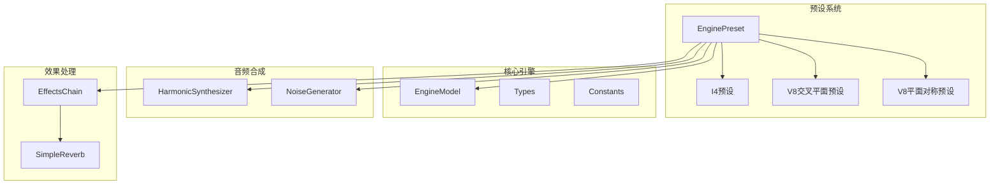
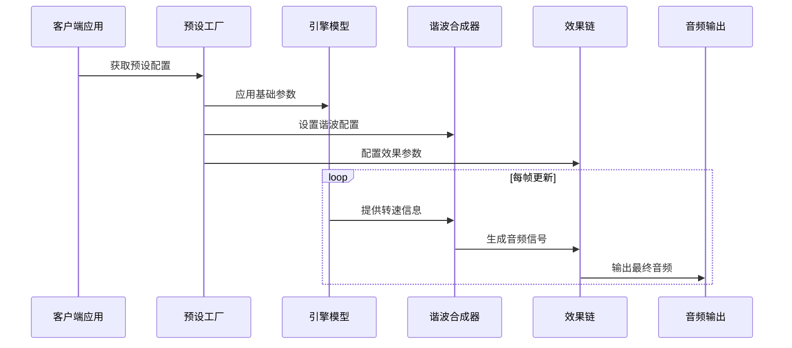
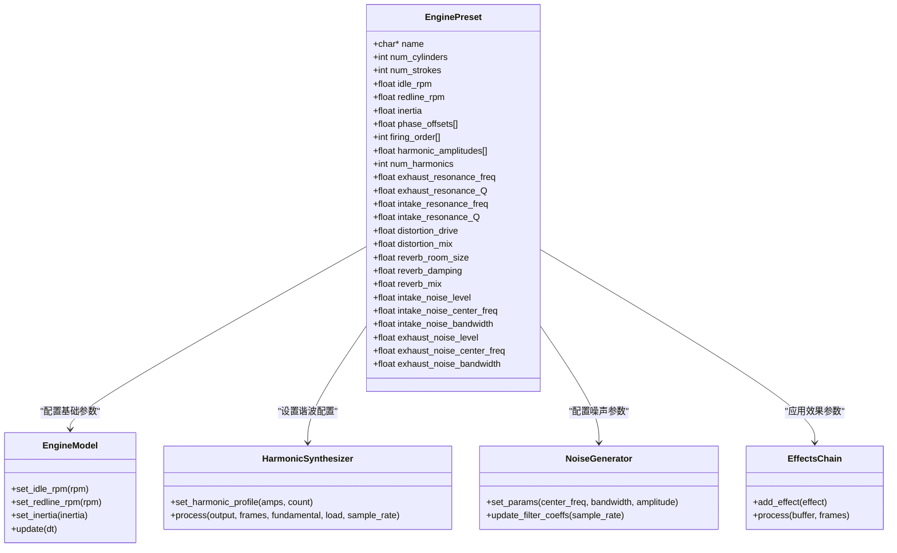

# EnginePreset结构定义

<cite>
**本文档引用的文件**
- [engine_preset.h](file://src/presets/engine_preset.h)
- [preset_i4.cpp](file://src/presets/preset_i4.cpp)
- [preset_v8_cross.cpp](file://src/presets/preset_v8_cross.cpp)
- [preset_v8_flat.cpp](file://src/presets/preset_v8_flat.cpp)
- [constants.h](file://src/core/constants.h)
- [types.h](file://src/core/types.h)
- [engine_model.h](file://src/core/engine_model.h)
- [harmonic_synth.h](file://src/synth/harmonic_synth.h)
- [noise_generator.cpp](file://src/synth/noise_generator.cpp)
- [reverb.h](file://src/effects/reverb.h)
- [effects_chain.h](file://src/effects/effects_chain.h)
</cite>

## 目录
1. [简介](#简介)
2. [项目结构](#项目结构)
3. [核心组件](#核心组件)
4. [架构概览](#架构概览)
5. [详细组件分析](#详细组件分析)
6. [依赖分析](#依赖分析)
7. [性能考虑](#性能考虑)
8. [故障排除指南](#故障排除指南)
9. [结论](#结论)

## 简介

EnginePreset是赛车声音引擎中的核心配置结构，用于定义发动机的声音特性和行为参数。该结构体包含了影响发动机声音的各个方面，从基础的机械参数到复杂的音频效果处理。通过预设系统，开发者可以快速应用不同类型的发动机声音配置，如I4、V8交叉平面和V8平面对称等经典发动机类型。

## 项目结构

EnginePreset结构体位于预设系统中，与核心引擎模型、谐波合成器、噪声生成器和效果链等组件协同工作：

**图表来源**
- [engine_preset.h:8-47](file://src/presets/engine_preset.h#L8-L47)
- [preset_i4.cpp:5-56](file://src/presets/preset_i4.cpp#L5-L56)
- [preset_v8_cross.cpp:5-63](file://src/presets/preset_v8_cross.cpp#L5-L63)
- [preset_v8_flat.cpp:5-62](file://src/presets/preset_v8_flat.cpp#L5-L62)

**章节来源**
- [engine_preset.h:1-55](file://src/presets/engine_preset.h#L1-L55)
- [constants.h:1-20](file://src/core/constants.h#L1-L20)

## 核心组件

EnginePreset结构体包含以下主要组件：

### 基本参数组
- **气缸数量 (num_cylinders)**: 发动机的气缸总数，决定谐波合成的基础频率
- **冲程数 (num_strokes)**: 四冲程或二冲程发动机的冲程类型
- **怠速转速 (idle_rpm)**: 发动机怠速时的转速
- **红线转速 (redline_rpm)**: 发动机的最大安全转速
- **惯性 (inertia)**: 发动机飞轮的转动惯量，影响转速响应

### 点火模式参数组
- **相位偏移数组 (phase_offsets)**: 每个气缸点火时刻相对于曲轴旋转的角度偏移
- **点火顺序数组 (firing_order)**: 气缸点火的顺序序列

### 谐波配置组
- **谐波幅度数组 (harmonic_amplitudes)**: 各次谐波的相对强度
- **谐波数量 (num_harmonics)**: 实际使用的谐波次数上限

### 滤波器参数组
- **排气共振频率 (exhaust_resonance_freq)**: 排气管共振的峰值频率
- **排气共振Q值 (exhaust_resonance_Q)**: 排气共振的带宽宽度
- **进气共振频率 (intake_resonance_freq)**: 进气管共振的峰值频率
- **进气共振Q值 (intake_resonance_Q)**: 进气共振的带宽宽度

### 效果参数组
- **失真驱动 (distortion_drive)**: 音频失真的强度级别
- **失真混合 (distortion_mix)**: 失真效果的干湿比例
- **混响房间大小 (reverb_room_size)**: 混响空间的大小感
- **混响阻尼 (reverb_damping)**: 混响的衰减速度
- **混响混合 (reverb_mix)**: 混响效果的干湿比例

### 噪声参数组
- **进气噪声级别 (intake_noise_level)**: 进气噪声的总体强度
- **进气噪声中心频率 (intake_noise_center_freq)**: 进气噪声的主要频率
- **进气噪声带宽 (intake_noise_bandwidth)**: 进气噪声的频率分布范围
- **排气噪声级别 (exhaust_noise_level)**: 排气噪声的总体强度
- **排气噪声中心频率 (exhaust_noise_center_freq)**: 排气噪声的主要频率
- **排气噪声带宽 (exhaust_noise_bandwidth)**: 排气噪声的频率分布范围

**章节来源**
- [engine_preset.h:8-47](file://src/presets/engine_preset.h#L8-L47)
- [constants.h:8-17](file://src/core/constants.h#L8-L17)

## 架构概览

EnginePreset在整体系统架构中的位置和交互关系：

**图表来源**
- [engine_preset.h:49-52](file://src/presets/engine_preset.h#L49-L52)
- [engine_model.h:15-26](file://src/core/engine_model.h#L15-L26)
- [harmonic_synth.h:14-17](file://src/synth/harmonic_synth.h#L14-L17)

## 详细组件分析

### 基本参数详解

#### 气缸数量 (num_cylinders)
- **物理意义**: 发动机的气缸总数，直接影响基础频率和谐波数量
- **典型取值**: 4、6、8、12（受MAX_CYLINDERS限制）
- **对声音特性的影响**: 
  - I4: 简单的四冲程节奏，产生明显的"爆音"特征
  - V8: 更丰富的谐波内容，产生深沉的低频响应
- **参数约束**: 必须小于等于MAX_CYLINDERS

#### 冲程数 (num_strokes)
- **物理意义**: 发动机的工作循环类型（2或4）
- **典型取值**: 2（二冲程）、4（四冲程）
- **对声音特性的影响**: 影响点火频率和功率输出模式

#### 怠速转速 (idle_rpm)
- **物理意义**: 发动机稳定运转的最低转速
- **典型取值**: 600-1200 RPM
- **对声音特性的影响**: 决定引擎声音的基频和低频内容

#### 红线转速 (redline_rpm)
- **物理意义**: 发动机的最大安全转速
- **典型取值**: 6000-12000 RPM
- **对声音特性的影响**: 影响高频谐波的截止和失真效果

#### 惯性 (inertia)
- **物理意义**: 发动机飞轮的转动惯量
- **典型取值**: 0.05-0.30
- **对声音特性的影响**: 
  - 高惯性: 平滑的转速变化，更饱满的声音
  - 低惯性: 快速响应，更尖锐的声音

**章节来源**
- [engine_preset.h:11-16](file://src/presets/engine_preset.h#L11-L16)
- [preset_i4.cpp:9-13](file://src/presets/preset_i4.cpp#L9-L13)
- [preset_v8_cross.cpp:9-13](file://src/presets/preset_v8_cross.cpp#L9-L13)
- [preset_v8_flat.cpp:9-13](file://src/presets/preset_v8_flat.cpp#L9-L13)

### 点火模式参数详解

#### 相位偏移 (phase_offsets)
- **物理意义**: 每个气缸点火相对于曲轴角度的位置
- **单位**: 弧度
- **典型取值**: 0到2π弧度范围内的均匀或不均匀分布
- **对声音特性的影响**: 
  - 均匀分布: 平衡的振动和声音
  - 不均匀分布: 特殊的"咆哮"或"爆音"效果

#### 点火顺序 (firing_order)
- **物理意义**: 气缸点火的序列
- **典型取值**: 1到N的排列组合
- **对声音特性的影响**: 
  - I4: 1-3-4-2，产生特定的节奏感
  - V8交叉平面: 1-8-4-3-6-5-7-2，产生经典的"咆哮"声
  - V8平面对称: 1-5-3-7-2-6-4-8，产生高音尖锐的"尖叫"声

**章节来源**
- [engine_preset.h:18-21](file://src/presets/engine_preset.h#L18-L21)
- [preset_i4.cpp:15-20](file://src/presets/preset_i4.cpp#L15-L20)
- [preset_v8_cross.cpp:15-26](file://src/presets/preset_v8_cross.cpp#L15-L26)
- [preset_v8_flat.cpp:15-24](file://src/presets/preset_v8_flat.cpp#L15-L24)

### 谐波配置详解

#### 谐波幅度 (harmonic_amplitudes)
- **物理意义**: 各次谐波的相对强度
- **典型取值**: 0.0到1.0之间的浮点数
- **对声音特性的影响**: 
  - 低次谐波主导: 深沉、饱满的声音
  - 高次谐波主导: 尖锐、刺耳的声音
  - 均匀分布: 平衡的音色

#### 谠波数量 (num_harmonics)
- **物理意义**: 实际使用的谐波次数
- **典型取值**: 8-32（受MAX_HARMONICS限制）
- **对声音特性的影响**: 
  - 较少谐波: 简洁、清晰的声音
  - 较多谐波: 复杂、丰富的声音

**章节来源**
- [engine_preset.h:23-25](file://src/presets/engine_preset.h#L23-L25)
- [preset_i4.cpp:22-32](file://src/presets/preset_i4.cpp#L22-L32)
- [preset_v8_cross.cpp:28-39](file://src/presets/preset_v8_cross.cpp#L28-L39)
- [preset_v8_flat.cpp:26-38](file://src/presets/preset_v8_flat.cpp#L26-L38)

### 滤波器参数详解

#### 共振频率 (resonance_freq)
- **物理意义**: 共振峰的中心频率
- **典型取值**: 
  - 进气: 200-800 Hz
  - 排气: 150-400 Hz
- **对声音特性的影响**: 
  - 低频共振: 深沉、有力的声音
  - 高频共振: 清晰、明亮的声音

#### 共振Q值 (resonance_Q)
- **物理意义**: 共振带宽的倒数，决定共振的尖锐程度
- **典型取值**: 1.0-3.0
- **对声音特性的影响**: 
  - 高Q值: 锐利、突出的共振峰
  - 低Q值: 平滑、宽广的共振响应

**章节来源**
- [engine_preset.h:27-31](file://src/presets/engine_preset.h#L27-L31)
- [preset_i4.cpp:34-38](file://src/presets/preset_i4.cpp#L34-L38)
- [preset_v8_cross.cpp:41-45](file://src/presets/preset_v8_cross.cpp#L41-L45)
- [preset_v8_flat.cpp:40-44](file://src/presets/preset_v8_flat.cpp#L40-L44)

### 效果参数详解

#### 失真驱动 (distortion_drive)
- **物理意义**: 失真效果的强度
- **典型取值**: 1.0-5.0
- **对声音特性的影响**: 
  - 低强度: 自然的过载音色
  - 高强度: 强烈的金属质感

#### 失真混合 (distortion_mix)
- **物理意义**: 失真效果的干湿比例
- **典型取值**: 0.0-1.0
- **对声音特性的影响**: 
  - 低混合: 保持原始音色
  - 高混合: 强化失真效果

#### 混响参数
- **房间大小 (reverb_room_size)**: 0.0-1.0，影响空间感
- **阻尼 (reverb_damping)**: 0.0-1.0，影响衰减速度
- **混合 (reverb_mix)**: 0.0-1.0，影响混响强度

**章节来源**
- [engine_preset.h:33-38](file://src/presets/engine_preset.h#L33-L38)
- [preset_i4.cpp:40-44](file://src/presets/preset_i4.cpp#L40-L44)
- [preset_v8_cross.cpp:47-51](file://src/presets/preset_v8_cross.cpp#L47-L51)
- [preset_v8_flat.cpp:46-50](file://src/presets/preset_v8_flat.cpp#L46-L50)

### 噪声参数详解

#### 噪声级别 (noise_level)
- **物理意义**: 噪声信号的总体强度
- **典型取值**: 0.01-0.20
- **对声音特性的影响**: 
  - 低强度: 细微的背景噪声
  - 高强度: 明显的机械噪声

#### 噪声中心频率 (center_freq)
- **物理意义**: 噪声的主要频率成分
- **典型取值**: 
  - 进气: 2000-4000 Hz
  - 排气: 1000-2000 Hz
- **对声音特性的影响**: 决定噪声的音色特征

#### 噪声带宽 (bandwidth)
- **物理意义**: 噪声频率分布的范围
- **典型取值**: 1000-3000 Hz
- **对声音特性的影响**: 
  - 宽带: 随机噪声，自然感强
  - 窄带: 有特定音色的噪声

**章节来源**
- [engine_preset.h:40-46](file://src/presets/engine_preset.h#L40-L46)
- [preset_i4.cpp:46-51](file://src/presets/preset_i4.cpp#L46-L51)
- [preset_v8_cross.cpp:53-58](file://src/presets/preset_v8_cross.cpp#L53-L58)
- [preset_v8_flat.cpp:52-57](file://src/presets/preset_v8_flat.cpp#L52-L57)

## 依赖分析

EnginePreset与其他组件的依赖关系：

**图表来源**
- [engine_preset.h:8-47](file://src/presets/engine_preset.h#L8-L47)
- [engine_model.h:24-26](file://src/core/engine_model.h#L24-L26)
- [harmonic_synth.h:12-17](file://src/synth/harmonic_synth.h#L12-L17)
- [noise_generator.cpp:11-15](file://src/synth/noise_generator.cpp#L11-L15)
- [effects_chain.h:12-16](file://src/effects/effects_chain.h#L12-L16)

**章节来源**
- [engine_preset.h:3-4](file://src/presets/engine_preset.h#L3-L4)
- [constants.h:10-11](file://src/core/constants.h#L10-L11)

## 性能考虑

### 内存使用优化
- **数组大小限制**: 受MAX_CYLINDERS和MAX_HARMONICS常量限制
- **静态分配**: 使用固定大小数组避免动态内存分配
- **缓存友好**: 相关参数按功能分组存储，提高访问效率

### 计算复杂度
- **谐波合成**: O(H×F)，其中H为谐波数量，F为帧数
- **滤波器处理**: O(F)，线性时间复杂度
- **效果链处理**: O(E×F)，其中E为效果数量

### 实时性能
- **无动态内存分配**: 所有参数在编译时确定
- **简单数据类型**: 使用基础数值类型，减少内存占用
- **批量处理**: 支持帧级批量音频处理

## 故障排除指南

### 常见问题及解决方案

#### 参数越界错误
**症状**: 程序崩溃或异常行为
**原因**: 参数值超出有效范围
**解决方法**: 
- 确保num_cylinders ≤ MAX_CYLINDERS
- 确保num_harmonics ≤ MAX_HARMONICS
- 验证所有浮点数参数在合理范围内

#### 声音质量异常
**症状**: 噪音过大或过小
**可能原因**: 
- 噪声参数设置不当
- 谐波配置不合理
- 滤波器参数冲突

**解决方法**:
- 调整噪声级别参数
- 重新设计谐波幅度分布
- 协调滤波器共振频率和Q值

#### 性能问题
**症状**: CPU使用率过高
**可能原因**: 
- 谐波数量过多
- 效果链中效果过多
- 采样率设置过高

**解决方法**:
- 减少num_harmonics
- 简化效果链配置
- 适当降低采样率

**章节来源**
- [constants.h:10-17](file://src/core/constants.h#L10-L17)
- [engine_preset.h:10-16](file://src/presets/engine_preset.h#L10-L16)

## 结论

EnginePreset结构体为赛车声音引擎提供了完整的参数化配置框架。通过精心设计的参数体系，开发者可以精确控制发动机的声音特性，从基础的机械参数到复杂的音频效果处理。预设系统的设计使得不同类型的发动机声音可以快速应用和调整，同时保持了良好的性能和可维护性。

该结构体的关键优势在于：
- **模块化设计**: 参数按功能分组，便于理解和调整
- **预设系统**: 提供即用的典型配置，支持快速原型开发
- **性能优化**: 固定大小数组和简单数据类型确保实时性能
- **扩展性**: 易于添加新的参数和效果类型

通过合理运用这些参数，开发者可以创造出真实而富有表现力的赛车引擎声音效果。