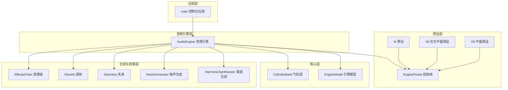
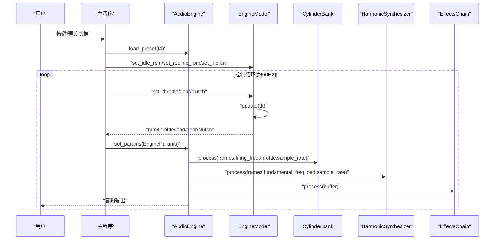
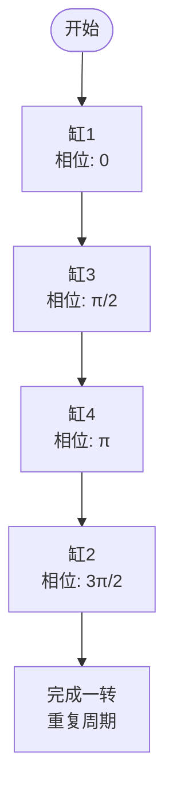
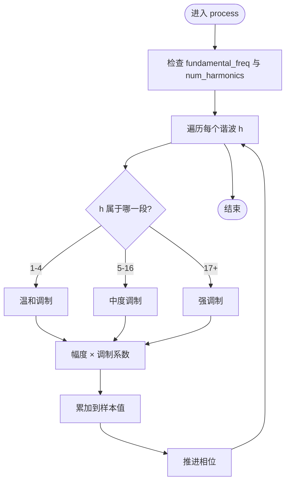
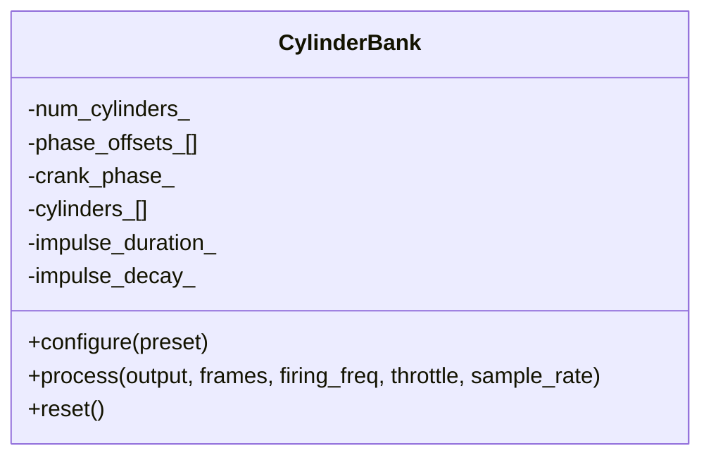
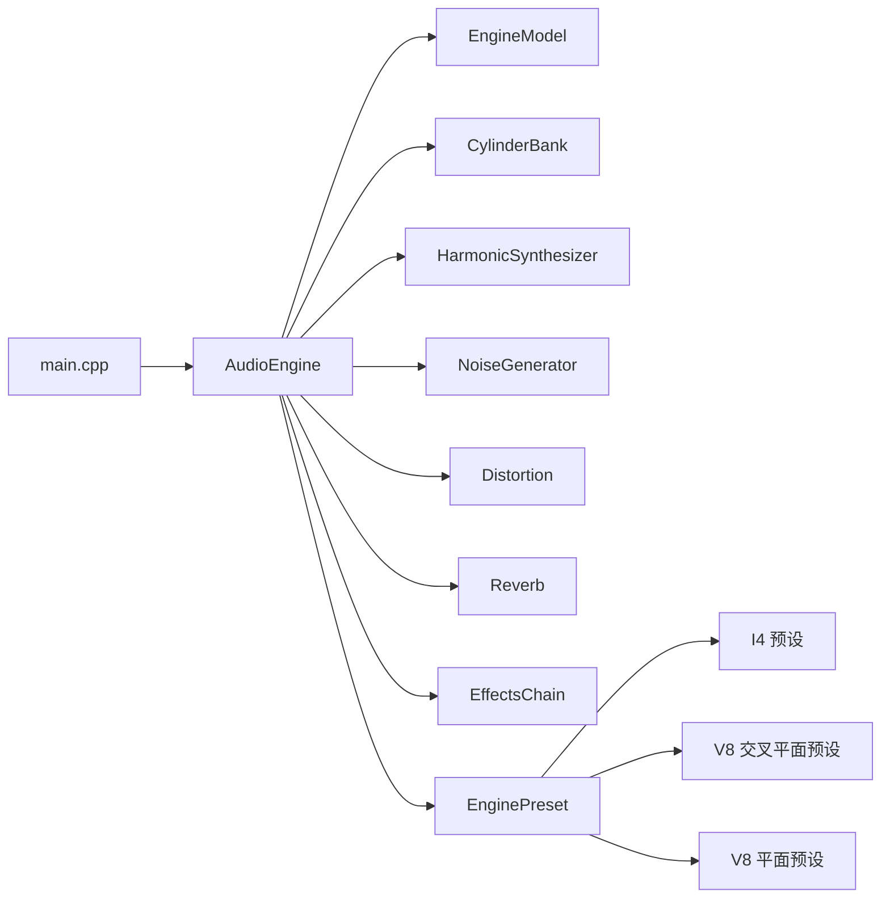

# Inline-4直列四缸预设

<cite>
**本文引用的文件**
- [preset_i4.cpp](file://src/presets/preset_i4.cpp)
- [engine_preset.h](file://src/presets/engine_preset.h)
- [preset_v8_cross.cpp](file://src/presets/preset_v8_cross.cpp)
- [preset_v8_flat.cpp](file://src/presets/preset_v8_flat.cpp)
- [engine_model.h](file://src/core/engine_model.h)
- [cylinder_bank.h](file://src/core/cylinder_bank.h)
- [harmonic_synth.h](file://src/synth/harmonic_synth.h)
- [harmonic_synth.cpp](file://src/synth/harmonic_synth.cpp)
- [audio_engine.h](file://src/audio/audio_engine.h)
- [main.cpp](file://src/main.cpp)
- [types.h](file://src/core/types.h)
- [constants.h](file://src/core/constants.h)
- [distortion.h](file://src/effects/distortion.h)
</cite>

## 目录
1. [简介](#简介)
2. [项目结构](#项目结构)
3. [核心组件](#核心组件)
4. [架构总览](#架构总览)
5. [详细组件分析](#详细组件分析)
6. [依赖关系分析](#依赖关系分析)
7. [性能考量](#性能考量)
8. [故障排查指南](#故障排查指南)
9. [结论](#结论)
10. [附录](#附录)

## 简介
本文件针对Inline-4（直列四缸）发动机预设进行深入技术文档化，围绕参数配置与声学特性展开，重点解释：
- 4气缸配置与直列排列的物理意义
- 点火顺序设计与相位偏移（1-3-4-2）
- 怠速与红线转速、惯性参数的选择依据
- 谐波分布与“蜂鸣”特征的来源
- 排气与进气共振滤波器的频率与品质因数
- 混响、失真等效果链参数的作用
- 与其他发动机类型（V8交叉平面、V8平面对比）的差异与适用场景
- 参数调优建议与实际应用示例

## 项目结构
该工程采用模块化分层设计：预设层定义发动机声学特征；核心层负责引擎模型与气缸冲量生成；合成与效果层负责谐波合成、滤波与混音；音频引擎层负责实时渲染与设备输出；主程序提供交互控制与预设切换。

图表来源
- [audio_engine.h:27-92](file://src/audio/audio_engine.h#L27-L92)
- [engine_model.h:7-48](file://src/core/engine_model.h#L7-L48)
- [cylinder_bank.h:9-41](file://src/core/cylinder_bank.h#L9-L41)
- [harmonic_synth.h:8-28](file://src/synth/harmonic_synth.h#L8-L28)
- [preset_i4.cpp:5-59](file://src/presets/preset_i4.cpp#L5-L59)
- [preset_v8_cross.cpp:5-66](file://src/presets/preset_v8_cross.cpp#L5-L66)
- [preset_v8_flat.cpp:5-65](file://src/presets/preset_v8_flat.cpp#L5-L65)
- [main.cpp:89-239](file://src/main.cpp#L89-L239)

章节来源
- [main.cpp:89-239](file://src/main.cpp#L89-L239)
- [audio_engine.h:27-92](file://src/audio/audio_engine.h#L27-L92)

## 核心组件
- EnginePreset：定义单个发动机预设的所有声学与参数，包括基本参数、点火相位、谐波分布、滤波器与效果参数等。
- EngineModel：引擎动力学模型，管理怠速、红线、惯性、摩擦、档位等。
- CylinderBank：基于点火相位与节流信号生成气缸冲量序列。
- HarmonicSynthesizer：按谐波幅度谱进行加法合成，受负载调制。
- AudioEngine：音频管线整合器，协调各子模块并驱动音频设备。
- 主程序：提供交互界面与预设切换。

章节来源
- [engine_preset.h:8-47](file://src/presets/engine_preset.h#L8-L47)
- [engine_model.h:7-48](file://src/core/engine_model.h#L7-L48)
- [cylinder_bank.h:9-41](file://src/core/cylinder_bank.h#L9-L41)
- [harmonic_synth.h:8-28](file://src/synth/harmonic_synth.h#L8-L28)
- [audio_engine.h:27-92](file://src/audio/audio_engine.h#L27-L92)

## 架构总览
I4预设通过EnginePreset注入到AudioEngine中，由EngineModel提供RPM/节流/档位等状态，CylinderBank根据点火相位生成原始冲量，HarmonicSynthesizer叠加谐波形成基音包络，随后经由滤波器、失真与混响等效果链处理，最终由音频引擎输出。

图表来源
- [main.cpp:146-233](file://src/main.cpp#L146-L233)
- [audio_engine.h:37-84](file://src/audio/audio_engine.h#L37-L84)
- [engine_model.h:15-44](file://src/core/engine_model.h#L15-L44)
- [cylinder_bank.h:18-38](file://src/core/cylinder_bank.h#L18-L38)
- [harmonic_synth.cpp:26-60](file://src/synth/harmonic_synth.cpp#L26-L60)

## 详细组件分析

### I4预设参数与声学特性
- 基本参数
  - 气缸数：4
  - 冲程数：4（四冲程）
  - 怠速：850rpm（略高于默认800rpm）
  - 红线：7500rpm（略低于默认8000rpm）
  - 惯性：0.12（略小于默认0.15），使转速响应更灵敏
- 点火顺序与相位
  - 顺序：1-3-4-2
  - 相位偏移：0, π/2, π, 3π/2（均匀间隔）
  - 特征：偶发间隔产生稳定的双周期脉动，利于形成清晰的谐波结构
- 谐波分布
  - 强调2次与4次谐波，形成“蜂鸣”特征
  - 1-4次谐波幅度相对较高，5-16次随频率递增衰减
- 滤波器参数
  - 排气共振：频率250Hz，品质因数1.8
  - 进气共振：频率500Hz，品质因数2.5
  - 特征：低频排气共鸣与中频进气共鸣共同塑造I4典型声色
- 效果链参数
  - 失真驱动：3.0，混合比例：0.5
  - 混响房间大小：0.25，阻尼：0.4，混合：0.12
  - 特征：适度失真增强中高频细节，混响营造空间感
- 噪声参数
  - 进气噪声：水平0.06，中心频率3500Hz，带宽2500Hz
  - 排气噪声：水平0.10，中心频率1800Hz，带宽1500Hz
  - 特征：排气噪声更强以突出爆震感，进气噪声集中在高频段

章节来源
- [preset_i4.cpp:5-59](file://src/presets/preset_i4.cpp#L5-L59)
- [engine_preset.h:8-47](file://src/presets/engine_preset.h#L8-L47)

### 点火顺序与相位设计
I4采用均匀相位间隔（每缸90°曲轴角），确保点火脉冲在时间域上呈规则双周期重复，有利于：
- 明确的基频与倍频成分
- 稳定的排气脉动与进气噪声模式
- 便于谐波合成器构建清晰的谐波谱

图表来源
- [preset_i4.cpp:15-20](file://src/presets/preset_i4.cpp#L15-L20)

章节来源
- [preset_i4.cpp:15-20](file://src/presets/preset_i4.cpp#L15-L20)

### 谐波合成与负载调制
HarmonicSynthesizer按EnginePreset提供的谐波幅度进行加法合成，并对不同频段的谐波施加不同的负载调制：
- 1-4次谐波：温和调制
- 5-16次谐波：中度调制
- 17+次谐波：强调制
- 作用：高负载时提升高频细节，低负载时保持低频饱满

图表来源
- [harmonic_synth.cpp:26-60](file://src/synth/harmonic_synth.cpp#L26-L60)
- [harmonic_synth.h:12-17](file://src/synth/harmonic_synth.h#L12-L17)

章节来源
- [harmonic_synth.cpp:26-60](file://src/synth/harmonic_synth.cpp#L26-L60)
- [harmonic_synth.h:12-17](file://src/synth/harmonic_synth.h#L12-L17)

### 气缸冲量生成与节流影响
CylinderBank根据EnginePreset中的相位偏移与节流值生成原始冲量序列，用于驱动谐波合成器与噪声源，形成真实的“点火”声音脉冲。

图表来源
- [cylinder_bank.h:9-38](file://src/core/cylinder_bank.h#L9-L38)

章节来源
- [cylinder_bank.h:9-38](file://src/core/cylinder_bank.h#L9-L38)

### 与其他发动机类型的对比
- V8交叉平面（Cross-Plane）
  - 点火间隔不均，产生“咆哮”特征
  - 强调基频与次谐波，低频更深沉
  - 排气共振更低（150Hz），进气共振中等（350Hz）
  - 失真与混响参数更偏向深沉氛围
- V8平面对比（Flat-Plane）
  - 点火间隔均匀，类似两个I4并行
  - 强调高次谐波，声音尖锐、高转速感强
  - 排气与进气共振更高（350/600Hz），失真驱动更大
- I4特点
  - 均匀点火间隔，稳定且清晰的谐波结构
  - 适度强调2/4次谐波，形成“蜂鸣”特征
  - 排气与进气共振适中，适合多种驾驶风格

章节来源
- [preset_v8_cross.cpp:5-66](file://src/presets/preset_v8_cross.cpp#L5-L66)
- [preset_v8_flat.cpp:5-65](file://src/presets/preset_v8_flat.cpp#L5-L65)
- [preset_i4.cpp:5-59](file://src/presets/preset_i4.cpp#L5-L59)

### 参数调优建议
- 转速范围
  - 怠速：若追求低转速平顺可降至800rpm；若追求更快响应可提高至900rpm
  - 红线：高性能场景可提升至8000rpm以上，但需配合点火相位与谐波谱微调
- 惯性
  - 降低惯性（如0.10）可获得更快的转速响应，适合街车或轻量化需求
  - 提高惯性（如0.18）可增强低转扭矩感，适合重载或复古风格
- 点火顺序
  - 保持均匀相位间隔（90°）以维持I4的稳定特征
  - 若需改变节奏感，可考虑交错相位，但会破坏I4的典型声学结构
- 谐波分布
  - 增强2/4次谐波幅度可强化“蜂鸣”特征
  - 减弱高频谐波可降低刺耳感，提升舒适度
- 滤波器
  - 提高排气共振频率与Q值可增强低频共鸣
  - 提高进气共振频率与Q值可提升高转爆发感
- 效果链
  - 失真驱动与混合比例需与目标风格匹配：运动型偏高，舒适型偏低
  - 混响参数影响空间感：大房间尺寸与低阻尼营造空旷感

章节来源
- [preset_i4.cpp:11-13](file://src/presets/preset_i4.cpp#L11-L13)
- [preset_i4.cpp:22-32](file://src/presets/preset_i4.cpp#L22-L32)
- [preset_i4.cpp:35-44](file://src/presets/preset_i4.cpp#L35-L44)
- [preset_i4.cpp:46-51](file://src/presets/preset_i4.cpp#L46-L51)

### 实际应用示例
- 场景一：日常街道驾驶
  - 目标：平顺、舒适、低噪
  - 建议：降低怠速至800rpm，适度减少失真混合，提高进气共振Q值以改善中频响应
- 场景二：赛道驾驶
  - 目标：高转速爆发、清晰声色
  - 建议：提升红线至8000rpm，适度提高排气共振频率与Q值，增强高次谐波
- 场景三：复古跑车风格
  - 目标：低频共鸣与“咆哮”感
  - 建议：参考V8交叉平面的低频策略，但保持I4的点火节奏，形成独特的“I4咆哮”

## 依赖关系分析
- 预设依赖关系
  - I4/V8预设均依赖EnginePreset结构体
  - 预设通过AudioEngine加载并缓存到音频线程
- 核心依赖关系
  - AudioEngine依赖EngineModel、CylinderBank、HarmonicSynthesizer、NoiseGenerator、Distortion、Reverb、EffectsChain与Mixer
  - EngineModel提供RPM/节流/档位状态
  - CylinderBank与HarmonicSynthesizer共同决定基音包络
- 主程序依赖
  - 主程序负责初始化AudioEngine、加载预设、接收输入并推送EngineParams

图表来源
- [main.cpp:89-239](file://src/main.cpp#L89-L239)
- [audio_engine.h:27-92](file://src/audio/audio_engine.h#L27-L92)
- [engine_model.h:7-48](file://src/core/engine_model.h#L7-L48)
- [cylinder_bank.h:9-41](file://src/core/cylinder_bank.h#L9-L41)
- [harmonic_synth.h:8-28](file://src/synth/harmonic_synth.h#L8-L28)
- [preset_i4.cpp:5-59](file://src/presets/preset_i4.cpp#L5-L59)
- [preset_v8_cross.cpp:5-66](file://src/presets/preset_v8_cross.cpp#L5-L66)
- [preset_v8_flat.cpp:5-65](file://src/presets/preset_v8_flat.cpp#L5-L65)

章节来源
- [main.cpp:89-239](file://src/main.cpp#L89-L239)
- [audio_engine.h:27-92](file://src/audio/audio_engine.h#L27-L92)

## 性能考量
- 实时渲染
  - 控制循环约60Hz，保证参数更新与音频渲染的同步
  - 预设参数通过原子指针在音频线程安全切换
- 缓冲区与采样率
  - 默认采样率48kHz，缓冲帧数512，兼顾延迟与稳定性
- 合成复杂度
  - 谐波合成与滤波器处理在固定帧内完成，避免过高的CPU占用
- 调优建议
  - 降低谐波数量或使用更高效的滤波器可进一步优化性能
  - 在低端设备上可适当降低采样率或增大缓冲帧数

章节来源
- [main.cpp:144-145](file://src/main.cpp#L144-L145)
- [audio_engine.h:22-25](file://src/audio/audio_engine.h#L22-L25)
- [constants.h:15-16](file://src/core/constants.h#L15-L16)

## 故障排查指南
- 无法启动音频设备
  - 检查AudioEngine初始化返回值与错误日志
  - 确认系统音频权限与设备可用性
- 预设切换无效
  - 确认主程序已调用load_preset并正确设置EngineParams
  - 检查当前预设是否被音频线程缓存
- 声音异常或失真过大
  - 降低失真驱动与混合比例
  - 调整排气/进气共振频率与Q值，避免与人耳敏感频段重叠
- 转速响应迟滞
  - 降低惯性参数以提升响应速度
  - 检查EngineModel的friction_与max_torque_是否合理

章节来源
- [main.cpp:110-113](file://src/main.cpp#L110-L113)
- [audio_engine.h:32-35](file://src/audio/audio_engine.h#L32-L35)
- [engine_model.h:38-40](file://src/core/engine_model.h#L38-L40)

## 结论
I4预设通过均匀点火相位、强调2/4次谐波、适中的排气与进气共振，形成了清晰而富有“蜂鸣”特征的直列四缸声学形象。与其他V8预设相比，I4在转速响应、谐波结构与空间感方面具有独特优势，适用于从日常到赛道的广泛场景。通过合理的参数调优，可在不同风格间灵活切换，满足多样化的听觉体验需求。

## 附录
- 关键常量与类型
  - PI/TWO_PI：数学常量
  - MAX_CYLINDERS/MAX_HARMONICS：限制最大气缸数与谐波数
  - Sample/FrameCount/SampleRate：基础数据类型
- 参考路径
  - I4预设定义：[preset_i4.cpp:5-59](file://src/presets/preset_i4.cpp#L5-L59)
  - EnginePreset结构体：[engine_preset.h:8-47](file://src/presets/engine_preset.h#L8-L47)
  - V8交叉平面预设：[preset_v8_cross.cpp:5-66](file://src/presets/preset_v8_cross.cpp#L5-L66)
  - V8平面对比预设：[preset_v8_flat.cpp:5-65](file://src/presets/preset_v8_flat.cpp#L5-L65)
  - 音频引擎接口：[audio_engine.h:27-92](file://src/audio/audio_engine.h#L27-L92)
  - 主程序入口：[main.cpp:89-239](file://src/main.cpp#L89-L239)