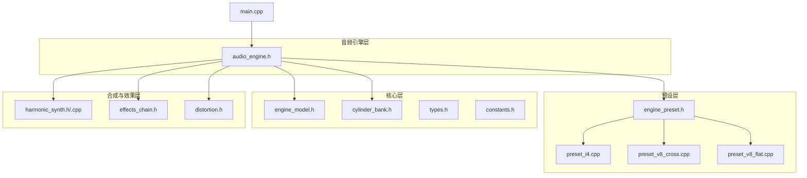
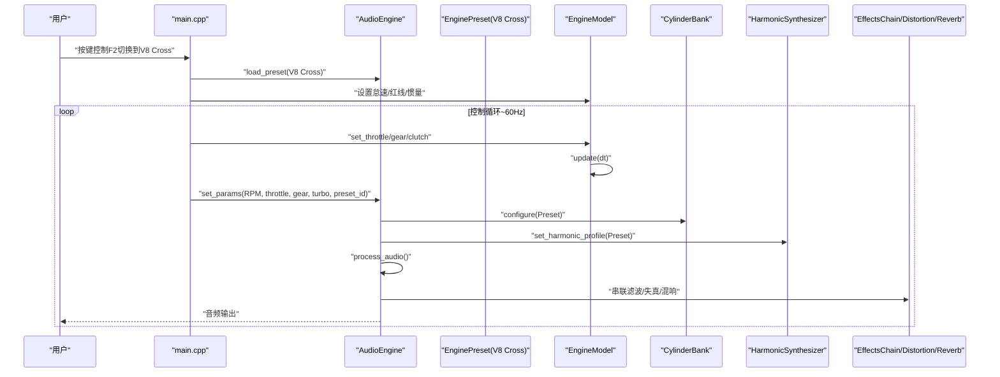
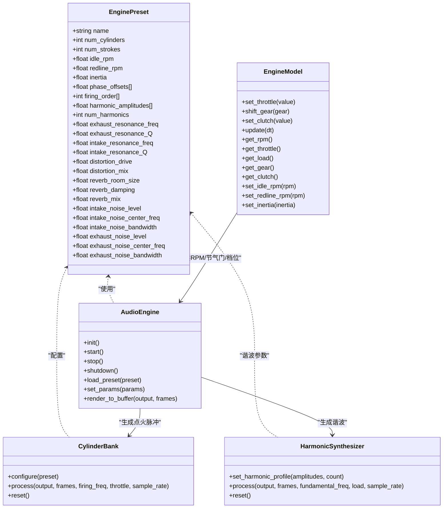

# V8交叉平面预设

<cite>
**本文引用的文件**
- [preset_v8_cross.cpp](file://src/presets/preset_v8_cross.cpp)
- [engine_preset.h](file://src/presets/engine_preset.h)
- [preset_v8_flat.cpp](file://src/presets/preset_v8_flat.cpp)
- [preset_i4.cpp](file://src/presets/preset_i4.cpp)
- [main.cpp](file://src/main.cpp)
- [audio_engine.h](file://src/audio/audio_engine.h)
- [harmonic_synth.h](file://src/synth/harmonic_synth.h)
- [harmonic_synth.cpp](file://src/synth/harmonic_synth.cpp)
- [cylinder_bank.h](file://src/core/cylinder_bank.h)
- [engine_model.h](file://src/core/engine_model.h)
- [types.h](file://src/core/types.h)
- [constants.h](file://src/core/constants.h)
- [effects_chain.h](file://src/effects/effects_chain.h)
- [distortion.h](file://src/effects/distortion.h)
</cite>

## 目录
1. [简介](#简介)
2. [项目结构](#项目结构)
3. [核心组件](#核心组件)
4. [架构总览](#架构总览)
5. [详细组件分析](#详细组件分析)
6. [依赖关系分析](#依赖关系分析)
7. [性能考量](#性能考量)
8. [故障排查指南](#故障排查指南)
9. [结论](#结论)
10. [附录](#附录)

## 简介
本文件针对V8交叉平面（Cross-Plane）发动机预设进行深入技术文档化，围绕以下目标展开：
- 解释V8交叉平面预设的参数配置与声学特性
- 深入说明8气缸配置、V8交叉排列、特殊的点火相位设计
- 详述各参数的具体数值与选择依据（如气缸数8、冲程数4、怠速700rpm、红线6500rpm等）
- 解释交叉平面V8特有的声学特征：不规则点火间隔产生的独特声学效果、谐波增强、排气脉动的复杂性
- 提供V8交叉平面的声学原理分析：相位偏移计算、点火顺序优化
- 给出参数调优指南与实际应用示例

## 项目结构
该工程采用模块化分层设计，核心模块包括：
- 预设层：定义不同发动机类型的预设参数（I4、V8交叉平面、V8平面对）
- 核心层：引擎模型、气缸组、类型与常量定义
- 合成与效果层：谐波合成器、噪声生成器、失真、混响、滤波器链
- 音频引擎层：统一调度与渲染管线
- 主程序：用户交互与参数传递

图表来源
- [main.cpp:115-122](file://src/main.cpp#L115-L122)
- [audio_engine.h:58-69](file://src/audio/audio_engine.h#L58-L69)
- [engine_preset.h:8-47](file://src/presets/engine_preset.h#L8-L47)

章节来源
- [main.cpp:89-132](file://src/main.cpp#L89-L132)
- [audio_engine.h:27-89](file://src/audio/audio_engine.h#L27-L89)

## 核心组件
- 引擎预设（EnginePreset）：集中定义发动机的基本参数、点火相位、谐波分布、滤波与效果参数等
- 引擎模型（EngineModel）：管理转速、节气门、档位、惯量等物理状态
- 气缸组（CylinderBank）：根据预设生成点火脉冲序列
- 谐波合成器（HarmonicSynthesizer）：基于预设的谐波幅度生成基波及各次谐波
- 效果链（EffectsChain）：串联滤波、失真、混响等效果
- 音频引擎（AudioEngine）：统一调度上述模块，完成音频渲染

章节来源
- [engine_preset.h:8-47](file://src/presets/engine_preset.h#L8-L47)
- [engine_model.h:7-45](file://src/core/engine_model.h#L7-L45)
- [cylinder_bank.h:9-38](file://src/core/cylinder_bank.h#L9-L38)
- [harmonic_synth.h:8-25](file://src/synth/harmonic_synth.h#L8-L25)
- [effects_chain.h:8-21](file://src/effects/effects_chain.h#L8-L21)
- [audio_engine.h:27-89](file://src/audio/audio_engine.h#L27-L89)

## 架构总览
V8交叉平面预设通过“预设→引擎模型→气缸组→谐波合成→效果处理→混音输出”的流水线工作。主程序负责加载默认预设（V8交叉平面），并将实时参数（RPM、节气门、档位、预设ID）推送到音频线程。

图表来源
- [main.cpp:115-122](file://src/main.cpp#L115-L122)
- [main.cpp:169-189](file://src/main.cpp#L169-L189)
- [audio_engine.h:37-84](file://src/audio/audio_engine.h#L37-L84)
- [preset_v8_cross.cpp:5-63](file://src/presets/preset_v8_cross.cpp#L5-L63)

## 详细组件分析

### V8交叉平面预设参数与声学特性
- 基本参数
  - 气缸数：8
  - 冲程数：4（四冲程）
  - 怠速：700rpm
  - 红线：6500rpm
  - 惯量：0.20（影响扭矩响应与转速变化率）
- 点火相位与点火顺序
  - 交叉平面曲轴：连杆轴颈在0°、90°、270°、180°位置，形成不均匀的点火间隔
  - 点火顺序：1-8-4-3-6-5-7-2
  - 对应相位偏移（弧度）：0、π/4、3π/4、π/2、π、5π/4、7π/4、3π/2
  - 不规则点火间隔产生独特的“V8轰鸣”声学特征
- 谐波分布
  - 使用前20个谐波，幅度按1-4阶强、随后逐步衰减的方式设计，强调低频与次谐波，营造深沉、饱满的声色
- 排气/进气共振
  - 排气共振频率：150Hz，Q值：1.2；进气共振频率：350Hz，Q值：1.8
  - 体现V8交叉平面典型的“低沉、厚实”排气声
- 效果参数
  - 失真驱动：1.8，混合比例：0.35
  - 混响房间大小：0.40，阻尼：0.55，混合：0.18
  - 进气/排气噪声水平、中心频率与带宽分别设定，用于补充真实感

章节来源
- [preset_v8_cross.cpp:8-12](file://src/presets/preset_v8_cross.cpp#L8-L12)
- [preset_v8_cross.cpp:15-26](file://src/presets/preset_v8_cross.cpp#L15-L26)
- [preset_v8_cross.cpp:29-39](file://src/presets/preset_v8_cross.cpp#L29-L39)
- [preset_v8_cross.cpp:42-58](file://src/presets/preset_v8_cross.cpp#L42-L58)

### 参数选择依据与声学原理
- 点火相位与不规则间隔
  - 交叉平面V8的相位偏移为等间距的π/2，但因V8双缸组布局，导致每侧气缸的点火间隔在曲轴旋转周期内呈现非均匀分布，从而产生独特的“burble”声学特征
  - 该设计在低中转速段强化低频与次谐波，符合V8交叉平面的典型听感
- 谐波增强与衰减
  - 1-4阶谐波幅度较高，随后以阶梯式递减，使声音具有“厚实、低沉”的特性
  - 与排气/进气共振参数配合，突出低频共鸣与中频脉动
- 排气脉动与复杂性
  - 排气共振频率较低且Q值适中，有助于放大排气脉动的低频成分，提升声压与质感
  - 与失真效果结合，适度削波可增加中高频泛音，丰富听感层次

章节来源
- [preset_v8_cross.cpp:15-18](file://src/presets/preset_v8_cross.cpp#L15-L18)
- [preset_v8_cross.cpp:29-39](file://src/presets/preset_v8_cross.cpp#L29-L39)
- [preset_v8_cross.cpp:42-45](file://src/presets/preset_v8_cross.cpp#L42-L45)

### 与其他预设的对比
- V8交叉平面 vs V8平面对
  - 平面对采用更均匀的点火间隔，偏向高转速、高谐波强调，声音更“尖锐”
  - 交叉平面强调低频与次谐波，声音更“厚重”
- V8交叉平面 vs I4
  - I4的点火间隔更均匀，谐波分布强调2阶与4阶，声音更“ buzzy”
  - V8交叉平面则通过不规则间隔与更深的谐波分布，营造不同的声学体验

章节来源
- [preset_v8_flat.cpp:15-24](file://src/presets/preset_v8_flat.cpp#L15-L24)
- [preset_v8_flat.cpp:26-38](file://src/presets/preset_v8_flat.cpp#L26-L38)
- [preset_i4.cpp:15-20](file://src/presets/preset_i4.cpp#L15-L20)
- [preset_i4.cpp:22-32](file://src/presets/preset_i4.cpp#L22-L32)

### 参数调优指南
- 转速范围与惯量
  - 怠速与红线：根据目标车辆或场景调整（交叉平面通常偏低沉，适合低中转速）
  - 惯量：增大惯量可降低转速变化率，适合低转速深沉风格；减小惯量可提升响应速度
- 点火相位与顺序
  - 若需改变声学特征，可调整相位偏移或点火顺序，但需注意与气缸组布局匹配
- 谐波分布
  - 提升1-4阶幅度可增强低频厚度；降低高阶幅度可减少刺耳感
- 共振与噪声
  - 降低排气共振频率与Q值可进一步加深低频；提高进气共振频率可改善高转速段的通透性
  - 适当提高排气噪声水平与中心频率可增强脉动感

章节来源
- [preset_v8_cross.cpp:8-12](file://src/presets/preset_v8_cross.cpp#L8-L12)
- [preset_v8_cross.cpp:29-39](file://src/presets/preset_v8_cross.cpp#L29-L39)
- [preset_v8_cross.cpp:42-58](file://src/presets/preset_v8_cross.cpp#L42-L58)

### 实际应用示例
- 在主程序中，默认加载V8交叉平面预设，并支持通过功能键在不同预设间切换
- 用户可通过键盘控制节气门、档位与增压状态，实时观察参数变化对声音的影响
- 预设参数会同步更新到引擎模型与音频引擎，确保实时渲染一致性

章节来源
- [main.cpp:115-122](file://src/main.cpp#L115-L122)
- [main.cpp:169-189](file://src/main.cpp#L169-L189)
- [main.cpp:206-214](file://src/main.cpp#L206-L214)

## 依赖关系分析
- 预设依赖
  - V8交叉平面预设依赖于EnginePreset结构体，后者定义了所有可配置参数
- 音频引擎依赖
  - AudioEngine聚合多个子模块：ParameterController、CylinderBank、HarmonicSynthesizer、NoiseGenerator、SamplePlayer、BiquadFilter、Distortion、SimpleReverb、AudioMixer
  - AudioEngine通过load_preset与set_params与外部交互
- 核心模块依赖
  - CylinderBank与HarmonicSynthesizer均依赖EnginePreset中的点火相位与谐波信息
  - EngineModel提供RPM与负载等输入，驱动音频合成

图表来源
- [engine_preset.h:8-47](file://src/presets/engine_preset.h#L8-L47)
- [audio_engine.h:58-69](file://src/audio/audio_engine.h#L58-L69)
- [cylinder_bank.h:13-19](file://src/core/cylinder_bank.h#L13-L19)
- [harmonic_synth.h:12-17](file://src/synth/harmonic_synth.h#L12-L17)
- [engine_model.h:11-26](file://src/core/engine_model.h#L11-L26)

## 性能考量
- 固定采样率与缓冲帧数
  - 默认采样率与缓冲帧数在常量中定义，保证渲染稳定性与实时性
- 渲染路径
  - AudioEngine在音频回调中按需生成点火脉冲、谐波、噪声与效果，避免不必要的计算
- 参数缓存
  - 当前预设在音频线程中缓存一份，减少跨线程访问开销
- 负载调制
  - 谐波合成器对不同阶次的谐波施加不同的负载调制，兼顾动态与稳定性

章节来源
- [constants.h:15-16](file://src/core/constants.h#L15-L16)
- [audio_engine.h:71-73](file://src/audio/audio_engine.h#L71-L73)
- [harmonic_synth.cpp:37-45](file://src/synth/harmonic_synth.cpp#L37-L45)

## 故障排查指南
- 预设未生效
  - 确认已调用load_preset并传入V8交叉平面预设
  - 检查set_params是否正确推送当前预设ID
- 声音异常
  - 检查谐波幅度与共振参数是否合理
  - 调整失真驱动与混响混合比例，避免过度削波或回声
- 实时响应问题
  - 确保控制循环以约60Hz运行，避免过高的CPU占用导致音频中断
- 参数不一致
  - 确保引擎模型的怠速、红线与惯量与所选预设一致

章节来源
- [main.cpp:115-122](file://src/main.cpp#L115-L122)
- [main.cpp:169-189](file://src/main.cpp#L169-L189)
- [main.cpp:206-214](file://src/main.cpp#L206-L214)

## 结论
V8交叉平面预设通过不规则点火间隔、特定的谐波分布与低频共振参数，成功复刻了V8交叉平面发动机的典型声学特征：低沉、厚实、富有脉动感。其参数设计与实现逻辑清晰，便于在保持真实感的同时进行灵活调优。建议在不同应用场景下结合转速范围、车辆特性与听感偏好，对惯量、谐波与共振参数进行微调，以达到最佳的声学表现。

## 附录
- 关键参数一览（来自V8交叉平面预设）
  - 气缸数：8
  - 冲程数：4
  - 怠速：700rpm
  - 红线：6500rpm
  - 惯量：0.20
  - 点火顺序：1-8-4-3-6-5-7-2
  - 相位偏移（弧度）：0、π/4、3π/4、π/2、π、5π/4、7π/4、3π/2
  - 谐波数：20
  - 排气共振：150Hz，Q=1.2
  - 进气共振：350Hz，Q=1.8
  - 失真驱动：1.8，混合：0.35
  - 混响：房间大小0.40，阻尼0.55，混合0.18
  - 进气噪声：水平0.04，中心频率2500Hz，带宽2000Hz
  - 排气噪声：水平0.07，中心频率1200Hz，带宽1200Hz

章节来源
- [preset_v8_cross.cpp:8-12](file://src/presets/preset_v8_cross.cpp#L8-L12)
- [preset_v8_cross.cpp:15-26](file://src/presets/preset_v8_cross.cpp#L15-L26)
- [preset_v8_cross.cpp:29-39](file://src/presets/preset_v8_cross.cpp#L29-L39)
- [preset_v8_cross.cpp:42-58](file://src/presets/preset_v8_cross.cpp#L42-L58)