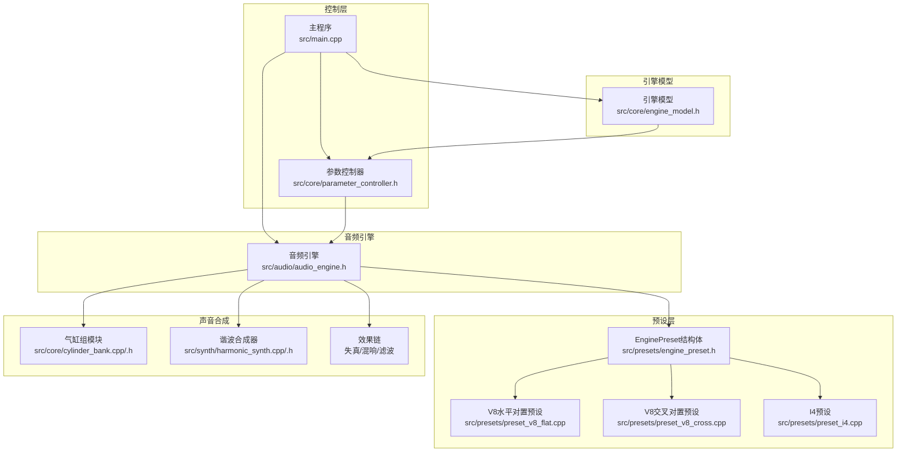
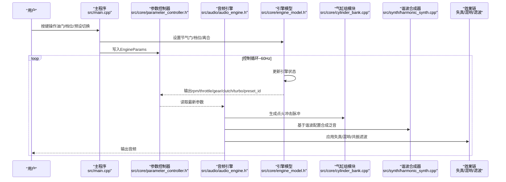
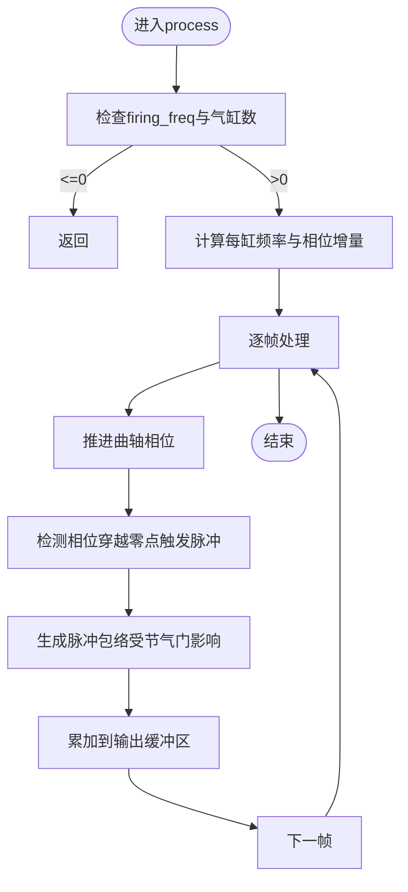
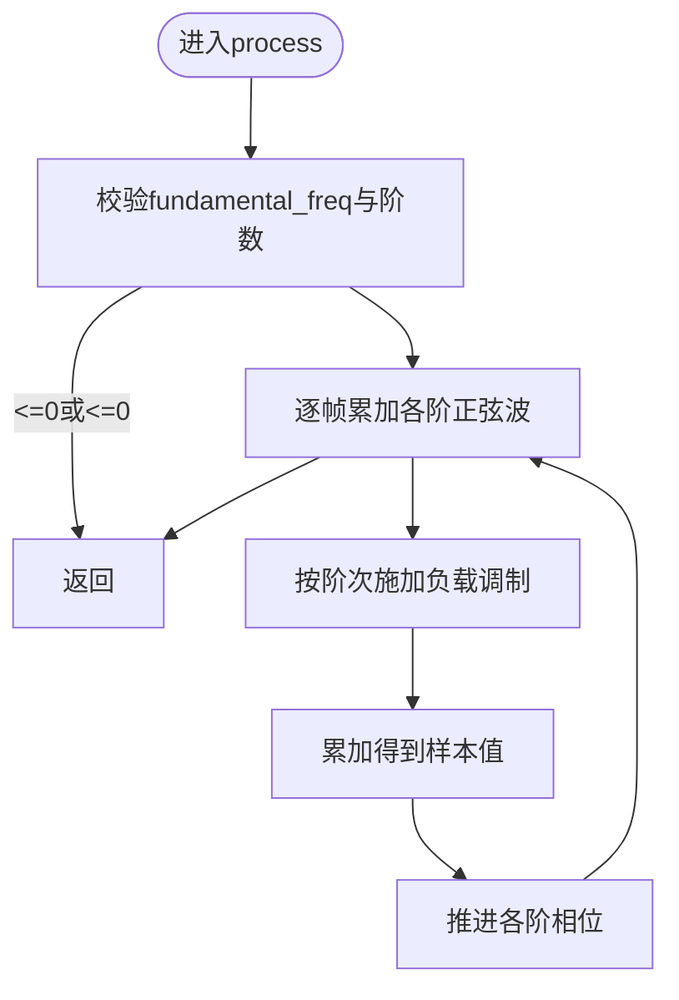
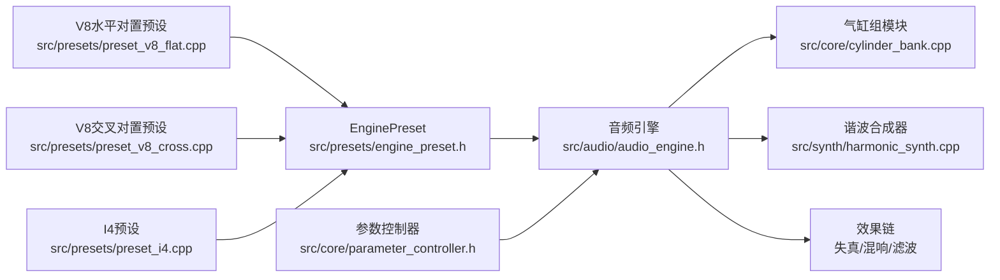

# V8水平对置预设

<cite>
**本文引用的文件**
- [src/presets/preset_v8_flat.cpp](file://src/presets/preset_v8_flat.cpp)
- [src/presets/engine_preset.h](file://src/presets/engine_preset.h)
- [src/core/cylinder_bank.cpp](file://src/core/cylinder_bank.cpp)
- [src/core/cylinder_bank.h](file://src/core/cylinder_bank.h)
- [src/synth/harmonic_synth.cpp](file://src/synth/harmonic_synth.cpp)
- [src/synth/harmonic_synth.h](file://src/synth/harmonic_synth.h)
- [src/effects/distortion.h](file://src/effects/distortion.h)
- [src/audio/audio_engine.h](file://src/audio/audio_engine.h)
- [src/main.cpp](file://src/main.cpp)
- [src/core/parameter_controller.h](file://src/core/parameter_controller.h)
- [src/core/engine_model.h](file://src/core/engine_model.h)
- [src/presets/preset_v8_cross.cpp](file://src/presets/preset_v8_cross.cpp)
- [src/presets/preset_i4.cpp](file://src/presets/preset_i4.cpp)
- [src/core/constants.h](file://src/core/constants.h)
</cite>

## 目录
1. [简介](#简介)
2. [项目结构](#项目结构)
3. [核心组件](#核心组件)
4. [架构总览](#架构总览)
5. [详细组件分析](#详细组件分析)
6. [依赖关系分析](#依赖关系分析)
7. [性能考量](#性能考量)
8. [故障排查指南](#故障排查指南)
9. [结论](#结论)
10. [附录](#附录)

## 简介
本文件针对“V8水平对置（Flat-Plane）”预设进行系统化技术文档化，围绕其参数配置与声学特性展开，重点解释以下内容：
- 8缸配置与四冲程设计
- 水平对置V8的特殊点火相位设计与点火顺序
- 怠速与红线转速、飞轮惯量等基础参数
- 高次谐波强调、排气/进气共振滤波器设置
- 噪声生成与失真、混响等后级效果参数
- 声学原理：相位偏移计算、点火顺序优化、声学谐振特性
- 参数调优指南与实际应用示例

## 项目结构
该代码库采用模块化分层组织，核心与声音合成路径如下：
- 预设层：定义不同发动机类型的EnginePreset参数集合
- 核心引擎模型：负责物理引擎的转速、负载、齿轮比等动力学
- 气缸组模块：根据点火相位与顺序生成原始“点火冲击”脉冲
- 谐波合成器：基于预设的高次谐波幅度合成泛音
- 效果链：包括失真、进排气共振滤波、混响等
- 音频引擎：整合上述模块，驱动音频渲染与播放

图表来源
- [src/main.cpp:89-239](file://src/main.cpp#L89-L239)
- [src/audio/audio_engine.h:27-92](file://src/audio/audio_engine.h#L27-L92)
- [src/core/engine_model.h:7-48](file://src/core/engine_model.h#L7-L48)
- [src/core/parameter_controller.h:9-61](file://src/core/parameter_controller.h#L9-L61)
- [src/presets/engine_preset.h:8-47](file://src/presets/engine_preset.h#L8-L47)
- [src/presets/preset_v8_flat.cpp:5-65](file://src/presets/preset_v8_flat.cpp#L5-L65)
- [src/presets/preset_v8_cross.cpp:5-66](file://src/presets/preset_v8_cross.cpp#L5-L66)
- [src/presets/preset_i4.cpp:5-59](file://src/presets/preset_i4.cpp#L5-L59)
- [src/core/cylinder_bank.cpp:28-81](file://src/core/cylinder_bank.cpp#L28-L81)
- [src/synth/harmonic_synth.cpp:26-63](file://src/synth/harmonic_synth.cpp#L26-L63)

章节来源
- [src/main.cpp:89-239](file://src/main.cpp#L89-L239)
- [src/audio/audio_engine.h:27-92](file://src/audio/audio_engine.h#L27-L92)

## 核心组件
本节聚焦V8水平对置预设的关键参数与实现要点。

- 发动机基本参数
  - 气缸数：8
  - 冲程数：4（四冲程）
  - 怠速：约900rpm
  - 红线：9000rpm
  - 飞轮惯量：0.10（相对较小，利于快速响应与高转）

- 点火相位与点火顺序
  - 使用“水平对置”相位策略，等间距点火（类似两个I4同时工作的节奏）
  - 通过相位偏移数组为每个气缸分配相位角，形成连续的点火事件
  - 点火顺序数组按相位偏移递增排序，确保每缸依次触发

- 谐波特性
  - 强调高次谐波（1–4阶较强），随阶次衰减更快，营造尖锐、高亢的高频特征
  - 调整高阶谐波幅度以匹配“尖叫式”高转声音

- 进排气共振滤波器
  - 排气共振频率：350Hz，Q值：2.0
  - 进气共振频率：600Hz，Q值：3.0
  - 共振峰用于增强特定频段，提升声学层次感

- 后级效果
  - 失真驱动：4.0；混合比例：0.55
  - 混响房间大小：0.20；阻尼：0.35；混响比例：0.10
  - 进气噪声：中心频率4000Hz，带宽3000Hz
  - 排气噪声：中心频率2000Hz，带宽1800Hz

章节来源
- [src/presets/preset_v8_flat.cpp:5-65](file://src/presets/preset_v8_flat.cpp#L5-L65)
- [src/presets/engine_preset.h:8-47](file://src/presets/engine_preset.h#L8-L47)

## 架构总览
下图展示从用户输入到最终音频输出的完整流程，以及V8水平对置预设在其中的位置。

图表来源
- [src/main.cpp:146-233](file://src/main.cpp#L146-L233)
- [src/core/parameter_controller.h:32-50](file://src/core/parameter_controller.h#L32-L50)
- [src/audio/audio_engine.h:37-89](file://src/audio/audio_engine.h#L37-L89)
- [src/core/engine_model.h:24-44](file://src/core/engine_model.h#L24-L44)
- [src/core/cylinder_bank.cpp:28-81](file://src/core/cylinder_bank.cpp#L28-L81)
- [src/synth/harmonic_synth.cpp:26-63](file://src/synth/harmonic_synth.cpp#L26-L63)

## 详细组件分析

### V8水平对置预设参数详解
- 名称与类型
  - 预设名称：“V8-FlatPlane”
  - 类型：EnginePreset（包含基础参数、点火相位、谐波、滤波与效果参数）

- 基础参数
  - 气缸数：8
  - 冲程数：4
  - 怠速：900rpm
  - 红线：9000rpm
  - 飞轮惯量：0.10（有利于高转响应）

- 点火相位与顺序
  - 通过相位偏移数组为每个气缸分配相位角，形成均匀分布的点火事件
  - 点火顺序数组按相位递增排序，确保每缸依次触发，避免重叠与不规则间隔

- 谐波配置
  - 强调前4阶谐波，随后随阶次快速衰减
  - 适合营造高转尖锐、明亮的声音特征

- 共振滤波器
  - 排气共振：350Hz，Q=2.0
  - 进气共振：600Hz，Q=3.0
  - 提升特定频段能量，增强声学层次

- 效果参数
  - 失真：驱动4.0，混合0.55
  - 混响：房间大小0.20，阻尼0.35，混响比例0.10
  - 噪声：进气噪声中心频率4000Hz，带宽3000Hz；排气噪声中心频率2000Hz，带宽1800Hz

章节来源
- [src/presets/preset_v8_flat.cpp:5-65](file://src/presets/preset_v8_flat.cpp#L5-L65)
- [src/presets/engine_preset.h:8-47](file://src/presets/engine_preset.h#L8-L47)

### 气缸组模块（CylinderBank）工作流
- 配置阶段
  - 从EnginePreset读取气缸数与相位偏移数组
  - 初始化曲轴相位与各气缸状态

- 采样处理
  - 将整体点火频率换算为每缸频率（除以气缸数）
  - 计算每样本相位增量，模拟曲轴旋转
  - 检测相位穿越零点以触发点火脉冲
  - 根据节气门调整脉冲持续时间、衰减速度与幅度

图表来源
- [src/core/cylinder_bank.cpp:28-81](file://src/core/cylinder_bank.cpp#L28-L81)

章节来源
- [src/core/cylinder_bank.cpp:28-81](file://src/core/cylinder_bank.cpp#L28-L81)

### 谐波合成器（HarmonicSynthesizer）工作流
- 配置阶段
  - 从EnginePreset读取谐波幅度数组与数量
  - 初始化各阶相位

- 采样处理
  - 对每一帧累加各阶正弦波
  - 负载调制：低阶（1–4）温和调制，中高阶（5–16）中度，更高阶（17+）强调
  - 每阶频率为基频乘以阶次，相位随频率推进

图表来源
- [src/synth/harmonic_synth.cpp:26-63](file://src/synth/harmonic_synth.cpp#L26-L63)

章节来源
- [src/synth/harmonic_synth.cpp:26-63](file://src/synth/harmonic_synth.cpp#L26-L63)

### V8水平对置与交叉对置对比
- V8水平对置（Flat-Plane）
  - 等间距点火相位，产生连续、高频的“尖叫”声
  - 强调高次谐波，排气/进气共振频率较高
  - 怠速与红线均偏高，惯量较小

- V8交叉对置（Cross-Plane）
  - 不等距点火相位，产生经典的“V8低沉轰鸣”
  - 强调基波与次谐波，共振频率更低
  - 怠速较低，惯量较大

章节来源
- [src/presets/preset_v8_flat.cpp:5-65](file://src/presets/preset_v8_flat.cpp#L5-L65)
- [src/presets/preset_v8_cross.cpp:5-66](file://src/presets/preset_v8_cross.cpp#L5-L66)

### 参数调优指南
- 点火相位与顺序
  - 若希望更“尖叫”，保持等间距相位；若追求低沉质感，可参考交叉对置的不等距相位
  - 调整相位偏移时需保证每缸相位唯一且覆盖完整圆周

- 谐波幅度
  - 提升1–4阶幅度可增强尖锐度；降低高阶幅度可减少刺耳感
  - 结合负载调制曲线，使高转时高次谐波更突出

- 共振滤波器
  - 提高排气共振频率与Q值可增强高频频段；提高进气共振频率与Q值可提升中频饱满度
  - 注意避免共振过强导致“尖啸”或“闷声”

- 失真与混响
  - 提高失真驱动与混合比例可增加齿音与非线性色彩；适度混响可增强空间感
  - 平衡混响与干信号比例，避免掩盖细节

- 实际应用示例
  - 高转漂移场景：使用水平对置预设，提升高次谐波与排气共振，配合较高失真驱动
  - 赛道起步：适度降低高次谐波与共振强度，提升低频饱满度与可控性

章节来源
- [src/presets/preset_v8_flat.cpp:27-57](file://src/presets/preset_v8_flat.cpp#L27-L57)
- [src/effects/distortion.h:7-19](file://src/effects/distortion.h#L7-L19)
- [src/audio/audio_engine.h:65-69](file://src/audio/audio_engine.h#L65-L69)

## 依赖关系分析
- 预设与模块耦合
  - EnginePreset作为数据契约，被音频引擎与参数控制器读取
  - 气缸组模块与谐波合成器直接消费EnginePreset中的相位与谐波信息
  - 效果模块（失真、混响、滤波）消费EnginePreset中的滤波与效果参数

- 参数桥接
  - 控制线程写入EngineParams，音频线程通过无锁三缓冲读取，避免同步开销

图表来源
- [src/presets/engine_preset.h:8-47](file://src/presets/engine_preset.h#L8-L47)
- [src/presets/preset_v8_flat.cpp:5-65](file://src/presets/preset_v8_flat.cpp#L5-L65)
- [src/presets/preset_v8_cross.cpp:5-66](file://src/presets/preset_v8_cross.cpp#L5-L66)
- [src/presets/preset_i4.cpp:5-59](file://src/presets/preset_i4.cpp#L5-L59)
- [src/audio/audio_engine.h:59-70](file://src/audio/audio_engine.h#L59-L70)
- [src/core/parameter_controller.h:32-50](file://src/core/parameter_controller.h#L32-L50)

章节来源
- [src/audio/audio_engine.h:59-70](file://src/audio/audio_engine.h#L59-L70)
- [src/core/parameter_controller.h:32-50](file://src/core/parameter_controller.h#L32-L50)

## 性能考量
- 采样率与缓冲帧
  - 默认采样率48kHz，缓冲帧512，满足实时渲染需求
- 无锁参数桥接
  - 三缓冲机制避免锁竞争，降低音频线程抖动
- 模块化合成
  - 各模块职责清晰，便于并行与优化
- 参数缓存
  - 音频线程持有当前EnginePreset本地副本，减少跨线程访问

章节来源
- [src/audio/audio_engine.h:22-25](file://src/audio/audio_engine.h#L22-L25)
- [src/core/parameter_controller.h:22-30](file://src/core/parameter_controller.h#L22-L30)
- [src/audio/audio_engine.h:72-74](file://src/audio/audio_engine.h#L72-L74)

## 故障排查指南
- 无法听到声音
  - 检查音频设备初始化是否成功
  - 确认引擎模型更新与参数推送正常
- 声音异常尖锐或刺耳
  - 降低高次谐波幅度或提高低次谐波幅度
  - 适当降低失真驱动与混合比例
- 声音低沉但不清晰
  - 提高排气/进气共振频率与Q值
  - 适度提升中高频谐波幅度
- 参数切换无效
  - 确认预设加载与引擎参数同步逻辑
  - 检查参数控制器的写入/读取流程

章节来源
- [src/main.cpp:110-113](file://src/main.cpp#L110-L113)
- [src/main.cpp:169-189](file://src/main.cpp#L169-L189)
- [src/core/parameter_controller.h:32-50](file://src/core/parameter_controller.h#L32-L50)

## 结论
V8水平对置预设通过等间距点火相位、强调高次谐波与高共振频率，营造出尖锐、高亢的高转声学特征。结合合理的失真与混响设置，可在赛车模拟中真实还原F1风格的V8高转声线。通过对比交叉对置预设，可进一步掌握不同点火策略对声学特性的决定性影响。建议在实际应用中根据场景需求微调谐波、共振与失真参数，以达到最佳听感平衡。

## 附录
- 关键常量与限制
  - 圆周率π与2π、最大气缸数、最大谐波数、默认采样率与缓冲帧等
- 参考实现位置
  - EnginePreset结构体定义与工厂函数
  - V8水平对置预设实现
  - V8交叉对置与I4预设实现（用于对比）

章节来源
- [src/core/constants.h:8-17](file://src/core/constants.h#L8-L17)
- [src/presets/engine_preset.h:8-52](file://src/presets/engine_preset.h#L8-L52)
- [src/presets/preset_v8_flat.cpp:5-65](file://src/presets/preset_v8_flat.cpp#L5-L65)
- [src/presets/preset_v8_cross.cpp:5-66](file://src/presets/preset_v8_cross.cpp#L5-L66)
- [src/presets/preset_i4.cpp:5-59](file://src/presets/preset_i4.cpp#L5-L59)