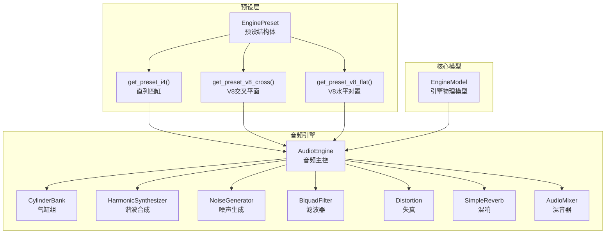
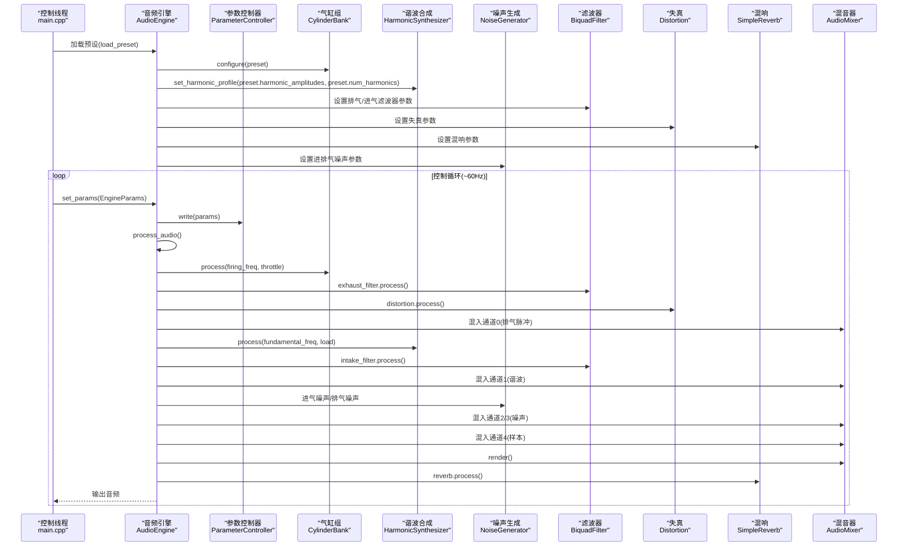
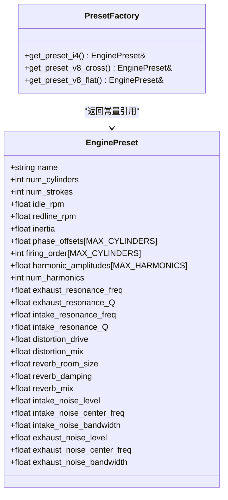
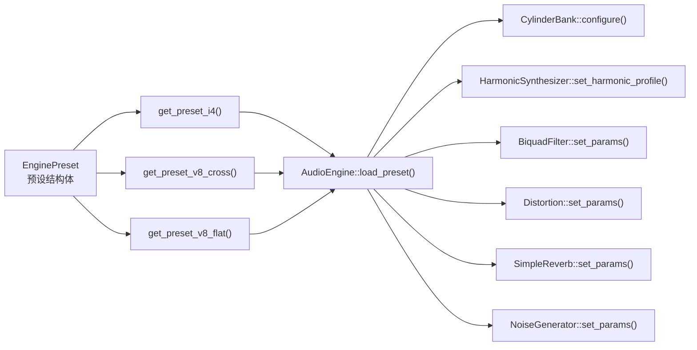

# 发动机预设管理系统

<cite>
**本文档引用的文件**
- [engine_preset.h](file://src/presets/engine_preset.h)
- [preset_i4.cpp](file://src/presets/preset_i4.cpp)
- [preset_v8_cross.cpp](file://src/presets/preset_v8_cross.cpp)
- [preset_v8_flat.cpp](file://src/presets/preset_v8_flat.cpp)
- [audio_engine.h](file://src/audio/audio_engine.h)
- [audio_engine.cpp](file://src/audio/audio_engine.cpp)
- [engine_model.h](file://src/core/engine_model.h)
- [cylinder_bank.h](file://src/core/cylinder_bank.h)
- [harmonic_synth.h](file://src/synth/harmonic_synth.h)
- [audio_mixer.h](file://src/mixer/audio_mixer.h)
- [types.h](file://src/core/types.h)
- [constants.h](file://src/core/constants.h)
- [main.cpp](file://src/main.cpp)
</cite>

## 目录
1. [简介](#简介)
2. [项目结构](#项目结构)
3. [核心组件](#核心组件)
4. [架构总览](#架构总览)
5. [详细组件分析](#详细组件分析)
6. [依赖关系分析](#依赖关系分析)
7. [性能考虑](#性能考虑)
8. [故障排除指南](#故障排除指南)
9. [结论](#结论)
10. [附录](#附录)

## 简介
本项目是一个赛车声学模拟器，专注于通过预设系统为不同类型的发动机生成逼真的声学特征。系统采用预设工厂模式，提供三种经典发动机类型：直列四缸（Inline-4）、V8交叉平面（V8 Cross-Plane）和V8水平对置（V8 Flat-Plane）。每个预设封装了完整的声学配置，包括气缸参数、点火时序、谐波分布、滤波器设置、失真与混响效果以及进排气噪声参数。

## 项目结构
系统采用模块化设计，核心目录组织如下：
- src/presets：预设定义与工厂函数，负责提供不同发动机类型的完整配置
- src/audio：音频引擎与处理流水线，负责将预设参数转换为最终音频输出
- src/core：核心模型与基础类型，包括引擎物理模型、气缸组、常量定义等
- src/synth：合成器模块，用于生成谐波与噪声
- src/mixer：混音器，负责多通道音频混合
- src/main.cpp：示例程序，展示如何加载预设、驱动引擎模型并播放声音

**图表来源**
- [engine_preset.h:8-47](file://src/presets/engine_preset.h#L8-L47)
- [preset_i4.cpp:5-56](file://src/presets/preset_i4.cpp#L5-L56)
- [preset_v8_cross.cpp:5-63](file://src/presets/preset_v8_cross.cpp#L5-L63)
- [preset_v8_flat.cpp:5-62](file://src/presets/preset_v8_flat.cpp#L5-L62)
- [audio_engine.h:27-89](file://src/audio/audio_engine.h#L27-L89)
- [engine_model.h:7-45](file://src/core/engine_model.h#L7-L45)

**章节来源**
- [engine_preset.h:1-55](file://src/presets/engine_preset.h#L1-L55)
- [audio_engine.h:1-92](file://src/audio/audio_engine.h#L1-L92)
- [engine_model.h:1-48](file://src/core/engine_model.h#L1-L48)

## 核心组件
本节深入解析预设系统的核心结构与工厂模式实现，涵盖参数定义、物理特性配置与声学特征建模。

- EnginePreset 结构体
  - 基础参数：气缸数量、冲程数、怠速转速、红线转速、飞轮惯量
  - 点火模式：每缸相位偏移（弧度）与点火顺序数组
  - 谐波谱：各次谐波幅度与谐波总数
  - 滤波器参数：排气共振频率与品质因数、进气共振频率与品质因数
  - 效果参数：失真驱动与混合、混响房间大小、阻尼与混合
  - 噪声参数：进气/排气噪声的强度、中心频率与带宽

- 预设工厂函数
  - 提供三个静态预设实例，使用局部静态变量确保线程安全与单例语义
  - 每个工厂函数返回对预设常量引用，避免重复分配与拷贝

- 参数范围与限制
  - 使用常量定义最大气缸数、最大谐波数、采样率与缓冲帧数等上限
  - 预设中的数值经过精心调优，以匹配典型发动机的声学特征

**章节来源**
- [engine_preset.h:8-47](file://src/presets/engine_preset.h#L8-L47)
- [engine_preset.h:49-52](file://src/presets/engine_preset.h#L49-L52)
- [constants.h:8-17](file://src/core/constants.h#L8-L17)

## 架构总览
音频引擎通过预设配置各个子模块，形成从“点火脉冲”到“最终音频”的完整处理链路。控制线程更新引擎状态并通过参数控制器传递给音频线程；音频线程读取当前预设与实时参数，执行多层合成与效果处理，最终输出到混音器并进行软限幅。

**图表来源**
- [audio_engine.cpp:70-92](file://src/audio/audio_engine.cpp#L70-L92)
- [audio_engine.cpp:102-160](file://src/audio/audio_engine.cpp#L102-L160)
- [main.cpp:115-129](file://src/main.cpp#L115-L129)

**章节来源**
- [audio_engine.cpp:18-45](file://src/audio/audio_engine.cpp#L18-L45)
- [audio_engine.cpp:70-92](file://src/audio/audio_engine.cpp#L70-L92)
- [audio_engine.cpp:102-160](file://src/audio/audio_engine.cpp#L102-L160)
- [main.cpp:146-233](file://src/main.cpp#L146-L233)

## 详细组件分析

### EnginePreset 结构与工厂模式
EnginePreset 是预设系统的核心数据容器，封装了所有与声学建模相关的参数。工厂函数通过局部静态变量实现线程安全的单例预设实例，避免重复初始化与内存开销。

**图表来源**
- [engine_preset.h:8-47](file://src/presets/engine_preset.h#L8-L47)
- [engine_preset.h:49-52](file://src/presets/engine_preset.h#L49-L52)

**章节来源**
- [engine_preset.h:8-47](file://src/presets/engine_preset.h#L8-L47)
- [engine_preset.h:49-52](file://src/presets/engine_preset.h#L49-L52)

### 直列四缸（Inline-4）预设
- 特性概述
  - 怠速与红线：适中的怠速与较高红线，强调中高转速表现
  - 点火时序：均匀间隔的点火相位，产生均衡的脉冲序列
  - 谐波分布：强调二阶与四阶谐波，营造“蜂鸣感”
  - 声学特征：排气共振频率适中，进气共振更宽泛，整体偏向“沙哑”质感
  - 效果与噪声：适度失真与混响，进排气噪声参数平衡

- 关键参数路径
  - [怠速/红线/惯量:11-13](file://src/presets/preset_i4.cpp#L11-L13)
  - [点火顺序与相位:15-20](file://src/presets/preset_i4.cpp#L15-L20)
  - [谐波幅度与数量:22-32](file://src/presets/preset_i4.cpp#L22-L32)
  - [滤波器参数:34-38](file://src/presets/preset_i4.cpp#L34-L38)
  - [效果与噪声:40-51](file://src/presets/preset_i4.cpp#L40-L51)

**章节来源**
- [preset_i4.cpp:5-56](file://src/presets/preset_i4.cpp#L5-L56)

### V8交叉平面（V8 Cross-Plane）预设
- 特性概述
  - 怠速与红线：较低怠速与适中红线，强调低频深沉感
  - 点火时序：不均匀间隔，产生经典的“V8咆哮”节奏
  - 谐波分布：强调基波与次谐波，呈现深沉的低频特征
  - 声学特征：低频排气共振与中频进气共振，配合适度失真与混响
  - 效果与噪声：较低的进排气噪声，突出管路共振

- 关键参数路径
  - [怠速/红线/惯量:11-13](file://src/presets/preset_v8_cross.cpp#L11-L13)
  - [点火顺序与相位:15-26](file://src/presets/preset_v8_cross.cpp#L15-L26)
  - [谐波幅度与数量:28-39](file://src/presets/preset_v8_cross.cpp#L28-L39)
  - [滤波器参数:41-45](file://src/presets/preset_v8_cross.cpp#L41-L45)
  - [效果与噪声:53-58](file://src/presets/preset_v8_cross.cpp#L53-L58)

**章节来源**
- [preset_v8_cross.cpp:5-63](file://src/presets/preset_v8_cross.cpp#L5-L63)

### V8水平对置（V8 Flat-Plane）预设
- 特性概述
  - 怠速与红线：较高怠速与极高红线，模拟高转速F1风格
  - 点火时序：均匀间隔，类似两个直列四缸的组合
  - 谐波分布：强调高频谐波，呈现尖锐的“尖叫”特征
  - 声学特征：高频排气与进气共振，配合高增益失真与较小混响
  - 效果与噪声：较高的进排气噪声中心频率与带宽

- 关键参数路径
  - [怠速/红线/惯量:11-13](file://src/presets/preset_v8_flat.cpp#L11-L13)
  - [点火顺序与相位:15-24](file://src/presets/preset_v8_flat.cpp#L15-L24)
  - [谐波幅度与数量:26-38](file://src/presets/preset_v8_flat.cpp#L26-L38)
  - [滤波器参数:40-44](file://src/presets/preset_v8_flat.cpp#L40-L44)
  - [效果与噪声:52-57](file://src/presets/preset_v8_flat.cpp#L52-L57)

**章节来源**
- [preset_v8_flat.cpp:5-62](file://src/presets/preset_v8_flat.cpp#L5-L62)

### 预设参数详解与调优建议
- 基础参数
  - 气缸数量与冲程数：决定点火频率与声学周期
  - 怠速与红线：影响可听频段与动态范围
  - 惯量：影响转速响应与平顺性
- 点火模式
  - 相位偏移与点火顺序：决定脉冲序列的对称性与节奏感
- 谐波谱
  - 谐波幅度与数量：控制频谱能量分布，影响“厚实”或“尖锐”感
- 滤波器
  - 排气/进气共振频率与品质因数：塑造管路共振特征
- 效果与噪声
  - 失真与混响：增强非线性与空间感
  - 进排气噪声：补充湍流与背压细节

调优经验法则
- 低转速偏好：提高低频谐波与排气共振，降低失真增益
- 高转速偏好：提升高频谐波与进气共振，增加噪声带宽
- 经典V8风格：强调基波与次谐波，适度混响与中等噪声
- 高端跑车风格：高频主导，锐利滤波，强失真与小混响

**章节来源**
- [engine_preset.h:11-47](file://src/presets/engine_preset.h#L11-L47)
- [preset_i4.cpp:22-51](file://src/presets/preset_i4.cpp#L22-L51)
- [preset_v8_cross.cpp:28-58](file://src/presets/preset_v8_cross.cpp#L28-L58)
- [preset_v8_flat.cpp:26-57](file://src/presets/preset_v8_flat.cpp#L26-L57)

### 创建新预设与自定义参数配置
- 步骤指南
  - 定义新工厂函数：在头文件声明，在源文件实现，使用局部静态EnginePreset
  - 配置基础参数：根据目标发动机类型设置气缸数、冲程数、怠速/红线、惯量
  - 设定点火模式：确定点火顺序与相位偏移，确保物理合理性
  - 设计谐波谱：基于目标音色选择谐波幅度与数量
  - 调整滤波器与效果：匹配管路共振与失真/混响参数
  - 校准噪声：平衡进排气噪声的强度、中心频率与带宽
  - 集成到应用：在主程序中添加预设加载与切换逻辑

- 扩展最佳实践
  - 保持参数范围合理，避免极端值导致不稳定或失真
  - 参考现有预设的参数比例，逐步微调
  - 在音频引擎中验证预设效果，及时调整以符合预期
  - 将新预设加入预设工厂函数列表，便于统一管理

**章节来源**
- [engine_preset.h:49-52](file://src/presets/engine_preset.h#L49-L52)
- [main.cpp:115-122](file://src/main.cpp#L115-L122)

## 依赖关系分析
预设系统与音频引擎之间通过工厂函数与参数控制器建立松耦合关系。音频引擎在初始化时加载预设，随后在音频回调中读取当前预设与实时参数，确保线程安全与高效处理。

**图表来源**
- [engine_preset.h:49-52](file://src/presets/engine_preset.h#L49-L52)
- [audio_engine.cpp:70-92](file://src/audio/audio_engine.cpp#L70-L92)

**章节来源**
- [audio_engine.cpp:70-92](file://src/audio/audio_engine.cpp#L70-L92)
- [engine_preset.h:49-52](file://src/presets/engine_preset.h#L49-L52)

## 性能考虑
- 预设加载与线程安全
  - 工厂函数使用局部静态变量，确保首次访问时初始化且线程安全
  - 音频引擎通过原子指针存储当前预设，避免锁竞争
- 处理链路优化
  - 固定缓冲区大小与Scratch缓冲，减少频繁分配
  - 合理的滤波器与效果参数，平衡音质与计算负载
- 实时性保障
  - 控制线程与音频线程分离，参数通过无锁队列传递
  - 音频回调内仅进行必要计算，避免阻塞

[本节为通用性能讨论，无需特定文件分析]

## 故障排除指南
- 无法初始化音频设备
  - 检查音频引擎初始化流程与设备配置
  - 确认采样率与缓冲帧数设置合理
- 预设未生效
  - 确认已调用预设加载函数并正确发布到音频线程
  - 检查参数控制器是否成功写入实时参数
- 声音异常或失真
  - 调整失真增益与混响参数，避免过载
  - 校准滤波器参数，防止频段过度衰减或放大
- 性能问题
  - 减少Scratch缓冲尺寸或优化处理链路
  - 检查是否有不必要的同步操作

**章节来源**
- [audio_engine.cpp:18-45](file://src/audio/audio_engine.cpp#L18-L45)
- [audio_engine.cpp:70-92](file://src/audio/audio_engine.cpp#L70-L92)
- [audio_engine.cpp:102-160](file://src/audio/audio_engine.cpp#L102-L160)

## 结论
本预设管理系统通过清晰的数据结构与工厂模式，实现了对多种发动机类型的精确声学建模。直列四缸、V8交叉平面与V8水平对置三类预设分别代表了不同的声学风格，满足从日常驾驶到高转速赛车的广泛需求。系统架构将预设配置与音频处理解耦，既保证了灵活性，又确保了实时性能。通过遵循本文档的参数调优经验与扩展指南，用户可以轻松创建新的预设并定制符合自身需求的声学特征。

[本节为总结性内容，无需特定文件分析]

## 附录

### 参数对照表（示例）
- 直列四缸（I4）
  - 怠速/红线/惯量：约850/7500/0.12
  - 点火相位：均匀间隔
  - 谐波重点：二阶与四阶
  - 排气共振：中等频率与品质因数
- V8交叉平面（V8 Cross-Plane）
  - 怠速/红线/惯量：约700/6500/0.20
  - 点火相位：不均匀间隔
  - 谐波重点：基波与次谐波
  - 排气共振：低频
- V8水平对置（V8 Flat-Plane）
  - 怠速/红线/惯量：约900/9000/0.10
  - 点火相位：均匀间隔
  - 谐波重点：高频
  - 排气共振：高频

**章节来源**
- [preset_i4.cpp:11-13](file://src/presets/preset_i4.cpp#L11-L13)
- [preset_v8_cross.cpp:11-13](file://src/presets/preset_v8_cross.cpp#L11-L13)
- [preset_v8_flat.cpp:11-13](file://src/presets/preset_v8_flat.cpp#L11-L13)