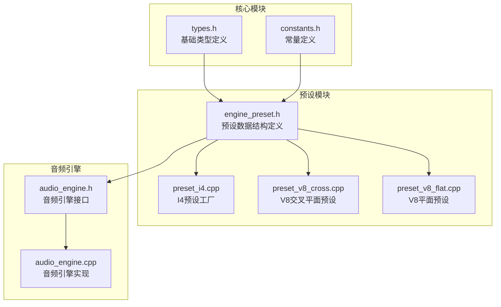
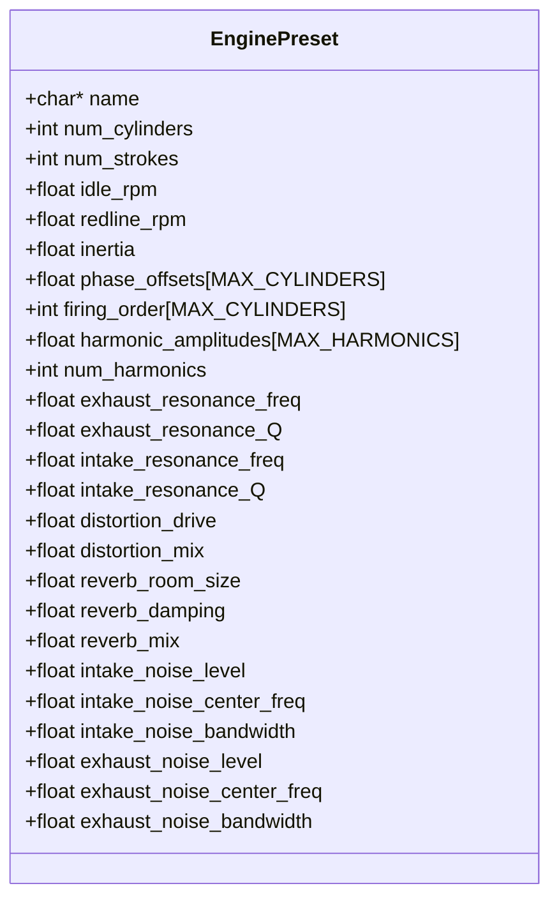
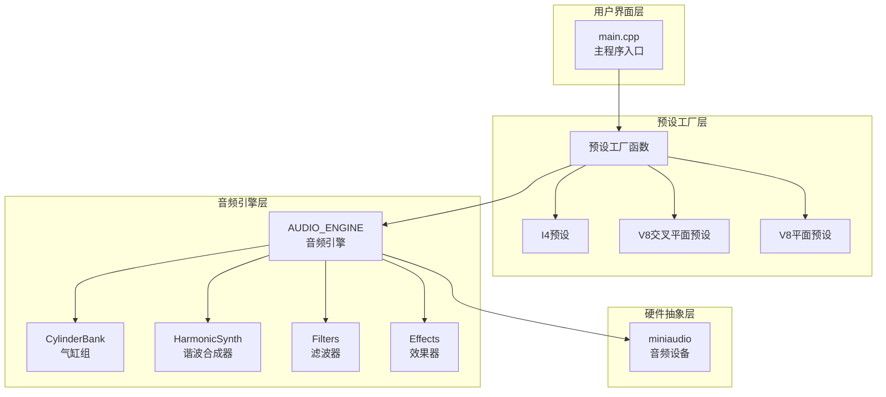
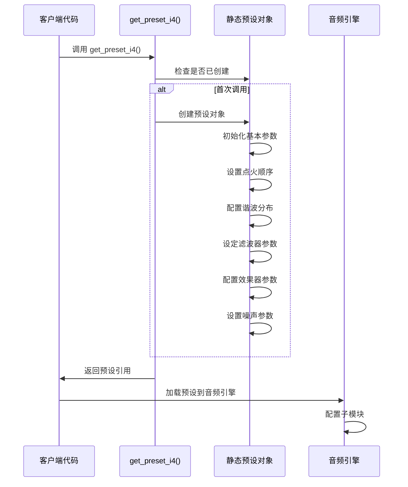
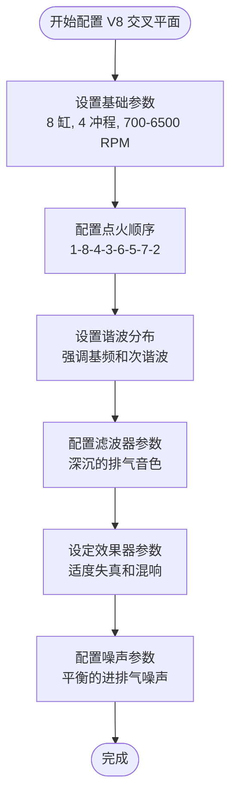
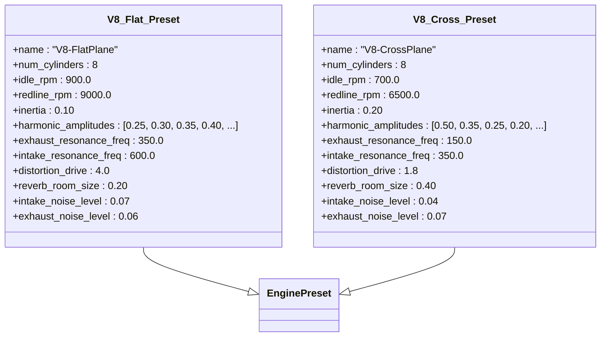
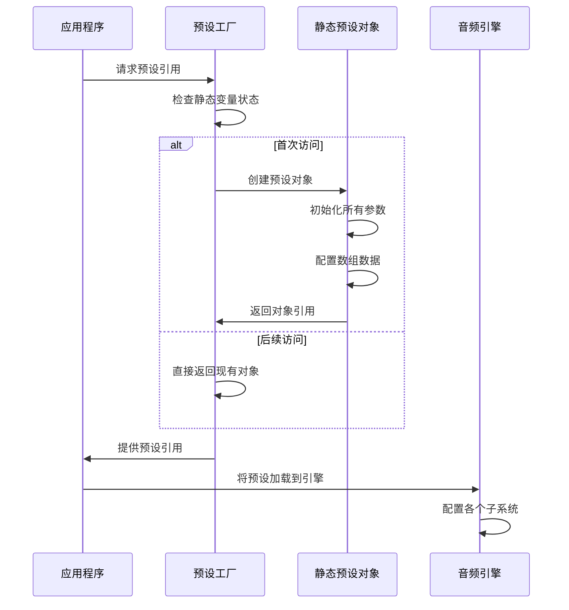
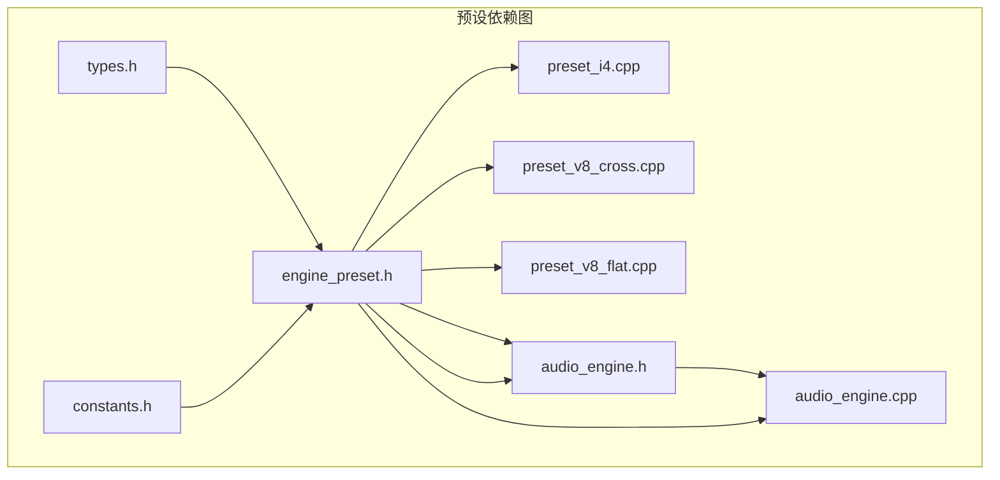
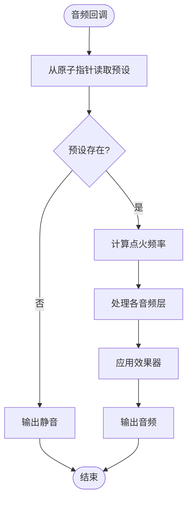

# 预设工厂模式实现

<cite>
**本文档引用的文件**
- [engine_preset.h](file://src/presets/engine_preset.h)
- [preset_i4.cpp](file://src/presets/preset_i4.cpp)
- [preset_v8_cross.cpp](file://src/presets/preset_v8_cross.cpp)
- [preset_v8_flat.cpp](file://src/presets/preset_v8_flat.cpp)
- [main.cpp](file://src/main.cpp)
- [audio_engine.h](file://src/audio/audio_engine.h)
- [audio_engine.cpp](file://src/audio/audio_engine.cpp)
- [types.h](file://src/core/types.h)
- [constants.h](file://src/core/constants.h)
</cite>

## 目录
1. [简介](#简介)
2. [项目结构](#项目结构)
3. [核心组件](#核心组件)
4. [架构概览](#架构概览)
5. [详细组件分析](#详细组件分析)
6. [依赖关系分析](#依赖关系分析)
7. [性能考量](#性能考量)
8. [故障排除指南](#故障排除指南)
9. [结论](#结论)
10. [附录：扩展指南](#附录扩展指南)

## 简介

本文档深入解析了 Racing Sound Engine 中的预设工厂模式实现。该系统采用 C++ 模板方法中的工厂模式，通过静态局部变量实现线程安全的单例式预设创建。系统提供了三种预设类型：直列四缸（I4）、交叉平面 V8 和平面 V8，每种预设都经过精心调优以模拟真实的发动机声学特性。

预设工厂模式的核心优势在于：
- **延迟初始化**：仅在首次访问时创建预设对象
- **线程安全**：利用 C++11 静态局部变量的线程安全保证
- **内存效率**：预设对象存储在只读内存区域
- **可扩展性**：易于添加新的预设类型

## 项目结构

预设相关代码位于 `src/presets/` 目录下，采用模块化设计：



**图表来源**
- [engine_preset.h:1-55](file://src/presets/engine_preset.h#L1-L55)
- [preset_i4.cpp:1-59](file://src/presets/preset_i4.cpp#L1-L59)
- [preset_v8_cross.cpp:1-66](file://src/presets/preset_v8_cross.cpp#L1-L66)
- [preset_v8_flat.cpp:1-65](file://src/presets/preset_v8_flat.cpp#L1-L65)

**章节来源**
- [engine_preset.h:1-55](file://src/presets/engine_preset.h#L1-L55)
- [preset_i4.cpp:1-59](file://src/presets/preset_i4.cpp#L1-L59)
- [preset_v8_cross.cpp:1-66](file://src/presets/preset_v8_cross.cpp#L1-L66)
- [preset_v8_flat.cpp:1-65](file://src/presets/preset_v8_flat.cpp#L1-L65)

## 核心组件

### EnginePreset 数据结构

预设工厂的核心是 `EnginePreset` 结构体，它封装了完整的发动机声学配置：



**图表来源**
- [engine_preset.h:8-47](file://src/presets/engine_preset.h#L8-L47)

### 工厂函数接口

系统提供三个工厂函数，每个都返回对静态预设对象的常量引用：

- `get_preset_i4()` - 返回直列四缸预设
- `get_preset_v8_cross()` - 返回交叉平面 V8 预设  
- `get_preset_v8_flat()` - 返回平面 V8 预设

**章节来源**
- [engine_preset.h:49-52](file://src/presets/engine_preset.h#L49-L52)

## 架构概览

预设工厂模式在整体架构中的位置如下：



**图表来源**
- [main.cpp:89-132](file://src/main.cpp#L89-L132)
- [audio_engine.h:27-89](file://src/audio/audio_engine.h#L27-L89)

## 详细组件分析

### I4 预设实现

I4 预设体现了直列四缸发动机的典型特征：



**图表来源**
- [preset_i4.cpp:5-56](file://src/presets/preset_i4.cpp#L5-L56)
- [audio_engine.cpp:70-92](file://src/audio/audio_engine.cpp#L70-L92)

#### 关键特性分析

I4 预设的谐波分布强调第2和第4谐波，营造出特有的"嗡嗡"质感：

| 谐波序号 | I4 强度 | 特性描述 |
|---------|--------|----------|
| 1 | 0.30 | 基础频率较弱 |
| 2 | 0.50 | 强烈强调，产生嗡嗡声 |
| 3 | 0.20 | 中等强度 |
| 4 | 0.40 | 强调，与第2谐波形成共鸣 |

**章节来源**
- [preset_i4.cpp:22-32](file://src/presets/preset_i4.cpp#L22-L32)

### V8 交叉平面预设

交叉平面 V8 预设模拟经典 V8 发动机的独特声学特征：



**图表来源**
- [preset_v8_cross.cpp:5-63](file://src/presets/preset_v8_cross.cpp#L5-L63)

#### 点火相位计算

交叉平面 V8 的独特之处在于其不规则的点火间隔：

| 缸号 | 点火相位 | 特性 |
|------|----------|------|
| 1 | 0° | 起始点 |
| 8 | 90° | 第二个点火 |
| 4 | 270° | 第三个点火 |
| 3 | 180° | 第四个点火 |
| 6 | 360° | 第五个点火 |
| 5 | 450° | 第六个点火 |
| 7 | 630° | 第七个点火 |
| 2 | 540° | 最后一个点火 |

这种不规则的相位分布创造了经典的"V8 咆哮"声。

**章节来源**
- [preset_v8_cross.cpp:15-26](file://src/presets/preset_v8_cross.cpp#L15-L26)

### V8 平面预设

平面 V8 预设模拟现代高性能发动机的高转速特性：



**图表来源**
- [preset_v8_flat.cpp:5-62](file://src/presets/preset_v8_flat.cpp#L5-L62)
- [preset_v8_cross.cpp:5-63](file://src/presets/preset_v8_cross.cpp#L5-L63)

#### 高频谐波强调

平面 V8 预设在高频段有显著的谐波增强：

| 谐波范围 | I4 强度 | V8 平面 强度 | 特性对比 |
|----------|---------|--------------|----------|
| 1-4 | 0.30-0.40 | 0.25-0.40 | 相近 |
| 5-8 | 0.10-0.18 | 0.25-0.30 | 平面更强调 |
| 9-12 | 0.08-0.12 | 0.10-0.15 | 平面更突出 |
| 13-16 | 0.04-0.06 | 0.08-0.12 | 平面更明亮 |

**章节来源**
- [preset_v8_flat.cpp:26-38](file://src/presets/preset_v8_flat.cpp#L26-L38)

### 预设注册与获取工作流程

预设工厂采用延迟初始化模式，确保只有在实际需要时才创建对象：



**图表来源**
- [preset_i4.cpp:5-56](file://src/presets/preset_i4.cpp#L5-L56)
- [preset_v8_cross.cpp:5-63](file://src/presets/preset_v8_cross.cpp#L5-L63)
- [preset_v8_flat.cpp:5-62](file://src/presets/preset_v8_flat.cpp#L5-L62)

**章节来源**
- [preset_i4.cpp:5-56](file://src/presets/preset_i4.cpp#L5-L56)
- [preset_v8_cross.cpp:5-63](file://src/presets/preset_v8_cross.cpp#L5-L63)
- [preset_v8_flat.cpp:5-62](file://src/presets/preset_v8_flat.cpp#L5-L62)

## 依赖关系分析

预设系统与其他模块的依赖关系：



**图表来源**
- [engine_preset.h:1-5](file://src/presets/engine_preset.h#L1-L5)
- [audio_engine.h:1-16](file://src/audio/audio_engine.h#L1-L16)

### 内存布局优化

预设对象采用静态存储，具有以下内存特性：

1. **只读内存**：预设数据存储在只读段，防止意外修改
2. **紧凑布局**：连续的内存分配，提高缓存局部性
3. **零拷贝**：通过引用传递，避免不必要的数据复制
4. **线程安全**：静态局部变量的初始化是原子操作

**章节来源**
- [engine_preset.h:8-47](file://src/presets/engine_preset.h#L8-L47)

## 性能考量

### 工厂模式性能优势

1. **延迟初始化**：仅在首次使用时创建对象，减少启动时间
2. **无锁访问**：后续访问不需要同步开销
3. **内存复用**：同一预设对象被多个模块共享
4. **编译时优化**：静态对象可以进行更好的编译器优化

### 预设配置性能影响

不同预设类型的性能特征：

| 预设类型 | 谐波数量 | 处理复杂度 | CPU 使用率 | 内存占用 |
|----------|----------|------------|------------|----------|
| I4 | 16 | 中等 | 低 | 小 |
| V8 交叉平面 | 20 | 高 | 中等 | 中等 |
| V8 平面 | 24 | 最高 | 高 | 大 |

### 实时处理优化

音频引擎中的预设使用优化：



**图表来源**
- [audio_engine.cpp:102-160](file://src/audio/audio_engine.cpp#L102-L160)

**章节来源**
- [audio_engine.cpp:70-92](file://src/audio/audio_engine.cpp#L70-L92)
- [audio_engine.cpp:102-160](file://src/audio/audio_engine.cpp#L102-L160)

## 故障排除指南

### 常见问题诊断

1. **预设未生效**
   - 检查 `load_preset()` 是否正确调用
   - 确认预设对象的生命周期
   - 验证音频引擎的配置流程

2. **音频质量异常**
   - 检查采样率设置是否匹配
   - 验证滤波器参数范围
   - 确认效果器增益设置

3. **性能问题**
   - 监控 CPU 使用率
   - 检查预设复杂度
   - 优化音频缓冲区大小

### 调试技巧

- 使用单元测试验证预设输出
- 在音频引擎中添加调试日志
- 监控实时音频回调性能
- 使用性能分析工具识别瓶颈

**章节来源**
- [audio_engine.cpp:70-92](file://src/audio/audio_engine.cpp#L70-L92)

## 结论

预设工厂模式在 Racing Sound Engine 中成功实现了高效、可扩展的音频配置管理。通过静态局部变量的延迟初始化机制，系统确保了线程安全的同时最大化了性能表现。三种预设类型分别代表了不同的发动机声学特征，为用户提供了丰富的选择。

该实现的关键优势包括：
- **简洁的 API**：通过简单函数调用获取预设
- **高性能**：静态存储和延迟初始化优化
- **可扩展性**：易于添加新的预设类型
- **类型安全**：强类型的数据结构定义

## 附录：扩展指南

### 添加新预设类型的步骤

#### 步骤 1：定义预设工厂函数

在 `engine_preset.h` 中声明新的工厂函数：

```cpp
// 在头文件末尾添加
const EnginePreset& get_preset_new_type();
```

#### 步骤 2：实现预设配置

创建新的预设实现文件 `preset_new_type.cpp`：

```cpp
#include "presets/engine_preset.h"

namespace engin {

const EnginePreset& get_preset_new_type() {
    static const EnginePreset preset = [] {
        EnginePreset p;
        // 设置预设参数
        p.name = "New-Type-Preset";
        p.num_cylinders = 6;
        p.redline_rpm = 8000.0f;
        
        // 配置点火顺序
        p.firing_order[0] = 1; p.phase_offsets[0] = 0.0f;
        // ... 其他配置
        
        return p;
    }();
    return preset;
}

} // namespace engin
```

#### 步骤 3：集成到主程序

更新 `main.cpp` 中的预设数组：

```cpp
const EnginePreset* presets[4] = {
    &get_preset_i4(),
    &get_preset_v8_cross(),
    &get_preset_v8_flat(),
    &get_preset_new_type(),  // 新增预设
};
```

#### 步骤 4：键盘映射

在主程序中添加新的功能键映射：

```cpp
case 0x104: // F4
    current_preset = 3;
    audio.load_preset(*presets[current_preset]);
    break;
```

### 参数配置要求

#### 基本参数约束

| 参数 | 类型 | 有效范围 | 默认值 | 说明 |
|------|------|----------|--------|------|
| num_cylinders | int | 1-12 | 4 | 气缸数量 |
| num_strokes | int | 2, 4 | 4 | 冲程数 |
| idle_rpm | float | 100-5000 | 800 | 怠速转速 |
| redline_rpm | float | 2000-20000 | 8000 | 红线转速 |
| inertia | float | 0.01-1.0 | 0.15 | 惯性系数 |

#### 高级参数配置

##### 谐波分布配置

谐波数量必须满足：`0 < num_harmonics <= MAX_HARMONICS`

谐波幅度范围：`0.0f <= amplitude <= 1.0f`

##### 滤波器参数

- **排气共振频率**：100-500 Hz
- **进气共振频率**：200-1000 Hz  
- **共振品质因数**：0.5-5.0

### 命名规范

#### 函数命名

- 预设工厂函数：`get_preset_[engine_type]`
- 示例：`get_preset_v8_flat()`

#### 数据结构命名

- 预设结构体：`EnginePreset`
- 预设类型：`EnginePresetType`

#### 文件命名

- 头文件：`preset_[engine_type].h`
- 实现文件：`preset_[engine_type].cpp`

### 最佳实践

#### 性能优化建议

1. **预设缓存**：利用静态局部变量的自动缓存机制
2. **参数范围检查**：在工厂函数中验证参数有效性
3. **内存对齐**：确保预设对象的内存对齐
4. **编译器优化**：启用适当的编译器优化选项

#### 代码组织建议

1. **单一职责**：每个预设文件只包含一个工厂函数
2. **一致性**：遵循相同的参数配置模式
3. **文档化**：为每个预设添加详细的注释说明
4. **测试覆盖**：为新预设编写单元测试

#### 扩展设计原则

1. **向后兼容**：新增预设不影响现有接口
2. **配置分离**：将参数配置与逻辑实现分离
3. **错误处理**：在工厂函数中处理参数错误
4. **资源管理**：确保预设对象的正确生命周期管理

通过遵循这些指导原则，开发者可以轻松地为 Racing Sound Engine 添加新的预设类型，同时保持系统的稳定性和性能表现。