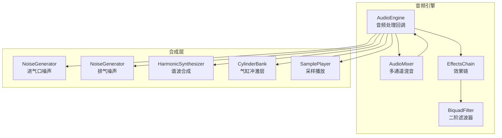
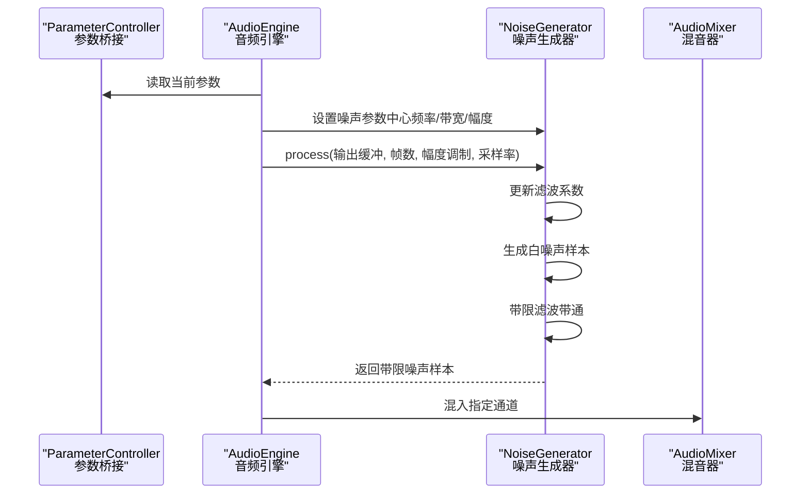
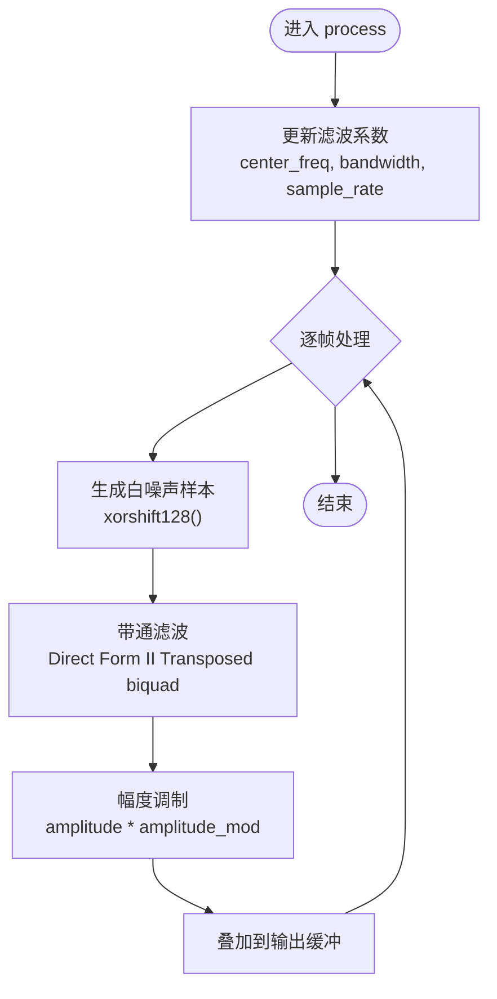
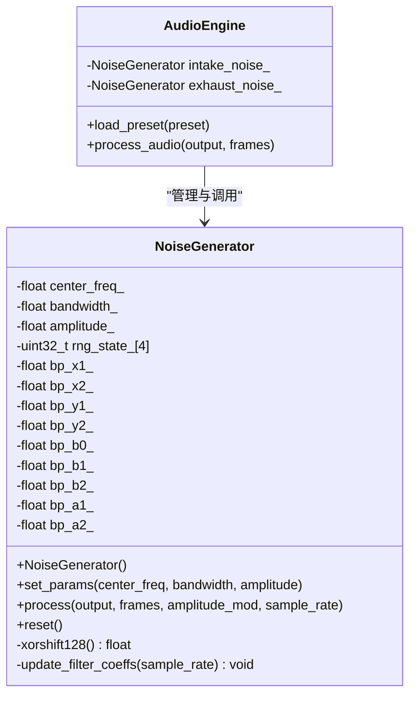
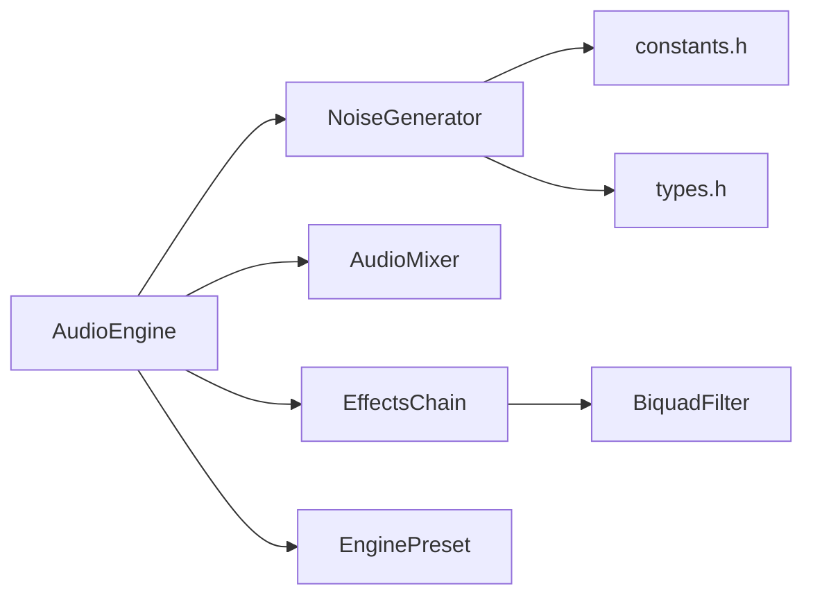

# 噪声生成器

<cite>
**本文引用的文件**
- [noise_generator.h](file://src/synth/noise_generator.h)
- [noise_generator.cpp](file://src/synth/noise_generator.cpp)
- [audio_engine.h](file://src/audio/audio_engine.h)
- [audio_engine.cpp](file://src/audio/audio_engine.cpp)
- [engine_preset.h](file://src/presets/engine_preset.h)
- [preset_i4.cpp](file://src/presets/preset_i4.cpp)
- [effects_chain.h](file://src/effects/effects_chain.h)
- [effects_chain.cpp](file://src/effects/effects_chain.cpp)
- [biquad_filter.h](file://src/effects/biquad_filter.h)
- [biquad_filter.cpp](file://src/effects/biquad_filter.cpp)
- [audio_mixer.h](file://src/mixer/audio_mixer.h)
- [parameter_controller.h](file://src/core/parameter_controller.h)
- [constants.h](file://src/core/constants.h)
- [types.h](file://src/core/types.h)
</cite>

## 目录
1. [引言](#引言)
2. [项目结构](#项目结构)
3. [核心组件](#核心组件)
4. [架构总览](#架构总览)
5. [详细组件分析](#详细组件分析)
6. [依赖关系分析](#依赖关系分析)
7. [性能考量](#性能考量)
8. [故障排查指南](#故障排查指南)
9. [结论](#结论)
10. [附录](#附录)

## 引言
本文件围绕赛车声音引擎中的“噪声生成器”模块，提供从数学原理到工程实现、从参数配置到音色塑造与性能优化的完整技术文档。噪声生成器负责在进气口与排气口等位置注入带限噪声，以模拟真实引擎的湍流与背压特性，从而增强听感的真实度与层次感。本文将重点说明：

- 白噪声与粉红噪声的生成原理与实现差异（本实现采用白噪声，辅以带限滤波近似粉红噪声的频段特性）
- 频谱整形技术：功率谱密度与频率响应的调节方式
- 参数配置：中心频率、带宽、幅度、动态范围等
- 在引擎声音合成中的应用：进气口噪声、排气管噪声
- 调优指南与音色塑造技巧
- 实现代码示例路径与性能优化建议

## 项目结构
噪声生成器位于合成层，作为独立模块被音频引擎调度，参与多通道混音与最终输出。其主要文件与职责如下：
- 噪声生成器：src/synth/noise_generator.{h,cpp}
- 音频引擎：src/audio/audio_engine.{h,cpp}
- 预设参数：src/presets/engine_preset.h 及具体预设实现
- 效果链与滤波器：src/effects/effects_chain.{h,cpp}、src/effects/biquad_filter.{h,cpp}
- 混音器：src/mixer/audio_mixer.h
- 参数桥接：src/core/parameter_controller.h
- 核心常量与类型：src/core/constants.h、src/core/types.h

图表来源
- [audio_engine.h:58-89](file://src/audio/audio_engine.h#L58-L89)
- [audio_engine.cpp:102-160](file://src/audio/audio_engine.cpp#L102-L160)
- [effects_chain.h:8-21](file://src/effects/effects_chain.h#L8-L21)
- [effects_chain.cpp:17-27](file://src/effects/effects_chain.cpp#L17-L27)
- [biquad_filter.h:1-20](file://src/effects/biquad_filter.h#L1-L20)

章节来源
- [audio_engine.h:27-89](file://src/audio/audio_engine.h#L27-L89)
- [audio_engine.cpp:102-160](file://src/audio/audio_engine.cpp#L102-L160)

## 核心组件
- 噪声生成器（NoiseGenerator）：提供带限白噪声生成，内部使用 xorshift128 线性同余随机数生成器，配合一阶或二阶滤波器形成目标频段的噪声信号。
- 预设参数（EnginePreset）：包含进气口与排气口噪声的中心频率、带宽与强度等关键参数，随预设切换而更新。
- 音频引擎（AudioEngine）：在音频回调中按顺序生成各层信号，将噪声分别混入不同通道，并通过效果链与混音器输出。

章节来源
- [noise_generator.h:8-38](file://src/synth/noise_generator.h#L8-L38)
- [noise_generator.cpp:7-81](file://src/synth/noise_generator.cpp#L7-L81)
- [engine_preset.h:40-47](file://src/presets/engine_preset.h#L40-L47)
- [audio_engine.cpp:138-143](file://src/audio/audio_engine.cpp#L138-L143)

## 架构总览
噪声生成器在音频引擎中的工作流如下：
- 预设加载时，根据预设设置噪声中心频率、带宽与幅度
- 音频回调中，依据节气门开度对噪声幅度进行动态调制
- 使用带限滤波器将白噪声整形至目标频段
- 将噪声叠加到对应通道缓冲区，再由混音器统一渲染

图表来源
- [audio_engine.cpp:102-160](file://src/audio/audio_engine.cpp#L102-L160)
- [noise_generator.cpp:60-79](file://src/synth/noise_generator.cpp#L60-L79)
- [parameter_controller.h:42-50](file://src/core/parameter_controller.h#L42-L50)

## 详细组件分析

### 数学原理与实现要点
- 白噪声生成：使用 xorshift128 伪随机数生成器产生[-1,1]区间均匀分布的样本，作为噪声源。
- 功率谱密度（PSD）：白噪声在全频带内具有平坦的功率谱；本实现通过带限滤波器将能量限制在目标频段，从而在目标频段内形成近似“粉红噪声”的能量分布特征。
- 频率响应整形：通过一阶或二阶带通滤波器实现中心频率与带宽的调节，Q 值影响带宽与峰值响应。
- 幅度调制：结合节气门开度对噪声幅度进行非线性调制，模拟进气/排气动态变化。

图表来源
- [noise_generator.cpp:39-79](file://src/synth/noise_generator.cpp#L39-L79)
- [noise_generator.h:20-38](file://src/synth/noise_generator.h#L20-L38)

章节来源
- [noise_generator.cpp:25-37](file://src/synth/noise_generator.cpp#L25-L37)
- [noise_generator.cpp:39-58](file://src/synth/noise_generator.cpp#L39-L58)
- [noise_generator.cpp:60-79](file://src/synth/noise_generator.cpp#L60-L79)

### 类与接口关系

图表来源
- [noise_generator.h:8-38](file://src/synth/noise_generator.h#L8-L38)
- [audio_engine.h:62-63](file://src/audio/audio_engine.h#L62-L63)
- [audio_engine.cpp:86-91](file://src/audio/audio_engine.cpp#L86-L91)

章节来源
- [noise_generator.h:8-38](file://src/synth/noise_generator.h#L8-L38)
- [audio_engine.h:62-63](file://src/audio/audio_engine.h#L62-L63)

### 参数配置与调优指南
- 中心频率（center_freq）：决定噪声能量集中的频段。进气口噪声通常偏高频，排气口噪声偏低频。
- 带宽（bandwidth）：控制噪声频段宽度，影响“粗糙度”与“厚度”。带宽越大，能量越分散，听感更“沙”。
- 幅度（amplitude）：基础噪声强度。结合动态调制可模拟负载变化。
- 动态范围（amplitude_mod）：随节气门开度非线性变化，进气口噪声常用温和提升，排气口噪声可更强。
- 预设参数（EnginePreset）：提供不同引擎类型的默认噪声参数，便于快速上手与风格化。

调优步骤建议：
- 先以预设参数启动，确认整体平衡
- 逐步调整中心频率与带宽，观察目标频段的突出程度
- 结合节气门调制曲线，使低转弱、高转强，贴合听感
- 控制总输出幅度，避免与主音头冲突

章节来源
- [engine_preset.h:40-47](file://src/presets/engine_preset.h#L40-L47)
- [preset_i4.cpp:46-51](file://src/presets/preset_i4.cpp#L46-L51)
- [audio_engine.cpp:138-143](file://src/audio/audio_engine.cpp#L138-L143)

### 在引擎声音合成中的应用
- 进气口噪声：用于模拟进气歧管与节气门处的湍流，通常高频、较薄，强调瞬态与节气门开度变化。
- 排气管噪声：用于模拟排气背压与共振，通常中低频、较厚，强调脉动与排气节奏。
- 多通道策略：进气口噪声与排气口噪声分别混入不同通道，便于后续效果链独立处理与平衡。

章节来源
- [audio_engine.cpp:138-143](file://src/audio/audio_engine.cpp#L138-L143)
- [audio_engine.h:62-63](file://src/audio/audio_engine.h#L62-L63)

### 实现代码示例路径
- 噪声生成器初始化与参数设置
  - [noise_generator.h:10-15](file://src/synth/noise_generator.h#L10-L15)
  - [noise_generator.cpp:11-15](file://src/synth/noise_generator.cpp#L11-L15)
- 噪声生成与滤波
  - [noise_generator.cpp:60-79](file://src/synth/noise_generator.cpp#L60-L79)
  - [noise_generator.cpp:39-58](file://src/synth/noise_generator.cpp#L39-L58)
- 预设加载与噪声参数注入
  - [audio_engine.cpp:86-91](file://src/audio/audio_engine.cpp#L86-L91)
  - [engine_preset.h:40-47](file://src/presets/engine_preset.h#L40-L47)
- 音频回调中的噪声混入
  - [audio_engine.cpp:138-143](file://src/audio/audio_engine.cpp#L138-L143)

## 依赖关系分析
- 噪声生成器依赖
  - 核心类型与常量：types.h、constants.h
  - 预设参数：engine_preset.h
  - 滤波器：biquad_filter.h/.cpp（用于带限整形）
  - 效果链：effects_chain.h/.cpp（可选串联在噪声之后）
  - 混音器：audio_mixer.h（将噪声混入目标通道）
- 音频引擎耦合
  - 通过 AudioEngine::load_preset 注入噪声参数
  - 在 process_audio 中按通道混入噪声

图表来源
- [noise_generator.h:3-4](file://src/synth/noise_generator.h#L3-L4)
- [audio_engine.h:9-16](file://src/audio/audio_engine.h#L9-L16)
- [effects_chain.h:3-4](file://src/effects/effects_chain.h#L3-L4)
- [biquad_filter.h:1-20](file://src/effects/biquad_filter.h#L1-L20)
- [engine_preset.h:3-5](file://src/presets/engine_preset.h#L3-L5)

章节来源
- [audio_engine.h:9-16](file://src/audio/audio_engine.h#L9-L16)
- [effects_chain.h:3-4](file://src/effects/effects_chain.h#L3-L4)
- [biquad_filter.h:1-20](file://src/effects/biquad_filter.h#L1-L20)

## 性能考量
- 随机数生成：xorshift128 为轻量级整数运算，CPU 成本极低，适合实时音频
- 滤波实现：Direct Form II Transposed biquad 计算量小、数值稳定，适合实时滤波
- 缓冲策略：音频引擎使用固定大小的本地缓冲（MAX_SCRATCH），避免频繁分配
- 参数桥接：ParameterController 三缓冲无锁参数传递，避免音频线程阻塞
- 输出保护：音频引擎末尾使用软限幅（tanh 压缩）防止削波

优化建议：
- 合理设置带宽与采样率，避免过高的滤波阶数
- 在预设中预先设定合理的中心频率与带宽，减少运行时动态更新
- 将噪声与其他实时计算合并到同一帧循环，降低跨模块调用成本
- 对幅度调制采用平滑插值，避免突变带来的瞬态噪声

章节来源
- [noise_generator.cpp:25-37](file://src/synth/noise_generator.cpp#L25-L37)
- [noise_generator.cpp:60-79](file://src/synth/noise_generator.cpp#L60-L79)
- [audio_engine.cpp:102-160](file://src/audio/audio_engine.cpp#L102-L160)
- [parameter_controller.h:18-50](file://src/core/parameter_controller.h#L18-L50)

## 故障排查指南
- 噪声异常安静或过响
  - 检查预设中的噪声幅度是否合理
  - 确认动态调制系数是否符合预期
  - 参考路径：[engine_preset.h:40-47](file://src/presets/engine_preset.h#L40-L47)，[audio_engine.cpp:138-143](file://src/audio/audio_engine.cpp#L138-L143)
- 噪声频段不正确
  - 检查中心频率与带宽设置
  - 确认滤波系数更新逻辑是否在每帧执行
  - 参考路径：[noise_generator.cpp:39-58](file://src/synth/noise_generator.cpp#L39-L58)
- 噪声失真或刺耳
  - 适当降低幅度或增大带宽，避免能量过于集中
  - 在噪声后串联低通或带限滤波进一步整形
  - 参考路径：[effects_chain.h:8-21](file://src/effects/effects_chain.h#L8-L21)，[biquad_filter.h:1-20](file://src/effects/biquad_filter.h#L1-L20)
- 削波或爆音
  - 检查混音器总输出是否超过安全阈值
  - 使用软限幅（tanh）保护输出
  - 参考路径：[audio_engine.cpp:155-159](file://src/audio/audio_engine.cpp#L155-L159)

章节来源
- [engine_preset.h:40-47](file://src/presets/engine_preset.h#L40-L47)
- [audio_engine.cpp:138-143](file://src/audio/audio_engine.cpp#L138-L143)
- [noise_generator.cpp:39-58](file://src/synth/noise_generator.cpp#L39-L58)
- [effects_chain.h:8-21](file://src/effects/effects_chain.h#L8-L21)
- [biquad_filter.h:1-20](file://src/effects/biquad_filter.h#L1-L20)
- [audio_engine.cpp:155-159](file://src/audio/audio_engine.cpp#L155-L159)

## 结论
噪声生成器通过高效的白噪声与带限滤波组合，在保持低 CPU 占用的同时实现了对目标频段的精确控制。结合预设参数与动态调制，能够自然地模拟进气口与排气管的湍流与背压特性。通过合理的参数调优与效果链整形，可在不同引擎风格下实现丰富且真实的噪声音色。

## 附录
- 关键类型与常量
  - [types.h:7-9](file://src/core/types.h#L7-L9)
  - [constants.h:8-16](file://src/core/constants.h#L8-L16)
- 预设工厂函数
  - [engine_preset.h:49-53](file://src/presets/engine_preset.h#L49-L53)
- IIR 滤波器接口
  - [biquad_filter.h:1-20](file://src/effects/biquad_filter.h#L1-L20)