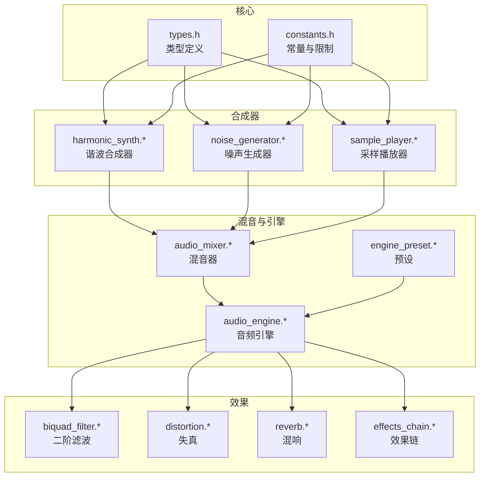
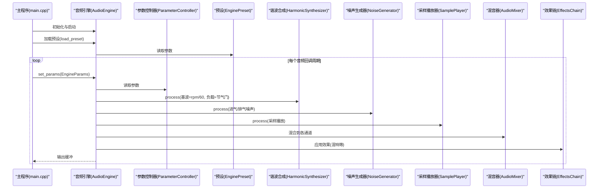
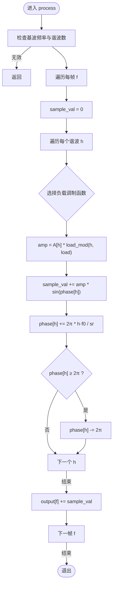
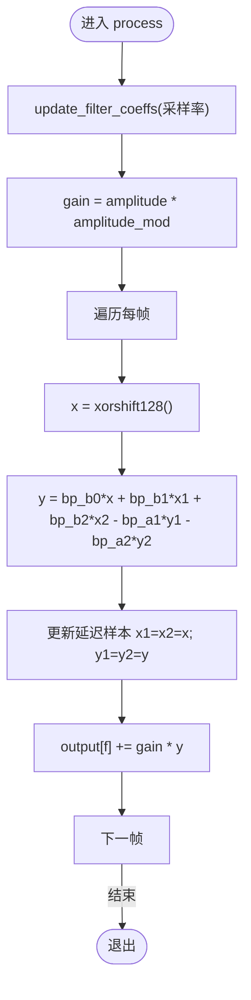
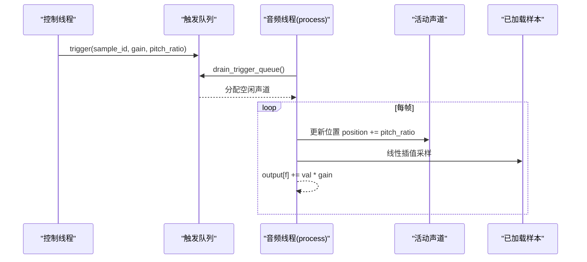
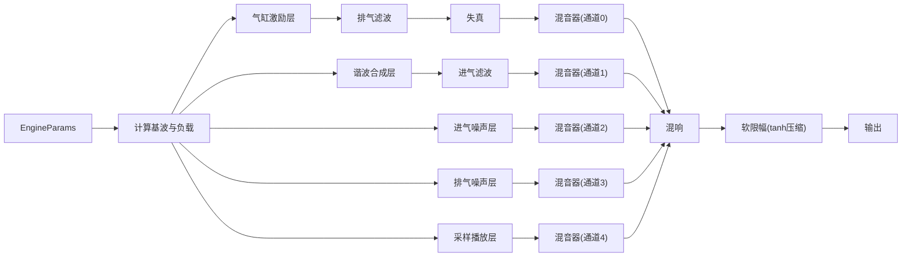
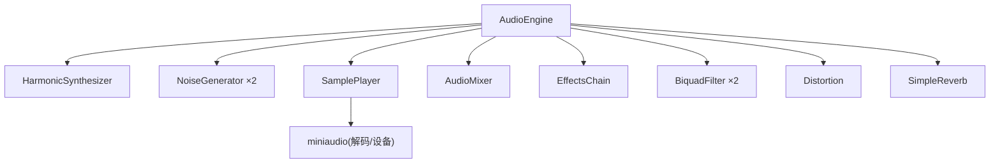

# 声音合成系统

<cite>
**本文引用的文件**
- [src/synth/harmonic_synth.h](file://src/synth/harmonic_synth.h)
- [src/synth/harmonic_synth.cpp](file://src/synth/harmonic_synth.cpp)
- [src/synth/noise_generator.h](file://src/synth/noise_generator.h)
- [src/synth/noise_generator.cpp](file://src/synth/noise_generator.cpp)
- [src/synth/sample_player.h](file://src/synth/sample_player.h)
- [src/synth/sample_player.cpp](file://src/synth/sample_player.cpp)
- [src/audio/audio_engine.h](file://src/audio/audio_engine.h)
- [src/audio/audio_engine.cpp](file://src/audio/audio_engine.cpp)
- [src/mixer/audio_mixer.h](file://src/mixer/audio_mixer.h)
- [src/mixer/audio_mixer.cpp](file://src/mixer/audio_mixer.cpp)
- [src/core/types.h](file://src/core/types.h)
- [src/core/constants.h](file://src/core/constants.h)
- [src/presets/engine_preset.h](file://src/presets/engine_preset.h)
- [src/presets/preset_i4.cpp](file://src/presets/preset_i4.cpp)
- [src/effects/effects_chain.h](file://src/effects/effects_chain.h)
- [src/effects/effects_chain.cpp](file://src/effects/effects_chain.cpp)
- [src/main.cpp](file://src/main.cpp)
</cite>

## 目录
1. [简介](#简介)
2. [项目结构](#项目结构)
3. [核心组件](#核心组件)
4. [架构总览](#架构总览)
5. [详细组件分析](#详细组件分析)
6. [依赖关系分析](#依赖关系分析)
7. [性能考量](#性能考量)
8. [故障排查指南](#故障排查指南)
9. [结论](#结论)
10. [附录：参数配置与音色调节](#附录参数配置与音色调节)

## 简介
本项目是一个面向赛车引擎模拟的声音合成系统，围绕“气缸激励层 + 谐波合成层 + 噪声层 + 采样播放层”的多层合成架构构建。系统通过参数控制器驱动引擎模型，计算出节气门与转速等关键参数，再由各合成器模块生成对应的声音信号，经滤波、失真、混音与混响等效果处理后输出。本文档聚焦以下内容：
- 谐波合成器的原理与实现：基波与谐波生成、频率调制、幅度包络控制
- 噪声生成器设计：白噪声、带限噪声与频谱整形
- 采样播放器功能：样本加载、循环播放、变速播放
- 合成器协作机制与数据流
- 参数配置指南与音色调节技巧
- 数字信号处理基础与算法实现
- 扩展新合成器与自定义音色生成算法的方法

## 项目结构
系统采用按功能域分层的组织方式：
- 核心类型与常量：统一的数据类型与全局常量
- 合成器子系统：谐波合成、噪声生成、采样播放
- 效果处理：滤波、失真、混响与效果链
- 混音器：多通道累加与渲染
- 音频引擎：设备初始化、回调、参数读取与处理流程
- 预设：不同发动机类型的参数集合
- 主程序：交互式控制台界面与实时参数注入

图表来源
- [src/core/types.h:1-12](file://src/core/types.h#L1-L12)
- [src/core/constants.h:1-20](file://src/core/constants.h#L1-L20)
- [src/synth/harmonic_synth.h:1-28](file://src/synth/harmonic_synth.h#L1-L28)
- [src/synth/noise_generator.h:1-41](file://src/synth/noise_generator.h#L1-L41)
- [src/synth/sample_player.h:1-62](file://src/synth/sample_player.h#L1-L62)
- [src/effects/biquad_filter.h](file://src/effects/biquad_filter.h)
- [src/effects/distortion.h](file://src/effects/distortion.h)
- [src/effects/reverb.h](file://src/effects/reverb.h)
- [src/effects/effects_chain.h:1-24](file://src/effects/effects_chain.h#L1-L24)
- [src/mixer/audio_mixer.h:1-37](file://src/mixer/audio_mixer.h#L1-L37)
- [src/audio/audio_engine.h:1-92](file://src/audio/audio_engine.h#L1-L92)
- [src/presets/engine_preset.h:1-55](file://src/presets/engine_preset.h#L1-L55)

章节来源
- [src/core/types.h:1-12](file://src/core/types.h#L1-L12)
- [src/core/constants.h:1-20](file://src/core/constants.h#L1-L20)
- [src/audio/audio_engine.h:1-92](file://src/audio/audio_engine.h#L1-L92)

## 核心组件
- 类型与常量
  - 统一采样类型、帧计数与采样率类型，确保跨模块一致
  - 全局常量定义了最大谐波数、最大声道数、最大采样数、触发队列大小等
- 音频引擎
  - 负责设备初始化、音频回调、参数读取与合成流水线执行
  - 提供离线渲染接口用于测试
- 混音器
  - 多通道累加缓冲区、通道增益与静音控制、渲染时清零缓冲
- 合成器
  - 谐波合成器：基于正弦谐波叠加与负载调制
  - 噪声生成器：xorshift128伪随机数生成 + 一阶带通整形
  - 采样播放器：WAV加载、锁无队列触发、线性插值播放与变速

章节来源
- [src/core/types.h:1-12](file://src/core/types.h#L1-L12)
- [src/core/constants.h:1-20](file://src/core/constants.h#L1-L20)
- [src/audio/audio_engine.h:27-92](file://src/audio/audio_engine.h#L27-L92)
- [src/mixer/audio_mixer.h:9-37](file://src/mixer/audio_mixer.h#L9-L37)
- [src/synth/harmonic_synth.h:8-25](file://src/synth/harmonic_synth.h#L8-L25)
- [src/synth/noise_generator.h:8-38](file://src/synth/noise_generator.h#L8-L38)
- [src/synth/sample_player.h:16-59](file://src/synth/sample_player.h#L16-L59)

## 架构总览
音频引擎在回调中按固定顺序执行多层合成与效果处理，最终进行软限幅输出。参数控制器提供来自用户输入的节气门、转速、档位等状态，预设提供不同发动机的谐波与滤波器参数。

图表来源
- [src/main.cpp:89-239](file://src/main.cpp#L89-L239)
- [src/audio/audio_engine.cpp:102-160](file://src/audio/audio_engine.cpp#L102-L160)
- [src/audio/audio_engine.h:27-92](file://src/audio/audio_engine.h#L27-L92)
- [src/presets/engine_preset.h:8-47](file://src/presets/engine_preset.h#L8-L47)

## 详细组件分析

### 谐波合成器（HarmonicSynthesizer）
- 设计目标
  - 通过对基波及其整数倍谐波进行相位累积与幅度叠加，模拟真实机械声源的泛音结构
  - 引入“负载”对高次谐波更强的调制，以体现引擎负荷对音色的影响
- 关键算法
  - 正弦波相位累积：每个谐波相位按 f(n)=n·f0 递增，采样率为 sr
  - 负载调制：对低、中、高次谐波施加不同的非线性函数，使高次谐波更敏感
  - 幅度包络：使用预设的谐波幅度数组进行加权求和
- 数据结构与复杂度
  - 存储每个谐波的幅度与相位，时间复杂度 O(H·F)，H 为谐波数，F 为帧数
- 实现要点
  - process 接口将合成结果累加至输出缓冲
  - reset 将相位清零，避免相位跳变
  - set_harmonic_profile 支持动态更新谐波幅度序列

图表来源
- [src/synth/harmonic_synth.cpp:26-60](file://src/synth/harmonic_synth.cpp#L26-L60)

章节来源
- [src/synth/harmonic_synth.h:8-25](file://src/synth/harmonic_synth.h#L8-L25)
- [src/synth/harmonic_synth.cpp:1-63](file://src/synth/harmonic_synth.cpp#L1-L63)
- [src/core/constants.h:11-11](file://src/core/constants.h#L11-L11)

### 噪声生成器（NoiseGenerator）
- 设计目标
  - 生成带限噪声，用于模拟进气与排气的湍流噪声
- 关键算法
  - 伪随机数：xorshift128 生成 [-1,1] 区间均匀分布
  - 频谱整形：一阶带通滤波器（直接II型转置结构）将噪声限制在中心频率与带宽内
  - 幅度调制：支持外部幅度调制因子
- 实现要点
  - update_filter_coeffs 动态根据采样率与中心频率/带宽计算滤波系数
  - process 每帧生成样本并进行一次一阶IIR更新

图表来源
- [src/synth/noise_generator.cpp:60-79](file://src/synth/noise_generator.cpp#L60-L79)

章节来源
- [src/synth/noise_generator.h:8-38](file://src/synth/noise_generator.h#L8-L38)
- [src/synth/noise_generator.cpp:1-82](file://src/synth/noise_generator.cpp#L1-L82)
- [src/core/constants.h:15-17](file://src/core/constants.h#L15-L17)

### 采样播放器（SamplePlayer）
- 设计目标
  - 实时播放 WAV 样本，支持循环与变速播放
- 关键算法
  - 锁无触发队列：控制线程向音频线程安全传递触发事件
  - 线性插值：在整数索引与小数部分之间进行线性插值，提高音高变化时的音质
  - 变速播放：通过步进速率（pitch_ratio）改变采样位置推进速度
- 实现要点
  - load_sample 使用 miniaudio 解码并缓存样本
  - drain_trigger_queue 在音频回调前把触发事件分配到空闲声道
  - process 对每个活动声道推进位置并在越界时处理循环或停止

图表来源
- [src/synth/sample_player.cpp:39-112](file://src/synth/sample_player.cpp#L39-L112)

章节来源
- [src/synth/sample_player.h:16-59](file://src/synth/sample_player.h#L16-L59)
- [src/synth/sample_player.cpp:1-115](file://src/synth/sample_player.cpp#L1-L115)
- [src/core/constants.h:12-17](file://src/core/constants.h#L12-L17)

### 音频引擎与数据流（AudioEngine）
- 流水线说明
  1) 气缸激励层 → 2) 排气滤波 → 3) 失真 → 4) 混音到通道0
  5) 谐波合成层 → 6) 进气滤波 → 7) 混音到通道1
  8) 进气噪声 → 9) 混音到通道2
  10) 排气噪声 → 11) 混音到通道3
  12) 采样播放 → 13) 混音到通道4
  14) 混音器汇总 → 15) 混响 → 16) 软限幅输出
- 参数映射
  - 基波频率 = rpm / 60（单位 Hz）
  - 负载 ≈ 节气门
  - 进排气共振频率与品质因数来自预设
- 缓冲与线程
  - 使用固定大小的临时缓冲避免越界
  - 参数与预设通过原子指针与本地副本保证音频线程安全

图表来源
- [src/audio/audio_engine.cpp:102-160](file://src/audio/audio_engine.cpp#L102-L160)
- [src/audio/audio_engine.h:58-84](file://src/audio/audio_engine.h#L58-L84)

章节来源
- [src/audio/audio_engine.h:27-92](file://src/audio/audio_engine.h#L27-L92)
- [src/audio/audio_engine.cpp:1-163](file://src/audio/audio_engine.cpp#L1-L163)

### 混音器（AudioMixer）
- 功能
  - 多通道累加缓冲、通道增益与静音控制
  - 渲染阶段将通道缓冲乘以增益并清零，避免泄漏
- 性能
  - 固定最大缓冲长度，避免越界访问
  - 简洁的逐样本循环，开销极低

章节来源
- [src/mixer/audio_mixer.h:9-37](file://src/mixer/audio_mixer.h#L9-L37)
- [src/mixer/audio_mixer.cpp:1-58](file://src/mixer/audio_mixer.cpp#L1-L58)

### 效果链（EffectsChain）
- 功能
  - 将多个 IEffect 串联，依次处理同一缓冲
- 适用场景
  - 多个效果级联（如滤波+失真+混响）

章节来源
- [src/effects/effects_chain.h:8-21](file://src/effects/effects_chain.h#L8-L21)
- [src/effects/effects_chain.cpp:1-30](file://src/effects/effects_chain.cpp#L1-L30)

## 依赖关系分析
- 模块耦合
  - 音频引擎聚合所有子模块，形成强中心化控制
  - 合成器与效果器均以“process(buffer, frames)”接口对接，便于替换与扩展
- 外部依赖
  - miniaudio 用于音频设备与解码
- 线程模型
  - 控制线程负责参数写入与样本加载
  - 音频回调线程负责实时合成与渲染

图表来源
- [src/audio/audio_engine.h:58-69](file://src/audio/audio_engine.h#L58-L69)
- [src/synth/sample_player.cpp:10-37](file://src/synth/sample_player.cpp#L10-L37)

章节来源
- [src/audio/audio_engine.h:1-92](file://src/audio/audio_engine.h#L1-L92)
- [src/synth/sample_player.cpp:1-115](file://src/synth/sample_player.cpp#L1-L115)

## 性能考量
- 时间复杂度
  - 谐波合成：O(H·F)，建议限制 H（默认 32）与合理设置帧长
  - 噪声生成：O(F)，一阶滤波常数开销
  - 采样播放：O(F)，线性插值成本低
- 内存与缓冲
  - 使用固定大小的临时缓冲，避免动态分配
  - 触发队列大小与最大声道数受常量约束
- 实时性
  - 避免在音频回调中进行磁盘 I/O 或大对象分配
  - 预加载样本与参数原子化传递

## 故障排查指南
- 无法启动音频设备
  - 检查设备初始化与回调配置；确认采样率与缓冲帧数设置
- 声音异常或削波
  - 检查混响与失真参数是否过大；确认软限幅是否生效
- 噪声层无声
  - 确认噪声参数（中心频率、带宽、幅度）与调制因子
- 谐波层音色不随节气门变化
  - 检查参数映射与负载调制逻辑
- 采样播放不循环或越界
  - 检查样本循环标志与位置推进逻辑

章节来源
- [src/audio/audio_engine.cpp:18-45](file://src/audio/audio_engine.cpp#L18-L45)
- [src/audio/audio_engine.cpp:155-159](file://src/audio/audio_engine.cpp#L155-L159)
- [src/synth/noise_generator.cpp:60-79](file://src/synth/noise_generator.cpp#L60-L79)
- [src/synth/sample_player.cpp:87-111](file://src/synth/sample_player.cpp#L87-L111)

## 结论
该系统以清晰的模块划分与稳定的音频回调为核心，实现了从气缸激励到谐波、噪声与采样的完整合成链路。通过预设与参数控制器，用户可以快速切换不同发动机风格并实时调节音色。现有接口与数据结构为扩展新合成器与自定义算法提供了良好基础。

## 附录：参数配置与音色调节

### 参数配置指南
- 预设（EnginePreset）
  - 发动机基本参数：气缸数、冲程数、怠速/红线转速、惯量
  - 点火相位与点火顺序：决定气缸激励的时序
  - 谐波幅度数组：控制各次谐波的相对能量
  - 滤波器参数：进气/排气共振频率与品质因数
  - 效果参数：失真驱动与混合、混响房间大小/阻尼/混合
  - 噪声参数：进气/排气噪声的中心频率、带宽与幅度
- 预设示例
  - Inline-4：强调 2nd 与 4th 谐波，偏向“buzz”音色
  - V8 Cross/Flat：更高谐波含量与更宽的噪声带宽

章节来源
- [src/presets/engine_preset.h:8-47](file://src/presets/engine_preset.h#L8-L47)
- [src/presets/preset_i4.cpp:5-56](file://src/presets/preset_i4.cpp#L5-L56)

### 音色调节技巧
- 谐波合成
  - 提升高次谐波幅度可增加“尖锐感”，降低则更圆润
  - 负载调制越强，高次谐波对节气门越敏感，适合表现自然进气声
- 噪声层
  - 进气噪声中心频率上移可增强“呼吸感”，排气噪声带宽增大可提升“爆发力”
  - 节气门越大，噪声幅度调制越高，模拟真实压气机效应
- 滤波器
  - 排气低通可柔化高频噪声，进气带通突出中频共鸣
- 效果处理
  - 适度失真可增强泛音，混响营造空间感，注意平衡避免掩盖细节
- 采样播放
  - 循环样本需避免相位突变；变速播放时保持音高连续性

### 数字信号处理基础与算法实现
- 正弦波相位累积
  - 每采样步进 Δφ = 2π·f / sr，相位超过 2π 则回退
- 频谱整形（带限噪声）
  - 使用一阶或二阶 IIR 滤波器将白噪声整形为带限信号
- 线性插值
  - 在整数索引与小数部分之间线性组合，减少量化噪声
- 软限幅
  - 使用双曲正切压缩防止削波，配合全局增益控制响度

章节来源
- [src/synth/harmonic_synth.cpp:36-56](file://src/synth/harmonic_synth.cpp#L36-L56)
- [src/synth/noise_generator.cpp:39-58](file://src/synth/noise_generator.cpp#L39-L58)
- [src/synth/sample_player.cpp:99-106](file://src/synth/sample_player.cpp#L99-L106)
- [src/audio/audio_engine.cpp:155-159](file://src/audio/audio_engine.cpp#L155-L159)

### 扩展新合成器与自定义算法
- 新合成器接口
  - 实现 process(Sample* output, FrameCount frames, ...)，将结果累加到输出缓冲
  - 提供 reset() 与必要的参数设置接口
- 自定义音色生成算法
  - 可在现有“谐波合成”基础上引入频率调制（FM）、相位调制（PM）或波形抖动
  - 可引入非线性激励（如冲击序列）以模拟活塞敲击或齿轮声
- 集成步骤
  - 在音频引擎中添加成员变量与混音调用
  - 在预设中新增相关参数，并在 load_preset 中完成初始化
  - 如需实时参数，通过参数控制器暴露并更新

章节来源
- [src/audio/audio_engine.h:58-84](file://src/audio/audio_engine.h#L58-L84)
- [src/audio/audio_engine.cpp:70-92](file://src/audio/audio_engine.cpp#L70-L92)
- [src/synth/harmonic_synth.h:12-17](file://src/synth/harmonic_synth.h#L12-L17)
- [src/synth/noise_generator.h:12-16](file://src/synth/noise_generator.h#L12-L16)
- [src/synth/sample_player.h:20-30](file://src/synth/sample_player.h#L20-L30)