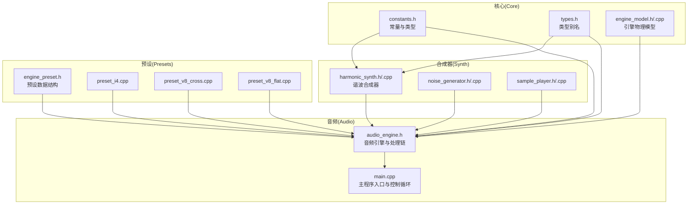
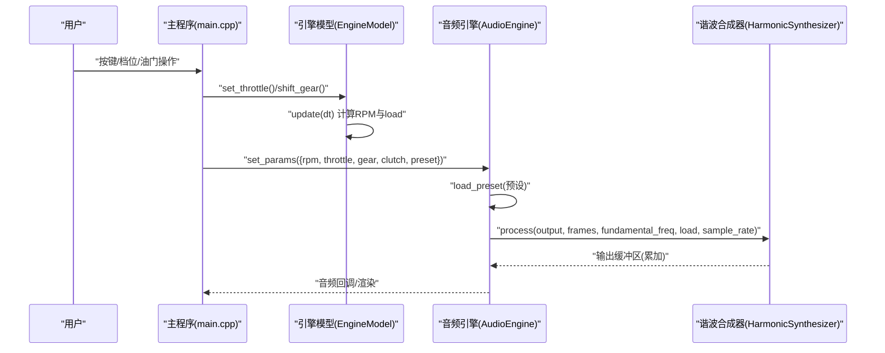
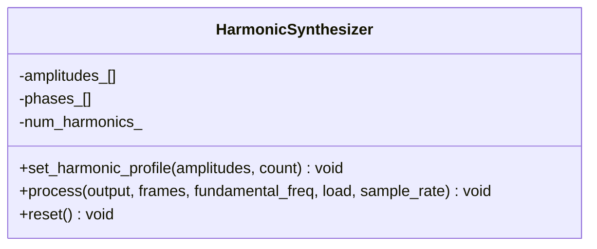
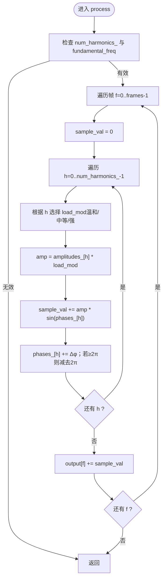
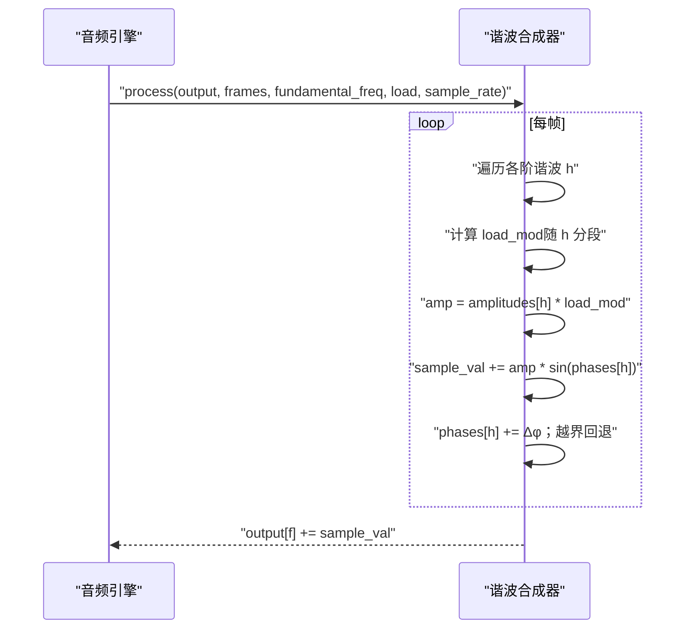
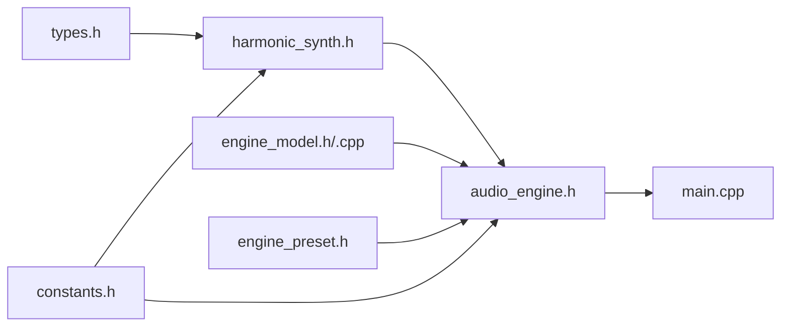

# 谐波合成器

<cite>
**本文引用的文件**
- [harmonic_synth.h](file://src/synth/harmonic_synth.h)
- [harmonic_synth.cpp](file://src/synth/harmonic_synth.cpp)
- [engine_preset.h](file://src/presets/engine_preset.h)
- [preset_i4.cpp](file://src/presets/preset_i4.cpp)
- [preset_v8_cross.cpp](file://src/presets/preset_v8_cross.cpp)
- [preset_v8_flat.cpp](file://src/presets/preset_v8_flat.cpp)
- [constants.h](file://src/core/constants.h)
- [types.h](file://src/core/types.h)
- [engine_model.h](file://src/core/engine_model.h)
- [engine_model.cpp](file://src/core/engine_model.cpp)
- [audio_engine.h](file://src/audio/audio_engine.h)
- [main.cpp](file://src/main.cpp)
- [test_harmonic_synth.cpp](file://tests/test_harmonic_synth.cpp)
</cite>

## 目录
1. [简介](#简介)
2. [项目结构](#项目结构)
3. [核心组件](#核心组件)
4. [架构总览](#架构总览)
5. [详细组件分析](#详细组件分析)
6. [依赖关系分析](#依赖关系分析)
7. [性能考量](#性能考量)
8. [故障排查指南](#故障排查指南)
9. [结论](#结论)
10. [附录：谐波轮廓最佳实践与示例](#附录谐波轮廓最佳实践与示例)

## 简介
本技术文档围绕“谐波合成器”展开，系统性阐述加法合成的基本原理与实现细节，重点覆盖以下主题：
- 基波频率与各阶谐波频率的生成机制
- 谐波配置文件（amplitudes 数组）的含义与 MAX_HARMONICS 限制
- process 函数工作流程：相位累积、幅度调制、输出缓冲区累加
- fundamental_freq、load 参数对音色的影响，以及 sample_rate 在频率计算中的作用
- 谐波轮廓设置的最佳实践与典型应用场景
- 如何通过配置不同谐波模式来模拟不同类型的引擎声音（如 I4、V8 交叉平面、V8 平面）

## 项目结构
该工程采用分层模块化组织方式，核心与合成相关的关键目录如下：
- src/core：物理引擎模型、常量与类型定义
- src/synth：合成器子系统（谐波合成器、噪声生成器、采样播放器）
- src/presets：引擎预设（含谐波轮廓、滤波器与效果参数）
- src/audio：音频引擎与处理链路封装
- src/mixer、effects：混音与效果处理
- tests：单元测试（含谐波合成器测试）

图表来源
- [constants.h:1-20](file://src/core/constants.h#L1-L20)
- [types.h:1-12](file://src/core/types.h#L1-L12)
- [engine_model.h:1-48](file://src/core/engine_model.h#L1-L48)
- [engine_model.cpp:1-55](file://src/core/engine_model.cpp#L1-L55)
- [harmonic_synth.h:1-28](file://src/synth/harmonic_synth.h#L1-L28)
- [harmonic_synth.cpp:1-63](file://src/synth/harmonic_synth.cpp#L1-L63)
- [engine_preset.h:1-55](file://src/presets/engine_preset.h#L1-L55)
- [preset_i4.cpp:1-59](file://src/presets/preset_i4.cpp#L1-L59)
- [preset_v8_cross.cpp:1-66](file://src/presets/preset_v8_cross.cpp#L1-L66)
- [preset_v8_flat.cpp:1-65](file://src/presets/preset_v8_flat.cpp#L1-L65)
- [audio_engine.h:1-92](file://src/audio/audio_engine.h#L1-L92)
- [main.cpp:1-239](file://src/main.cpp#L1-L239)

章节来源
- [constants.h:1-20](file://src/core/constants.h#L1-L20)
- [types.h:1-12](file://src/core/types.h#L1-L12)
- [harmonic_synth.h:1-28](file://src/synth/harmonic_synth.h#L1-L28)
- [harmonic_synth.cpp:1-63](file://src/synth/harmonic_synth.cpp#L1-L63)
- [engine_preset.h:1-55](file://src/presets/engine_preset.h#L1-L55)
- [preset_i4.cpp:1-59](file://src/presets/preset_i4.cpp#L1-L59)
- [preset_v8_cross.cpp:1-66](file://src/presets/preset_v8_cross.cpp#L1-L66)
- [preset_v8_flat.cpp:1-65](file://src/presets/preset_v8_flat.cpp#L1-L65)
- [audio_engine.h:1-92](file://src/audio/audio_engine.h#L1-L92)
- [main.cpp:1-239](file://src/main.cpp#L1-L239)

## 核心组件
- 谐波合成器（HarmonicSynthesizer）
  - 提供 set_harmonic_profile 配置谐波轮廓（amplitudes 数组）
  - 提供 process 执行加法合成，按帧累加到输出缓冲区
  - 内部维护每个谐波的幅度与相位数组，受 MAX_HARMONICS 限制
- 引擎物理模型（EngineModel）
  - 提供 throttle、gear、clutch 等输入，计算当前 load
  - 以固定步长更新 RPM，支持怠速与红线保护
- 预设（EnginePreset）
  - 包含 num_cylinders、num_strokes、idle/redline、惯量等基础参数
  - 含 harmonic_amplitudes 与 num_harmonics，用于定义谐波轮廓
  - 含排气/进气共振滤波器与失真、混响等效果参数
- 音频引擎（AudioEngine）
  - 组合谐波合成器、噪声生成器、采样播放器与效果链
  - 提供 load_preset 与 set_params 接口，将引擎状态映射到音频输出

章节来源
- [harmonic_synth.h:8-25](file://src/synth/harmonic_synth.h#L8-L25)
- [harmonic_synth.cpp:12-24](file://src/synth/harmonic_synth.cpp#L12-L24)
- [engine_model.h:7-45](file://src/core/engine_model.h#L7-L45)
- [engine_model.cpp:21-52](file://src/core/engine_model.cpp#L21-L52)
- [engine_preset.h:8-47](file://src/presets/engine_preset.h#L8-L47)
- [audio_engine.h:27-89](file://src/audio/audio_engine.h#L27-L89)

## 架构总览
下图展示了从用户输入到音频输出的端到端流程，重点体现“引擎物理模型 -> 预设参数 -> 谐波合成器”的数据流。

图表来源
- [main.cpp:146-233](file://src/main.cpp#L146-L233)
- [engine_model.cpp:21-52](file://src/core/engine_model.cpp#L21-L52)
- [audio_engine.h:37-84](file://src/audio/audio_engine.h#L37-L84)
- [harmonic_synth.cpp:26-60](file://src/synth/harmonic_synth.cpp#L26-L60)

## 详细组件分析

### 谐波合成器类与数据结构
- 关键成员
  - amplitudes_[MAX_HARMONICS]：存储每阶谐波的幅度权重
  - phases_[MAX_HARMONICS]：存储每阶谐波的相位（弧度）
  - num_harmonics_：实际使用的谐波数量（≤ MAX_HARMONICS）
- 关键方法
  - set_harmonic_profile：拷贝并裁剪至 MAX_HARMONICS，其余清零
  - process：逐帧累加各阶谐波正弦波，按 load 调制高阶谐波幅度
  - reset：重置相位

图表来源
- [harmonic_synth.h:8-25](file://src/synth/harmonic_synth.h#L8-L25)

章节来源
- [harmonic_synth.h:8-25](file://src/synth/harmonic_synth.h#L8-L25)
- [harmonic_synth.cpp:12-24](file://src/synth/harmonic_synth.cpp#L12-L24)

### 加法合成与频率生成机制
- 基波与谐波
  - fundamental_freq 为基波频率（赫兹）
  - 第 h+1 阶谐波频率为 fundamental_freq × (h+1)，h 从 0 到 num_harmonics_-1
- 相位累积
  - 每帧相位增量 Δφ = (2π × 谐波频率)/sample_rate
  - 相位超过 2π 后回退，避免数值漂移
- 输出合成
  - 每帧将各阶谐波的幅度 × sin(相位) 累加到输出缓冲区对应位置

图表来源
- [harmonic_synth.cpp:26-60](file://src/synth/harmonic_synth.cpp#L26-L60)
- [constants.h:8-11](file://src/core/constants.h#L8-L11)

章节来源
- [harmonic_synth.cpp:26-60](file://src/synth/harmonic_synth.cpp#L26-L60)
- [constants.h:8-11](file://src/core/constants.h#L8-L11)

### 谐波配置文件与 MAX_HARMONICS 限制
- EnginePreset 中的 harmonic_amplitudes 与 num_harmonics
  - harmonic_amplitudes 定义了 1st 至 N-th 谐波的相对强度
  - num_harmonics 指定参与合成的有效谐波阶数
- MAX_HARMONICS 的作用
  - 限制合成器内部数组大小与处理开销
  - set_harmonic_profile 会将传入 count 与 MAX_HARMONICS 取较小值，并将超出部分清零
- 不同引擎类型的典型谐波轮廓
  - I4：强调 2nd 与 4th 谐波，呈现“嗡嗡”质感
  - V8 交叉平面：强调基波与前几阶，低频深沉
  - V8 平面：高阶谐波更强，高频尖锐

章节来源
- [engine_preset.h:23-25](file://src/presets/engine_preset.h#L23-L25)
- [harmonic_synth.cpp:12-20](file://src/synth/harmonic_synth.cpp#L12-L20)
- [preset_i4.cpp:22-32](file://src/presets/preset_i4.cpp#L22-L32)
- [preset_v8_cross.cpp:28-39](file://src/presets/preset_v8_cross.cpp#L28-L39)
- [preset_v8_flat.cpp:26-38](file://src/presets/preset_v8_flat.cpp#L26-L38)

### process 函数工作流程详解
- 输入参数
  - fundamental_freq：基波频率（赫兹）
  - load：负载参数（0~1），影响高阶谐波幅度调制
  - sample_rate：采样率（赫兹）
- 关键步骤
  - 载荷调制：对不同阶次的谐波施加强弱不同的 load_mod，高阶更敏感
  - 幅度调制：最终幅度 = 预设幅度 × load_mod
  - 正弦合成：对每阶谐波计算 sin(相位)，累加到样本值
  - 相位推进：按 Δφ 累加相位，保持周期性
  - 输出累加：将样本值加到输出缓冲区对应帧

图表来源
- [harmonic_synth.cpp:26-60](file://src/synth/harmonic_synth.cpp#L26-L60)

章节来源
- [harmonic_synth.cpp:26-60](file://src/synth/harmonic_synth.cpp#L26-L60)

### fundamental_freq、load 与 sample_rate 的作用
- fundamental_freq
  - 决定基波频率，进而决定所有谐波频率（第 h+1 阶 = (h+1) × fundamental_freq）
  - 影响音高；增大使整体音调升高，减小使整体音调降低
- load
  - 通过分段非线性函数对不同阶次的谐波进行调制
  - 高阶谐波受 load 影响更大，提升负载感与动态变化
- sample_rate
  - 控制相位增量 Δφ = (2π × 频率)/sample_rate
  - 影响频率分辨率与计算复杂度；更高采样率可减少混叠但增加开销

章节来源
- [harmonic_synth.cpp:37-45](file://src/synth/harmonic_synth.cpp#L37-L45)
- [harmonic_synth.cpp:50-56](file://src/synth/harmonic_synth.cpp#L50-L56)
- [constants.h:8-15](file://src/core/constants.h#L8-L15)

### 预设与引擎模型的衔接
- 预设（EnginePreset）
  - 提供 num_cylinders、num_strokes、idle/redline、惯量等基础参数
  - 提供 harmonic_amplitudes 与 num_harmonics，定义不同引擎的“音色指纹”
- 引擎模型（EngineModel）
  - 根据档位、离合器、节气门与惯量计算当前 load
  - 将 RPM 与 load 传递给音频线程，驱动谐波合成器

章节来源
- [engine_preset.h:8-47](file://src/presets/engine_preset.h#L8-L47)
- [engine_model.cpp:21-52](file://src/core/engine_model.cpp#L21-L52)

## 依赖关系分析
- 头文件依赖
  - harmonic_synth.h 依赖 core/types.h 与 core/constants.h
  - audio_engine.h 聚合了合成器、噪声、效果与混音模块
- 运行时耦合
  - 主程序通过 EngineModel 更新状态，再由 AudioEngine 将参数映射到合成器
  - 预设在音频线程内缓存，保证实时访问效率

图表来源
- [harmonic_synth.h:3-4](file://src/synth/harmonic_synth.h#L3-L4)
- [constants.h:1-20](file://src/core/constants.h#L1-L20)
- [audio_engine.h:3-16](file://src/audio/audio_engine.h#L3-L16)
- [engine_model.h:1-48](file://src/core/engine_model.h#L1-L48)
- [engine_preset.h:1-55](file://src/presets/engine_preset.h#L1-L55)
- [main.cpp:1-239](file://src/main.cpp#L1-L239)

章节来源
- [harmonic_synth.h:3-4](file://src/synth/harmonic_synth.h#L3-L4)
- [audio_engine.h:3-16](file://src/audio/audio_engine.h#L3-L16)
- [engine_model.h:1-48](file://src/core/engine_model.h#L1-L48)
- [engine_preset.h:1-55](file://src/presets/engine_preset.h#L1-L55)
- [main.cpp:1-239](file://src/main.cpp#L1-L239)

## 性能考量
- 复杂度
  - 每帧复杂度 O(frames × num_harmonics)，num_harmonics ≤ MAX_HARMONICS
  - 相位推进与三角函数计算为主要开销
- 优化建议
  - 控制 MAX_HARMONICS 与 num_harmonics，避免不必要的高阶谐波
  - 使用分段 load_mod 仅在必要范围内计算，减少分支开销
  - 在音频线程中复用缓冲区，避免频繁分配
  - 合理设置 buffer_frames 与 sample_rate，在延迟与质量间平衡

## 故障排查指南
- 无输出或静音
  - 检查是否已调用 set_harmonic_profile 设置有效谐波轮廓
  - 确认 fundamental_freq > 0 且 num_harmonics_ > 0
  - 单元测试验证：参考 test_zero_harmonics_silent
- 负载不生效
  - 确认 EngineModel.update 已被调用并产生合理的 load
  - 单元测试验证：参考 test_load_modulates_harmonics
- 音色不符合预期
  - 对比预设中的 harmonic_amplitudes 与 num_harmonics
  - 调整 sample_rate 与 buffer_frames，观察频率分辨率与延迟

章节来源
- [test_harmonic_synth.cpp:56-71](file://tests/test_harmonic_synth.cpp#L56-L71)
- [test_harmonic_synth.cpp:28-54](file://tests/test_harmonic_synth.cpp#L28-L54)
- [engine_model.cpp:21-52](file://src/core/engine_model.cpp#L21-L52)

## 结论
本项目通过“物理引擎模型 + 预设 + 谐波合成器”的组合，实现了可交互的引擎声合成系统。谐波合成器以加法合成为核心，利用预设的谐波轮廓与负载调制，高效地模拟不同发动机类型的音色特征。通过合理配置 fundamental_freq、load 与 sample_rate，可在真实感与性能之间取得良好平衡。

## 附录：谐波轮廓最佳实践与示例

### 最佳实践
- 选择合适的 num_harmonics
  - I4：16 阶左右，强调 2nd 与 4th，突出“嗡嗡”质感
  - V8 交叉平面：20 阶左右，强调基波与前几阶，营造低频深沉感
  - V8 平面：24 阶以上，强调高阶谐波，呈现高频尖锐感
- 调整 fundamental_freq 与 load 的关系
  - 低 RPM：提高 fundamental_freq 使音调更明亮
  - 高 RPM：适度降低 fundamental_freq 或使用更强的 load_mod，增强高阶谐波的动态
- sample_rate 的取舍
  - 默认 48kHz 已满足多数场景；更高采样率可提升高频解析力，但增加 CPU 开销

### 典型应用场景
- 模拟 I4 引擎
  - 使用 preset_i4 的 harmonic_amplitudes 与 num_harmonics
  - 特点：2nd 与 4th 谐波较强，适合表现自然吸气或涡轮增压的“嗡嗡”声
- 模拟 V8 交叉平面
  - 使用 preset_v8_cross 的 harmonic_amplitudes 与 num_harmonics
  - 特点：基波与前几阶强，低频深沉，适合表现经典美式肌肉车
- 模拟 V8 平面
  - 使用 preset_v8_flat 的 harmonic_amplitudes 与 num_harmonics
  - 特点：高阶谐波强，高频尖锐，适合表现高转速、高声压的赛车引擎

### 代码示例路径（不直接展示代码）
- 配置 I4 谐波轮廓
  - [preset_i4.cpp:22-32](file://src/presets/preset_i4.cpp#L22-L32)
- 配置 V8 交叉平面谐波轮廓
  - [preset_v8_cross.cpp:28-39](file://src/presets/preset_v8_cross.cpp#L28-L39)
- 配置 V8 平面谐波轮廓
  - [preset_v8_flat.cpp:26-38](file://src/presets/preset_v8_flat.cpp#L26-L38)
- 在音频引擎中加载预设
  - [audio_engine.h:37](file://src/audio/audio_engine.h#L37)
- 主程序中切换预设与更新参数
  - [main.cpp:169-189](file://src/main.cpp#L169-L189)
  - [main.cpp:206-214](file://src/main.cpp#L206-L214)