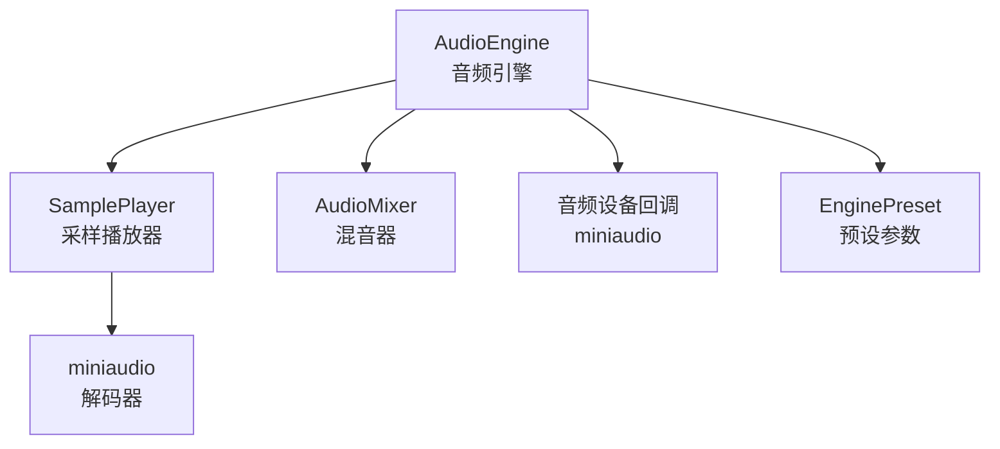
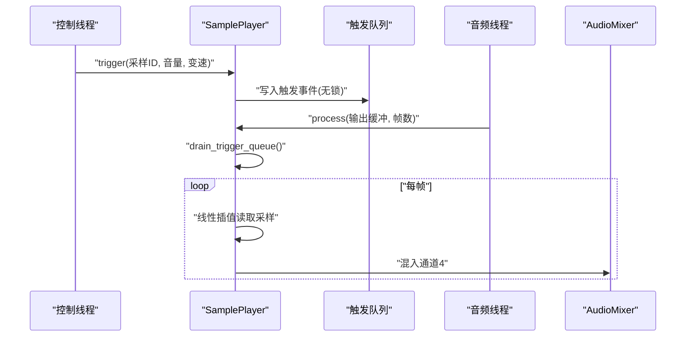
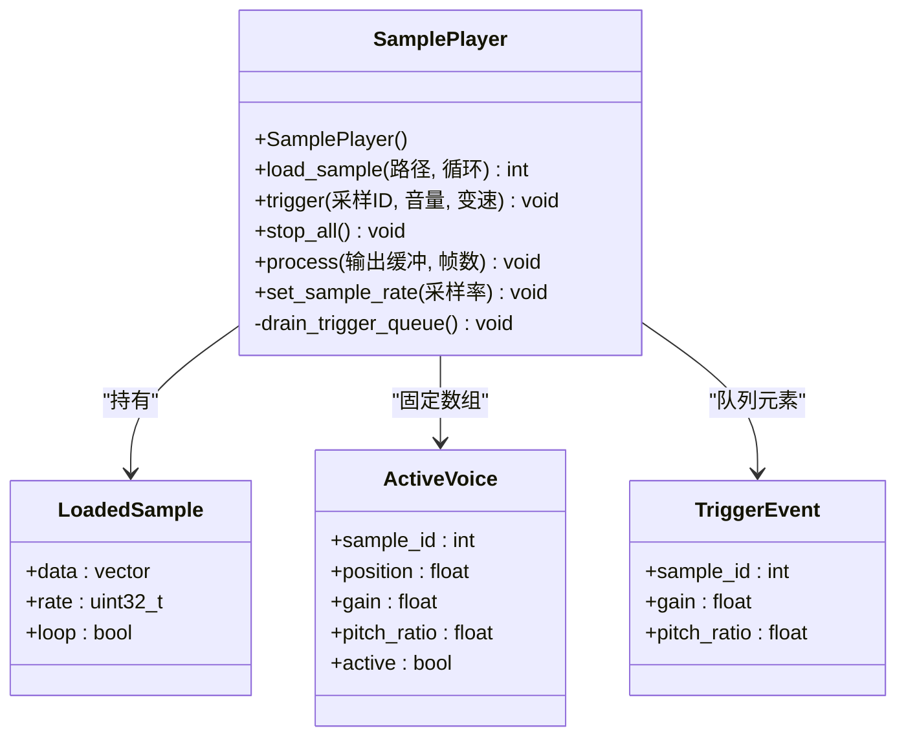
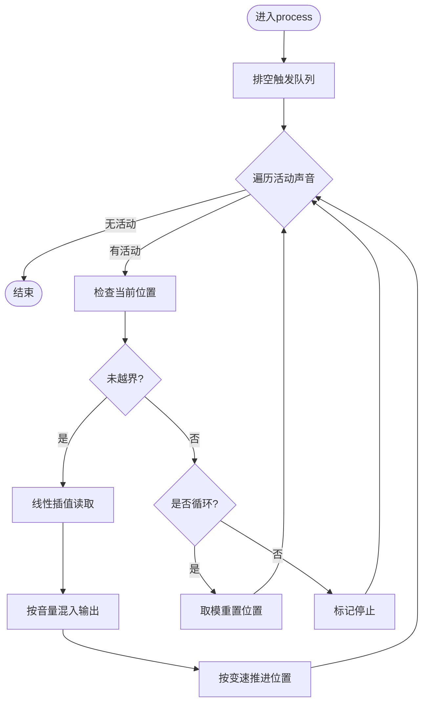
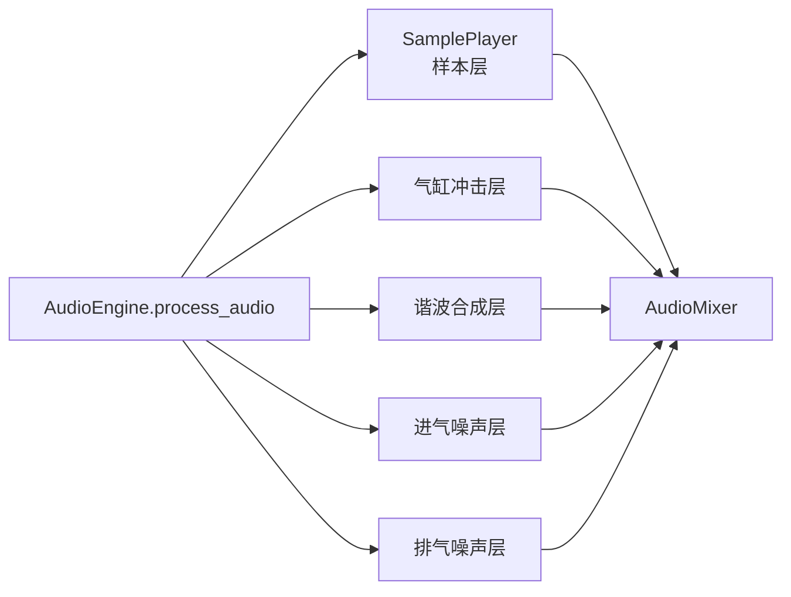
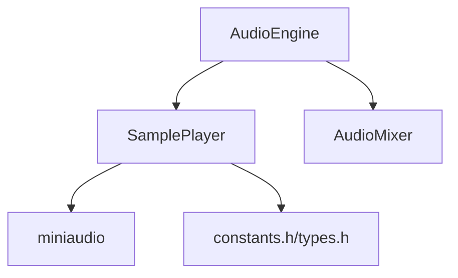

# 采样播放器

<cite>
**本文档引用的文件**
- [src/synth/sample_player.h](file://src/synth/sample_player.h)
- [src/synth/sample_player.cpp](file://src/synth/sample_player.cpp)
- [src/audio/audio_engine.h](file://src/audio/audio_engine.h)
- [src/audio/audio_engine.cpp](file://src/audio/audio_engine.cpp)
- [src/mixer/audio_mixer.h](file://src/mixer/audio_mixer.h)
- [src/core/types.h](file://src/core/types.h)
- [src/core/constants.h](file://src/core/constants.h)
- [src/presets/engine_preset.h](file://src/presets/engine_preset.h)
- [src/audio/miniaudio_impl.cpp](file://src/audio/miniaudio_impl.cpp)
- [meson_options.txt](file://meson_options.txt)
</cite>

## 目录
1. [简介](#简介)
2. [项目结构](#项目结构)
3. [核心组件](#核心组件)
4. [架构总览](#架构总览)
5. [详细组件分析](#详细组件分析)
6. [依赖关系分析](#依赖关系分析)
7. [性能考量](#性能考量)
8. [故障排查指南](#故障排查指南)
9. [结论](#结论)
10. [附录](#附录)

## 简介
本文件为赛车声音引擎中的采样播放器提供全面技术文档。内容涵盖音频样本的加载与存储机制（WAV格式、内存管理、缓存策略）、采样播放核心功能（循环播放、变速播放、音高变换）、参数控制（播放速度、循环点、音量、淡入淡出）、在引擎声音中的应用（排气声、轮胎摩擦声、刹车声）、采样选择与编辑建议（音质与文件大小平衡），以及具体使用示例与性能注意事项。

## 项目结构
采样播放器位于合成层，作为音频引擎的一个子模块参与整体渲染流程。其主要职责是：
- 在初始化阶段加载WAV采样到内存
- 提供无锁触发接口，从控制线程安全地调度播放
- 在音频线程中按帧处理，混合输出到混音器

图表来源
- [src/audio/audio_engine.cpp:102-160](file://src/audio/audio_engine.cpp#L102-L160)
- [src/synth/sample_player.cpp:10-37](file://src/synth/sample_player.cpp#L10-L37)
- [src/mixer/audio_mixer.h:9-34](file://src/mixer/audio_mixer.h#L9-L34)

章节来源
- [src/audio/audio_engine.h:27-92](file://src/audio/audio_engine.h#L27-L92)
- [src/synth/sample_player.h:16-61](file://src/synth/sample_player.h#L16-L61)
- [src/core/constants.h:10-18](file://src/core/constants.h#L10-L18)

## 核心组件
- 采样播放器（SamplePlayer）
  - 负责采样加载、触发播放、音频线程处理与混音
  - 支持循环播放、变速播放（通过步进比例）、音量控制
- 音频引擎（AudioEngine）
  - 组织各子模块，驱动音频回调，将采样播放器输出混入最终输出
- 混音器（AudioMixer）
  - 多通道累加与最终渲染，提供通道增益与静音控制

章节来源
- [src/synth/sample_player.h:16-61](file://src/synth/sample_player.h#L16-L61)
- [src/audio/audio_engine.h:27-92](file://src/audio/audio_engine.h#L27-L92)
- [src/mixer/audio_mixer.h:9-34](file://src/mixer/audio_mixer.h#L9-L34)

## 架构总览
采样播放器在音频引擎的处理流程中，作为独立的“样本层”被调用。其工作流如下：

图表来源
- [src/synth/sample_player.cpp:39-76](file://src/synth/sample_player.cpp#L39-L76)
- [src/synth/sample_player.cpp:78-112](file://src/synth/sample_player.cpp#L78-L112)
- [src/audio/audio_engine.cpp:145-147](file://src/audio/audio_engine.cpp#L145-L147)

章节来源
- [src/audio/audio_engine.cpp:102-160](file://src/audio/audio_engine.cpp#L102-L160)

## 详细组件分析

### 采样播放器类结构
采样播放器采用“已加载采样数组 + 固定数量活动声音 + 无锁触发队列”的设计，确保实时安全与可扩展性。

图表来源
- [src/synth/sample_player.h:16-61](file://src/synth/sample_player.h#L16-L61)

章节来源
- [src/synth/sample_player.h:16-61](file://src/synth/sample_player.h#L16-L61)

### 加载与存储机制
- 文件格式支持：通过miniaudio解码器加载WAV文件，目标格式为单声道浮点（f32），采样率在构造时或运行时设置
- 内存管理：每个采样以连续向量形式保存，按需分配；释放由容器生命周期管理
- 缓存策略：采样加载发生在非实时阶段，避免音频回调中的阻塞操作；采样数据驻留于进程内存，按需多次播放

章节来源
- [src/synth/sample_player.cpp:10-37](file://src/synth/sample_player.cpp#L10-L37)
- [src/audio/audio_engine.cpp:41-42](file://src/audio/audio_engine.cpp#L41-L42)

### 触发与播放流程
- 触发接口：控制线程调用trigger，将事件写入固定大小的无锁触发队列；若队列满则丢弃
- 队列排空：音频线程在每帧开始时排空队列，为每个事件分配一个空闲声音
- 播放过程：对每个活动声音，按当前位置线性插值读取采样，累加到输出缓冲；根据pitch_ratio推进位置；到达末尾时若循环则取模重置，否则标记停止

图表来源
- [src/synth/sample_player.cpp:55-76](file://src/synth/sample_player.cpp#L55-L76)
- [src/synth/sample_player.cpp:78-112](file://src/synth/sample_player.cpp#L78-L112)

章节来源
- [src/synth/sample_player.cpp:39-112](file://src/synth/sample_player.cpp#L39-L112)

### 参数控制详解
- 播放速度（变速）：通过pitch_ratio控制每帧推进的采样步长，实现升速/降速播放
- 音量控制：通过gain对输出进行缩放
- 循环点设置：由加载时的loop标志决定；内部通过取模实现无缝循环
- 淡入淡出：当前实现未内置淡入淡出算法，可通过外部预处理或在上层逻辑中结合gain曲线实现

章节来源
- [src/synth/sample_player.h:41-47](file://src/synth/sample_player.h#L41-L47)
- [src/synth/sample_player.cpp:87-109](file://src/synth/sample_player.cpp#L87-L109)

### 在引擎声音中的应用
采样播放器作为独立通道参与引擎主处理流程，典型应用场景：
- 排气声：可叠加谐波合成与滤波器，再由采样播放器补充真实排气片段
- 轮胎摩擦声：可叠加噪声生成器，采样播放器用于添加特定质感的纹理
- 刹车声：在特定工况下触发采样播放器，配合音量与变速参数模拟不同强度与频率

图表来源
- [src/audio/audio_engine.cpp:127-150](file://src/audio/audio_engine.cpp#L127-L150)

章节来源
- [src/audio/audio_engine.cpp:102-160](file://src/audio/audio_engine.cpp#L102-L160)

### 使用示例与最佳实践
- 初始化与加载
  - 在引擎初始化时设置采样率，并加载所需WAV文件，记录返回的采样ID
  - 将采样ID与预设参数或运行时参数关联
- 触发播放
  - 在控制线程中调用trigger，传入采样ID、期望音量与变速比
  - 注意触发队列容量限制，避免高频触发导致事件丢失
- 参数调节
  - 结合节气门开度、转速等参数动态调整音量与变速
  - 对于刹车声等瞬态事件，可临时提高音量并使用较高变速以增强真实感
- 性能建议
  - 控制同时激活的声音数量，避免过多并发导致CPU压力
  - 合理设置缓冲帧数与采样率，权衡延迟与质量

章节来源
- [src/audio/audio_engine.cpp:18-45](file://src/audio/audio_engine.cpp#L18-L45)
- [src/synth/sample_player.cpp:39-47](file://src/synth/sample_player.cpp#L39-L47)

## 依赖关系分析
- 采样播放器依赖
  - miniaudio：WAV解码与PCM读取
  - 核心类型与常量：Sample、FrameCount、SampleRate、MAX_VOICES、TRIGGER_QUEUE_SIZE等
- 音频引擎集成
  - 在process_audio中调用SamplePlayer::process并将结果混入指定通道
  - 通过AudioMixer完成多通道混合与最终输出

图表来源
- [src/synth/sample_player.cpp:1-5](file://src/synth/sample_player.cpp#L1-L5)
- [src/core/constants.h:10-18](file://src/core/constants.h#L10-L18)
- [src/core/types.h:7-9](file://src/core/types.h#L7-L9)
- [src/audio/audio_engine.cpp:145-147](file://src/audio/audio_engine.cpp#L145-L147)

章节来源
- [src/synth/sample_player.cpp:1-5](file://src/synth/sample_player.cpp#L1-L5)
- [src/audio/audio_engine.cpp:145-147](file://src/audio/audio_engine.cpp#L145-L147)

## 性能考量
- 实时安全性
  - 触发接口使用无锁单生产者单消费者队列，避免音频回调中的阻塞
  - 队列容量有限，高频触发可能被丢弃，应避免过度频繁的触发
- 计算复杂度
  - 每帧对每个活动声音执行一次线性插值，时间复杂度O(F×V)，F为帧数，V为活动声音数
  - 插值与乘法运算简单，通常可在低延迟缓冲下高效完成
- 内存占用
  - 每个采样占用连续向量内存，长度取决于采样时长与采样率
  - 建议按需加载常用采样，避免一次性加载过多大文件
- I/O与初始化
  - 采样加载发生在非实时阶段，避免音频回调中的磁盘I/O
- 采样率与缓冲
  - 采样率与缓冲帧数由构建选项与引擎配置共同决定，需根据目标平台与延迟要求调整

章节来源
- [src/core/constants.h:12-17](file://src/core/constants.h#L12-L17)
- [meson_options.txt:1-4](file://meson_options.txt#L1-L4)
- [src/audio/audio_engine.cpp:18-45](file://src/audio/audio_engine.cpp#L18-L45)

## 故障排查指南
- 无法加载采样
  - 检查文件路径与格式是否为WAV；确认采样率配置正确
  - 若返回负值，表示解码失败或初始化失败
- 触发无效
  - 触发队列已满会丢弃事件；降低触发频率或增大队列容量
  - 确认采样ID有效且在已加载采样范围内
- 声音提前停止
  - 非循环采样到达末尾后自动停止；如需循环请加载时启用循环标志
- 音量异常
  - 检查gain参数范围与混音器通道增益设置
- 性能问题
  - 减少同时激活的声音数量；优化缓冲帧数与采样率；避免在音频回调中执行额外I/O

章节来源
- [src/synth/sample_player.cpp:10-37](file://src/synth/sample_player.cpp#L10-L37)
- [src/synth/sample_player.cpp:39-47](file://src/synth/sample_player.cpp#L39-L47)
- [src/synth/sample_player.cpp:87-97](file://src/synth/sample_player.cpp#L87-L97)

## 结论
采样播放器以简洁高效的架构实现了WAV采样的加载、触发与播放，具备循环播放、变速播放与音量控制能力。通过无锁触发队列与音频线程分离的设计，满足了实时音频处理的需求。在引擎声音合成中，采样播放器可作为真实质感的重要补充，与谐波合成、噪声与滤波器等模块协同，构建丰富的驾驶声音体验。

## 附录

### 关键参数与配置
- 采样率与缓冲帧数
  - 默认采样率与缓冲帧数可通过构建选项与引擎配置设置
- 声道与混音
  - 引擎采用单声道输出，采样播放器输出至专用通道后与其他层混合
- 预设与参数
  - 引擎预设影响噪声与滤波器参数，采样播放器参数（音量、变速）可独立控制

章节来源
- [meson_options.txt:1-4](file://meson_options.txt#L1-L4)
- [src/audio/audio_engine.h:22-26](file://src/audio/audio_engine.h#L22-L26)
- [src/mixer/audio_mixer.h:25-34](file://src/mixer/audio_mixer.h#L25-L34)
- [src/presets/engine_preset.h:8-47](file://src/presets/engine_preset.h#L8-L47)