# 开发者指南

<cite>
**本文引用的文件**
- [src/main.cpp](file://src/main.cpp)
- [src/audio/audio_engine.h](file://src/audio/audio_engine.h)
- [src/core/engine_model.h](file://src/core/engine_model.h)
- [src/synth/harmonic_synth.h](file://src/synth/harmonic_synth.h)
- [src/effects/effects_chain.h](file://src/effects/effects_chain.h)
- [src/core/types.h](file://src/core/types.h)
- [src/core/parameter_controller.h](file://src/core/parameter_controller.h)
- [src/mixer/audio_mixer.h](file://src/mixer/audio_mixer.h)
- [src/presets/engine_preset.h](file://src/presets/engine_preset.h)
- [src/presets/preset_i4.cpp](file://src/presets/preset_i4.cpp)
- [src/presets/preset_v8_cross.cpp](file://src/presets/preset_v8_cross.cpp)
- [src/core/constants.h](file://src/core/constants.h)
- [src/synth/noise_generator.h](file://src/synth/noise_generator.h)
- [src/effects/biquad_filter.h](file://src/effects/biquad_filter.h)
- [meson_options.txt](file://meson_options.txt)
</cite>

## 目录
1. [简介](#简介)
2. [项目结构](#项目结构)
3. [核心组件](#核心组件)
4. [架构总览](#架构总览)
5. [详细组件分析](#详细组件分析)
6. [依赖关系分析](#依赖关系分析)
7. [性能考量](#性能考量)
8. [故障排查指南](#故障排查指南)
9. [结论](#结论)
10. [附录](#附录)

## 简介
本指南面向希望参与赛车声音引擎开发的贡献者，覆盖代码贡献规范、扩展开发方法、架构最佳实践、调试与性能分析、未来规划与协作规范，并提供高级主题（实时音频与数字信号处理）的深入讲解。读者无需深厚的音频背景即可上手，但建议具备C++基础与对实时系统的基本理解。

## 项目结构
项目采用按功能域分层的组织方式：顶层入口负责交互与控制循环；核心模块提供引擎物理模型与参数桥接；合成与效果模块分别生成与处理声音；混音模块汇总多路输出；预设模块封装不同发动机的声音特征；测试模块覆盖关键单元。

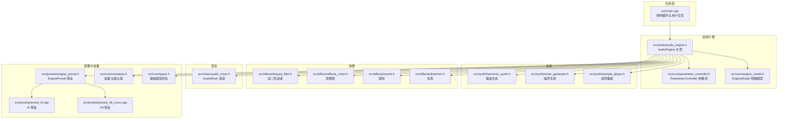

图表来源
- [src/main.cpp:89-238](file://src/main.cpp#L89-L238)
- [src/audio/audio_engine.h:27-89](file://src/audio/audio_engine.h#L27-L89)
- [src/core/engine_model.h:7-45](file://src/core/engine_model.h#L7-L45)
- [src/core/parameter_controller.h:20-58](file://src/core/parameter_controller.h#L20-L58)
- [src/synth/harmonic_synth.h:8-25](file://src/synth/harmonic_synth.h#L8-L25)
- [src/synth/noise_generator.h:8-38](file://src/synth/noise_generator.h#L8-L38)
- [src/effects/biquad_filter.h:25-42](file://src/effects/biquad_filter.h#L25-L42)
- [src/effects/effects_chain.h:8-21](file://src/effects/effects_chain.h#L8-L21)
- [src/mixer/audio_mixer.h:9-34](file://src/mixer/audio_mixer.h#L9-L34)
- [src/presets/engine_preset.h:8-47](file://src/presets/engine_preset.h#L8-L47)
- [src/presets/preset_i4.cpp:5-56](file://src/presets/preset_i4.cpp#L5-L56)
- [src/presets/preset_v8_cross.cpp:5-63](file://src/presets/preset_v8_cross.cpp#L5-L63)
- [src/core/constants.h:8-18](file://src/core/constants.h#L8-L18)
- [src/core/types.h:7-11](file://src/core/types.h#L7-L11)

章节来源
- [src/main.cpp:89-238](file://src/main.cpp#L89-L238)
- [src/audio/audio_engine.h:27-89](file://src/audio/audio_engine.h#L27-L89)
- [src/core/engine_model.h:7-45](file://src/core/engine_model.h#L7-L45)
- [src/core/parameter_controller.h:20-58](file://src/core/parameter_controller.h#L20-L58)
- [src/synth/harmonic_synth.h:8-25](file://src/synth/harmonic_synth.h#L8-L25)
- [src/synth/noise_generator.h:8-38](file://src/synth/noise_generator.h#L8-L38)
- [src/effects/biquad_filter.h:25-42](file://src/effects/biquad_filter.h#L25-L42)
- [src/effects/effects_chain.h:8-21](file://src/effects/effects_chain.h#L8-L21)
- [src/mixer/audio_mixer.h:9-34](file://src/mixer/audio_mixer.h#L9-L34)
- [src/presets/engine_preset.h:8-47](file://src/presets/engine_preset.h#L8-L47)
- [src/presets/preset_i4.cpp:5-56](file://src/presets/preset_i4.cpp#L5-L56)
- [src/presets/preset_v8_cross.cpp:5-63](file://src/presets/preset_v8_cross.cpp#L5-L63)
- [src/core/constants.h:8-18](file://src/core/constants.h#L8-L18)
- [src/core/types.h:7-11](file://src/core/types.h#L7-L11)

## 核心组件
- 基础类型与常量
  - 类型别名：采样、帧数、采样率统一管理，便于跨模块一致性。
  - 常量：最大缸数、谐波数、声道数、效果数、触发队列大小、默认采样率与缓冲帧数。
- 参数桥接（无锁三缓冲）
  - 控制线程写入，音频线程读取，避免锁与分配，保证实时性。
- 引擎物理模型
  - 节气门、档位、离合状态驱动转速与负载，提供固定频率更新接口。
- 合成与效果
  - 谐波合成：基于预设谐波谱生成基波倍频叠加。
  - 噪声生成：带限白噪声，支持中心频率与带宽调节。
  - 效果链：可组合滤波、失真、混响等。
- 混音
  - 多通道累加后一次性渲染，支持增益与静音控制。
- 预设
  - 封装不同发动机的点火相位、谐波谱、滤波与噪声参数，便于快速切换。

章节来源
- [src/core/types.h:7-11](file://src/core/types.h#L7-L11)
- [src/core/constants.h:8-18](file://src/core/constants.h#L8-L18)
- [src/core/parameter_controller.h:20-58](file://src/core/parameter_controller.h#L20-L58)
- [src/core/engine_model.h:7-45](file://src/core/engine_model.h#L7-L45)
- [src/synth/harmonic_synth.h:8-25](file://src/synth/harmonic_synth.h#L8-L25)
- [src/synth/noise_generator.h:8-38](file://src/synth/noise_generator.h#L8-L38)
- [src/effects/effects_chain.h:8-21](file://src/effects/effects_chain.h#L8-L21)
- [src/mixer/audio_mixer.h:9-34](file://src/mixer/audio_mixer.h#L9-L34)
- [src/presets/engine_preset.h:8-47](file://src/presets/engine_preset.h#L8-L47)

## 架构总览
音频引擎通过回调在音频线程中运行，控制线程负责输入与参数更新。参数桥确保线程间安全传递；引擎模型计算节气门、档位与离合影响的转速与负载；合成模块生成谐波与噪声；效果链对信号进行整形；混音器最终输出到设备。

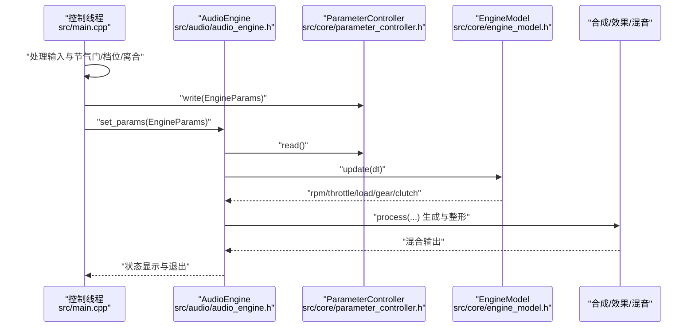

图表来源
- [src/main.cpp:146-233](file://src/main.cpp#L146-L233)
- [src/audio/audio_engine.h:32-89](file://src/audio/audio_engine.h#L32-L89)
- [src/core/parameter_controller.h:32-50](file://src/core/parameter_controller.h#L32-L50)
- [src/core/engine_model.h:15-22](file://src/core/engine_model.h#L15-L22)

## 详细组件分析

### 参数桥接（ParameterController）
- 设计要点
  - 三缓冲环形交换，发布/消费顺序通过原子变量保证，避免锁与分配。
  - 控制线程仅写，音频线程仅读，严格分离职责。
- 使用建议
  - 控制线程每次更新参数后调用写入；音频线程在处理周期内调用读取一次，避免重复读取导致“过期”参数被多次使用。
- 复杂度
  - 写/读均为O(1)，内存局部性良好，适合高频参数更新场景。

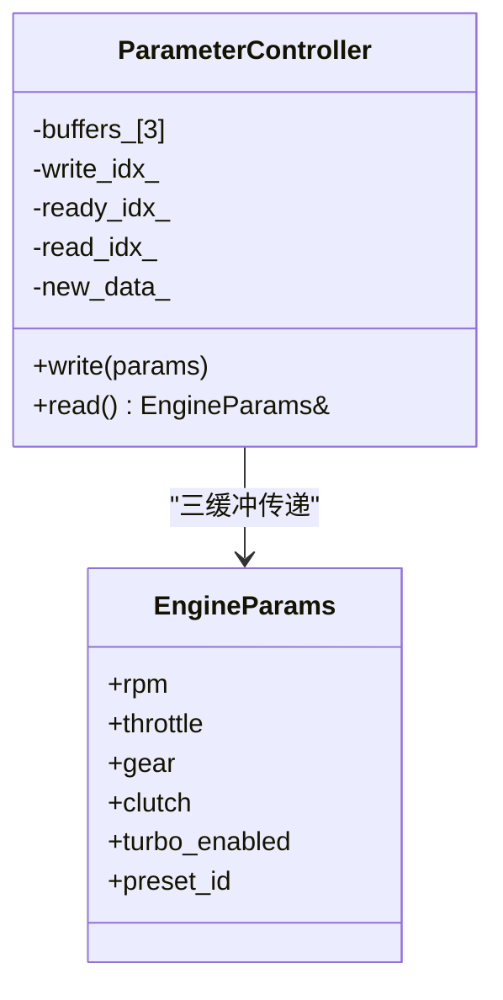

图表来源
- [src/core/parameter_controller.h:20-58](file://src/core/parameter_controller.h#L20-L58)
- [src/core/parameter_controller.h:9-16](file://src/core/parameter_controller.h#L9-L16)

章节来源
- [src/core/parameter_controller.h:20-58](file://src/core/parameter_controller.h#L20-L58)

### 引擎物理模型（EngineModel）
- 功能
  - 维护当前转速、节气门、档位、离合与负载；根据惯性、摩擦与最大扭矩推导动力学。
  - 提供固定频率更新接口，控制线程以约60Hz调用。
- 扩展建议
  - 新增档位或齿轮比时，需同步更新齿轮比表与档位逻辑。
  - 可引入涡轮增压、制动与传动效率等参数，增强真实感。

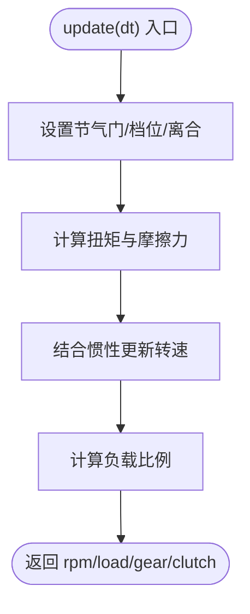

图表来源
- [src/core/engine_model.h:15-44](file://src/core/engine_model.h#L15-L44)

章节来源
- [src/core/engine_model.h:7-45](file://src/core/engine_model.h#L7-L45)

### 谐波合成（HarmonicSynthesizer）
- 功能
  - 基于预设谐波谱与负载调制生成叠加声，作为发动机“主体音色”的核心。
- 扩展建议
  - 支持动态调整谐波谱或引入非线性失真以模拟不同工况。
  - 可加入相位抖动或随机化以减少机械声的“伪影”。

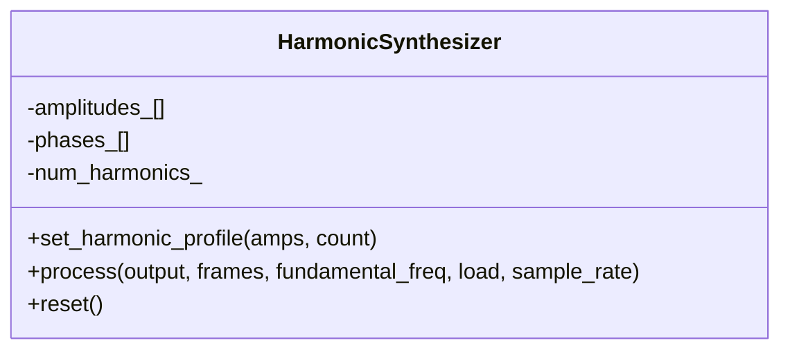

图表来源
- [src/synth/harmonic_synth.h:8-25](file://src/synth/harmonic_synth.h#L8-L25)

章节来源
- [src/synth/harmonic_synth.h:8-25](file://src/synth/harmonic_synth.h#L8-L25)

### 噪声生成（NoiseGenerator）
- 功能
  - 生成带限白噪声，用于进气与排气“口鼻音”等自然细节。
- 扩展建议
  - 引入频变滤波或包络调制，使噪声随转速/负载变化更自然。
  - 可增加多段包络以模拟不同阶段的进排气脉冲。

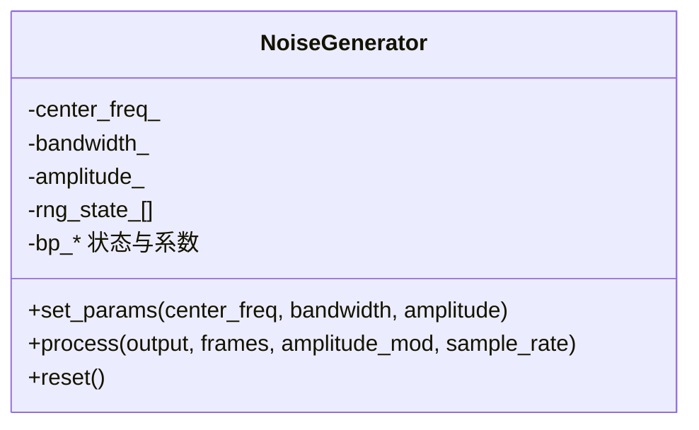

图表来源
- [src/synth/noise_generator.h:8-38](file://src/synth/noise_generator.h#L8-L38)

章节来源
- [src/synth/noise_generator.h:8-38](file://src/synth/noise_generator.h#L8-L38)

### 双二阶滤波（BiquadFilter）
- 功能
  - 实现多种滤波类型（低/高/带/带阻/峰值/斜坡），用于塑造尾气与进气的共振特性。
- 扩展建议
  - 引入参数平滑与LUT优化，降低每帧计算开销。
  - 支持自适应截止频率，随转速/负载动态调整。

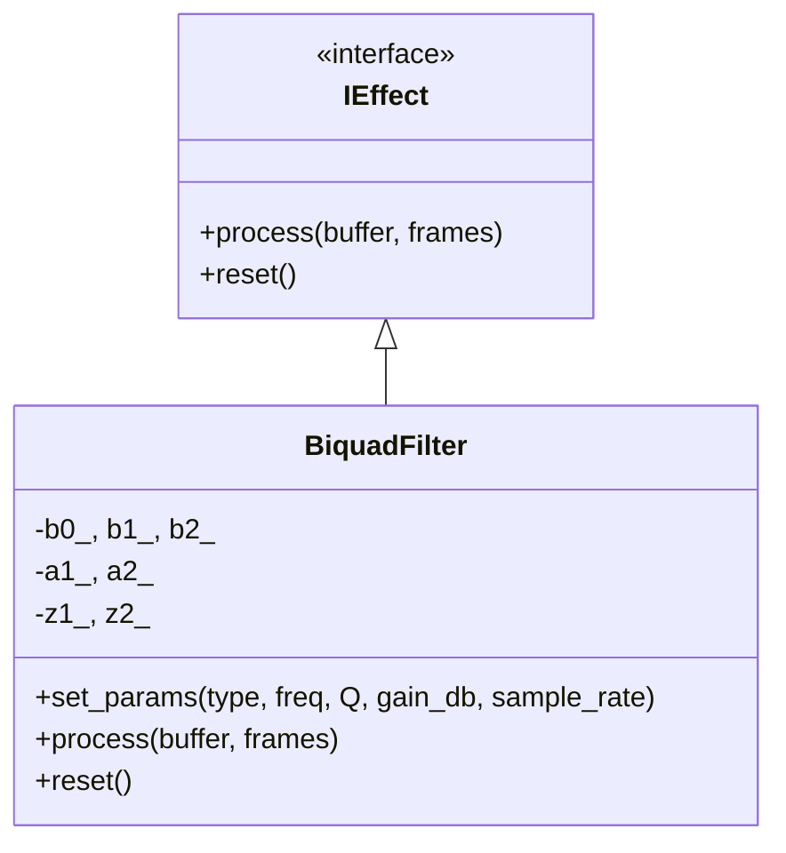

图表来源
- [src/effects/biquad_filter.h:18-42](file://src/effects/biquad_filter.h#L18-L42)

章节来源
- [src/effects/biquad_filter.h:25-42](file://src/effects/biquad_filter.h#L25-L42)

### 效果链（EffectsChain）
- 功能
  - 将多个IEffect串联，形成可配置的音频整形管线。
- 扩展建议
  - 支持动态插入/移除效果节点，实现运行时效果切换。
  - 引入并行分支与旁路机制，提升灵活性与性能。

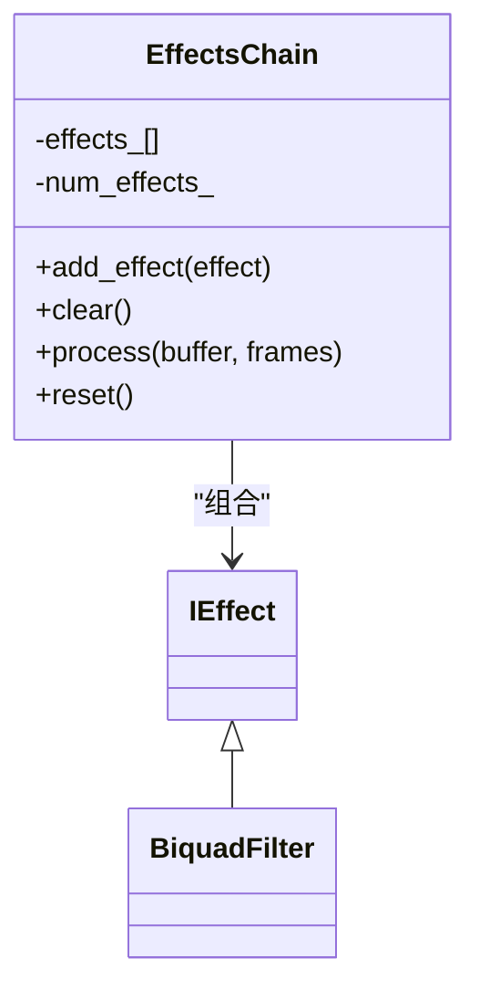

图表来源
- [src/effects/effects_chain.h:8-21](file://src/effects/effects_chain.h#L8-L21)
- [src/effects/biquad_filter.h:25-42](file://src/effects/biquad_filter.h#L25-L42)

章节来源
- [src/effects/effects_chain.h:8-21](file://src/effects/effects_chain.h#L8-L21)

### 混音（AudioMixer）
- 功能
  - 多通道累加，统一渲染输出，支持通道增益与静音。
- 扩展建议
  - 引入淡入淡出与插值，避免参数突变带来的点击声。
  - 支持多声道布局（立体声/环绕）与动态路由。

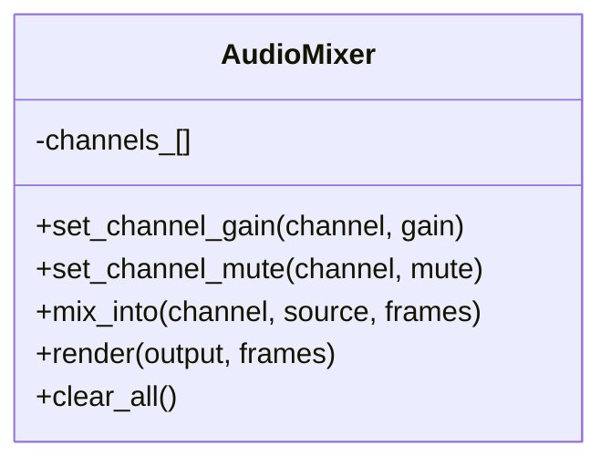

图表来源
- [src/mixer/audio_mixer.h:9-34](file://src/mixer/audio_mixer.h#L9-L34)

章节来源
- [src/mixer/audio_mixer.h:9-34](file://src/mixer/audio_mixer.h#L9-L34)

### 预设（EnginePreset）
- 功能
  - 封装不同发动机的几何、点火相位、谐波谱与效果参数，便于快速切换。
- 扩展建议
  - 引入“配方式”参数组合，支持用户自定义参数组合。
  - 提供可视化编辑器或脚本导入机制，降低手工配置成本。

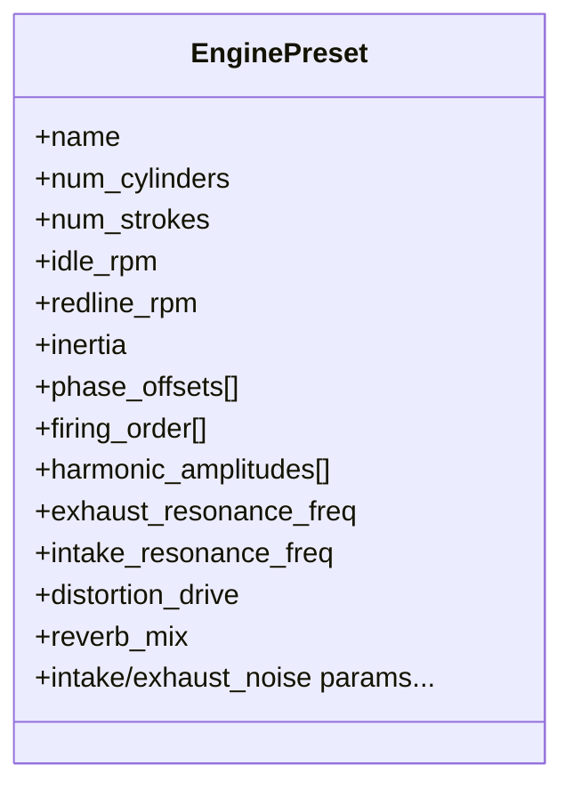

图表来源
- [src/presets/engine_preset.h:8-47](file://src/presets/engine_preset.h#L8-L47)

章节来源
- [src/presets/engine_preset.h:8-47](file://src/presets/engine_preset.h#L8-L47)
- [src/presets/preset_i4.cpp:5-56](file://src/presets/preset_i4.cpp#L5-L56)
- [src/presets/preset_v8_cross.cpp:5-63](file://src/presets/preset_v8_cross.cpp#L5-L63)

### 音频引擎主控（AudioEngine）
- 功能
  - 管理子模块生命周期、参数桥接、音频回调与离线渲染。
  - 提供加载预设、设置参数、启动/停止/关闭等接口。
- 关键点
  - 回调中仅做最小必要工作，避免阻塞。
  - 使用静态回调适配miniaudio设备句柄。

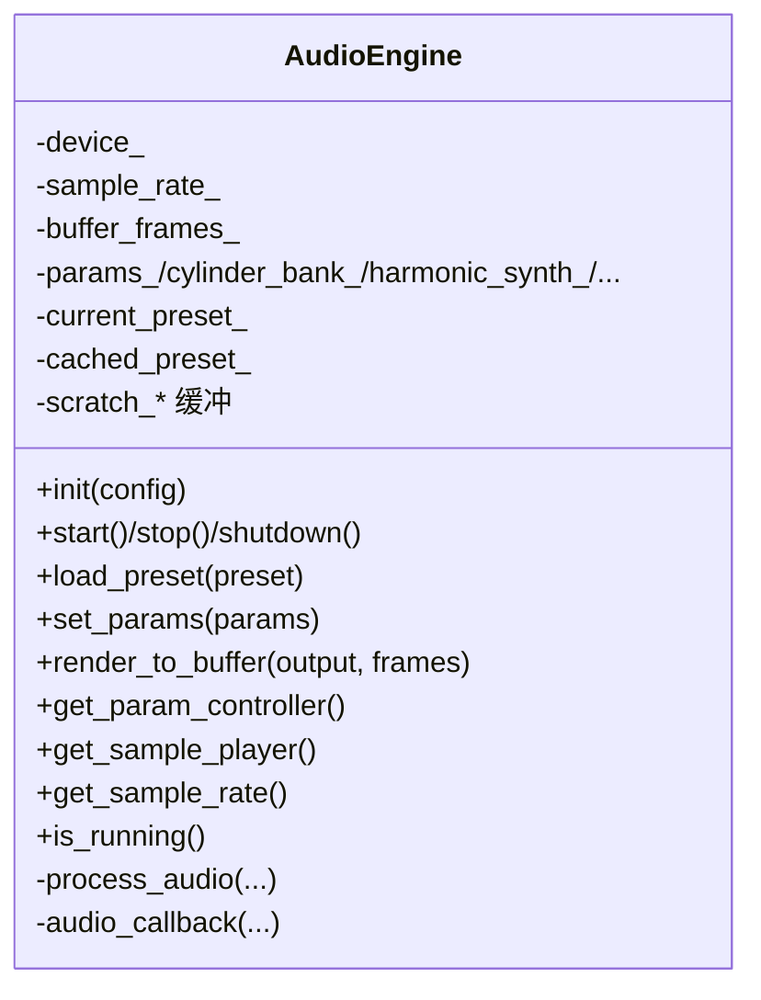

图表来源
- [src/audio/audio_engine.h:27-89](file://src/audio/audio_engine.h#L27-L89)

章节来源
- [src/audio/audio_engine.h:27-89](file://src/audio/audio_engine.h#L27-L89)

## 依赖关系分析
- 模块耦合
  - AudioEngine聚合各子模块，是事实上的控制中枢；与ParameterController存在单向依赖（音频线程读取）。
  - EngineModel独立于音频线程，仅通过参数桥交互。
  - 合成与效果模块均实现IEffect接口，便于替换与组合。
- 外部依赖
  - miniaudio设备回调封装于AudioEngine内部，对外透明。
- 可能的改进
  - 将回调中的处理拆分为“准备阶段”和“执行阶段”，进一步降低抖动。
  - 对常用参数（如滤波器系数）引入缓存与变更检测，减少重复计算。

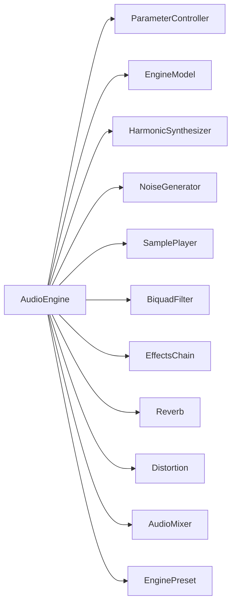

图表来源
- [src/audio/audio_engine.h:58-69](file://src/audio/audio_engine.h#L58-L69)
- [src/core/parameter_controller.h:43-49](file://src/core/parameter_controller.h#L43-L49)
- [src/core/engine_model.h:15-22](file://src/core/engine_model.h#L15-L22)

章节来源
- [src/audio/audio_engine.h:58-69](file://src/audio/audio_engine.h#L58-L69)
- [src/core/parameter_controller.h:43-49](file://src/core/parameter_controller.h#L43-L49)
- [src/core/engine_model.h:15-22](file://src/core/engine_model.h#L15-L22)

## 性能考量
- 实时性与延迟
  - 保持音频回调极短，避免任何阻塞或动态分配。
  - 使用三缓冲参数桥，避免锁与上下文切换。
- CPU使用率
  - 合理设置采样率与缓冲帧数；在资源受限平台适当降低采样率或增大缓冲以换取稳定性。
  - 对滤波器与合成器参数进行缓存与变更检测，减少无效计算。
- 内存与泄漏
  - 避免在音频回调中分配内存；所有临时数据尽量复用或使用栈/静态缓冲。
  - 使用RAII管理资源，确保析构路径正确释放。
- 测量与分析
  - 使用系统自带工具（Windows Performance Recorder、Linux perf）采集CPU占用与调用栈。
  - 在关键路径插入计时点，统计平均/峰值耗时与抖动。

## 故障排查指南
- 无法初始化音频设备
  - 检查采样率与缓冲帧数是否合理；确认系统音频权限与驱动状态。
  - 查看初始化失败日志与返回码。
- 声音断断续续或爆音
  - 排查参数桥是否正确发布/消费；检查混音器通道增益与饱和。
  - 确认回调中未进行阻塞操作（磁盘/网络/锁）。
- 参数不生效
  - 确认控制线程已调用写入，音频线程已调用读取；检查参数桥索引交换逻辑。
- 预设切换异常
  - 确认预设加载成功且缓存副本已更新；检查原子指针写入顺序。

章节来源
- [src/main.cpp:110-113](file://src/main.cpp#L110-L113)
- [src/audio/audio_engine.h:32-35](file://src/audio/audio_engine.h#L32-L35)
- [src/core/parameter_controller.h:32-50](file://src/core/parameter_controller.h#L32-L50)

## 结论
本项目以“参数桥+模块化合成与效果链+多通道混音”为核心，兼顾实时性与可扩展性。遵循本文的扩展与最佳实践，可在不破坏实时性的前提下持续增强音色表现与功能覆盖。

## 附录

### 代码贡献规范
- 编码风格
  - 类型与函数使用大驼峰，变量与常量小驼峰；枚举值全大写加下划线。
  - 头文件包含顺序：同模块头、其他模块头、C/C++标准库、第三方库。
  - 函数与类声明尽量放在头文件，实现放在对应源文件。
- 命名约定
  - 类：名词或复合词，首字母大写；接口以“I”前缀（如IEffect）。
  - 方法：动词短语，清晰表达意图；纯读取方法以get_前缀。
  - 成员变量：m_前缀或下划线后缀，避免与局部变量冲突。
- 注释标准
  - 公共接口必须有简要用途说明与参数/返回值说明。
  - 复杂算法或关键路径应标注时间/空间复杂度与边界条件。
  - TODO/FIXME使用统一格式，明确责任人与截止日期。
- 提交信息
  - 标题简洁描述变更；正文说明动机、方案与风险；引用相关Issue。

### 扩展开发方法
- 添加新发动机类型
  - 在预设模块新增一个EnginePreset实例，定义缸数、冲程、点火相位、谐波谱与滤波/噪声参数。
  - 在入口处注册预设选择逻辑，确保AudioEngine可加载该预设。
- 添加新效果处理器
  - 实现IEffect接口，提供process与reset；在效果链中注册。
  - 如需参数化，提供set_params方法并在AudioEngine中暴露。
- 添加合成器模块
  - 在AudioEngine中新增合成器实例，接入处理流程；确保线程安全与缓冲复用。
- 预设工厂函数
  - 在头文件声明工厂函数，在源文件实现静态预设对象；返回引用以避免拷贝。

章节来源
- [src/presets/engine_preset.h:49-52](file://src/presets/engine_preset.h#L49-L52)
- [src/presets/preset_i4.cpp:5-56](file://src/presets/preset_i4.cpp#L5-L56)
- [src/presets/preset_v8_cross.cpp:5-63](file://src/presets/preset_v8_cross.cpp#L5-L63)
- [src/effects/biquad_filter.h:18-23](file://src/effects/biquad_filter.h#L18-L23)
- [src/effects/effects_chain.h:12-16](file://src/effects/effects_chain.h#L12-L16)
- [src/audio/audio_engine.h:58-69](file://src/audio/audio_engine.h#L58-L69)

### 架构最佳实践
- 模块设计原则
  - 单一职责：每个模块专注一类能力（合成/效果/混音）。
  - 依赖倒置：高层模块不依赖低层实现，而是依赖抽象（如IEffect）。
  - 可替换性：通过接口与工厂模式实现模块替换。
- 接口设计
  - 明确输入/输出与副作用；提供reset与clear方法清理状态。
  - 对可能失败的操作提供返回码或异常说明。
- 错误处理
  - 初始化失败立即返回并记录原因；运行时错误尽量局部化，避免级联崩溃。
  - 对外部依赖（如设备）提供降级策略（如静音或简化处理）。

### 调试技巧与性能分析
- 音频延迟测量
  - 在控制线程与音频线程分别打点，计算从输入到输出的时间差。
  - 使用系统计时器（如高精度时钟）避免浮点误差累积。
- CPU使用率监控
  - 使用perf/ETW/Activity Monitor观察CPU占用分布；定位热点函数。
- 内存泄漏检测
  - 在非实时路径使用内存检测工具；确保所有new/delete或malloc/free成对出现。
- 抖动与吞吐
  - 统计回调耗时分布与峰值；调整缓冲帧数与采样率平衡延迟与稳定性。

### 未来发展规划与技术演进
- 音频质量
  - 引入更高阶的合成（如波形振荡器、FM/PM合成）与非线性建模。
  - 增强空间化与环境感知（头部相关传递函数、动态混响）。
- 实时性与可移植性
  - 优化参数桥与回调路径，支持更低延迟与更稳的帧时序。
  - 增强对移动端与嵌入式平台的支持（编译选项与资源限制）。
- 工具链与自动化
  - 提供可视化参数编辑器与预设管理工具。
  - 增加持续集成与基准测试，保障回归质量。
- 社区协作
  - 制定清晰的PR流程与代码审查清单；鼓励贡献音色样本与预设。
  - 发布API文档与示例工程，降低上手门槛。

### 社区贡献指南与开源协作规范
- 行为准则
  - 尊重多样性，友善沟通；禁止人身攻击与歧视性言论。
- 贡献流程
  - Fork仓库 -> 创建功能分支 -> 提交修改 -> 发起PR -> 代码审查 -> 合并。
- Issue与讨论
  - Bug报告需包含环境信息、复现步骤与期望/实际结果。
  - 功能请求需说明动机、使用场景与验收标准。
- 许可与版权
  - 采用宽松许可（如MIT），贡献即默认同意授权给项目。

### 高级主题
- 实时音频编程挑战
  - 确保音频回调在硬实时约束内完成；避免阻塞、动态分配与竞态。
  - 使用环形缓冲与零拷贝思想减少拷贝次数。
- 数字信号处理进阶
  - 滤波器设计：选择合适的窗函数与阶数，避免频谱泄漏与相位失真。
  - 合成技术：引入相位瞬态控制、频域变换与自适应参数。
  - 混响建模：使用卷积或反馈滤波器网络，注意数值稳定与延迟补偿。