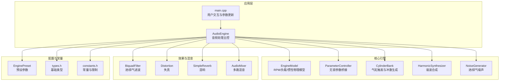
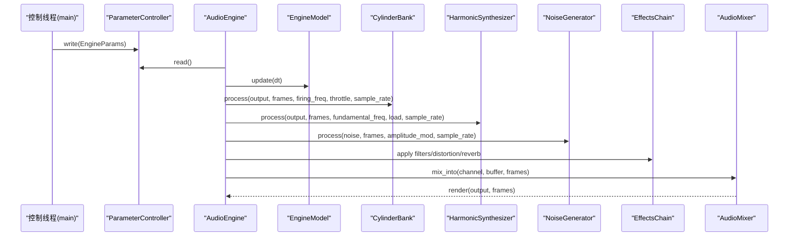
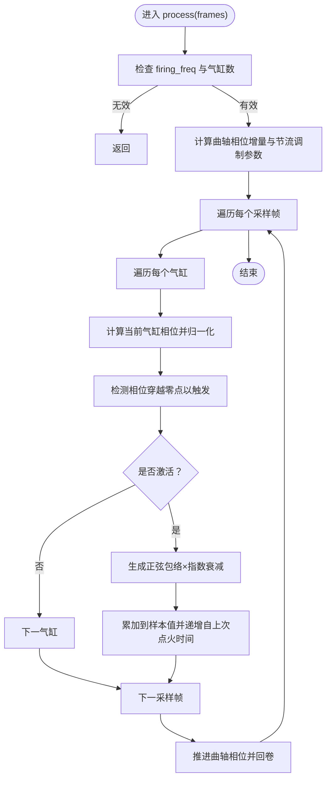
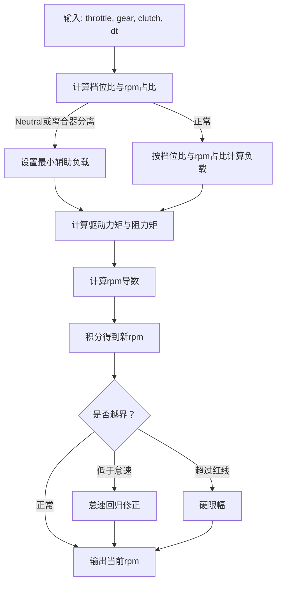
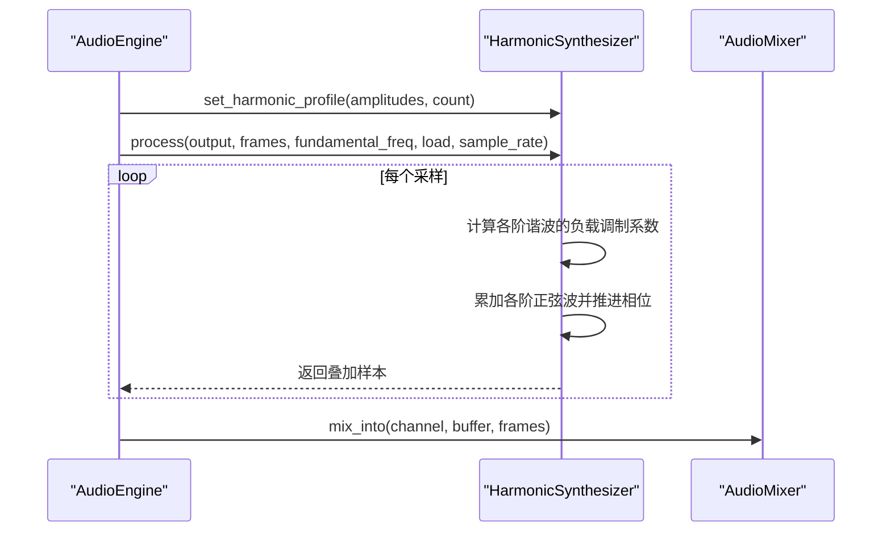
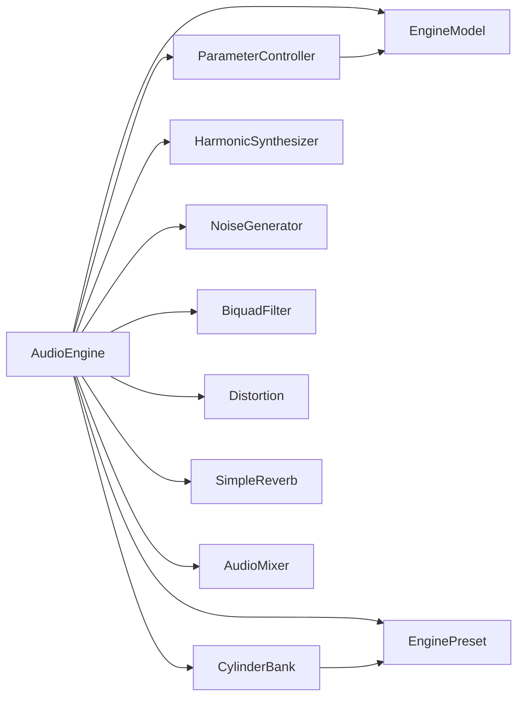

# CylinderBank气缸银行系统

<cite>
**本文引用的文件**
- [cylinder_bank.h](file://src/core/cylinder_bank.h)
- [cylinder_bank.cpp](file://src/core/cylinder_bank.cpp)
- [engine_model.h](file://src/core/engine_model.h)
- [engine_model.cpp](file://src/core/engine_model.cpp)
- [engine_preset.h](file://src/presets/engine_preset.h)
- [preset_i4.cpp](file://src/presets/preset_i4.cpp)
- [preset_v8_cross.cpp](file://src/presets/preset_v8_cross.cpp)
- [preset_v8_flat.cpp](file://src/presets/preset_v8_flat.cpp)
- [harmonic_synth.h](file://src/synth/harmonic_synth.h)
- [harmonic_synth.cpp](file://src/synth/harmonic_synth.cpp)
- [audio_engine.h](file://src/audio/audio_engine.h)
- [audio_engine.cpp](file://src/audio/audio_engine.cpp)
- [audio_mixer.h](file://src/mixer/audio_mixer.h)
- [parameter_controller.h](file://src/core/parameter_controller.h)
- [noise_generator.h](file://src/synth/noise_generator.h)
- [main.cpp](file://src/main.cpp)
- [test_cylinder_bank.cpp](file://tests/test_cylinder_bank.cpp)
- [types.h](file://src/core/types.h)
- [constants.h](file://src/core/constants.h)
</cite>

## 目录
1. [简介](#简介)
2. [项目结构](#项目结构)
3. [核心组件](#核心组件)
4. [架构总览](#架构总览)
5. [详细组件分析](#详细组件分析)
6. [依赖关系分析](#依赖关系分析)
7. [性能考量](#性能考量)
8. [故障排查指南](#故障排查指南)
9. [结论](#结论)
10. [附录](#附录)

## 简介
本文件围绕CylinderBank气缸银行系统进行深入技术文档化，重点解释以下方面：
- 气缸触发时序的精确控制机制：包括点火相位计算、压力波传播建模、排气时序等物理现象的模拟。
- 多气缸配置的协调工作机制：涵盖I4、V8交叉平面、V8平面等不同发动机布局的时序差异。
- 气缸触发的数学模型：点火角度、燃烧压力、排气脉冲等参数的计算方法与实现。
- 不同发动机类型的配置示例与优化策略：通过预设（preset）定义与参数映射实现。
- 与谐波合成器的集成方式与音频信号生成机制：如何将气缸触发信号转换为可听声音。

## 项目结构
该工程采用模块化分层设计，核心模块包括：
- 核心引擎与物理模型：EngineModel、ParameterController
- 气缸银行与触发：CylinderBank
- 音频合成与效果链：HarmonicSynthesizer、NoiseGenerator、BiquadFilter、Distortion、SimpleReverb
- 混音与输出：AudioMixer
- 预设与类型常量：EnginePreset、types、constants
- 应用入口与控制循环：main、AudioEngine

**图表来源**
- [audio_engine.h:27-89](file://src/audio/audio_engine.h#L27-L89)
- [main.cpp:89-239](file://src/main.cpp#L89-L239)
- [engine_model.h:7-47](file://src/core/engine_model.h#L7-L47)
- [parameter_controller.h:20-58](file://src/core/parameter_controller.h#L20-L58)
- [cylinder_bank.h:9-38](file://src/core/cylinder_bank.h#L9-L38)
- [harmonic_synth.h:8-25](file://src/synth/harmonic_synth.h#L8-L25)
- [noise_generator.h:8-38](file://src/synth/noise_generator.h#L8-L38)
- [audio_mixer.h:9-34](file://src/mixer/audio_mixer.h#L9-L34)
- [engine_preset.h:8-47](file://src/presets/engine_preset.h#L8-L47)
- [types.h:7-11](file://src/core/types.h#L7-L11)
- [constants.h:8-17](file://src/core/constants.h#L8-L17)

**章节来源**
- [audio_engine.h:27-89](file://src/audio/audio_engine.h#L27-L89)
- [main.cpp:89-239](file://src/main.cpp#L89-L239)

## 核心组件
本节聚焦于CylinderBank气缸银行系统的核心职责与实现要点：
- 角度与相位管理：每个气缸拥有独立相位偏移，随曲轴角速度推进。
- 冲激触发与包络：在相位穿越零点时产生短时冲激，使用正弦包络与指数衰减控制形状。
- 节流响应：节流开度影响冲激持续时间、衰减速度与幅度，实现“更重/更清”的动态变化。
- 多气缸协调：通过统一的曲轴相位增量与各缸相位偏移，保证多缸同步与错峰触发。

关键接口与数据结构：
- 配置接口：从EnginePreset读取气缸数与相位偏移，并重置内部状态。
- 处理接口：按采样率推进曲轴相位，检测触发事件，生成叠加后的样本缓冲。
- 内部状态：每缸相位、上次相位、自上次点火的时间；全局曲轴相位。

**章节来源**
- [cylinder_bank.h:9-38](file://src/core/cylinder_bank.h#L9-L38)
- [cylinder_bank.cpp:11-78](file://src/core/cylinder_bank.cpp#L11-L78)
- [engine_preset.h:8-47](file://src/presets/engine_preset.h#L8-L47)

## 架构总览
AudioEngine作为音频渲染主控，负责：
- 参数桥接：ParameterController在控制线程写入，在音频回调中读取，避免锁与分配。
- 模块编排：依次调用EngineModel更新RPM，CylinderBank生成气缸冲激，HarmonicSynthesizer生成谐波，NoiseGenerator生成进/排气噪声，BiquadFilter滤波，Distortion失真，SimpleReverb混响，最后由AudioMixer汇总输出。
- 预设切换：支持I4、V8交叉平面、V8平面三种预设，分别定义相位偏移、谐波轮廓与滤波/噪声参数。

**图表来源**
- [audio_engine.h:58-84](file://src/audio/audio_engine.h#L58-L84)
- [parameter_controller.h:32-50](file://src/core/parameter_controller.h#L32-L50)
- [engine_model.cpp:21-52](file://src/core/engine_model.cpp#L21-L52)
- [cylinder_bank.cpp:28-78](file://src/core/cylinder_bank.cpp#L28-L78)
- [harmonic_synth.cpp:26-60](file://src/synth/harmonic_synth.cpp#L26-L60)
- [noise_generator.h:12-16](file://src/synth/noise_generator.h#L12-L16)
- [audio_mixer.h:16-22](file://src/mixer/audio_mixer.h#L16-L22)

## 详细组件分析

### CylinderBank 气缸银行
CylinderBank是气缸触发与冲激生成的核心模块。其工作流程如下：
- 计算曲轴相位增量：基于整体点火频率与气缸数，确定每样本的相位步进。
- 相位推进与归一化：每帧推进曲轴相位，并将各缸相位规范化到[0, 2π)范围。
- 触发检测：当相位跨越零点（从接近2π跳至接近0）时，标记该缸进入激活期。
- 冲激生成：在激活期内按正弦包络与指数衰减合成单次冲激，叠加到输出缓冲。
- 节流调制：高节流下缩短冲激持续时间、加快衰减、提升幅度，营造更“重”的声学特性。

**图表来源**
- [cylinder_bank.cpp:28-78](file://src/core/cylinder_bank.cpp#L28-L78)

**章节来源**
- [cylinder_bank.h:9-38](file://src/core/cylinder_bank.h#L9-L38)
- [cylinder_bank.cpp:11-78](file://src/core/cylinder_bank.cpp#L11-L78)

### EngineModel 发动机物理模型
EngineModel负责RPM、负载与惯性的动力学建模：
- 负载计算：根据档位比、离合器状态与RPM占比，计算驱动阻力。
- 扭矩平衡：驱动力矩与阻力矩（摩擦+负载）决定角加速度。
- RPM积分与限幅：包含怠速回归与红线限制。
- 输出：提供当前rpm、节气门、负载、档位、离合器状态供音频模块使用。

**图表来源**
- [engine_model.cpp:21-52](file://src/core/engine_model.cpp#L21-L52)

**章节来源**
- [engine_model.h:7-47](file://src/core/engine_model.h#L7-L47)
- [engine_model.cpp:21-52](file://src/core/engine_model.cpp#L21-L52)

### 预设与多气缸布局
预设定义了不同发动机的相位偏移、谐波轮廓与滤波/噪声参数，从而实现差异化的声音特征：
- I4（直列四缸）：均匀点火间隔，强调2阶与4阶谐波，偏向“嗡嗡”质感。
- V8交叉平面：非均匀点火间隔，强调基波与次谐波，呈现深沉“咆哮”感。
- V8平面：等间距点火，强调高阶谐波，呈现尖锐“尖叫”感。

```mermaid
classDiagram
class EnginePreset {
+string name
+int num_cylinders
+int num_strokes
+float idle_rpm
+float redline_rpm
+float inertia
+float phase_offsets[MAX_CYLINDERS]
+int firing_order[MAX_CYLINDERS]
+float harmonic_amplitudes[MAX_HARMONICS]
+int num_harmonics
+float exhaust_resonance_freq
+float exhaust_resonance_Q
+float intake_resonance_freq
+float intake_resonance_Q
+float distortion_drive
+float distortion_mix
+float reverb_room_size
+float reverb_damping
+float reverb_mix
+float intake_noise_level
+float intake_noise_center_freq
+float intake_noise_bandwidth
+float exhaust_noise_level
+float exhaust_noise_center_freq
+float exhaust_noise_bandwidth
}
class Preset_I4 {
+get_preset_i4()
}
class Preset_V8_Cross {
+get_preset_v8_cross()
}
class Preset_V8_Flat {
+get_preset_v8_flat()
}
Preset_I4 --> EnginePreset : "构造"
Preset_V8_Cross --> EnginePreset : "构造"
Preset_V8_Flat --> EnginePreset : "构造"
```

**图表来源**
- [engine_preset.h:8-47](file://src/presets/engine_preset.h#L8-L47)
- [preset_i4.cpp:5-56](file://src/presets/preset_i4.cpp#L5-L56)
- [preset_v8_cross.cpp:5-63](file://src/presets/preset_v8_cross.cpp#L5-L63)
- [preset_v8_flat.cpp:5-62](file://src/presets/preset_v8_flat.cpp#L5-L62)

**章节来源**
- [engine_preset.h:8-47](file://src/presets/engine_preset.h#L8-L47)
- [preset_i4.cpp:5-56](file://src/presets/preset_i4.cpp#L5-L56)
- [preset_v8_cross.cpp:5-63](file://src/presets/preset_v8_cross.cpp#L5-L63)
- [preset_v8_flat.cpp:5-62](file://src/presets/preset_v8_flat.cpp#L5-L62)

### 与谐波合成器的集成
HarmonicSynthesizer以“基波频率×谐波序号”的方式合成叠加波形，并根据负载对不同频段的谐波进行调制，从而实现：
- 负载温和调制：低阶谐波（1-4）受轻度影响
- 负载中度调制：中阶谐波（5-16）受中度影响
- 负载强效调制：高阶谐波（17+）受强效影响

**图表来源**
- [harmonic_synth.h:8-25](file://src/synth/harmonic_synth.h#L8-L25)
- [harmonic_synth.cpp:26-60](file://src/synth/harmonic_synth.cpp#L26-L60)
- [audio_engine.h:58-84](file://src/audio/audio_engine.h#L58-L84)

**章节来源**
- [harmonic_synth.h:8-25](file://src/synth/harmonic_synth.h#L8-L25)
- [harmonic_synth.cpp:26-60](file://src/synth/harmonic_synth.cpp#L26-L60)

### 与噪声生成器的集成
NoiseGenerator用于生成进/排气噪声，参数包括中心频率、带宽与振幅，通过简单的一阶带通滤波器与xorshift伪随机数生成器实现：
- 噪声谱特性：由中心频率与带宽决定，配合振幅调制形成动态变化。
- 动态调制：结合节气门与负载，使进/排气噪声随工况变化。

**章节来源**
- [noise_generator.h:8-38](file://src/synth/noise_generator.h#L8-L38)

### 与混音器的集成
AudioMixer提供多通道缓冲区与增益/静音控制，支持将多个来源（气缸冲激、谐波、噪声、样本）叠加到最终输出：
- 混音通道：静态数组存储通道缓冲，支持增益与静音。
- 渲染：将所有通道缓冲求和并清空，输出到设备。

**章节来源**
- [audio_mixer.h:9-34](file://src/mixer/audio_mixer.h#L9-L34)

## 依赖关系分析
- AudioEngine聚合多个子模块，通过统一的音频回调顺序组织处理链。
- ParameterController提供跨线程参数传递，避免锁与内存分配。
- CylinderBank依赖EnginePreset提供的相位偏移与节流调制参数。
- 预设模块为EngineModel与AudioEngine提供初始参数与特性约束。

**图表来源**
- [audio_engine.h:58-84](file://src/audio/audio_engine.h#L58-L84)
- [parameter_controller.h:32-50](file://src/core/parameter_controller.h#L32-L50)
- [engine_model.h:7-47](file://src/core/engine_model.h#L7-L47)
- [cylinder_bank.h:9-38](file://src/core/cylinder_bank.h#L9-L38)
- [harmonic_synth.h:8-25](file://src/synth/harmonic_synth.h#L8-L25)
- [noise_generator.h:8-38](file://src/synth/noise_generator.h#L8-L38)
- [audio_mixer.h:9-34](file://src/mixer/audio_mixer.h#L9-L34)
- [engine_preset.h:8-47](file://src/presets/engine_preset.h#L8-L47)

**章节来源**
- [audio_engine.h:58-84](file://src/audio/audio_engine.h#L58-L84)
- [parameter_controller.h:32-50](file://src/core/parameter_controller.h#L32-L50)

## 性能考量
- 无锁参数桥接：ParameterController使用三缓冲与原子操作，避免音频线程等待，降低抖动风险。
- 单次遍历：CylinderBank与HarmonicSynthesizer均采用单次循环累加，减少分支与函数调用开销。
- 常量与限制：constants.h中的MAX_*常量限制数组大小，避免运行时分配与缓存未命中。
- 节流调制：通过节流参数直接调整冲激持续时间与衰减速度，避免复杂的查表或插值。
- 预设参数：预设集中管理，减少重复初始化成本。

[本节为通用性能讨论，不直接分析具体文件]

## 故障排查指南
- 输出全零或无声
  - 检查firing_freq是否大于0，以及气缸数是否有效。
  - 确认节气门参数在[0,1]范围内。
  - 参考测试用例验证基本行为。
- 声音异常“尖锐”或“沉闷”
  - 切换预设（I4/V8交叉/V8平面）观察差异。
  - 调整distortion与reverb参数，观察对高频/低频的影响。
- 触发不规律或“爆音”
  - 检查相位偏移是否与预设一致。
  - 适当降低节流，避免过高的衰减与过短的持续时间导致的瞬态过冲。
- 实时控制抖动
  - 确保ParameterController在控制线程写入、音频线程读取。
  - 避免在音频回调中执行阻塞操作。

**章节来源**
- [test_cylinder_bank.cpp:10-84](file://tests/test_cylinder_bank.cpp#L10-L84)
- [parameter_controller.h:32-50](file://src/core/parameter_controller.h#L32-L50)

## 结论
CylinderBank气缸银行系统通过精确的相位推进与触发检测，结合节流调制与多缸协调，实现了对真实内燃机声学特性的高效模拟。配合EngineModel的动力学建模、HarmonicSynthesizer的谐波合成、NoiseGenerator的进/排气噪声生成以及完整的音频效果链与混音器，系统能够稳定地输出高质量的赛车引擎声。通过预设的灵活配置，开发者可以快速适配不同发动机布局与风格，并在实时音频渲染场景中保持低延迟与高稳定性。

[本节为总结性内容，不直接分析具体文件]

## 附录

### 数学模型与参数说明
- 曲轴相位推进
  - 每气缸相位增量：Δφ_cylinder = 2π × (firing_freq / num_cylinders) / sample_rate
  - 全局曲轴相位：φ_crank(n) = φ_crank(n−1) + Δφ_crank
- 触发检测
  - 当前相位与上次相位满足跨越零点条件时，标记该缸激活。
- 冲激包络
  - 包络：env(t) = sin(π × t / duration) × exp(-decay × t)
  - 幅度：amplitude = base_amplitude × throttle_weight
- 负载调制（谐波）
  - 低阶（1-4）：mild load modulation
  - 中阶（5-16）：moderate load modulation
  - 高阶（17+）：strong load modulation

**章节来源**
- [cylinder_bank.cpp:34-41](file://src/core/cylinder_bank.cpp#L34-L41)
- [cylinder_bank.cpp:63-67](file://src/core/cylinder_bank.cpp#L63-L67)
- [harmonic_synth.cpp:38-45](file://src/synth/harmonic_synth.cpp#L38-L45)

### 不同发动机类型的配置示例与优化策略
- I4（直列四缸）
  - 特征：均匀点火间隔，强调2阶与4阶谐波，偏向“嗡嗡”质感。
  - 优化：提高中低频共振，适度增强排气噪声带宽，提升“涡音”感。
- V8交叉平面
  - 特征：非均匀点火间隔，强调基波与次谐波，呈现深沉“咆哮”感。
  - 优化：降低排气共振频率与Q值，提升混响空间与混响混合比例。
- V8平面
  - 特征：等间距点火，强调高阶谐波，呈现尖锐“尖叫”感。
  - 优化：提升高阶谐波权重，适度增加失真驱动与噪声中心频率。

**章节来源**
- [preset_i4.cpp:15-51](file://src/presets/preset_i4.cpp#L15-L51)
- [preset_v8_cross.cpp:15-60](file://src/presets/preset_v8_cross.cpp#L15-L60)
- [preset_v8_flat.cpp:15-58](file://src/presets/preset_v8_flat.cpp#L15-L58)

### 与谐波合成器的集成方式与音频信号生成机制
- 基波频率：由EngineModel的rpm经齿轮比与传动比换算得到。
- 谐波轮廓：由EnginePreset中的harmonic_amplitudes定义。
- 负载调制：低阶/中阶/高阶谐波分别采用不同的调制强度，模拟真实引擎的频率响应。
- 最终叠加：将气缸冲激、谐波、噪声与效果处理后的信号在AudioMixer中混合输出。

**章节来源**
- [harmonic_synth.cpp:26-60](file://src/synth/harmonic_synth.cpp#L26-L60)
- [audio_engine.h:58-84](file://src/audio/audio_engine.h#L58-L84)