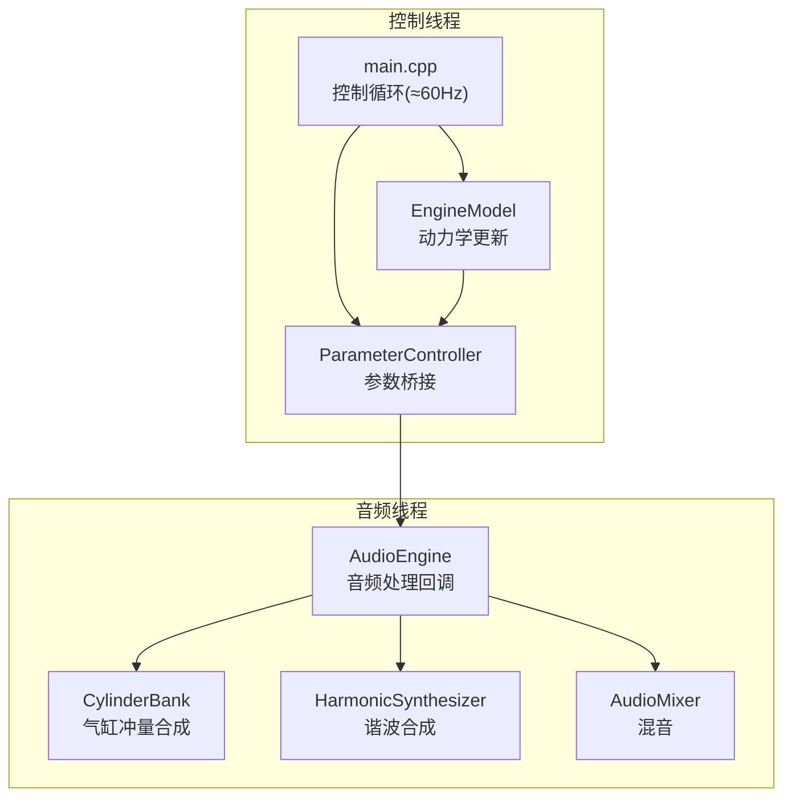
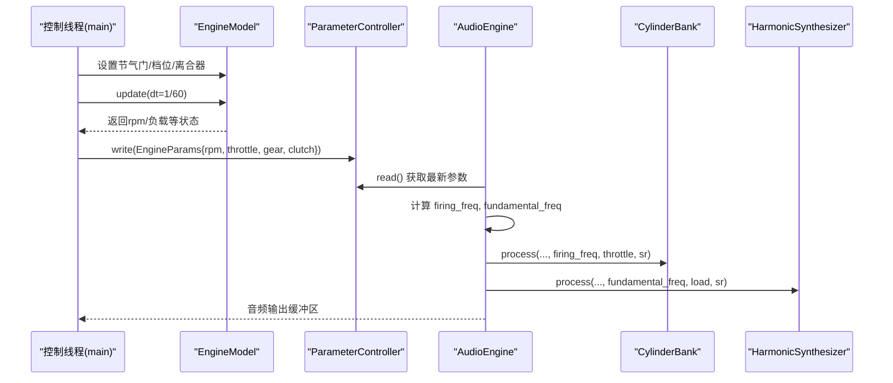
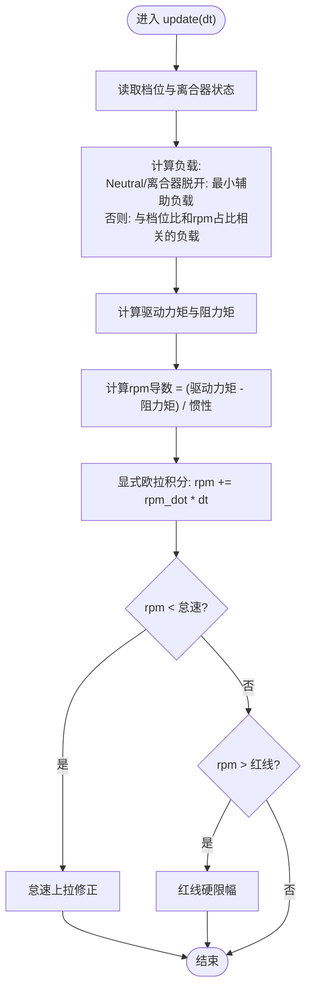
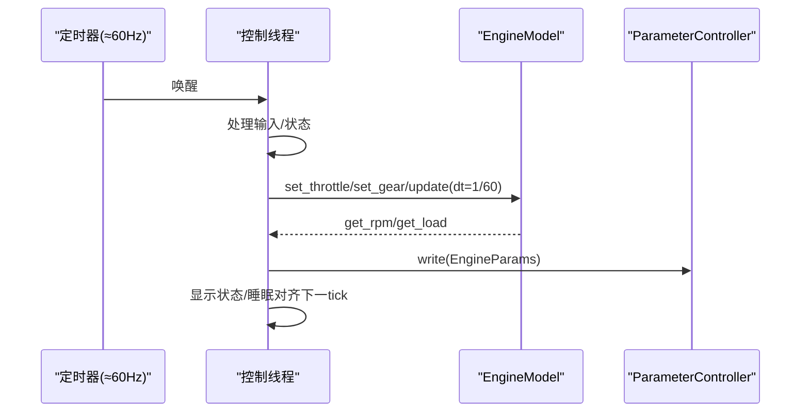
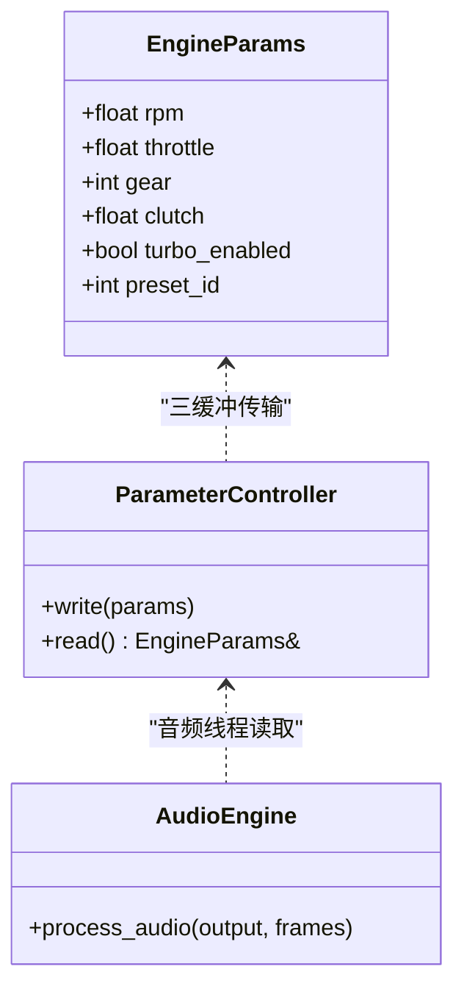
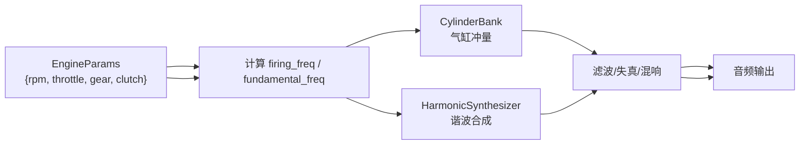
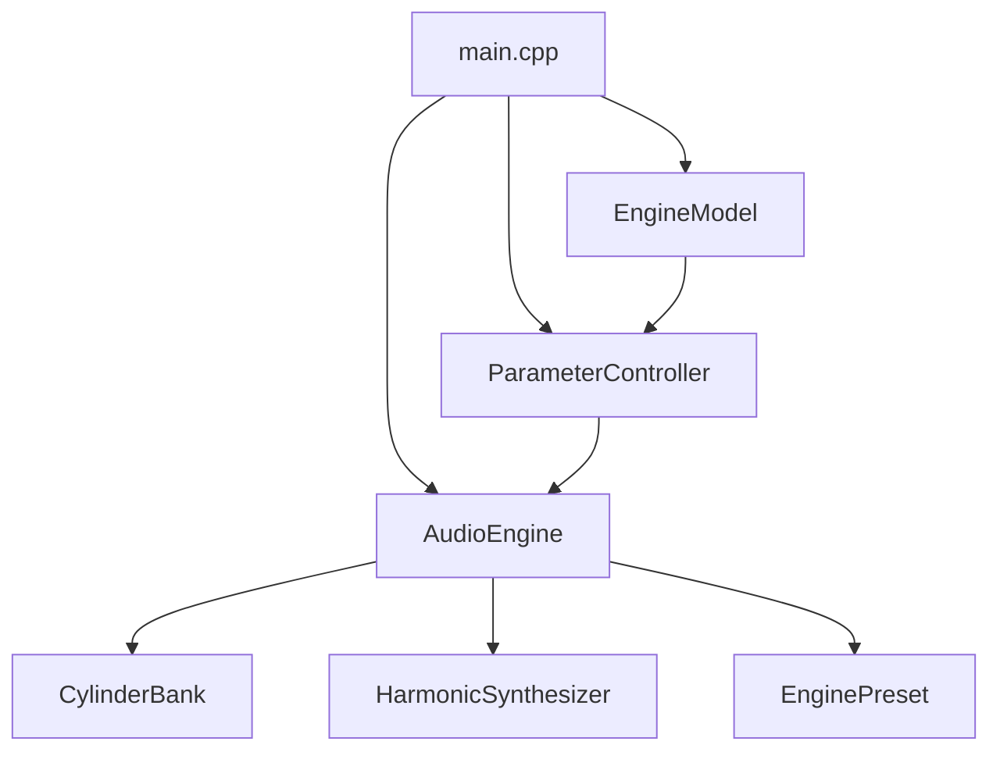

# EngineModel核心引擎

<cite>
**本文档引用的文件**
- [engine_model.h](file://src/core/engine_model.h)
- [engine_model.cpp](file://src/core/engine_model.cpp)
- [parameter_controller.h](file://src/core/parameter_controller.h)
- [audio_engine.h](file://src/audio/audio_engine.h)
- [audio_engine.cpp](file://src/audio/audio_engine.cpp)
- [main.cpp](file://src/main.cpp)
- [cylinder_bank.h](file://src/core/cylinder_bank.h)
- [cylinder_bank.cpp](file://src/core/cylinder_bank.cpp)
- [harmonic_synth.h](file://src/synth/harmonic_synth.h)
- [engine_preset.h](file://src/presets/engine_preset.h)
- [preset_i4.cpp](file://src/presets/preset_i4.cpp)
- [test_engine_model.cpp](file://tests/test_engine_model.cpp)
</cite>

## 目录
1. [简介](#简介)
2. [项目结构](#项目结构)
3. [核心组件](#核心组件)
4. [架构总览](#架构总览)
5. [详细组件分析](#详细组件分析)
6. [依赖关系分析](#依赖关系分析)
7. [性能考虑](#性能考虑)
8. [故障排除指南](#故障排除指南)
9. [结论](#结论)
10. [附录](#附录)

## 简介
本文件面向EngineModel核心引擎，系统化阐述其动力学计算与物理建模，包括：
- 转速控制与怠速/红线保护机制
- 负载模拟与齿轮传动比耦合
- 摩擦与阻尼建模
- 引擎方程的数学实现（扭矩、惯性、阻尼）
- 固定频率更新机制（约60Hz控制线程）
- 参数调优指南（怠速、红线、惯性等）
- 与其他模块的数据交换协议与接口设计

## 项目结构
EngineModel位于核心层，负责引擎动力学状态演进；AudioEngine作为音频渲染管线的调度者，通过ParameterController向音频线程推送参数；主程序在控制线程中以固定频率驱动EngineModel并同步参数。

**图表来源**
- [main.cpp:143-233](file://src/main.cpp#L143-L233)
- [engine_model.cpp:21-52](file://src/core/engine_model.cpp#L21-L52)
- [parameter_controller.h:20-50](file://src/core/parameter_controller.h#L20-L50)
- [audio_engine.cpp:102-160](file://src/audio/audio_engine.cpp#L102-L160)

**章节来源**
- [main.cpp:89-239](file://src/main.cpp#L89-L239)
- [engine_model.h:7-45](file://src/core/engine_model.h#L7-L45)
- [audio_engine.h:27-92](file://src/audio/audio_engine.h#L27-L92)

## 核心组件
- EngineModel：实现引擎动力学，包含怠速、红线、惯性、摩擦、最大扭矩等参数，以及基于欧拉积分的rpm导数更新。
- ParameterController：三缓冲无锁参数桥，控制线程写入，音频线程读取。
- AudioEngine：音频处理回调，根据EngineParams计算点火频率与基础频率，组织多层合成与效果链。
- CylinderBank：基于曲轴相位与点火顺序生成气缸冲量信号。
- HarmonicSynthesizer：基于预设谐波谱的加性合成。
- Preset系统：提供不同发动机类型的参数集合（含怠速、红线、惯性、相位偏移、谐波谱等）。

**章节来源**
- [engine_model.h:7-45](file://src/core/engine_model.h#L7-L45)
- [engine_model.cpp:21-52](file://src/core/engine_model.cpp#L21-L52)
- [parameter_controller.h:9-58](file://src/core/parameter_controller.h#L9-L58)
- [audio_engine.h:27-92](file://src/audio/audio_engine.h#L27-L92)
- [audio_engine.cpp:102-160](file://src/audio/audio_engine.cpp#L102-L160)
- [cylinder_bank.h:9-38](file://src/core/cylinder_bank.h#L9-L38)
- [harmonic_synth.h:8-25](file://src/synth/harmonic_synth.h#L8-L25)
- [engine_preset.h:8-47](file://src/presets/engine_preset.h#L8-L47)

## 架构总览
EngineModel在控制线程中以固定时间步长dt（约1/60秒）更新rpm；同时将当前rpm、节气门开度、档位、离合器状态等参数通过ParameterController发布到音频线程。音频线程在回调中读取这些参数，计算点火频率与基础频率，驱动CylinderBank与HarmonicSynthesizer生成声学信号，并经由滤波、失真、混音与混响等链路输出。

**图表来源**
- [main.cpp:200-214](file://src/main.cpp#L200-L214)
- [engine_model.cpp:21-52](file://src/core/engine_model.cpp#L21-L52)
- [parameter_controller.h:32-50](file://src/core/parameter_controller.h#L32-L50)
- [audio_engine.cpp:102-160](file://src/audio/audio_engine.cpp#L102-L160)

## 详细组件分析

### EngineModel 动力学与数学实现
- 状态变量
  - 当前rpm、节气门开度、负载、档位、离合器状态
  - 怠速rpm、红线rpm、惯性、摩擦、最大扭矩
- 负载建模
  - 档位为0或离合器脱开时，仅保留最小辅助负载
  - 正常传动时，负载与档位比和rpm占比成正比，受离合器状态缩放
- 扭矩与惯性
  - 驱动扭矩与节气门成正比
  - 阻力扭矩包含固定摩擦与随负载与rpm占比缩放的部分
  - rpm导数由净扭矩除以惯性得到
- 积分与限幅
  - 使用显式欧拉积分：rpm += rpm_dot * dt
  - 怠速限制：低于怠速时施加轻微上拉修正
  - 红线限制：超过红线直接截断

**图表来源**
- [engine_model.cpp:21-52](file://src/core/engine_model.cpp#L21-L52)

**章节来源**
- [engine_model.h:28-45](file://src/core/engine_model.h#L28-L45)
- [engine_model.cpp:21-52](file://src/core/engine_model.cpp#L21-L52)
- [test_engine_model.cpp:8-48](file://tests/test_engine_model.cpp#L8-L48)

### 固定频率更新机制与控制线程设计
- 控制线程以约60Hz运行（周期约16.667ms），在每次tick中：
  - 处理输入（节气门、档位、预设切换等）
  - 调用EngineModel::update(dt)，其中dt=1/60秒
  - 将EngineParams写入ParameterController，供音频线程读取
  - 显示状态信息
  - 通过睡眠维持稳定帧周期

**图表来源**
- [main.cpp:143-233](file://src/main.cpp#L143-L233)
- [engine_model.cpp:21-52](file://src/core/engine_model.cpp#L21-L52)
- [parameter_controller.h:32-50](file://src/core/parameter_controller.h#L32-L50)

**章节来源**
- [main.cpp:143-233](file://src/main.cpp#L143-L233)

### 与其他模块的数据交换协议
- EngineParams结构体定义了音频线程所需的全部引擎状态与控制参数
- ParameterController采用三缓冲无锁设计，避免控制线程与音频线程之间的锁竞争
- AudioEngine在回调中读取EngineParams，计算firing_freq与fundamental_freq，驱动后续合成链

**图表来源**
- [parameter_controller.h:9-58](file://src/core/parameter_controller.h#L9-L58)
- [audio_engine.cpp:102-160](file://src/audio/audio_engine.cpp#L102-L160)

**章节来源**
- [parameter_controller.h:9-58](file://src/core/parameter_controller.h#L9-L58)
- [audio_engine.cpp:102-160](file://src/audio/audio_engine.cpp#L102-L160)

### 引擎方程的数学实现细节
- 驱动力矩：与节气门开度成正比
- 阻力矩：固定摩擦项 + 随负载与rpm占比缩放的阻尼项
- 惯性：影响rpm导数大小，决定响应快慢
- 数值积分：显式欧拉法，步长为dt=1/60秒
- 限幅：怠速上拉与红线硬限幅保证物理合理性

**章节来源**
- [engine_model.cpp:33-51](file://src/core/engine_model.cpp#L33-L51)

### 负载模拟与齿轮传动耦合
- 档位为0或离合器脱开时，负载极低（仅辅助系统）
- 正常传动时，负载与档位比和rpm占比成正比，离合器状态进一步缩放
- 这种设计使高转速高档位时负载更大，符合真实车辆特性

**章节来源**
- [engine_model.cpp:22-31](file://src/core/engine_model.cpp#L22-L31)
- [engine_model.h:42-44](file://src/core/engine_model.h#L42-L44)

### 摩擦损失与阻尼系统
- 固定摩擦项提供基础阻力
- 可变阻尼与负载和rpm占比相关，模拟进气、油泵、冷却泵等辅助系统的阻力
- 该组合确保低转速时易于启动，高转速高负载时有足够阻力

**章节来源**
- [engine_model.cpp:33-35](file://src/core/engine_model.cpp#L33-L35)

### 发动机声音合成链路（与EngineModel的衔接）
- AudioEngine根据EngineParams中的rpm与预设，计算firing_freq与fundamental_freq
- CylinderBank依据firing_freq与节气门生成气缸冲量信号
- HarmonicSynthesizer依据基础频率与负载生成谐波叠加
- 后续经滤波、失真、混音与混响，最终输出

**图表来源**
- [audio_engine.cpp:113-160](file://src/audio/audio_engine.cpp#L113-L160)
- [cylinder_bank.cpp:28-78](file://src/core/cylinder_bank.cpp#L28-L78)
- [harmonic_synth.h:14-17](file://src/synth/harmonic_synth.h#L14-L17)

**章节来源**
- [audio_engine.cpp:113-160](file://src/audio/audio_engine.cpp#L113-L160)
- [cylinder_bank.cpp:28-78](file://src/core/cylinder_bank.cpp#L28-L78)
- [harmonic_synth.h:14-17](file://src/synth/harmonic_synth.h#L14-L17)

## 依赖关系分析
- EngineModel依赖于基本类型与常量定义
- AudioEngine依赖EngineModel的状态（通过参数桥），并依赖CylinderBank与HarmonicSynthesizer进行声音合成
- 主程序负责初始化AudioEngine与EngineModel，建立参数桥接与固定频率控制循环

**图表来源**
- [engine_model.h:3](file://src/core/engine_model.h#L3)
- [audio_engine.h:5-16](file://src/audio/audio_engine.h#L5-L16)
- [main.cpp:104-132](file://src/main.cpp#L104-L132)

**章节来源**
- [engine_model.h:3](file://src/core/engine_model.h#L3)
- [audio_engine.h:5-16](file://src/audio/audio_engine.h#L5-L16)
- [main.cpp:104-132](file://src/main.cpp#L104-L132)

## 性能考虑
- 固定频率更新：控制线程以约60Hz更新，确保引擎状态与音频渲染的同步性
- 数值积分：显式欧拉法简单稳定，适合实时音频场景；若需更高精度可考虑改进积分方法
- 无锁参数桥：三缓冲设计避免锁竞争，降低音频线程抖动风险
- 负载计算：负载与档位比、rpm占比、离合器状态耦合，计算开销低，适合实时
- 预设参数：通过预设统一管理引擎与声音特性，便于快速切换与调优

## 故障排除指南
- RPM无法达到怠速
  - 检查怠速上拉修正逻辑是否生效
  - 确认怠速rpm设置与当前节气门状态
- RPM超过红线不降
  - 确认红线限幅逻辑是否触发
  - 检查dt是否过大导致积分不稳定
- 负载未随档位变化
  - 检查档位与离合器状态
  - 确认负载计算公式与档位比一致
- 音频卡顿或爆音
  - 检查参数桥是否正确发布
  - 确认音频回调中未出现阻塞操作
  - 检查混响与失真参数是否过度

**章节来源**
- [engine_model.cpp:42-51](file://src/core/engine_model.cpp#L42-L51)
- [parameter_controller.h:32-50](file://src/core/parameter_controller.h#L32-L50)
- [audio_engine.cpp:155-160](file://src/audio/audio_engine.cpp#L155-L160)

## 结论
EngineModel以简洁而稳健的动力学模型实现了引擎转速的实时仿真，结合固定频率控制与无锁参数桥，有效支撑了整个音频合成链路。通过预设系统与清晰的接口设计，用户可在保持物理合理性的前提下，灵活调整怠速、红线、惯性与负载等关键参数，获得多样化的声学体验。

## 附录

### 参数调优指南
- 怠速rpm（idle_rpm）
  - 设置原则：反映发动机最小稳定转速；过低易抖动，过高则低速响应迟缓
  - 与怠速上拉修正协同工作，确保低负载稳定
- 红线rpm（redline_rpm）
  - 设置原则：高于最高使用转速；过低会频繁限幅，过高可能不安全
  - 与rpm导数与限幅逻辑共同决定高转响应
- 惯性（inertia）
  - 设置原则：反映飞轮与旋转部件惯量；越大响应越慢但更平顺，越小越灵敏
  - 与扭矩与摩擦共同决定rpm导数
- 摩擦（friction）
  - 设置原则：基础阻力项；过小易超调，过大则难以提速
- 最大扭矩（max_torque）
  - 设置原则：与节气门线性映射的驱动力上限；影响加速感与峰值功率表现
- 负载与档位比
  - 设置原则：档位越高、rpm占比越大，负载越大；离合器状态应按比例缩放
- 预设参数（预设I4/V8等）
  - 设置原则：结合气缸数、冲程数、相位偏移与谐波谱，匹配目标声学特征

**章节来源**
- [engine_model.h:24-39](file://src/core/engine_model.h#L24-L39)
- [engine_model.cpp:22-31](file://src/core/engine_model.cpp#L22-L31)
- [engine_preset.h:11-47](file://src/presets/engine_preset.h#L11-L47)
- [preset_i4.cpp:5-55](file://src/presets/preset_i4.cpp#L5-L55)

### 接口与数据交换规范
- EngineParams字段
  - rpm：当前转速（来自EngineModel）
  - throttle：节气门开度（0~1）
  - gear：档位（0=空档，1~6）
  - clutch：离合器状态（0~1）
  - turbo_enabled：涡轮开关（扩展功能）
  - preset_id：当前预设标识
- ParameterController
  - 控制线程写入，音频线程读取，保证无锁与零分配
- AudioEngine
  - 在回调中读取EngineParams，计算firing_freq与fundamental_freq
  - 驱动CylinderBank与HarmonicSynthesizer，串联滤波、失真、混音与混响

**章节来源**
- [parameter_controller.h:9-58](file://src/core/parameter_controller.h#L9-L58)
- [audio_engine.cpp:102-160](file://src/audio/audio_engine.cpp#L102-L160)