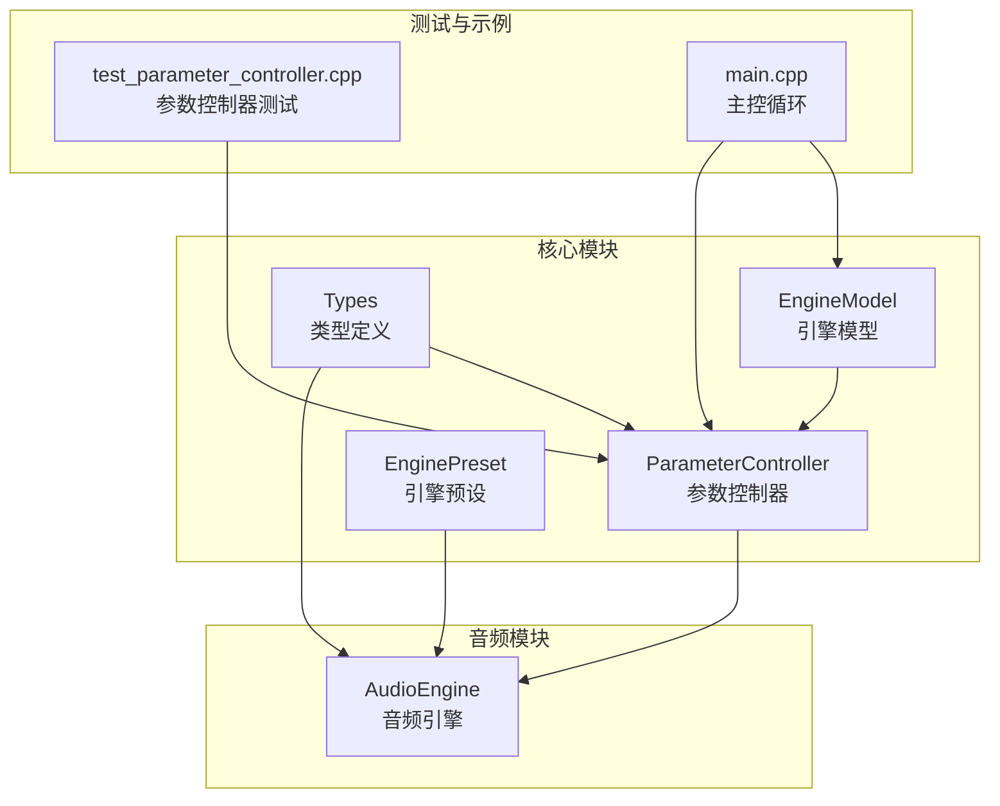
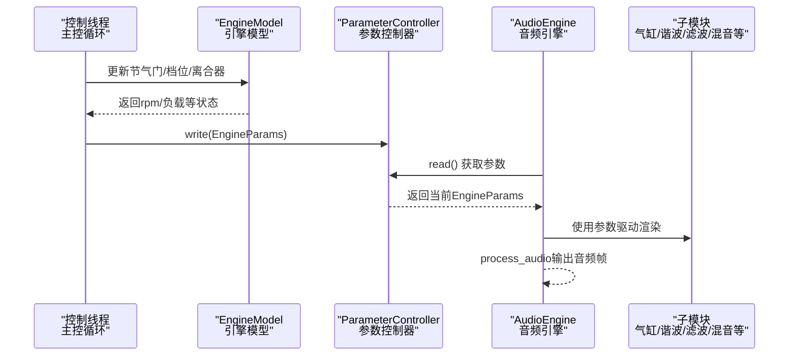
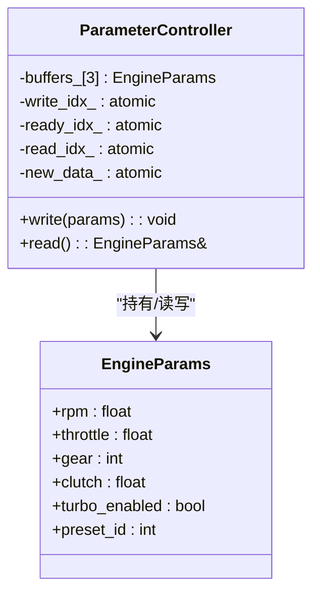
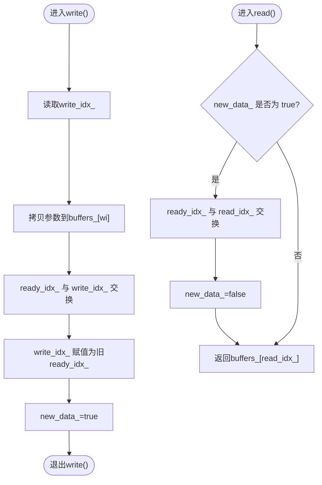
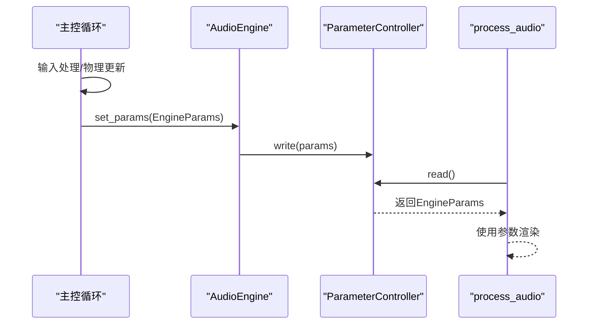
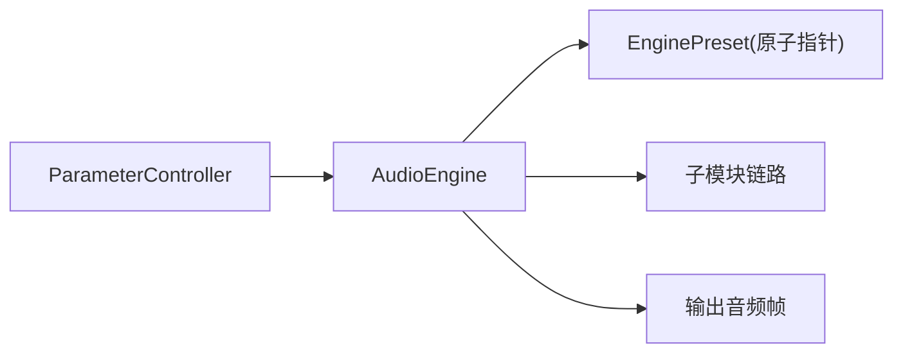
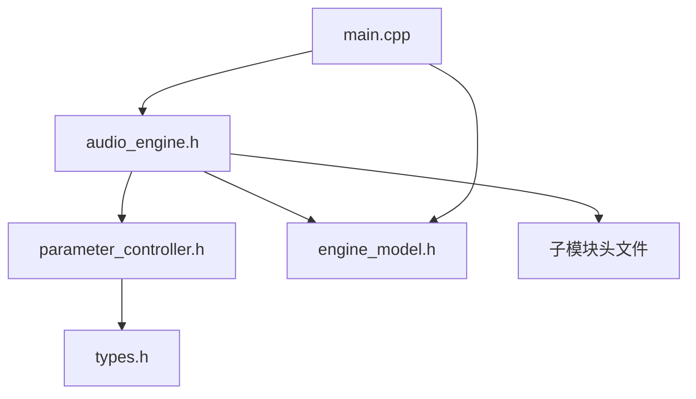

# ParameterController参数控制器

<cite>
**本文引用的文件列表**
- [parameter_controller.h](file://src/core/parameter_controller.h)
- [engine_model.h](file://src/core/engine_model.h)
- [engine_model.cpp](file://src/core/engine_model.cpp)
- [audio_engine.h](file://src/audio/audio_engine.h)
- [audio_engine.cpp](file://src/audio/audio_engine.cpp)
- [types.h](file://src/core/types.h)
- [engine_preset.h](file://src/presets/engine_preset.h)
- [test_parameter_controller.cpp](file://tests/test_parameter_controller.cpp)
- [main.cpp](file://src/main.cpp)
</cite>

## 目录
1. [简介](#简介)
2. [项目结构](#项目结构)
3. [核心组件](#核心组件)
4. [架构总览](#架构总览)
5. [详细组件分析](#详细组件分析)
6. [依赖关系分析](#依赖关系分析)
7. [性能考量](#性能考量)
8. [故障排查指南](#故障排查指南)
9. [结论](#结论)
10. [附录](#附录)

## 简介
本文件围绕ParameterController参数控制器展开，系统性阐述其在 Racing Sound Engine 中的职责与实现：通过三缓冲无锁设计实现控制线程与音频线程之间的参数传递；解析参数同步策略、状态管理与实时更新算法；说明与AudioEngine的数据流集成方式；并给出参数验证与边界检查、使用模式与最佳实践，以及竞态条件规避的关键技术。

## 项目结构
ParameterController位于核心模块，与引擎模型、音频引擎、预设配置共同构成声音合成管线的关键参数通道。

图表来源
- [parameter_controller.h:1-61](file://src/core/parameter_controller.h#L1-L61)
- [engine_model.h:1-48](file://src/core/engine_model.h#L1-L48)
- [audio_engine.h:1-92](file://src/audio/audio_engine.h#L1-L92)
- [engine_preset.h:1-55](file://src/presets/engine_preset.h#L1-L55)
- [types.h:1-12](file://src/core/types.h#L1-L12)
- [test_parameter_controller.cpp:1-95](file://tests/test_parameter_controller.cpp#L1-L95)
- [main.cpp:140-239](file://src/main.cpp#L140-L239)

章节来源
- [parameter_controller.h:1-61](file://src/core/parameter_controller.h#L1-L61)
- [audio_engine.h:1-92](file://src/audio/audio_engine.h#L1-L92)
- [engine_model.h:1-48](file://src/core/engine_model.h#L1-L48)
- [engine_preset.h:1-55](file://src/presets/engine_preset.h#L1-L55)
- [types.h:1-12](file://src/core/types.h#L1-L12)
- [test_parameter_controller.cpp:1-95](file://tests/test_parameter_controller.cpp#L1-L95)
- [main.cpp:140-239](file://src/main.cpp#L140-L239)

## 核心组件
- ParameterController：三缓冲无锁参数桥，控制线程写入、音频线程读取，零锁分配，避免阻塞。
- EngineParams：参数载体，包含rpm、节气门、档位、离合器、涡轮开关、预设ID等。
- AudioEngine：音频渲染回调中读取参数，驱动子模块（气缸脉冲、谐波合成、滤波、失真、混音、混响等）。
- EngineModel：物理引擎，计算rpm、负载等，供主控循环更新并传入参数控制器。
- EnginePreset：引擎预设，影响谐波、滤波、失真、混响等参数，音频线程以原子指针读取。

章节来源
- [parameter_controller.h:9-16](file://src/core/parameter_controller.h#L9-L16)
- [parameter_controller.h:20-58](file://src/core/parameter_controller.h#L20-L58)
- [audio_engine.h:27-92](file://src/audio/audio_engine.h#L27-L92)
- [engine_model.h:7-45](file://src/core/engine_model.h#L7-L45)
- [engine_preset.h:8-47](file://src/presets/engine_preset.h#L8-L47)

## 架构总览
ParameterController在控制线程与音频线程之间建立“发布-订阅”式参数通道：
- 控制线程（主控循环）：更新EngineModel，构造EngineParams，调用ParameterController::write发布。
- 音频线程（process_audio回调）：调用ParameterController::read获取最新参数，驱动各子模块渲染。

图表来源
- [main.cpp:200-214](file://src/main.cpp#L200-L214)
- [parameter_controller.h:32-50](file://src/core/parameter_controller.h#L32-L50)
- [audio_engine.cpp:102-160](file://src/audio/audio_engine.cpp#L102-L160)

## 详细组件分析

### ParameterController：三缓冲无锁参数桥
- 设计目标：控制线程写、音频线程读，零锁、零分配、无阻塞。
- 数据结构：三个EngineParams缓冲区，配合write_idx_/ready_idx_/read_idx_三个原子索引，以及new_data_布尔标记。
- 同步策略：
  - 写入：先写入当前write_idx_缓冲，再交换ready_idx_与write_idx_，发布新缓冲；同时设置new_data_为true。
  - 读取：若new_data_为true，交换read_idx_与ready_idx_，完成“翻转”，然后返回read_idx_指向的缓冲。
- 原子语义：使用memory_order_release与memory_order_acquire/acq_rel保证发布-消费顺序，避免重排导致的可见性问题。
- 线程安全：无共享可变状态，仅通过原子变量与内存屏障保证可见性；避免了互斥锁与条件变量。

图表来源
- [parameter_controller.h:20-58](file://src/core/parameter_controller.h#L20-L58)
- [parameter_controller.h:9-16](file://src/core/parameter_controller.h#L9-L16)

章节来源
- [parameter_controller.h:20-58](file://src/core/parameter_controller.h#L20-L58)
- [test_parameter_controller.cpp:10-33](file://tests/test_parameter_controller.cpp#L10-L33)
- [test_parameter_controller.cpp:35-85](file://tests/test_parameter_controller.cpp#L35-L85)

### 参数同步策略与实时更新算法
- 发布-消费模型：write发布新参数，read在每次音频回调中检查new_data_并翻转缓冲，确保音频线程看到“整包”参数。
- 缓冲翻转流程：
  - 写入阶段：写入缓冲 -> 交换ready与write -> 设置new_data=true
  - 读取阶段：若new_data=true -> 交换read与ready -> 清除new_data=false
- 实时性保障：音频线程在process_audio中只做一次read()，避免跨帧参数撕裂；控制线程以固定频率（约60Hz）推送参数，音频线程按音频块处理，参数更新粒度与音频块一致。

图表来源
- [parameter_controller.h:32-50](file://src/core/parameter_controller.h#L32-L50)

章节来源
- [parameter_controller.h:32-50](file://src/core/parameter_controller.h#L32-L50)

### 控制线程与音频线程的数据交换协议
- 控制线程职责：输入处理（键盘）、物理引擎更新、参数打包、调用write发布。
- 音频线程职责：process_audio中调用read获取参数，按参数驱动各子模块渲染。
- 协议要点：
  - 参数打包：从EngineModel读取rpm、节气门、档位、离合器、涡轮状态、预设ID。
  - 发布时机：固定频率（约60Hz）由主控循环调用audio.set_params(params)，内部转发至ParameterController::write。
  - 消费时机：音频回调process_audio中调用ParameterController::read，保证每帧内参数一致性。

图表来源
- [main.cpp:200-214](file://src/main.cpp#L200-L214)
- [audio_engine.cpp:94-106](file://src/audio/audio_engine.cpp#L94-L106)
- [parameter_controller.h:32-50](file://src/core/parameter_controller.h#L32-L50)

章节来源
- [main.cpp:200-214](file://src/main.cpp#L200-L214)
- [audio_engine.cpp:94-106](file://src/audio/audio_engine.cpp#L94-L106)

### 参数验证与边界检查机制
- 控制线程侧：
  - 主控循环对节气门进行上下限约束（最小0、最大1），档位约束在0~6范围内。
  - 涡轮状态为布尔切换，不涉及数值范围。
- 音频线程侧：
  - ParameterController::read返回的是最近一次发布的完整EngineParams，不做额外校验。
  - AudioEngine::process_audio中使用参数时，采用直接映射（如rpm用于计算点火频率、节气门近似为负载），未见额外边界检查。
- 测试侧：
  - 并发测试验证了读取一致性，确保不会出现“半更新”或越界读取。

章节来源
- [main.cpp:153-167](file://src/main.cpp#L153-L167)
- [engine_model.cpp:9-19](file://src/core/engine_model.cpp#L9-L19)
- [test_parameter_controller.cpp:35-85](file://tests/test_parameter_controller.cpp#L35-L85)

### 与AudioEngine的集成接口与数据流控制
- AudioEngine成员：
  - 持有ParameterController实例，提供get_param_controller()访问。
  - 在process_audio中调用params_.read()获取参数，并结合current_preset_（原子指针）读取预设。
- 数据流：
  - 参数来源：主控循环构造EngineParams并调用AudioEngine::set_params(params)。
  - 参数去向：process_audio读取参数后，驱动气缸脉冲层、谐波合成层、噪声层、混音器与混响等。
- 原子预设：current_preset_以原子方式发布，音频线程通过load(acquire)读取，避免竞态。

图表来源
- [audio_engine.h:59-73](file://src/audio/audio_engine.h#L59-L73)
- [audio_engine.cpp:102-160](file://src/audio/audio_engine.cpp#L102-L160)

章节来源
- [audio_engine.h:43-47](file://src/audio/audio_engine.h#L43-L47)
- [audio_engine.cpp:102-160](file://src/audio/audio_engine.cpp#L102-L160)

### 使用模式与最佳实践
- 参数订阅与事件通知：
  - ParameterController本身不提供事件回调；建议在应用层维护参数变更检测（例如比较上一帧EngineParams），在需要时触发UI或日志事件。
- 状态查询：
  - 音频线程通过read()获取最新参数；控制线程通过EngineModel的getter查询当前状态。
- 参数推送节奏：
  - 控制线程以固定频率（约60Hz）推送参数，避免过密导致CPU占用，过疏导致音频参数抖动。
- 竞态条件避免：
  - 严格区分线程职责：控制线程仅write，音频线程仅read；不要在音频线程中调用write。
  - 使用原子布尔new_data_与适当的memory_order保证发布-消费顺序。
- 边界与稳定性：
  - 控制线程侧对节气门与档位进行边界约束；音频线程侧保持参数透明传递，必要时可在应用层增加额外校验。

章节来源
- [main.cpp:143-144](file://src/main.cpp#L143-L144)
- [parameter_controller.h:32-50](file://src/core/parameter_controller.h#L32-L50)
- [engine_model.cpp:9-19](file://src/core/engine_model.cpp#L9-L19)

## 依赖关系分析
- 头文件依赖：
  - parameter_controller.h依赖types.h与<atomic>/<array>。
  - audio_engine.h依赖parameter_controller.h、engine_model.h与各类子模块头文件。
  - main.cpp依赖audio_engine.h与engine_model.h，负责参数构造与推送。
- 运行时耦合：
  - AudioEngine持有ParameterController实例，形成参数通道。
  - EngineModel与主控循环耦合，决定参数来源。
  - EnginePreset通过原子指针与AudioEngine集成，影响音频渲染参数。

图表来源
- [parameter_controller.h:3-5](file://src/core/parameter_controller.h#L3-L5)
- [audio_engine.h:3-16](file://src/audio/audio_engine.h#L3-L16)
- [main.cpp:140-239](file://src/main.cpp#L140-L239)

章节来源
- [parameter_controller.h:3-5](file://src/core/parameter_controller.h#L3-L5)
- [audio_engine.h:3-16](file://src/audio/audio_engine.h#L3-L16)
- [main.cpp:140-239](file://src/main.cpp#L140-L239)

## 性能考量
- 无锁设计：三缓冲+原子索引避免锁竞争，适合高频参数更新与实时音频渲染。
- 零分配：参数复制发生在固定缓冲区，避免堆分配与GC压力。
- 内存屏障：合理使用memory_order_release/acquire确保跨线程可见性，减少不必要的重排。
- 建议：
  - 控制线程参数更新频率与音频块大小匹配，避免过度频繁写入。
  - 若参数数量增长，可考虑分组更新或批量发布，减少new_data_翻转次数。

## 故障排查指南
- 症状：音频参数“撕裂”或读取到部分更新
  - 排查：确认控制线程仅调用write，音频线程仅调用read；检查是否在音频线程中修改参数。
  - 参考：并发测试验证读取一致性。
- 症状：参数越界导致异常
  - 排查：检查控制线程侧节气门与档位的边界约束是否生效；确认EngineModel的setter已正确调用。
- 症状：参数未及时更新
  - 排查：确认主控循环以约60Hz频率调用set_params；检查AudioEngine::process_audio是否被正常回调。
- 症状：预设参数未生效
  - 排查：确认AudioEngine::load_preset已发布current_preset_；音频线程通过原子读取到最新指针。

章节来源
- [test_parameter_controller.cpp:35-85](file://tests/test_parameter_controller.cpp#L35-L85)
- [main.cpp:200-214](file://src/main.cpp#L200-L214)
- [audio_engine.cpp:70-92](file://src/audio/audio_engine.cpp#L70-L92)

## 结论
ParameterController通过三缓冲无锁设计，为控制线程与音频线程提供了高效、稳定的参数通道。配合固定频率的参数推送与严格的线程职责划分，实现了低延迟、无阻塞的实时音频参数更新。结合EngineModel的状态与AudioEngine的渲染链路，形成了完整的参数驱动声音合成体系。建议在应用层补充必要的边界检查与事件通知机制，以进一步提升系统的可观测性与健壮性。

## 附录
- 关键路径参考
  - 参数写入：[main.cpp:207-214](file://src/main.cpp#L207-L214)
  - 参数读取：[audio_engine.cpp:105-106](file://src/audio/audio_engine.cpp#L105-L106)
  - 参数控制器实现：[parameter_controller.h:32-50](file://src/core/parameter_controller.h#L32-L50)
  - 引擎模型状态：[engine_model.cpp:21-52](file://src/core/engine_model.cpp#L21-L52)
  - 预设加载与原子发布：[audio_engine.cpp:70-92](file://src/audio/audio_engine.cpp#L70-L92)