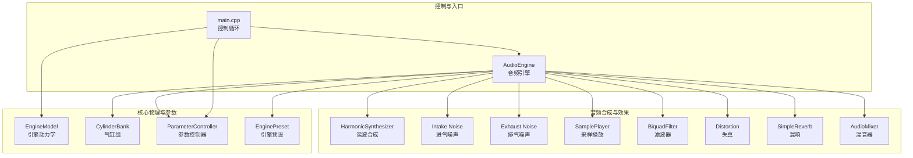
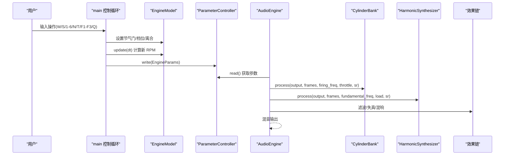
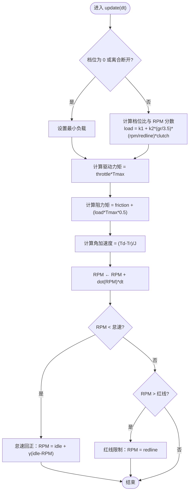
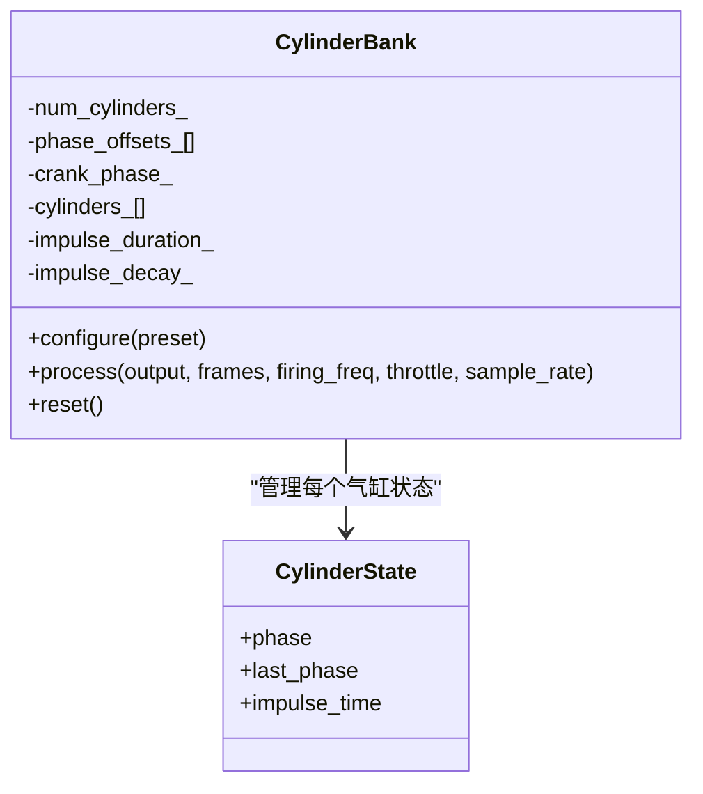
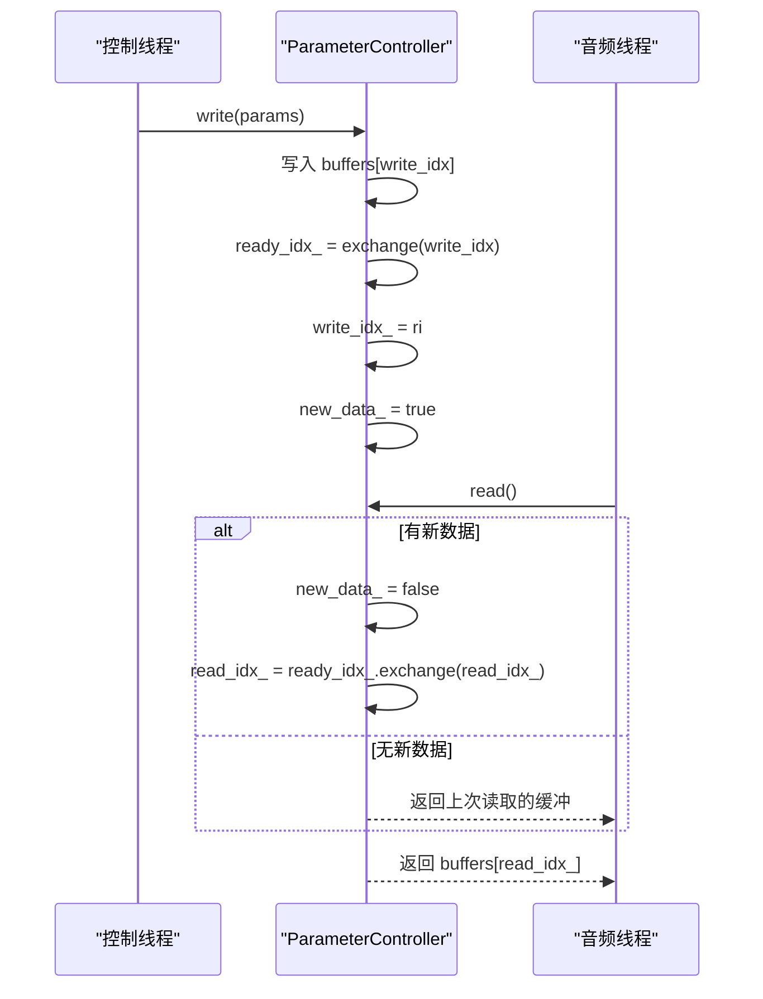
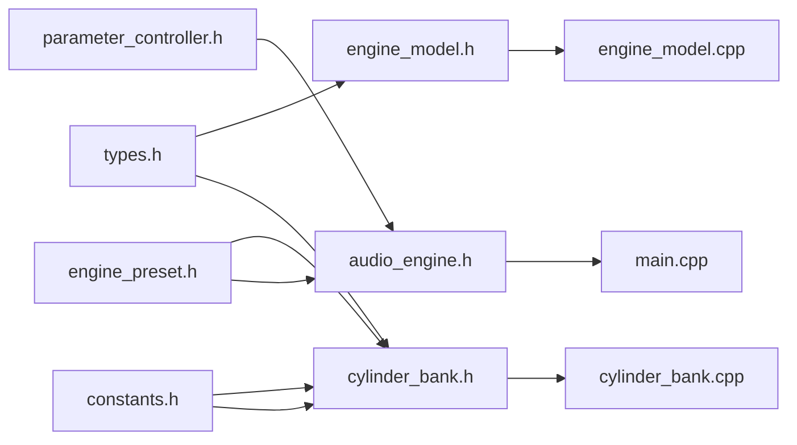

# 引擎物理建模系统

<cite>
**本文档引用的文件**
- [engine_model.h](file://src/core/engine_model.h)
- [engine_model.cpp](file://src/core/engine_model.cpp)
- [cylinder_bank.h](file://src/core/cylinder_bank.h)
- [cylinder_bank.cpp](file://src/core/cylinder_bank.cpp)
- [parameter_controller.h](file://src/core/parameter_controller.h)
- [types.h](file://src/core/types.h)
- [constants.h](file://src/core/constants.h)
- [engine_preset.h](file://src/presets/engine_preset.h)
- [preset_i4.cpp](file://src/presets/preset_i4.cpp)
- [preset_v8_cross.cpp](file://src/presets/preset_v8_cross.cpp)
- [audio_engine.h](file://src/audio/audio_engine.h)
- [main.cpp](file://src/main.cpp)
- [test_engine_model.cpp](file://tests/test_engine_model.cpp)
- [test_cylinder_bank.cpp](file://tests/test_cylinder_bank.cpp)
- [test_parameter_controller.cpp](file://tests/test_parameter_controller.cpp)
</cite>

## 目录
1. [简介](#简介)
2. [项目结构](#项目结构)
3. [核心组件](#核心组件)
4. [架构总览](#架构总览)
5. [详细组件分析](#详细组件分析)
6. [依赖关系分析](#依赖关系分析)
7. [性能考虑](#性能考虑)
8. [故障排除指南](#故障排除指南)
9. [结论](#结论)
10. [附录](#附录)

## 简介
本文件面向引擎物理建模系统，围绕以下目标展开：深入解释 EngineModel 类的设计原理（引擎动力学计算、转速控制、负载模拟）、CylinderBank 的工作机制（气缸触发时序、点火相位、压力波传播建模）、ParameterController 的线程安全参数传递机制（参数同步、状态管理、实时更新策略），并提供数学模型与算法实现说明、参数调优指南与性能优化技巧，以及与其他模块的集成方式与数据交换协议。

## 项目结构
该系统采用分层模块化设计：
- 核心物理与参数层：EngineModel、CylinderBank、ParameterController、EnginePreset
- 音频合成与效果层：HarmonicSynthesizer、NoiseGenerator、SamplePlayer、BiquadFilter、Distortion、SimpleReverb、AudioMixer
- 集成与入口：AudioEngine、main 控制循环
- 测试：针对各模块的行为验证

图表来源
- [main.cpp:89-239](file://src/main.cpp#L89-L239)
- [audio_engine.h:27-92](file://src/audio/audio_engine.h#L27-L92)
- [engine_model.h:7-48](file://src/core/engine_model.h#L7-L48)
- [cylinder_bank.h:9-41](file://src/core/cylinder_bank.h#L9-L41)
- [parameter_controller.h:20-61](file://src/core/parameter_controller.h#L20-L61)
- [engine_preset.h:8-55](file://src/presets/engine_preset.h#L8-L55)

章节来源
- [main.cpp:89-239](file://src/main.cpp#L89-L239)
- [audio_engine.h:27-92](file://src/audio/audio_engine.h#L27-L92)

## 核心组件
本节概述三个关键组件：EngineModel、CylinderBank、ParameterController，并给出它们在系统中的职责与交互。

- EngineModel：负责引擎动力学仿真，包括节气门驱动、摩擦与负载阻力、惯性效应、怠速与红线保护等。
- CylinderBank：基于气缸点火相位与时序生成原始“气缸脉冲”信号，作为声学建模的基础激励源。
- ParameterController：无锁三缓冲参数桥，实现控制线程写入、音频线程读取的高效参数传递。

章节来源
- [engine_model.h:7-48](file://src/core/engine_model.h#L7-L48)
- [engine_model.cpp:21-52](file://src/core/engine_model.cpp#L21-L52)
- [cylinder_bank.h:9-41](file://src/core/cylinder_bank.h#L9-L41)
- [cylinder_bank.cpp:28-78](file://src/core/cylinder_bank.cpp#L28-L78)
- [parameter_controller.h:20-61](file://src/core/parameter_controller.h#L20-L61)

## 架构总览
系统以“控制循环 + 音频回调”的双线程模式运行：
- 控制线程（main）：处理用户输入、更新 EngineModel、打包 EngineParams 并通过 ParameterController 发布到音频线程。
- 音频线程（AudioEngine::process_audio）：从 ParameterController 读取最新参数，驱动 CylinderBank、HarmonicSynthesizer、噪声与效果链路，最终混合输出。

图表来源
- [main.cpp:146-233](file://src/main.cpp#L146-L233)
- [engine_model.cpp:21-52](file://src/core/engine_model.cpp#L21-L52)
- [parameter_controller.h:32-50](file://src/core/parameter_controller.h#L32-L50)
- [audio_engine.h:83-88](file://src/audio/audio_engine.h#L83-L88)

## 详细组件分析

### EngineModel 设计与数学模型
EngineModel 实现了简化的二阶旋转机械系统模型，核心变量与关系如下：
- 状态变量：当前 RPM、节气门开度、档位、离合器状态、负载、惯量、摩擦系数、最大扭矩。
- 负载建模：根据档位比与当前 RPM 分数计算等效负载，Neutral 或离合分离时仅保留最小附件负载。
- 动力学：驱动力矩来自节气门开度与最大扭矩；阻力矩包含固定摩擦与与负载及 RPM 分数相关的比例项。
- 角加速度：由驱动力矩减去阻力矩后除以惯量得到角加速度，积分得到 RPM 变化。
- 怠速与红线：当低于怠速阈值时施加轻微回拉；超过红线时硬限幅。

数学公式要点（基于实现逻辑）：
- 驱动力矩：Td = throttle × T_max
- 阻力矩：Tr = friction + (k_load × gear_ratio) × T_max × α(load_rpm_frac)
- 角加速度：α = (Td − Tr) / J
- RPM 更新：RPM ← RPM + α × dt
- 怠速回正：若 RPM < idle，则 RPM ← idle + γ(idle − RPM)，γ ∈ (0,1)
- 红线限制：若 RPM > redline，则 RPM ← redline

图表来源
- [engine_model.cpp:21-52](file://src/core/engine_model.cpp#L21-L52)

章节来源
- [engine_model.h:28-45](file://src/core/engine_model.h#L28-L45)
- [engine_model.cpp:21-52](file://src/core/engine_model.cpp#L21-L52)

### CylinderBank 工作机制与点火时序建模
CylinderBank 将引擎的“点火事件”映射为采样域的瞬态脉冲，再叠加到输出缓冲区。其关键机制包括：
- 配置：从 EnginePreset 读取气缸数量与相位偏移数组，初始化每个气缸的状态。
- 触发检测：基于曲轴相位与气缸相位偏移，检测相位穿越零点（跨越 2π→0 包裹）时产生一次点火脉冲。
- 冲击函数：在脉冲激活期间使用半正弦包络乘以指数衰减，形成类似“压力波”的瞬态响应，其持续时间与衰减速率受节气门开度调制。
- 曲轴相位推进：每采样步长推进曲轴相位，确保多缸事件按相位顺序发生。

图表来源
- [cylinder_bank.h:9-41](file://src/core/cylinder_bank.h#L9-L41)
- [cylinder_bank.cpp:28-78](file://src/core/cylinder_bank.cpp#L28-L78)

章节来源
- [cylinder_bank.h:11-21](file://src/core/cylinder_bank.h#L11-L21)
- [cylinder_bank.cpp:28-78](file://src/core/cylinder_bank.cpp#L28-L78)
- [engine_preset.h:18-21](file://src/presets/engine_preset.h#L18-L21)

### ParameterController 线程安全参数传递
ParameterController 使用三缓冲无锁机制实现控制线程写入、音频线程读取：
- 结构：三个 EngineParams 缓冲区，配合 write_idx_/ready_idx_/read_idx_ 三个原子索引，以及 new_data_ 原子标志。
- 写入流程：写入当前 write_idx 缓冲，交换 ready 与 write，发布新版本，设置 new_data_。
- 读取流程：若 new_data_ 为真，交换 read 与 ready，完成缓冲切换，然后读取当前 read 缓冲。
- 同步语义：使用 release/acquire 语义保证写入可见性与读取一致性，避免伪共享与分配。

图表来源
- [parameter_controller.h:32-50](file://src/core/parameter_controller.h#L32-L50)

章节来源
- [parameter_controller.h:20-61](file://src/core/parameter_controller.h#L20-L61)

### 参数调优指南与性能优化
- EngineModel 参数
  - 情态：怠速与红线应与具体引擎预设匹配；惯量影响动态响应（大惯量更“顺滑”，小惯量更“敏感”）。
  - 负载：档位比与 RPM 分数共同决定负载大小；高转速高档位会显著增加负载。
  - 摩擦与最大扭矩：摩擦决定怠速稳定性与低速回正能力；T_max 决定加速潜力。
- CylinderBank 参数
  - 冲击持续时间与衰减：高节气门下缩短持续时间、加快衰减，使声音更“尖锐”；低节气门下延长与缓和，更“沉厚”。
  - 相位偏移：直接影响点火序列与听感（如 V8 交叉轴的“burble”特性）。
- ParameterController
  - 无锁读写：避免锁竞争，适合高频参数更新；注意不要在音频线程中做昂贵操作。
- 性能优化
  - 控制循环固定频率（示例为约 60Hz），确保 EngineModel dt 稳定。
  - 预先配置 EnginePreset，减少运行时切换成本。
  - 在音频回调内尽量避免动态分配与复杂分支判断。

章节来源
- [engine_model.cpp:21-52](file://src/core/engine_model.cpp#L21-L52)
- [cylinder_bank.cpp:37-41](file://src/core/cylinder_bank.cpp#L37-L41)
- [main.cpp:144-233](file://src/main.cpp#L144-L233)

## 依赖关系分析
- EngineModel 依赖常量与类型定义，用于物理参数与数值稳定。
- CylinderBank 依赖 EnginePreset 提供的相位与气缸数，以及常量定义。
- ParameterController 依赖原子类型进行无锁同步。
- AudioEngine 组合多个子模块，协调参数与信号流。
- main 控制循环连接 EngineModel 与 AudioEngine，通过 ParameterController 传递参数。

图表来源
- [engine_model.h:3](file://src/core/engine_model.h#L3)
- [cylinder_bank.h:3-5](file://src/core/cylinder_bank.h#L3-L5)
- [parameter_controller.h:3](file://src/core/parameter_controller.h#L3)
- [audio_engine.h:3-16](file://src/audio/audio_engine.h#L3-L16)
- [main.cpp:1-4](file://src/main.cpp#L1-L4)

章节来源
- [engine_model.h:3](file://src/core/engine_model.h#L3)
- [cylinder_bank.h:3-5](file://src/core/cylinder_bank.h#L3-L5)
- [parameter_controller.h:3](file://src/core/parameter_controller.h#L3)
- [audio_engine.h:3-16](file://src/audio/audio_engine.h#L3-L16)
- [main.cpp:1-4](file://src/main.cpp#L1-L4)

## 性能考虑
- 固定控制频率：控制循环以约 60Hz 运行，保证 EngineModel dt 稳定，避免数值不稳定。
- 无锁参数桥：ParameterController 三缓冲避免锁竞争，适合高频参数更新场景。
- 预设加载：在 AudioEngine 中缓存当前预设指针，音频线程本地复制以降低跨线程访问成本。
- 缓冲复用：AudioEngine 内部使用静态临时缓冲，减少堆分配与内存抖动。
- 算法复杂度：EngineModel 与 CylinderBank 均为 O(N)（N 为帧数或气缸数），满足实时要求。

章节来源
- [main.cpp:144-233](file://src/main.cpp#L144-L233)
- [parameter_controller.h:20-61](file://src/core/parameter_controller.h#L20-L61)
- [audio_engine.h:71-82](file://src/audio/audio_engine.h#L71-L82)

## 故障排除指南
- EngineModel 行为验证
  - 怠速范围：长时间仿真后 RPM 应稳定在怠速附近。
  - 加速响应：全油门空档应使 RPM 上升。
  - 红线限制：超过红线应被限制。
  - 档位负载：高挡位在相同 RPM 下应产生更大负载。
- CylinderBank 行为验证
  - 输出非零：不同引擎预设（I4/V8）应产生可感知的输出峰值。
  - 节气门增益：高节气门应产生更高能量输出（RMS 更大）。
- ParameterController 行为验证
  - 初始状态：读取初始参数符合默认值。
  - 写读一致性：写入后读取应一致；并发读写不应出现撕裂读取。
  - 并发稳定性：在高频率读写下仍保持数据一致性。

章节来源
- [test_engine_model.cpp:8-75](file://tests/test_engine_model.cpp#L8-L75)
- [test_cylinder_bank.cpp:10-83](file://tests/test_cylinder_bank.cpp#L10-L83)
- [test_parameter_controller.cpp:10-94](file://tests/test_parameter_controller.cpp#L10-L94)

## 结论
本引擎物理建模系统以简洁而稳健的数学模型实现了引擎动力学与声学激励的耦合：EngineModel 提供稳定的 RPM 与负载演化，CylinderBank 将点火事件转换为可听的瞬态脉冲，ParameterController 保障控制与音频线程间高效、无锁的参数同步。通过合理的参数调优与性能优化策略，系统可在实时音频渲染中提供逼真的引擎声学体验。

## 附录

### 数据交换协议与集成要点
- 控制线程向音频线程传递 EngineParams（RPM、节气门、档位、离合、涡轮开关、预设 ID）。
- 音频线程从 AudioEngine 获取参数并驱动 CylinderBank、HarmonicSynthesizer、噪声与效果链。
- 预设 EnginePreset 提供气缸数、相位偏移、谐波谱、滤波与噪声参数，统一管理不同引擎风格。

章节来源
- [main.cpp:206-214](file://src/main.cpp#L206-L214)
- [audio_engine.h:37-47](file://src/audio/audio_engine.h#L37-L47)
- [engine_preset.h:8-55](file://src/presets/engine_preset.h#L8-L55)