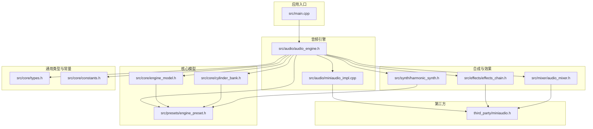
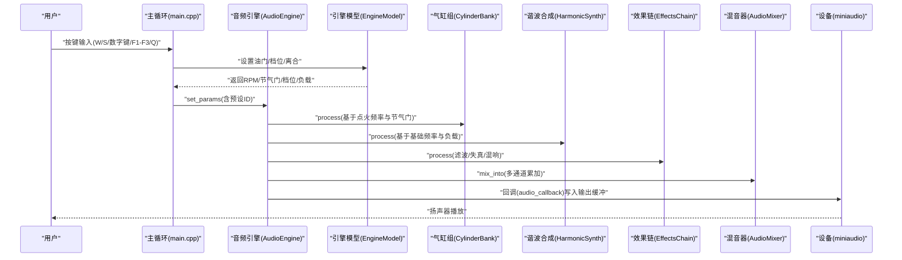
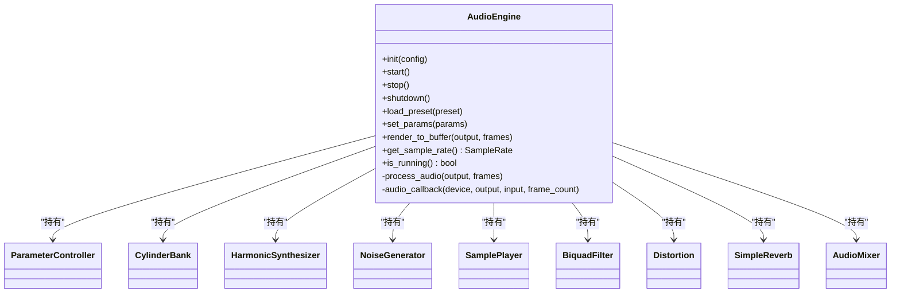
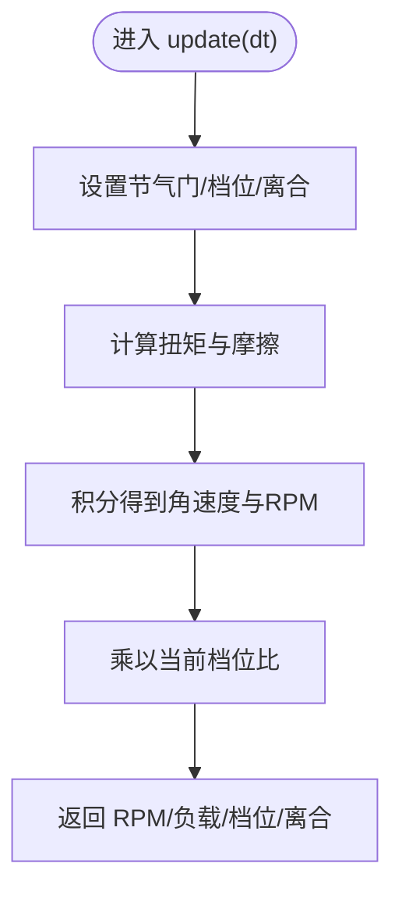
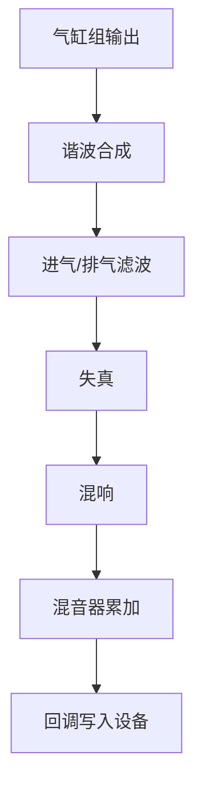

# 快速开始

<cite>
**本文引用的文件**
- [meson_options.txt](file://meson_options.txt)
- [main.cpp](file://src/main.cpp)
- [audio_engine.h](file://src/audio/audio_engine.h)
- [engine_model.h](file://src/core/engine_model.h)
- [types.h](file://src/core/types.h)
- [constants.h](file://src/core/constants.h)
- [engine_preset.h](file://src/presets/engine_preset.h)
- [harmonic_synth.h](file://src/synth/harmonic_synth.h)
- [effects_chain.h](file://src/effects/effects_chain.h)
- [cylinder_bank.h](file://src/core/cylinder_bank.h)
- [audio_mixer.h](file://src/mixer/audio_mixer.h)
- [miniaudio_impl.cpp](file://src/audio/miniaudio_impl.cpp)
- [.gitignore](file://.gitignore)
- [miniaudio.h](file://third_party/miniaudio.h)
</cite>

## 目录
1. [简介](#简介)
2. [项目结构](#项目结构)
3. [核心组件](#核心组件)
4. [架构总览](#架构总览)
5. [详细组件分析](#详细组件分析)
6. [依赖与安装](#依赖与安装)
7. [构建与编译](#构建与编译)
8. [运行示例](#运行示例)
9. [控制台界面与操作](#控制台界面与操作)
10. [性能优化与系统兼容性](#性能优化与系统兼容性)
11. [故障排除](#故障排除)
12. [结论](#结论)

## 简介
本指南面向首次接触赛车声音引擎的开发者与爱好者，帮助你在约 30 分钟内完成从克隆到运行第一个实例的全流程。你将学会：
- 安装系统要求与依赖（miniaudio、CMake 或 Meson）
- 配置构建环境与编译选项
- 成功运行演示程序并体验控制台交互
- 了解关键模块与音频管线的工作原理
- 排查常见问题并进行性能优化

## 项目结构
该仓库采用按功能域分层的组织方式：核心物理模型、合成器、效果链、混音器与音频引擎封装，以及预设数据与测试用例。顶层通过 Meson 进行构建配置。

图表来源
- [main.cpp:1-239](file://src/main.cpp#L1-L239)
- [audio_engine.h:1-92](file://src/audio/audio_engine.h#L1-L92)
- [miniaudio_impl.cpp:1-5](file://src/audio/miniaudio_impl.cpp#L1-L5)
- [engine_model.h:1-48](file://src/core/engine_model.h#L1-L48)
- [cylinder_bank.h:1-41](file://src/core/cylinder_bank.h#L1-L41)
- [harmonic_synth.h:1-28](file://src/synth/harmonic_synth.h#L1-L28)
- [effects_chain.h:1-24](file://src/effects/effects_chain.h#L1-L24)
- [audio_mixer.h:1-37](file://src/mixer/audio_mixer.h#L1-L37)
- [engine_preset.h:1-55](file://src/presets/engine_preset.h#L1-L55)
- [types.h:1-12](file://src/core/types.h#L1-L12)
- [constants.h:1-20](file://src/core/constants.h#L1-L20)
- [miniaudio.h:1-200](file://third_party/miniaudio.h#L1-L200)

章节来源
- [main.cpp:1-239](file://src/main.cpp#L1-L239)
- [audio_engine.h:1-92](file://src/audio/audio_engine.h#L1-L92)
- [engine_model.h:1-48](file://src/core/engine_model.h#L1-L48)
- [cylinder_bank.h:1-41](file://src/core/cylinder_bank.h#L1-L41)
- [harmonic_synth.h:1-28](file://src/synth/harmonic_synth.h#L1-L28)
- [effects_chain.h:1-24](file://src/effects/effects_chain.h#L1-L24)
- [audio_mixer.h:1-37](file://src/mixer/audio_mixer.h#L1-L37)
- [engine_preset.h:1-55](file://src/presets/engine_preset.h#L1-L55)
- [types.h:1-12](file://src/core/types.h#L1-L12)
- [constants.h:1-20](file://src/core/constants.h#L1-L20)
- [miniaudio.h:1-200](file://third_party/miniaudio.h#L1-L200)

## 核心组件
- 应用入口与控制循环：负责初始化音频设备、加载默认预设、驱动引擎物理模型、接收输入并渲染状态显示。
- 音频引擎：封装 miniaudio 设备回调、参数控制器、气缸组、谐波合成器、噪声生成器、采样播放器、滤波器、失真、混响与混音器。
- 物理模型：根据油门、档位、离合状态计算转速、负载等参数。
- 合成与效果：基于预设的谐波谱、共振频率与带宽生成声学特征，并通过滤波、失真与混响塑造最终音色。
- 混音器：多通道累加与输出渲染。

章节来源
- [main.cpp:89-238](file://src/main.cpp#L89-L238)
- [audio_engine.h:27-89](file://src/audio/audio_engine.h#L27-L89)
- [engine_model.h:7-45](file://src/core/engine_model.h#L7-L45)
- [harmonic_synth.h:8-25](file://src/synth/harmonic_synth.h#L8-L25)
- [effects_chain.h:8-21](file://src/effects/effects_chain.h#L8-L21)
- [audio_mixer.h:9-34](file://src/mixer/audio_mixer.h#L9-L34)

## 架构总览
下图展示了从用户输入到音频输出的关键路径：控制线程更新引擎状态，音频线程在回调中合成与处理，最终写入系统音频设备。

图表来源
- [main.cpp:146-233](file://src/main.cpp#L146-L233)
- [audio_engine.h:83-88](file://src/audio/audio_engine.h#L83-L88)
- [engine_model.h:15-22](file://src/core/engine_model.h#L15-L22)
- [cylinder_bank.h:18-19](file://src/core/cylinder_bank.h#L18-L19)
- [harmonic_synth.h:16-17](file://src/synth/harmonic_synth.h#L16-L17)
- [effects_chain.h:15-16](file://src/effects/effects_chain.h#L15-L16)
- [audio_mixer.h:17-20](file://src/mixer/audio_mixer.h#L17-L20)
- [miniaudio.h:60-87](file://third_party/miniaudio.h#L60-L87)

## 详细组件分析

### 音频引擎类关系

图表来源
- [audio_engine.h:27-89](file://src/audio/audio_engine.h#L27-L89)

章节来源
- [audio_engine.h:27-89](file://src/audio/audio_engine.h#L27-L89)

### 引擎物理模型
- 输入：油门（0~1）、档位（0=空档，1~6）、离合（0~1）
- 输出：当前 RPM、节气门、负载、档位、离合
- 关键参数：怠速、红线、惯量、摩擦、最大扭矩、档位比

图表来源
- [engine_model.h:15-44](file://src/core/engine_model.h#L15-L44)

章节来源
- [engine_model.h:7-45](file://src/core/engine_model.h#L7-L45)

### 合成与效果链
- 气缸组：根据预设相位与点火频率生成原始脉冲信号
- 谐波合成：基于预设谐波幅度叠加生成基础音色
- 效果链：串联滤波、失真、混响等处理
- 混音器：多通道累加并输出

图表来源
- [cylinder_bank.h:18-19](file://src/core/cylinder_bank.h#L18-L19)
- [harmonic_synth.h:16-17](file://src/synth/harmonic_synth.h#L16-L17)
- [effects_chain.h:15-16](file://src/effects/effects_chain.h#L15-L16)
- [audio_mixer.h:17-20](file://src/mixer/audio_mixer.h#L17-L20)

章节来源
- [cylinder_bank.h:9-38](file://src/core/cylinder_bank.h#L9-L38)
- [harmonic_synth.h:8-25](file://src/synth/harmonic_synth.h#L8-L25)
- [effects_chain.h:8-21](file://src/effects/effects_chain.h#L8-L21)
- [audio_mixer.h:9-34](file://src/mixer/audio_mixer.h#L9-L34)

## 依赖与安装

### 系统要求
- 支持平台：Windows、Linux、macOS（由 miniaudio 提供跨平台音频后端）
- 编译器：支持 C++17 的编译器（如 GCC、Clang、MSVC）
- 构建工具：Meson（推荐）或 CMake（仓库未提供 CMakeLists）

### 依赖项
- miniaudio：作为音频设备与回调的底层库，已以内联实现形式提供单一翻译单元。
- 第三方头文件：miniaudio.h 已随仓库提供。

章节来源
- [miniaudio_impl.cpp:1-5](file://src/audio/miniaudio_impl.cpp#L1-L5)
- [miniaudio.h:1-200](file://third_party/miniaudio.h#L1-L200)

## 构建与编译

### 使用 Meson（推荐）
1) 准备
- 安装 Meson 与 Python（用于 Meson）
- 安装构建所需工具链（Windows: MSVC 或 MinGW；Linux: GCC；macOS: Xcode/Clang）

2) 配置
- 创建构建目录并配置：在仓库根目录执行
  - meson setup builddir --buildtype=release
- 可选：修改默认采样率与缓冲帧数
  - meson configure builddir -Dsample_rate=48000 -Dbuffer_frames=512

3) 编译
- meson compile -C builddir

4) 产物
- 可执行文件位于 builddir/src/racing_sound_engine.exe（Windows）或 builddir/src/racing_sound_engine（Linux/macOS）

章节来源
- [meson_options.txt:1-5](file://meson_options.txt#L1-L5)
- [.gitignore:1-54](file://.gitignore#L1-L54)

### 使用 CMake（可选）
- 若你更偏爱 CMake，可在仓库根目录新建 build 目录并执行：
  - cmake -S . -B build -DCMAKE_BUILD_TYPE=Release
  - cmake --build build --config Release
- 注意：仓库未提供 CMake 配置文件，请自行创建或参考 Meson 配置映射。

## 运行示例

### 启动程序
- 在构建目录执行：
  - Windows: builddir/src/racing_sound_engine.exe
  - Linux/macOS: builddir/src/racing_sound_engine

### 初始状态
- 默认加载“V8 Cross-Plane”预设
- 音频设备初始化成功后，控制台打印采样率与缓冲帧数
- 默认预设参数已载入引擎模型

章节来源
- [main.cpp:104-132](file://src/main.cpp#L104-L132)
- [main.cpp:115-122](file://src/main.cpp#L115-L122)

## 控制台界面与操作

### 键盘控制
- W / 上箭头：油门增加
- S / 下箭头：油门减少
- 1~6：挂入对应档位
- N：空档
- T：切换涡轮增压
- F1：加载 Inline-4 预设
- F2：加载 V8 Cross-Plane 预设
- F3：加载 V8 Flat-Plane 预设
- Q / ESC：退出

### 实时状态显示
- 显示内容：RPM、档位、节气门百分比、负载、涡轮状态、当前预设名称
- 更新频率：约 60Hz

章节来源
- [main.cpp:93-102](file://src/main.cpp#L93-L102)
- [main.cpp:152-194](file://src/main.cpp#L152-L194)
- [main.cpp:217-225](file://src/main.cpp#L217-L225)

## 性能优化与系统兼容性

### 性能要点
- 降低缓冲帧数可减少延迟但提高 CPU 占用；增大缓冲帧数可提升稳定性但增加延迟
- 合理选择采样率（默认 48kHz）以平衡音质与性能
- 在高负载场景下，适当减少混响与滤波器数量可降低开销
- 使用 Release 构建类型获得更好的优化

### 系统兼容性
- Windows：支持 Win32 控制台输入与扩展键处理
- Linux/macOS：使用非阻塞终端模式读取输入
- 设备兼容：由 miniaudio 自动选择最佳音频后端（WASAPI/DirectSound/AudioUnit/OpenSL ES 等）

章节来源
- [main.cpp:11-18](file://src/main.cpp#L11-L18)
- [main.cpp:22-52](file://src/main.cpp#L22-L52)
- [main.cpp:144-145](file://src/main.cpp#L144-L145)
- [miniaudio.h:1-200](file://third_party/miniaudio.h#L1-L200)

## 故障排除

### 常见编译错误与解决
- 找不到 Meson
  - 解决：安装 Meson 并确保其在 PATH 中
- 未找到 C++ 编译器
  - 解决：安装 GCC/Clang/MSVC 并正确配置开发环境
- 无法链接 miniaudio
  - 解决：确认已包含 miniaudio_impl.cpp（仓库已提供），避免重复定义
- 未生成可执行文件
  - 解决：检查 Meson 配置是否启用构建演示程序（默认开启）

### 运行时问题
- 无法初始化音频设备
  - 检查系统音频驱动与权限；尝试切换默认播放设备
- 控制台无输入响应
  - Windows：确认使用控制台窗口；某些 IDE 控制台可能不支持扩展键
  - Linux/macOS：确保标准输入可用且非阻塞模式未被其他进程占用

章节来源
- [main.cpp:110-113](file://src/main.cpp#L110-L113)
- [main.cpp:54-81](file://src/main.cpp#L54-L81)
- [miniaudio.h:1-200](file://third_party/miniaudio.h#L1-L200)

## 结论
通过本指南，你已经完成了赛车声音引擎的环境准备、构建与运行，并掌握了控制台交互方式。建议进一步探索预设切换、参数调节与自定义效果链，以获得更丰富的听觉体验。