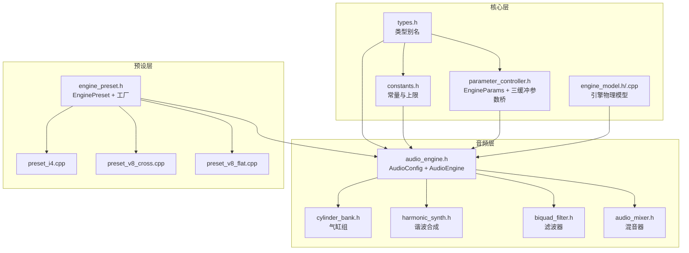
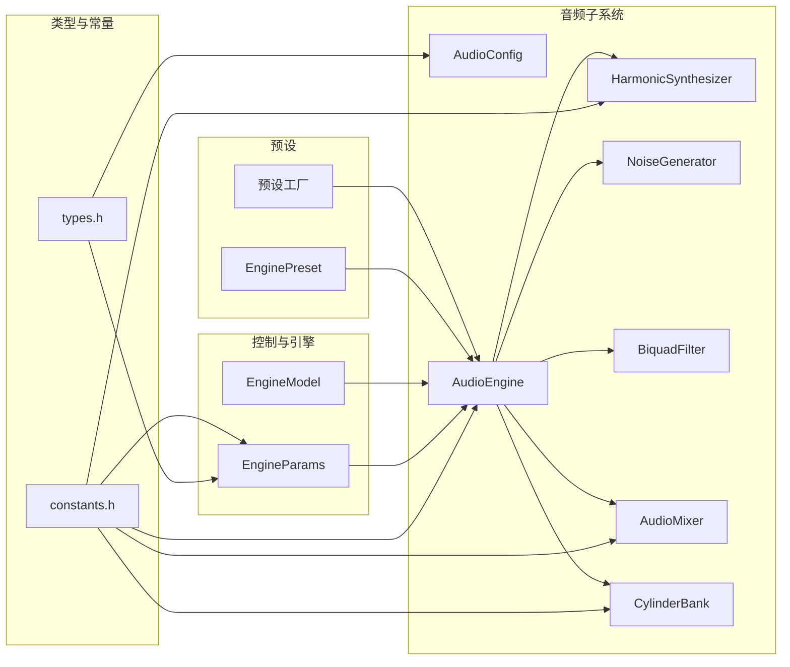
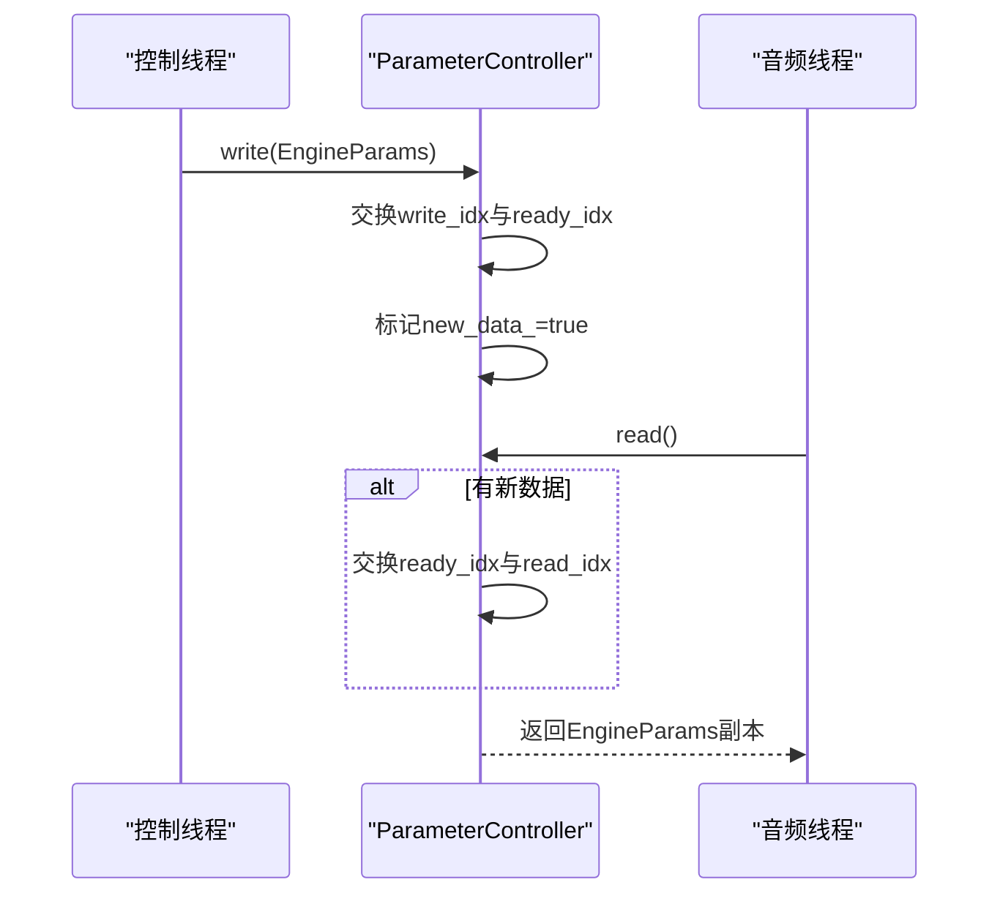
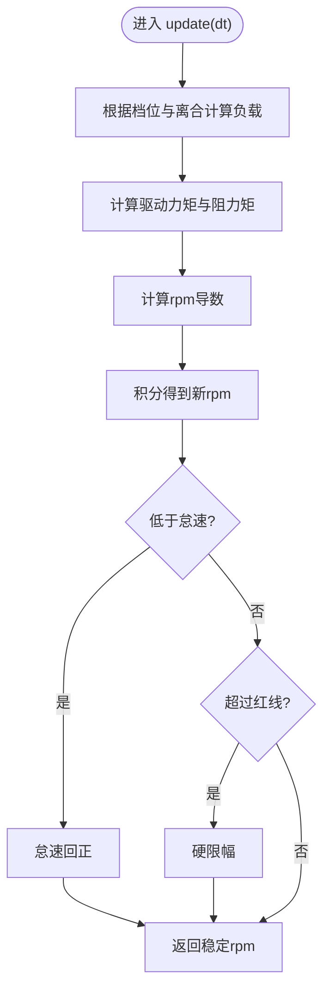
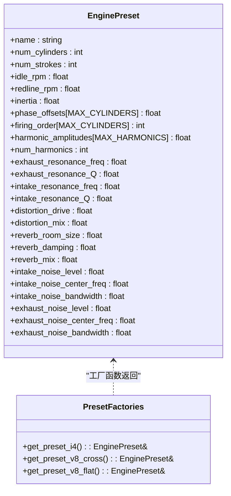
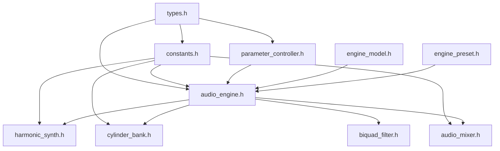

# 数据类型和常量系统

<cite>
**本文档引用的文件**
- [types.h](file://src/core/types.h)
- [constants.h](file://src/core/constants.h)
- [parameter_controller.h](file://src/core/parameter_controller.h)
- [engine_model.h](file://src/core/engine_model.h)
- [engine_model.cpp](file://src/core/engine_model.cpp)
- [engine_preset.h](file://src/presets/engine_preset.h)
- [preset_i4.cpp](file://src/presets/preset_i4.cpp)
- [preset_v8_cross.cpp](file://src/presets/preset_v8_cross.cpp)
- [preset_v8_flat.cpp](file://src/presets/preset_v8_flat.cpp)
- [audio_engine.h](file://src/audio/audio_engine.h)
- [biquad_filter.h](file://src/effects/biquad_filter.h)
- [audio_mixer.h](file://src/mixer/audio_mixer.h)
- [cylinder_bank.h](file://src/core/cylinder_bank.h)
- [harmonic_synth.h](file://src/synth/harmonic_synth.h)
- [main.cpp](file://src/main.cpp)
- [meson_options.txt](file://meson_options.txt)
</cite>

## 目录
1. [简介](#简介)
2. [项目结构](#项目结构)
3. [核心组件](#核心组件)
4. [架构总览](#架构总览)
5. [详细组件分析](#详细组件分析)
6. [依赖关系分析](#依赖关系分析)
7. [性能考量](#性能考量)
8. [故障排除指南](#故障排除指南)
9. [结论](#结论)
10. [附录](#附录)

## 简介
本文件为赛车声音引擎的数据类型与常量系统的权威参考，覆盖以下主题：
- 核心数据类型别名与模板基础（Sample、FrameCount、SampleRate）
- 常量系统：物理常数、音频默认参数、系统上限与限制
- 参数结构体：EngineParams（控制线程）与AudioConfig（音频线程）
- 枚举类型：滤波器类型等
- 预设系统：EnginePreset 及其工厂函数
- 安全性与边界检查：数值范围约束、原子参数桥接、缓冲区大小限制
- 设计原则与扩展方法：类型安全、无锁参数传递、可配置采样率与缓冲区
- 最佳实践与常见陷阱：参数更新节奏、线程模型、预设切换策略
- 完整API参考与使用示例路径

## 项目结构
该系统围绕“核心类型与常量”“参数与引擎模型”“合成与效果链”“混音器”“预设”五大模块组织，采用分层设计与清晰的头文件接口，确保跨模块复用与编译隔离。

**图表来源**
- [types.h:1-12](file://src/core/types.h#L1-L12)
- [constants.h:1-20](file://src/core/constants.h#L1-L20)
- [parameter_controller.h:1-61](file://src/core/parameter_controller.h#L1-L61)
- [engine_model.h:1-48](file://src/core/engine_model.h#L1-L48)
- [engine_model.cpp:1-54](file://src/core/engine_model.cpp#L1-L54)
- [audio_engine.h:1-92](file://src/audio/audio_engine.h#L1-L92)
- [cylinder_bank.h:1-41](file://src/core/cylinder_bank.h#L1-L41)
- [harmonic_synth.h:1-28](file://src/synth/harmonic_synth.h#L1-L28)
- [biquad_filter.h:1-45](file://src/effects/biquad_filter.h#L1-L45)
- [audio_mixer.h:1-37](file://src/mixer/audio_mixer.h#L1-L37)
- [engine_preset.h:1-55](file://src/presets/engine_preset.h#L1-L55)
- [preset_i4.cpp:1-59](file://src/presets/preset_i4.cpp#L1-L59)
- [preset_v8_cross.cpp:1-66](file://src/presets/preset_v8_cross.cpp#L1-L66)
- [preset_v8_flat.cpp:1-65](file://src/presets/preset_v8_flat.cpp#L1-L65)

**章节来源**
- [types.h:1-12](file://src/core/types.h#L1-L12)
- [constants.h:1-20](file://src/core/constants.h#L1-L20)
- [audio_engine.h:1-92](file://src/audio/audio_engine.h#L1-L92)

## 核心组件
本节聚焦于数据类型与常量的定义与职责。

- 类型别名
  - Sample：单样本浮点表示，统一采样域数据类型
  - FrameCount：帧计数，用于音频处理块长度
  - SampleRate：采样率，单位Hz
  - 作用：避免裸整型/浮点在接口中滥用，提升可读性与类型安全

- 常量系统
  - 数学常量：π、2π
  - 系统上限：最大气缸数、最大谐波数、最大声部数、最大混音通道、最大效果数、触发队列大小
  - 默认参数：默认采样率、默认缓冲帧数
  - 作用：集中管理全局限制与默认值，便于构建期与运行时一致性

- 参数结构体
  - EngineParams：控制线程参数（rpm、油门、档位、离合、涡轮、预设ID），用于驱动引擎物理模型与音频合成
  - AudioConfig：音频线程配置（采样率、缓冲帧数），由AudioEngine初始化使用

- 枚举类型
  - FilterType：滤波器类型集合（低通、高通、带通、陷波、峰值、低shelf、高shelf）

**章节来源**
- [types.h:1-12](file://src/core/types.h#L1-L12)
- [constants.h:1-20](file://src/core/constants.h#L1-L20)
- [parameter_controller.h:9-16](file://src/core/parameter_controller.h#L9-L16)
- [audio_engine.h:22-25](file://src/audio/audio_engine.h#L22-L25)
- [biquad_filter.h:7-15](file://src/effects/biquad_filter.h#L7-L15)

## 架构总览
下图展示类型与常量在系统中的分布与交互，强调“核心类型/常量”作为上层模块的基石。

**图表来源**
- [types.h:7-9](file://src/core/types.h#L7-L9)
- [constants.h:8-17](file://src/core/constants.h#L8-L17)
- [parameter_controller.h:9-16](file://src/core/parameter_controller.h#L9-L16)
- [engine_model.h:7-45](file://src/core/engine_model.h#L7-L45)
- [audio_engine.h:22-89](file://src/audio/audio_engine.h#L22-L89)
- [harmonic_synth.h:8-25](file://src/synth/harmonic_synth.h#L8-L25)
- [audio_mixer.h:9-34](file://src/mixer/audio_mixer.h#L9-L34)
- [cylinder_bank.h:9-38](file://src/core/cylinder_bank.h#L9-L38)
- [engine_preset.h:8-47](file://src/presets/engine_preset.h#L8-L47)

## 详细组件分析

### 类型与常量系统
- 类型别名
  - 使用统一的别名封装底层数值类型，避免误用与二义性
  - 示例路径：[类型别名定义:7-9](file://src/core/types.h#L7-L9)
- 常量与上限
  - 数学常量：π、2π，供三角函数与相位计算使用
  - 系统上限：气缸、谐波、声部、混音通道、效果数等，保障静态数组与固定缓冲区的容量
  - 默认参数：采样率与缓冲帧数，影响实时处理延迟与CPU占用
  - 示例路径：[常量定义:8-17](file://src/core/constants.h#L8-L17)
- 设计原则
  - 内联常量（constexpr/inline）减少符号与调用开销
  - 上限集中管理，便于重构与测试覆盖
  - 默认值来自构建选项，支持灵活部署

**章节来源**
- [types.h:1-12](file://src/core/types.h#L1-L12)
- [constants.h:1-20](file://src/core/constants.h#L1-L20)
- [meson_options.txt:1-3](file://meson_options.txt#L1-L3)

### 参数结构与无锁桥接
- EngineParams
  - 字段：rpm、throttle、gear、clutch、turbo_enabled、preset_id
  - 语义：控制线程驱动引擎行为；需在固定频率更新
  - 示例路径：[参数结构定义:9-16](file://src/core/parameter_controller.h#L9-L16)
- ParameterController（三缓冲无锁桥）
  - 三个环形缓冲，控制线程写入，音频线程读取
  - 通过原子索引交换实现发布/订阅，避免锁与分配
  - 读取时按需交换ready/read索引，确保最新参数可见
  - 示例路径：[参数桥实现:20-58](file://src/core/parameter_controller.h#L20-L58)
- 安全性与边界检查
  - 控制线程写入前，参数值应进行范围约束（如油门0~1、档位0~6）
  - 音频线程读取后立即应用，避免跨线程竞态
  - 示例路径：[参数桥读取流程:42-50](file://src/core/parameter_controller.h#L42-L50)

**图表来源**
- [parameter_controller.h:33-50](file://src/core/parameter_controller.h#L33-L50)

**章节来源**
- [parameter_controller.h:1-61](file://src/core/parameter_controller.h#L1-L61)

### 引擎物理模型与边界约束
- EngineModel
  - 输入：throttle、gear、clutch
  - 输出：当前rpm、负载load、档位gear、离合clutch
  - 关键特性：齿轮比映射、摩擦与最大扭矩建模、怠速回正与红线限制
  - 示例路径：[模型声明:7-45](file://src/core/engine_model.h#L7-L45)
- 边界检查与稳定性
  - 油门、离合使用范围约束
  - RPM在怠速与红线之间钳制
  - 负载随档位与转速比例变化
  - 示例路径：[更新逻辑与钳制:9-52](file://src/core/engine_model.cpp#L9-L52)

**图表来源**
- [engine_model.cpp:21-52](file://src/core/engine_model.cpp#L21-L52)

**章节来源**
- [engine_model.h:1-48](file://src/core/engine_model.h#L1-L48)
- [engine_model.cpp:1-54](file://src/core/engine_model.cpp#L1-L54)

### 预设系统与模板化参数
- EnginePreset
  - 结构：名称、气缸数/冲程、怠速/红线、惯量、点火相位/顺序、谐波幅度、滤波器参数、效果参数、噪声参数
  - 作用：将不同发动机类型的声音特征封装为可加载模板
  - 示例路径：[预设结构定义:8-47](file://src/presets/engine_preset.h#L8-L47)
- 预设工厂
  - 提供三种典型预设：I4、V8交叉轴、V8平面轴
  - 每个预设定义独特的点火相位、谐波分布、滤波与噪声特征
  - 示例路径：[I4预设:5-56](file://src/presets/preset_i4.cpp#L5-L56)、[V8交叉轴:5-63](file://src/presets/preset_v8_cross.cpp#L5-L63)、[V8平面轴:5-62](file://src/presets/preset_v8_flat.cpp#L5-L62)
- 使用方式
  - 控制线程选择预设并调用加载接口
  - 同步更新引擎模型的怠速、红线、惯量等关键参数
  - 示例路径：[主程序中的预设切换:169-189](file://src/main.cpp#L169-L189)

**图表来源**
- [engine_preset.h:8-53](file://src/presets/engine_preset.h#L8-L53)
- [preset_i4.cpp:5-56](file://src/presets/preset_i4.cpp#L5-L56)
- [preset_v8_cross.cpp:5-63](file://src/presets/preset_v8_cross.cpp#L5-L63)
- [preset_v8_flat.cpp:5-62](file://src/presets/preset_v8_flat.cpp#L5-L62)

**章节来源**
- [engine_preset.h:1-55](file://src/presets/engine_preset.h#L1-L55)
- [preset_i4.cpp:1-59](file://src/presets/preset_i4.cpp#L1-L59)
- [preset_v8_cross.cpp:1-66](file://src/presets/preset_v8_cross.cpp#L1-L66)
- [preset_v8_flat.cpp:1-65](file://src/presets/preset_v8_flat.cpp#L1-L65)
- [main.cpp:169-189](file://src/main.cpp#L169-L189)

### 音频引擎与配置
- AudioConfig
  - 字段：采样率、缓冲帧数
  - 默认值来自常量，可通过构造函数覆盖
  - 示例路径：[配置结构:22-25](file://src/audio/audio_engine.h#L22-L25)
- AudioEngine
  - 子模块：参数控制器、气缸组、谐波合成、进排气噪声、样本播放、滤波器、失真、混响、混音器
  - 缓冲区：多路临时缓冲，大小受常量限制
  - 示例路径：[类声明与成员:27-89](file://src/audio/audio_engine.h#L27-L89)
- 安全性
  - 原子标志位表示运行状态
  - 原子指针持有当前预设，音频线程本地缓存以避免频繁原子访问
  - 示例路径：[运行状态与预设原子字段:46-74](file://src/audio/audio_engine.h#L46-L74)

**章节来源**
- [audio_engine.h:1-92](file://src/audio/audio_engine.h#L1-L92)
- [constants.h:15-17](file://src/core/constants.h#L15-L17)

### 效果器与滤波器
- BiquadFilter
  - 接口：设置参数（类型、频率、Q、增益、采样率）、处理、重置
  - 实现：直接形式II转置双二阶滤波器
  - 示例路径：[滤波器接口与实现:25-42](file://src/effects/biquad_filter.h#L25-L42)
- 枚举类型
  - FilterType：明确的滤波类型集合，避免魔法字符串
  - 示例路径：[滤波器类型枚举:7-15](file://src/effects/biquad_filter.h#L7-L15)

**章节来源**
- [biquad_filter.h:1-45](file://src/effects/biquad_filter.h#L1-L45)

### 混音器与缓冲区
- AudioMixer
  - 功能：通道增益、静音控制、累加到通道缓冲、渲染输出并清空
  - 限制：通道数上限、每通道缓冲大小上限
  - 示例路径：[混音器接口:9-34](file://src/mixer/audio_mixer.h#L9-L34)
- 安全性
  - 固定大小缓冲避免动态分配
  - 渲染后自动清空通道缓冲，防止泄漏

**章节来源**
- [audio_mixer.h:1-37](file://src/mixer/audio_mixer.h#L1-L37)

### 合成与噪声
- CylinderBank
  - 功能：基于预设的点火相位与顺序生成气缸脉冲信号
  - 限制：最大气缸数
  - 示例路径：[气缸组接口:9-38](file://src/core/cylinder_bank.h#L9-L38)
- HarmonicSynthesizer
  - 功能：基于谐波幅度与相位合成复合音色
  - 限制：最大谐波数
  - 示例路径：[谐波合成器接口:8-25](file://src/synth/harmonic_synth.h#L8-L25)

**章节来源**
- [cylinder_bank.h:1-41](file://src/core/cylinder_bank.h#L1-L41)
- [harmonic_synth.h:1-28](file://src/synth/harmonic_synth.h#L1-L28)

## 依赖关系分析
- 模块耦合
  - 所有模块依赖核心类型与常量，形成稳定的基础设施层
  - 参数桥接仅依赖类型与原子操作，不引入额外依赖
  - 预设独立于具体合成实现，便于替换与扩展
- 外部依赖
  - 音频后端通过单一编译单元链接实现，头文件仅声明
  - 构建选项提供采样率与缓冲区大小的可配置入口

**图表来源**
- [types.h:1-12](file://src/core/types.h#L1-L12)
- [constants.h:1-20](file://src/core/constants.h#L1-L20)
- [parameter_controller.h:1-61](file://src/core/parameter_controller.h#L1-L61)
- [engine_model.h:1-48](file://src/core/engine_model.h#L1-L48)
- [audio_engine.h:1-92](file://src/audio/audio_engine.h#L1-L92)
- [harmonic_synth.h:1-28](file://src/synth/harmonic_synth.h#L1-L28)
- [audio_mixer.h:1-37](file://src/mixer/audio_mixer.h#L1-L37)
- [cylinder_bank.h:1-41](file://src/core/cylinder_bank.h#L1-L41)
- [biquad_filter.h:1-45](file://src/effects/biquad_filter.h#L1-L45)
- [engine_preset.h:1-55](file://src/presets/engine_preset.h#L1-L55)

**章节来源**
- [meson_options.txt:1-3](file://meson_options.txt#L1-L3)

## 性能考量
- 无锁参数桥：三缓冲+原子索引交换，避免阻塞与内存分配，适合高频参数更新
- 固定缓冲区：混音器与合成器使用静态数组，降低碎片与分配开销
- 常量内联：数学常量与默认值内联，减少符号解析与调用成本
- 采样率与缓冲帧：通过构建选项与常量统一管理，平衡延迟与吞吐
- 线程模型：控制线程负责输入与参数更新，音频线程专注实时处理，职责清晰

## 故障排除指南
- 参数越界
  - 症状：rpm、油门、离合异常跳变或崩溃
  - 处理：在控制线程写入前进行范围约束；确认参数桥写入频率与音频线程读取节奏匹配
  - 参考路径：[参数桥写入与读取:33-50](file://src/core/parameter_controller.h#L33-L50)
- RPM异常
  - 症状：转速持续高于红线或低于怠速
  - 处理：检查档位与离合状态；确认引擎模型更新频率与dt一致；核对惯量与摩擦参数
  - 参考路径：[引擎模型钳制逻辑:42-51](file://src/core/engine_model.cpp#L42-L51)
- 预设切换抖动
  - 症状：切换预设时出现爆音或音色突变
  - 处理：在切换前后同步更新引擎模型参数；确保参数桥已发布新参数
  - 参考路径：[主程序预设切换:169-189](file://src/main.cpp#L169-L189)
- 滤波器不稳定
  - 症状：高频啸叫或削波
  - 处理：检查滤波器Q值与中心频率；确认采样率参数正确传入
  - 参考路径：[滤波器参数设置:29-30](file://src/effects/biquad_filter.h#L29-L30)

**章节来源**
- [parameter_controller.h:33-50](file://src/core/parameter_controller.h#L33-L50)
- [engine_model.cpp:42-51](file://src/core/engine_model.cpp#L42-L51)
- [main.cpp:169-189](file://src/main.cpp#L169-L189)
- [biquad_filter.h:29-30](file://src/effects/biquad_filter.h#L29-L30)

## 结论
本数据类型与常量系统以“类型别名+常量上限+无锁桥接”为核心，支撑起从控制输入到音频输出的完整管线。通过预设模板化与模块化设计，系统具备良好的可扩展性与可维护性。遵循本文的最佳实践与边界检查建议，可有效避免常见陷阱并获得稳定的实时性能。

## 附录

### API参考（路径索引）
- 类型与常量
  - [类型别名:7-9](file://src/core/types.h#L7-L9)
  - [常量与上限:8-17](file://src/core/constants.h#L8-L17)
- 参数与引擎
  - [EngineParams:9-16](file://src/core/parameter_controller.h#L9-L16)
  - [ParameterController:20-58](file://src/core/parameter_controller.h#L20-L58)
  - [EngineModel:7-45](file://src/core/engine_model.h#L7-L45)
- 预设
  - [EnginePreset:8-47](file://src/presets/engine_preset.h#L8-L47)
  - [I4预设:5-56](file://src/presets/preset_i4.cpp#L5-L56)
  - [V8交叉轴预设:5-63](file://src/presets/preset_v8_cross.cpp#L5-L63)
  - [V8平面轴预设:5-62](file://src/presets/preset_v8_flat.cpp#L5-L62)
- 音频引擎
  - [AudioConfig:22-25](file://src/audio/audio_engine.h#L22-L25)
  - [AudioEngine:27-89](file://src/audio/audio_engine.h#L27-L89)
- 效果器与混音
  - [BiquadFilter:25-42](file://src/effects/biquad_filter.h#L25-L42)
  - [AudioMixer:9-34](file://src/mixer/audio_mixer.h#L9-L34)
- 合成与噪声
  - [CylinderBank:9-38](file://src/core/cylinder_bank.h#L9-L38)
  - [HarmonicSynthesizer:8-25](file://src/synth/harmonic_synth.h#L8-L25)

### 使用示例（路径索引）
- 加载预设并更新引擎参数
  - [主程序预设切换与参数同步:169-189](file://src/main.cpp#L169-L189)
- 设置滤波器参数
  - [滤波器参数设置接口:29-30](file://src/effects/biquad_filter.h#L29-L30)
- 混音器通道增益与渲染
  - [混音器通道增益与渲染:13-22](file://src/mixer/audio_mixer.h#L13-L22)