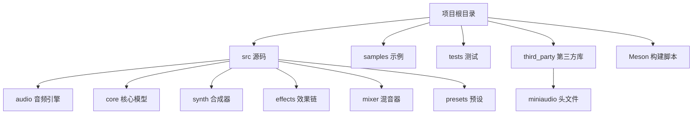
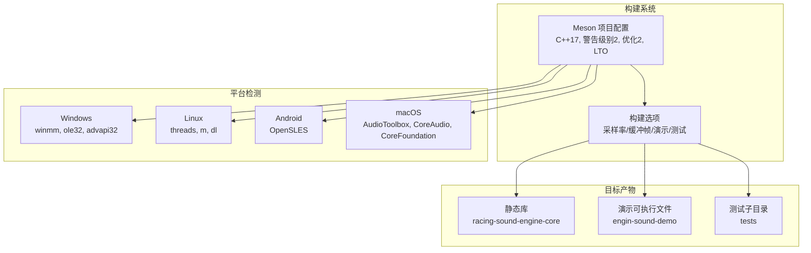
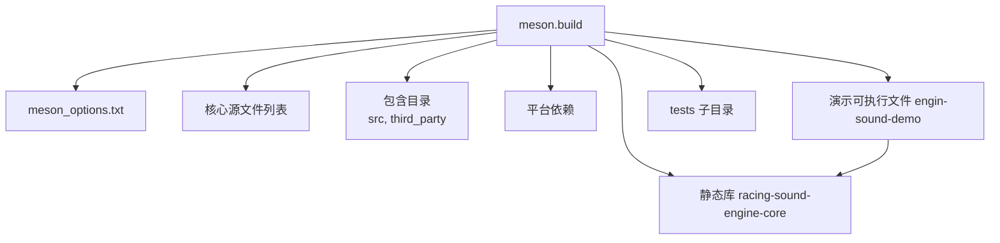

# 构建和部署配置

<cite>
**本文档引用的文件**
- [meson.build](file://meson.build)
- [meson_options.txt](file://meson_options.txt)
- [src/main.cpp](file://src/main.cpp)
- [src/audio/miniaudio_impl.cpp](file://src/audio/miniaudio_impl.cpp)
- [src/audio/audio_engine.h](file://src/audio/audio_engine.h)
- [tests/test_audio_mixer.cpp](file://tests/test_audio_mixer.cpp)
- [third_party/miniaudio.h](file://third_party/miniaudio.h)
</cite>

## 目录
1. [简介](#简介)
2. [项目结构](#项目结构)
3. [核心组件](#核心组件)
4. [架构概览](#架构概览)
5. [详细组件分析](#详细组件分析)
6. [依赖关系分析](#依赖关系分析)
7. [性能考虑](#性能考虑)
8. [故障排除指南](#故障排除指南)
9. [结论](#结论)
10. [附录](#附录)

## 简介
本指南面向赛车声音引擎项目的构建与部署配置，基于 Meson 构建系统，覆盖编译选项、依赖管理、平台特定设置、编译器优化、第三方库集成（尤其是 miniaudio）、跨平台构建支持（Windows、Linux、macOS）、打包分发以及 CI/CD 建议。文档同时提供故障排除与最佳实践，帮助开发者在不同平台上高效构建与发布。

## 项目结构
项目采用模块化组织，核心代码位于 src 目录，包含音频引擎、核心模型、合成器、效果链、混音器与预设；samples 提供示例应用；tests 提供单元测试；third_party 存放第三方库头文件；根目录包含 Meson 构建脚本与选项定义。

**章节来源**
- [meson.build:1-84](file://meson.build#L1-L84)
- [meson_options.txt:1-5](file://meson_options.txt#L1-L5)

## 核心组件
- 构建系统：Meson，使用 C++17 标准，默认警告级别为中等，优化等级为 2，并启用链接时优化（LTO）。
- 平台依赖：根据主机系统自动选择所需系统库或框架（Windows 多媒体、OLE、AdvAPI；Linux 线程、数学与动态链接库；Android OpenSLES；macOS AppleFrameworks）。
- 可配置参数：采样率、缓冲帧数、是否构建演示程序与测试。
- 库与目标：静态库封装核心功能，声明为可被其他项目使用的依赖；可选构建演示可执行文件；可选构建测试子目录。
- 第三方库：通过头文件方式集成 miniaudio，仅在单一编译单元中实现其源码以避免重复定义。

**章节来源**
- [meson.build:1-84](file://meson.build#L1-L84)
- [meson_options.txt:1-5](file://meson_options.txt#L1-L5)
- [src/audio/miniaudio_impl.cpp:1-6](file://src/audio/miniaudio_impl.cpp#L1-L6)

## 架构概览
下图展示构建系统如何根据平台选择依赖并生成静态库与可选目标：

**图表来源**
- [meson.build:10-28](file://meson.build#L10-L28)
- [meson.build:60-78](file://meson.build#L60-L78)

**章节来源**
- [meson.build:10-28](file://meson.build#L10-L28)
- [meson.build:60-78](file://meson.build#L60-L78)

## 详细组件分析

### 编译器与构建选项
- 默认标准：C++17，确保现代语言特性可用。
- 警告级别：中等（warning_level=2），平衡编译器提示与噪音。
- 优化等级：2（optimization=2），兼顾性能与编译时间。
- 链接时优化：启用 LTO（b_lto=true），提升运行时性能。
- 可配置参数：采样率（默认 48000 Hz）、缓冲帧数（默认 512）、是否构建演示程序与测试。

这些选项在项目初始化阶段集中定义，保证所有平台一致的编译行为。

**章节来源**
- [meson.build:3-8](file://meson.build#L3-L8)
- [meson_options.txt:1-5](file://meson_options.txt#L1-L5)

### 平台特定设置
- Windows：查找并链接 winmm、ole32、advapi32，满足多媒体与时序需求。
- Linux：链接 threads；可选链接 m（数学库）与 dl（动态链接）。
- Android：可选链接 OpenSLES（低延迟音频）。
- macOS：链接 AppleFrameworks（AudioToolbox、CoreAudio、CoreFoundation）。

平台检测逻辑在构建脚本中按主机系统类型分支，确保正确依赖。

**章节来源**
- [meson.build:16-28](file://meson.build#L16-L28)

### 第三方依赖：miniaudio 集成与版本控制
- 集成方式：通过头文件引入（third_party/miniaudio.h），仅在单一编译单元中定义实现（src/audio/miniaudio_impl.cpp），避免多处实现导致的符号冲突。
- 版本信息：头文件中标注版本号与发布日期，便于追踪与审计。
- 使用场景：作为音频设备驱动与数据回调的基础库，配合项目内部音频引擎使用。

**图表来源**
- [src/audio/miniaudio_impl.cpp:1-6](file://src/audio/miniaudio_impl.cpp#L1-L6)
- [third_party/miniaudio.h:1-20](file://third_party/miniaudio.h#L1-L20)

**章节来源**
- [src/audio/miniaudio_impl.cpp:1-6](file://src/audio/miniaudio_impl.cpp#L1-L6)
- [third_party/miniaudio.h:1-20](file://third_party/miniaudio.h#L1-L20)

### 静态库与依赖声明
- 核心静态库：聚合所有核心源文件，统一包含 src 与 third_party 目录，链接平台依赖。
- 依赖声明：通过 declare_dependency 暴露链接目标、包含路径与依赖，便于外部项目复用。

该设计降低耦合，提高可维护性与可移植性。

**章节来源**
- [meson.build:42-70](file://meson.build#L42-L70)

### 演示程序与测试
- 演示程序：可选构建，依赖核心静态库，提供交互式控制界面与实时音频渲染。
- 测试：可选构建，包含多个单元测试文件，验证混音器等核心模块的行为。

演示程序入口与平台输入适配逻辑展示了跨平台键盘输入处理策略。

**章节来源**
- [meson.build:73-78](file://meson.build#L73-L78)
- [src/main.cpp:89-239](file://src/main.cpp#L89-L239)
- [tests/test_audio_mixer.cpp:1-96](file://tests/test_audio_mixer.cpp#L1-L96)

### 配置数据注入
- 采样率与缓冲帧数通过 configuration_data 注入到构建配置中，供源码使用（如演示程序中的默认值）。

**章节来源**
- [meson.build:34-37](file://meson.build#L34-L37)

## 依赖关系分析
下图展示构建脚本中模块间的依赖关系与数据流：

**图表来源**
- [meson.build:31-78](file://meson.build#L31-L78)
- [meson_options.txt:1-5](file://meson_options.txt#L1-L5)

**章节来源**
- [meson.build:31-78](file://meson.build#L31-L78)

## 性能考虑
- 编译优化：优化等级 2 与 LTO 在 Release 场景下通常能带来更好的运行时性能，但会增加链接时间。
- 警告级别：中等警告有助于发现潜在问题，建议在开发阶段保持此级别。
- 平台差异：不同平台的音频后端与系统库会影响延迟与稳定性，需结合实际硬件测试调优。
- 测试覆盖：单元测试有助于在早期发现性能回归与错误，建议持续集成中强制运行。

[本节为通用指导，无需具体文件引用]

## 故障排除指南
- 无法找到 miniaudio 头文件或实现
  - 现象：编译报错找不到头文件或重复定义实现。
  - 排查：确认 third_party/miniaudio.h 是否存在；确保仅在 src/audio/miniaudio_impl.cpp 中定义实现，其他文件仅包含头文件。
  - 参考：[miniaudio_impl.cpp:1-6](file://src/audio/miniaudio_impl.cpp#L1-L6)，[miniaudio.h:1-20](file://third_party/miniaudio.h#L1-L20)

- Windows 平台音频初始化失败
  - 现象：演示程序初始化音频设备失败。
  - 排查：确认 winmm、ole32、advapi32 已正确链接；检查系统音频驱动状态。
  - 参考：[meson.build 平台依赖:16-20](file://meson.build#L16-L20)

- Linux 下音频权限或设备占用
  - 现象：无法打开音频设备或出现权限错误。
  - 排查：确认 ALSA/PulseAudio 正常运行；检查用户是否加入音频组；尝试切换到不同后端。
  - 参考：[meson.build 平台依赖:20-24](file://meson.build#L20-L24)

- macOS 下框架缺失或签名问题
  - 现象：链接成功但运行时报框架缺失或沙盒限制。
  - 排查：确认已链接 AudioToolbox、CoreAudio、CoreFoundation；检查应用签名与沙盒配置。
  - 参考：[meson.build 平台依赖:26-28](file://meson.build#L26-L28)

- 构建选项未生效
  - 现象：自定义采样率或缓冲帧数未影响运行时。
  - 排查：确认通过 Meson 选项传递了新值；检查演示程序是否使用了配置数据中的默认值。
  - 参考：[meson_options.txt:1-5](file://meson_options.txt#L1-L5)，[meson.build 配置注入:34-37](file://meson.build#L34-L37)，[main.cpp 默认值:107-108](file://src/main.cpp#L107-L108)

- 测试失败或环境不一致
  - 现象：本地测试通过但在 CI 中失败。
  - 排查：统一编译器版本与构建选项；确保测试二进制与运行环境一致。
  - 参考：[test_audio_mixer.cpp:1-96](file://tests/test_audio_mixer.cpp#L1-L96)

**章节来源**
- [src/audio/miniaudio_impl.cpp:1-6](file://src/audio/miniaudio_impl.cpp#L1-L6)
- [third_party/miniaudio.h:1-20](file://third_party/miniaudio.h#L1-L20)
- [meson.build:16-28](file://meson.build#L16-L28)
- [meson_options.txt:1-5](file://meson_options.txt#L1-L5)
- [src/main.cpp:107-108](file://src/main.cpp#L107-L108)
- [tests/test_audio_mixer.cpp:1-96](file://tests/test_audio_mixer.cpp#L1-L96)

## 结论
本项目以 Meson 为核心构建系统，采用模块化设计与清晰的平台适配策略，结合 miniaudio 的头文件集成方式，实现了跨平台音频引擎的快速构建与部署。通过可配置的采样率与缓冲区参数、可选的演示与测试目标，满足从开发调试到生产发布的多种需求。建议在 CI/CD 中统一构建环境与工具链版本，持续运行测试，确保质量与稳定性。

[本节为总结性内容，无需具体文件引用]

## 附录

### 跨平台构建要点
- Windows：确保系统库可用；推荐使用 MSVC 或 GCC；注意控制台输入兼容性。
- Linux：确保线程、数学与动态链接库可用；注意不同发行版的默认音频后端差异。
- macOS：确保 AppleFrameworks 可用；注意沙盒与签名要求；避免与系统音频框架冲突。

**章节来源**
- [meson.build:16-28](file://meson.build#L16-L28)

### 打包与分发建议
- 动态库依赖：优先静态链接核心库，减少运行时依赖；若必须共享库，提供完整依赖清单并在安装包中一并分发。
- 安装程序：为 Windows 提供 MSI/NSIS；为 Linux 提供 AppImage 或包管理器安装脚本；为 macOS 提供 DMG 包含签名应用。
- 系统集成：在 Linux 上注册桌面条目与音频后端；在 macOS 上配置 Info.plist 与权限；在 Windows 上注册音频设备权限。

[本节为通用指导，无需具体文件引用]

### CI/CD 流水线建议
- 触发条件：主分支保护、PR 自动构建与测试。
- 并行任务：Windows（MSVC/GCC）、Linux（GCC/Clang）、macOS（Xcode）三平台并行构建。
- 测试策略：运行单元测试与关键集成测试；对演示程序进行短时播放验证。
- 发布流程：通过标签触发发布作业，生成多平台安装包与校验文件。

[本节为通用指导，无需具体文件引用]