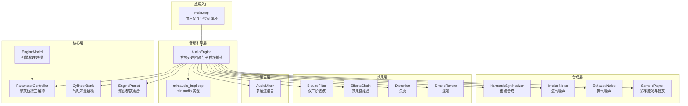
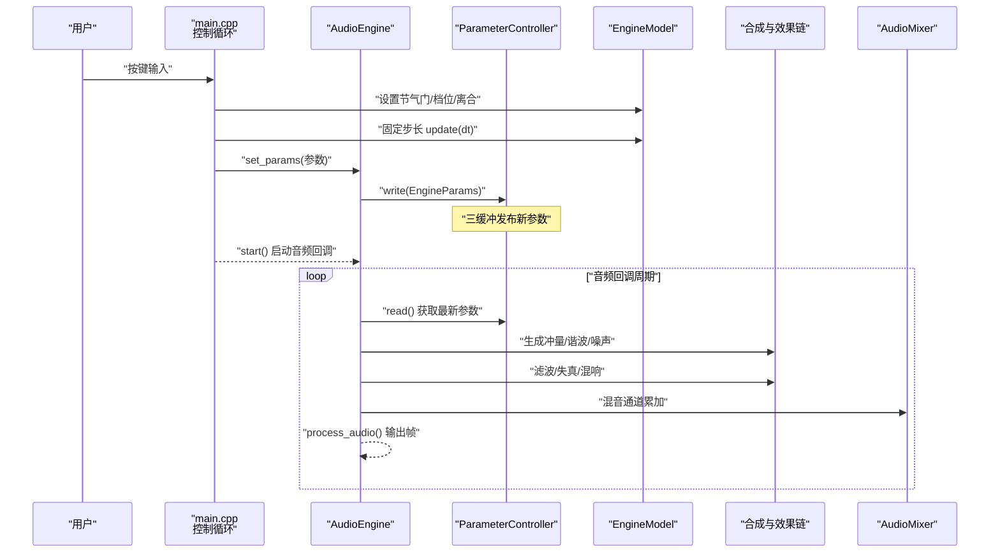
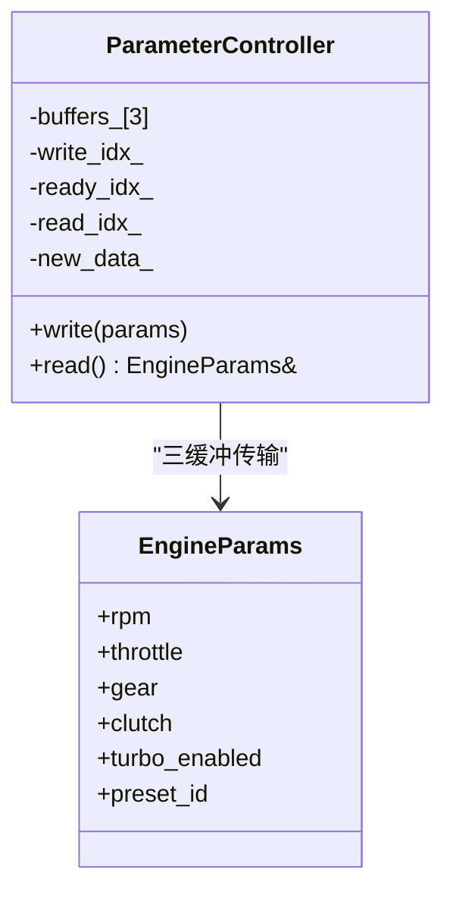
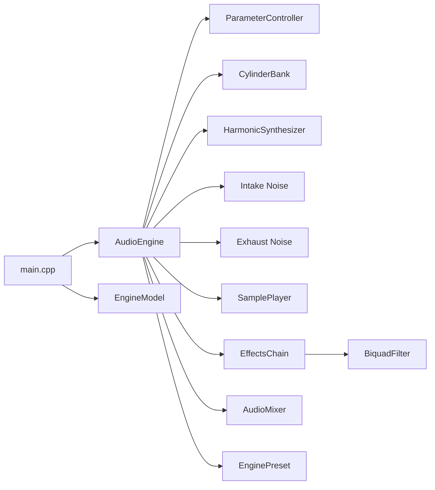

# 核心架构设计

<cite>
**本文引用的文件**
- [src/main.cpp](file://src/main.cpp)
- [src/audio/audio_engine.h](file://src/audio/audio_engine.h)
- [src/audio/miniaudio_impl.cpp](file://src/audio/miniaudio_impl.cpp)
- [src/core/engine_model.h](file://src/core/engine_model.h)
- [src/core/parameter_controller.h](file://src/core/parameter_controller.h)
- [src/core/cylinder_bank.h](file://src/core/cylinder_bank.h)
- [src/synth/harmonic_synth.h](file://src/synth/harmonic_synth.h)
- [src/synth/sample_player.h](file://src/synth/sample_player.h)
- [src/effects/biquad_filter.h](file://src/effects/biquad_filter.h)
- [src/effects/effects_chain.h](file://src/effects/effects_chain.h)
- [src/mixer/audio_mixer.h](file://src/mixer/audio_mixer.h)
- [src/presets/engine_preset.h](file://src/presets/engine_preset.h)
- [src/core/types.h](file://src/core/types.h)
- [src/core/constants.h](file://src/core/constants.h)
</cite>

## 目录
1. [引言](#引言)
2. [项目结构](#项目结构)
3. [核心组件](#核心组件)
4. [架构总览](#架构总览)
5. [详细组件分析](#详细组件分析)
6. [依赖分析](#依赖分析)
7. [性能考量](#性能考量)
8. [故障排查指南](#故障排查指南)
9. [结论](#结论)
10. [附录](#附录)

## 引言
本文件面向赛车声音引擎的核心架构文档，系统化阐述音频引擎、物理建模、效果处理与用户交互四大模块的设计思路与实现要点；说明分层架构中的数据流方向、模块间依赖关系与接口设计原则；解析实时音频处理的关键挑战与解决方案（缓冲区管理、线程同步、延迟控制）；总结设计模式的应用（工厂模式：预设系统；观察者模式：参数桥接；组合模式：效果链）；给出系统边界图与组件交互图；并对技术决策的权衡、约束条件、扩展性与未来发展方向进行讨论。

## 项目结构
该工程采用按功能域分层的目录组织方式：
- src/audio：音频引擎与设备集成（基于 miniaudio）
- src/core：核心类型、常量、参数桥接、气缸组与引擎模型
- src/synth：合成器（谐波合成、噪声生成、采样播放）
- src/effects：单个效果与效果链（滤波、失真、混响）
- src/mixer：多路混音与通道缓冲
- src/presets：预设工厂与参数集合
- tests：单元测试（覆盖各模块）
- third_party：外部依赖（miniaudio）

图表来源
- [src/main.cpp:89-238](file://src/main.cpp#L89-L238)
- [src/audio/audio_engine.h:27-89](file://src/audio/audio_engine.h#L27-L89)
- [src/audio/miniaudio_impl.cpp:1-6](file://src/audio/miniaudio_impl.cpp#L1-L6)
- [src/core/engine_model.h:7-45](file://src/core/engine_model.h#L7-L45)
- [src/core/parameter_controller.h:20-58](file://src/core/parameter_controller.h#L20-L58)
- [src/core/cylinder_bank.h:9-38](file://src/core/cylinder_bank.h#L9-L38)
- [src/synth/harmonic_synth.h:8-25](file://src/synth/harmonic_synth.h#L8-L25)
- [src/synth/sample_player.h:16-61](file://src/synth/sample_player.h#L16-L61)
- [src/effects/biquad_filter.h:25-42](file://src/effects/biquad_filter.h#L25-L42)
- [src/effects/effects_chain.h:8-21](file://src/effects/effects_chain.h#L8-L21)
- [src/mixer/audio_mixer.h:9-34](file://src/mixer/audio_mixer.h#L9-L34)
- [src/presets/engine_preset.h:8-54](file://src/presets/engine_preset.h#L8-L54)

章节来源
- [src/main.cpp:89-238](file://src/main.cpp#L89-L238)
- [src/audio/audio_engine.h:27-89](file://src/audio/audio_engine.h#L27-L89)
- [src/core/constants.h:8-18](file://src/core/constants.h#L8-L18)

## 核心组件
- 音频引擎（AudioEngine）：负责初始化设备、启动/停止回调、参数桥接、子模块编排与离线渲染。内部维护多个合成与效果模块实例，并提供静态回调以对接 miniaudio。
- 参数桥接（ParameterController）：三缓冲无锁参数桥，控制线程写入，音频线程读取，避免阻塞与分配。
- 引擎模型（EngineModel）：固定步长更新的物理模型，计算 RPM、负载、档位比等状态。
- 气缸组（CylinderBank）：根据预设点火相位与节气门生成原始冲量信号。
- 谐波合成（HarmonicSynthesizer）：基于预设谐波谱的加法合成，输出基波及其谐波叠加。
- 噪声生成（Intake/Exhaust Noise）：分别模拟进气与排气噪声频段特性。
- 采样播放（SamplePlayer）：非实时加载样本，实时安全的触发与播放队列。
- 效果链（EffectsChain）：组合多个 IEffect 的处理管线。
- 双二阶滤波（BiquadFilter）：可配置的滤波器类型与参数。
- 失真与混响（Distortion/SimpleReverb）：非线性与空间感增强。
- 混音器（AudioMixer）：多通道累加、增益与静音控制，最终混合到输出。

章节来源
- [src/audio/audio_engine.h:27-89](file://src/audio/audio_engine.h#L27-L89)
- [src/core/parameter_controller.h:20-58](file://src/core/parameter_controller.h#L20-L58)
- [src/core/engine_model.h:7-45](file://src/core/engine_model.h#L7-L45)
- [src/core/cylinder_bank.h:9-38](file://src/core/cylinder_bank.h#L9-L38)
- [src/synth/harmonic_synth.h:8-25](file://src/synth/harmonic_synth.h#L8-L25)
- [src/synth/sample_player.h:16-61](file://src/synth/sample_player.h#L16-L61)
- [src/effects/biquad_filter.h:25-42](file://src/effects/biquad_filter.h#L25-L42)
- [src/effects/effects_chain.h:8-21](file://src/effects/effects_chain.h#L8-L21)
- [src/mixer/audio_mixer.h:9-34](file://src/mixer/audio_mixer.h#L9-L34)

## 架构总览
系统采用“控制线程 + 音频回调线程”的双线程模型：
- 控制线程：处理用户输入、更新引擎模型、推送参数到音频线程。
- 音频回调线程：从参数桥读取最新参数，驱动合成与效果链，最终通过混音器输出。

图表来源
- [src/main.cpp:146-233](file://src/main.cpp#L146-L233)
- [src/audio/audio_engine.h:32-88](file://src/audio/audio_engine.h#L32-L88)
- [src/core/parameter_controller.h:32-50](file://src/core/parameter_controller.h#L32-L50)
- [src/core/engine_model.h:15-26](file://src/core/engine_model.h#L15-L26)
- [src/mixer/audio_mixer.h:16-22](file://src/mixer/audio_mixer.h#L16-L22)

## 详细组件分析

### 音频引擎（AudioEngine）
职责与接口
- 初始化与生命周期管理：init/start/stop/shutdown
- 参数与预设：load_preset/set_params
- 离线渲染：render_to_buffer
- 子模块访问：get_param_controller/get_sample_player
- 回调封装：audio_callback 与 process_audio

内部子模块
- ParameterController：参数桥接
- CylinderBank/HarmonicSynthesizer/NoiseGenerator/SamplePlayer：声音源
- BiquadFilter/BiquadFilter/Distortion/SimpleReverb：效果
- AudioMixer：混音

线程与内存
- 运行状态使用原子布尔值
- 当前预设以原子指针存储，音频线程持有本地缓存副本
- 多个固定大小的临时缓冲用于中间处理

章节来源
- [src/audio/audio_engine.h:27-89](file://src/audio/audio_engine.h#L27-L89)
- [src/audio/miniaudio_impl.cpp:1-6](file://src/audio/miniaudio_impl.cpp#L1-L6)

### 参数桥接（ParameterController）
设计要点
- 三缓冲无锁：写索引、就绪索引、读索引三者轮转，避免锁与分配
- 发布/消费语义：写入后交换就绪索引并置位新数据标志；音频线程在有新数据时交换读索引
- 类型安全：EngineParams 结构体承载所有运行时参数

图表来源
- [src/core/parameter_controller.h:20-58](file://src/core/parameter_controller.h#L20-L58)
- [src/core/parameter_controller.h:9-16](file://src/core/parameter_controller.h#L9-L16)

章节来源
- [src/core/parameter_controller.h:20-58](file://src/core/parameter_controller.h#L20-L58)

### 引擎模型（EngineModel）
物理建模
- 输入：节气门、档位、离合
- 状态：RPM、负载、档位、离合
- 更新：固定步长 dt，结合惯性、摩擦与最大扭矩计算下一时刻状态
- 预设：空闲转速、红线转速、惯量等

章节来源
- [src/core/engine_model.h:7-45](file://src/core/engine_model.h#L7-L45)

### 气缸组（CylinderBank）
实现要点
- 根据预设的点火相位与点火顺序生成冲量脉冲
- 冲量形状受节气门影响（尖锐度）
- 累加到输出缓冲

章节来源
- [src/core/cylinder_bank.h:9-38](file://src/core/cylinder_bank.h#L9-L38)

### 谐波合成（HarmonicSynthesizer）
实现要点
- 基于预设的谐波幅度谱，对基波进行加法合成
- 输出累加到目标缓冲
- 支持重置

章节来源
- [src/synth/harmonic_synth.h:8-25](file://src/synth/harmonic_synth.h#L8-L25)

### 噪声生成与采样播放
- 进气/排气噪声：分别在不同中心频率与带宽下生成噪声
- 采样播放：非实时加载样本，实时安全的触发队列与多声部播放

章节来源
- [src/synth/sample_player.h:16-61](file://src/synth/sample_player.h#L16-L61)

### 效果链与滤波器
- IEffect 接口统一处理流程
- EffectsChain 组合多个效果，按顺序处理
- BiquadFilter 提供多种滤波类型与参数

章节来源
- [src/effects/biquad_filter.h:18-42](file://src/effects/biquad_filter.h#L18-L42)
- [src/effects/effects_chain.h:8-21](file://src/effects/effects_chain.h#L8-L21)

### 混音器（AudioMixer）
实现要点
- 多通道累加缓冲，支持增益与静音
- 渲染阶段清零通道缓冲，避免泄漏
- 线程安全：仅在音频线程中调用

章节来源
- [src/mixer/audio_mixer.h:9-34](file://src/mixer/audio_mixer.h#L9-L34)
- [src/mixer/audio_mixer.cpp:1-58](file://src/mixer/audio_mixer.cpp#L1-L58)

### 预设系统（工厂模式）
- EnginePreset 定义了不同发动机类型的参数集合
- 工厂函数返回预设引用，便于加载与切换

章节来源
- [src/presets/engine_preset.h:8-54](file://src/presets/engine_preset.h#L8-L54)

## 依赖分析
模块耦合与内聚
- AudioEngine 作为编排者，聚合各子模块，耦合度高但职责清晰
- ParameterController 与 EngineModel 解耦，通过 EngineParams 传递
- EffectsChain 通过 IEffect 接口解耦具体效果
- SamplePlayer 与触发事件队列隔离实时路径

图表来源
- [src/audio/audio_engine.h:58-69](file://src/audio/audio_engine.h#L58-L69)
- [src/effects/effects_chain.h:19](file://src/effects/effects_chain.h#L19)
- [src/main.cpp:104-132](file://src/main.cpp#L104-L132)

章节来源
- [src/audio/audio_engine.h:58-69](file://src/audio/audio_engine.h#L58-L69)
- [src/effects/effects_chain.h:19](file://src/effects/effects_chain.h#L19)
- [src/main.cpp:104-132](file://src/main.cpp#L104-L132)

## 性能考量
实时音频处理的关键挑战与对策
- 缓冲区管理
  - 使用固定大小的中间缓冲（MAX_SCRATCH 等），避免动态分配
  - AudioMixer 通道缓冲大小受限，确保常数时间混合
- 线程同步
  - ParameterController 三缓冲无锁参数桥，避免互斥锁与阻塞
  - SamplePlayer 触发队列为 SPSC 无锁队列，降低竞争
- 延迟控制
  - 控制循环约 60Hz，保证参数更新速率与可听感知一致
  - 音频回调帧数由配置决定，尽量保持稳定以减少抖动
- 计算复杂度
  - 合成与效果链均为逐样本处理，复杂度 O(N)，适合实时
  - 预设参数提前加载，避免运行时查找开销

章节来源
- [src/audio/audio_engine.h:75-82](file://src/audio/audio_engine.h#L75-L82)
- [src/mixer/audio_mixer.h:25-33](file://src/mixer/audio_mixer.h#L25-L33)
- [src/core/parameter_controller.h:32-50](file://src/core/parameter_controller.h#L32-L50)
- [src/synth/sample_player.h:53-58](file://src/synth/sample_player.h#L53-L58)
- [src/main.cpp:143-144](file://src/main.cpp#L143-L144)

## 故障排查指南
常见问题与定位
- 设备初始化失败
  - 检查 AudioEngine::init 返回值与错误日志
  - 确认默认采样率与缓冲帧数配置合理
- 参数未生效
  - 确认控制线程已调用 set_params，且音频线程成功 read
  - 检查三缓冲索引是否正确交换
- 声音断断续续或爆音
  - 检查混音器通道增益与静音状态
  - 确认各合成模块输出未溢出
- 延迟过大
  - 适当减小缓冲帧数，平衡延迟与稳定性
  - 检查控制循环睡眠逻辑是否正确

章节来源
- [src/main.cpp:110-113](file://src/main.cpp#L110-L113)
- [src/audio/audio_engine.h:32-47](file://src/audio/audio_engine.h#L32-L47)
- [src/core/parameter_controller.h:43-50](file://src/core/parameter_controller.h#L43-L50)
- [src/mixer/audio_mixer.h:16-22](file://src/mixer/audio_mixer.h#L16-L22)

## 结论
该赛车声音引擎以“控制线程 + 音频回调线程”为核心，通过参数桥接实现低延迟、无锁的数据通路；以预设工厂、效果链组合与多模块合成构建可扩展的声音生成体系；以固定缓冲与常数时间算法满足实时性要求。整体架构清晰、模块职责明确、接口稳定，具备良好的扩展性与可维护性。

## 附录

### 数据类型与常量
- 基础类型：Sample、FrameCount、SampleRate
- 全局常量：采样率、缓冲帧数、最大通道数、最大效果数、最大声音数等

章节来源
- [src/core/types.h:7-9](file://src/core/types.h#L7-L9)
- [src/core/constants.h:8-18](file://src/core/constants.h#L8-L18)

### 用户交互与控制循环
- 键盘输入处理：跨平台非阻塞读取
- 控制循环：约 60Hz，更新引擎状态并推送参数
- 状态显示：实时显示 RPM、档位、节气门、负载、涡轮与预设

章节来源
- [src/main.cpp:54-81](file://src/main.cpp#L54-L81)
- [src/main.cpp:146-233](file://src/main.cpp#L146-L233)