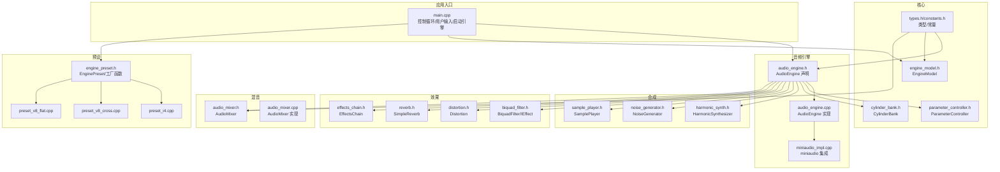
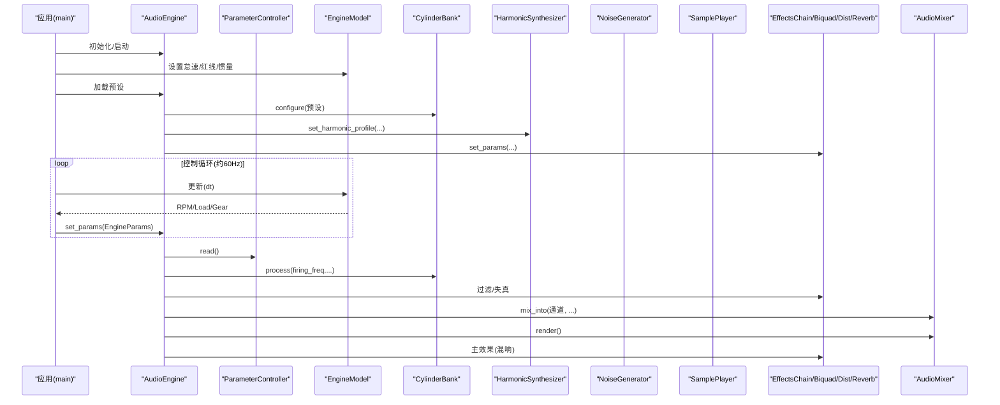
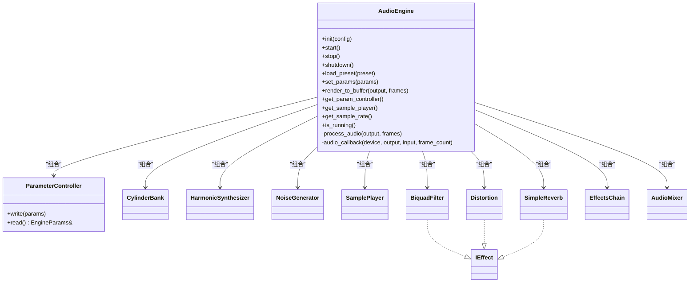
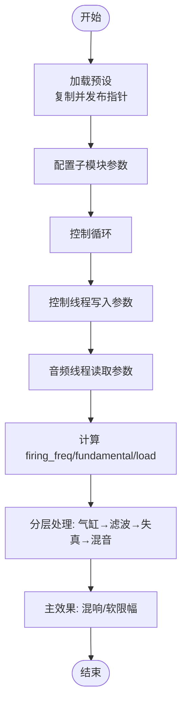
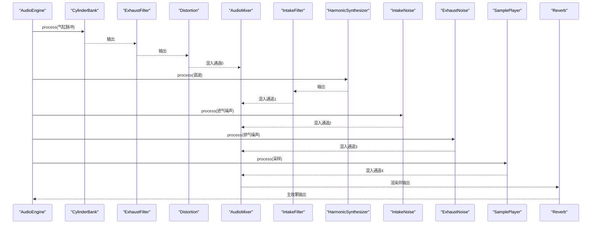
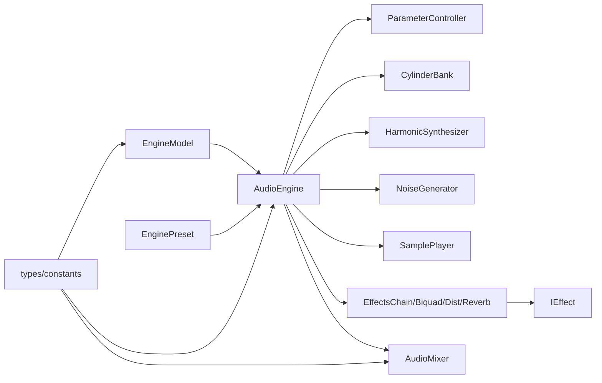

# 模块依赖关系

<cite>
**本文引用的文件**
- [src/main.cpp](file://src/main.cpp)
- [src/audio/audio_engine.h](file://src/audio/audio_engine.h)
- [src/audio/audio_engine.cpp](file://src/audio/audio_engine.cpp)
- [src/audio/miniaudio_impl.cpp](file://src/audio/miniaudio_impl.cpp)
- [src/core/engine_model.h](file://src/core/engine_model.h)
- [src/core/engine_model.cpp](file://src/core/engine_model.cpp)
- [src/core/parameter_controller.h](file://src/core/parameter_controller.h)
- [src/core/cylinder_bank.h](file://src/core/cylinder_bank.h)
- [src/synth/harmonic_synth.h](file://src/synth/harmonic_synth.h)
- [src/synth/noise_generator.h](file://src/synth/noise_generator.h)
- [src/synth/sample_player.h](file://src/synth/sample_player.h)
- [src/effects/biquad_filter.h](file://src/effects/biquad_filter.h)
- [src/effects/distortion.h](file://src/effects/distortion.h)
- [src/effects/reverb.h](file://src/effects/reverb.h)
- [src/effects/effects_chain.h](file://src/effects/effects_chain.h)
- [src/mixer/audio_mixer.h](file://src/mixer/audio_mixer.h)
- [src/mixer/audio_mixer.cpp](file://src/mixer/audio_mixer.cpp)
- [src/presets/engine_preset.h](file://src/presets/engine_preset.h)
- [src/presets/preset_i4.cpp](file://src/presets/preset_i4.cpp)
- [src/presets/preset_v8_cross.cpp](file://src/presets/preset_v8_cross.cpp)
- [src/presets/preset_v8_flat.cpp](file://src/presets/preset_v8_flat.cpp)
- [src/core/types.h](file://src/core/types.h)
- [src/core/constants.h](file://src/core/constants.h)
</cite>

## 目录
1. [简介](#简介)
2. [项目结构](#项目结构)
3. [核心组件](#核心组件)
4. [架构总览](#架构总览)
5. [详细组件分析](#详细组件分析)
6. [依赖分析](#依赖分析)
7. [性能考量](#性能考量)
8. [故障排查指南](#故障排查指南)
9. [结论](#结论)
10. [附录](#附录)

## 简介
本文件聚焦赛车声音引擎的模块依赖关系与接口设计原则，系统性梳理 AudioEngine 如何协调各子模块工作，解析依赖注入（构造函数注入与接口抽象）的实现方式，阐述模块解耦策略（前向声明、PIMPL、接口隔离），并总结避免循环依赖与依赖管理的最佳实践。同时给出模块扩展与替换的指导原则，帮助读者在不破坏实时音频路径的前提下进行功能演进。

## 项目结构
项目采用按领域分层的组织方式：顶层入口负责交互与参数桥接；核心域包含引擎物理模型与参数控制器；合成域提供谐波、噪声与采样播放；效果域提供滤波、失真、混响与链式组合；混音域统一汇聚多通道输出；预设域提供不同发动机类型的参数集合。

图表来源
- [src/main.cpp:89-239](file://src/main.cpp#L89-L239)
- [src/audio/audio_engine.h:20-92](file://src/audio/audio_engine.h#L20-L92)
- [src/audio/audio_engine.cpp:1-163](file://src/audio/audio_engine.cpp#L1-L163)
- [src/audio/miniaudio_impl.cpp](file://src/audio/miniaudio_impl.cpp)
- [src/core/engine_model.h:1-48](file://src/core/engine_model.h#L1-L48)
- [src/core/engine_model.cpp:1-55](file://src/core/engine_model.cpp#L1-L55)
- [src/core/parameter_controller.h:1-61](file://src/core/parameter_controller.h#L1-L61)
- [src/core/cylinder_bank.h:1-41](file://src/core/cylinder_bank.h#L1-L41)
- [src/synth/harmonic_synth.h:1-28](file://src/synth/harmonic_synth.h#L1-L28)
- [src/synth/noise_generator.h:1-41](file://src/synth/noise_generator.h#L1-L41)
- [src/synth/sample_player.h:1-62](file://src/synth/sample_player.h#L1-L62)
- [src/effects/biquad_filter.h:1-45](file://src/effects/biquad_filter.h#L1-L45)
- [src/effects/distortion.h:1-22](file://src/effects/distortion.h#L1-L22)
- [src/effects/reverb.h](file://src/effects/reverb.h)
- [src/effects/effects_chain.h:1-24](file://src/effects/effects_chain.h#L1-L24)
- [src/mixer/audio_mixer.h:1-37](file://src/mixer/audio_mixer.h#L1-L37)
- [src/mixer/audio_mixer.cpp:1-58](file://src/mixer/audio_mixer.cpp#L1-L58)
- [src/presets/engine_preset.h:1-55](file://src/presets/engine_preset.h#L1-L55)
- [src/presets/preset_i4.cpp](file://src/presets/preset_i4.cpp)
- [src/presets/preset_v8_cross.cpp](file://src/presets/preset_v8_cross.cpp)
- [src/presets/preset_v8_flat.cpp](file://src/presets/preset_v8_flat.cpp)
- [src/core/types.h:1-12](file://src/core/types.h#L1-L12)
- [src/core/constants.h:1-20](file://src/core/constants.h#L1-L20)

章节来源
- [src/main.cpp:89-239](file://src/main.cpp#L89-L239)
- [src/audio/audio_engine.h:20-92](file://src/audio/audio_engine.h#L20-L92)
- [src/audio/audio_engine.cpp:1-163](file://src/audio/audio_engine.cpp#L1-L163)
- [src/core/constants.h:1-20](file://src/core/constants.h#L1-L20)

## 核心组件
- AudioEngine：音频引擎主控，封装设备初始化、回调、参数桥接、子模块编排与混音渲染。通过内部静态回调将 miniaudio 的数据回调转为 process_audio 的纯函数调用，保证音频线程安全与无锁参数桥接。
- ParameterController：三缓冲无锁参数桥，控制线程写入，音频线程读取，避免锁与分配，确保实时性。
- EngineModel：引擎物理模型，根据油门、档位、离合等输入计算负载与转速，提供稳定的 RPM 输出。
- CylinderBank：基于气缸相位与点火频率生成原始气缸脉冲序列。
- HarmonicSynthesizer：加法合成，按谐波谱生成基频泛音，受负载调制。
- NoiseGenerator：带限白噪声生成器，带通滤波与 xorshift 伪随机数。
- SamplePlayer：非实时加载与触发，音频线程内混合活动声部，支持锁销队列触发。
- BiquadFilter/IEffect：通用效果接口与双二阶滤波器实现，支持多种滤波类型。
- Distortion/Reverb：具体效果实现，均实现 IEffect 接口。
- EffectsChain：效果链聚合器，按顺序处理。
- AudioMixer：多通道混音器，累加到通道缓冲后一次性渲染，支持静音与增益。

章节来源
- [src/audio/audio_engine.h:27-92](file://src/audio/audio_engine.h#L27-L92)
- [src/audio/audio_engine.cpp:18-163](file://src/audio/audio_engine.cpp#L18-L163)
- [src/core/parameter_controller.h:18-61](file://src/core/parameter_controller.h#L18-L61)
- [src/core/engine_model.h:7-48](file://src/core/engine_model.h#L7-L48)
- [src/core/engine_model.cpp:21-55](file://src/core/engine_model.cpp#L21-L55)
- [src/core/cylinder_bank.h:9-41](file://src/core/cylinder_bank.h#L9-L41)
- [src/synth/harmonic_synth.h:8-28](file://src/synth/harmonic_synth.h#L8-L28)
- [src/synth/noise_generator.h:8-41](file://src/synth/noise_generator.h#L8-L41)
- [src/synth/sample_player.h:16-62](file://src/synth/sample_player.h#L16-L62)
- [src/effects/biquad_filter.h:17-45](file://src/effects/biquad_filter.h#L17-L45)
- [src/effects/distortion.h:7-22](file://src/effects/distortion.h#L7-L22)
- [src/effects/effects_chain.h:8-24](file://src/effects/effects_chain.h#L8-L24)
- [src/mixer/audio_mixer.h:9-37](file://src/mixer/audio_mixer.h#L9-L37)
- [src/mixer/audio_mixer.cpp:6-58](file://src/mixer/audio_mixer.cpp#L6-L58)

## 架构总览
AudioEngine 作为中枢，负责：
- 设备生命周期管理与回调绑定
- 参数桥接与预设配置
- 子模块初始化与参数下发
- 音频处理流水线编排
- 最终混音与主效果处理

图表来源
- [src/main.cpp:104-239](file://src/main.cpp#L104-L239)
- [src/audio/audio_engine.cpp:18-163](file://src/audio/audio_engine.cpp#L18-L163)
- [src/core/engine_model.cpp:21-55](file://src/core/engine_model.cpp#L21-L55)
- [src/core/parameter_controller.h:42-50](file://src/core/parameter_controller.h#L42-L50)

## 详细组件分析

### AudioEngine 类与依赖注入
- 构造函数注入：AudioEngine 在其成员列表中直接持有所有子模块实例（如 ParameterController、CylinderBank、HarmonicSynthesizer、NoiseGenerator、SamplePlayer、BiquadFilter、Distortion、SimpleReverb、AudioMixer）。这种“组合优于继承”的方式实现了强内聚、低耦合的模块化。
- 接口抽象：对外暴露 IEffect 接口，使 BiquadFilter、Distortion、Reverb 等以统一方式接入 EffectsChain 或直接由 AudioEngine 调用，遵循接口隔离原则。
- PIMPL 使用：设备句柄以不透明指针形式在头文件中仅声明，实际定义在实现文件中，降低编译依赖与二进制耦合。
- 参数桥接：通过 ParameterController 的三缓冲无锁机制，控制线程写入、音频线程读取，避免锁竞争与分配。

图表来源
- [src/audio/audio_engine.h:27-92](file://src/audio/audio_engine.h#L27-L92)
- [src/effects/biquad_filter.h:17-45](file://src/effects/biquad_filter.h#L17-L45)
- [src/effects/distortion.h:7-22](file://src/effects/distortion.h#L7-L22)
- [src/effects/effects_chain.h:8-24](file://src/effects/effects_chain.h#L8-L24)
- [src/mixer/audio_mixer.h:9-37](file://src/mixer/audio_mixer.h#L9-L37)

章节来源
- [src/audio/audio_engine.h:27-92](file://src/audio/audio_engine.h#L27-L92)
- [src/audio/audio_engine.cpp:18-163](file://src/audio/audio_engine.cpp#L18-L163)
- [src/core/parameter_controller.h:18-61](file://src/core/parameter_controller.h#L18-L61)
- [src/effects/biquad_filter.h:17-45](file://src/effects/biquad_filter.h#L17-L45)

### 参数桥接与预设加载流程
- 预设加载：AudioEngine::load_preset 将传入的 EnginePreset 复制到本地缓存，并原子发布指针；同时配置各子模块参数（谐波谱、滤波器、失真、混响、噪声等）。
- 参数读取：process_audio 中从 ParameterController 原子读取最新 EngineParams，结合当前预设计算点火频率、基频与负载，驱动各子模块。

图表来源
- [src/audio/audio_engine.cpp:70-96](file://src/audio/audio_engine.cpp#L70-L96)
- [src/audio/audio_engine.cpp:102-160](file://src/audio/audio_engine.cpp#L102-L160)
- [src/core/parameter_controller.h:32-50](file://src/core/parameter_controller.h#L32-L50)

章节来源
- [src/audio/audio_engine.cpp:70-96](file://src/audio/audio_engine.cpp#L70-L96)
- [src/audio/audio_engine.cpp:102-160](file://src/audio/audio_engine.cpp#L102-L160)
- [src/core/parameter_controller.h:18-61](file://src/core/parameter_controller.h#L18-L61)

### 合成与效果链路
- 气缸层：CylinderBank 生成原始脉冲，经排气滤波与失真，混入通道0。
- 谐波层：HarmonicSynthesizer 生成基频泛音，经进气滤波，混入通道1。
- 噪声层：进气/排气噪声分别混入通道2/3。
- 采样层：SamplePlayer 播放采样，混入通道4。
- 效果链：各通道经混音器汇总后，执行主效果（混响），最后软限幅防止削波。

图表来源
- [src/audio/audio_engine.cpp:127-154](file://src/audio/audio_engine.cpp#L127-L154)
- [src/mixer/audio_mixer.cpp:31-47](file://src/mixer/audio_mixer.cpp#L31-L47)

章节来源
- [src/audio/audio_engine.cpp:127-154](file://src/audio/audio_engine.cpp#L127-L154)
- [src/mixer/audio_mixer.cpp:31-47](file://src/mixer/audio_mixer.cpp#L31-L47)

### 模块解耦策略
- 前向声明：在头文件中仅包含必要前置声明或最小接口，减少编译时依赖。
- PIMPL：设备句柄与实现细节隐藏在源文件，头文件保持稳定，降低外部编译影响。
- 接口隔离：IEffect 抽象统一了效果处理接口，便于替换与扩展。
- 无锁参数桥：ParameterController 使用三缓冲与原子操作，避免跨线程锁争用。
- 预设解耦：EnginePreset 作为纯数据结构，AudioEngine 仅读取并配置子模块，便于快速切换。

章节来源
- [src/audio/audio_engine.h:50-92](file://src/audio/audio_engine.h#L50-L92)
- [src/effects/biquad_filter.h:17-45](file://src/effects/biquad_filter.h#L17-L45)
- [src/core/parameter_controller.h:18-61](file://src/core/parameter_controller.h#L18-L61)
- [src/presets/engine_preset.h:8-55](file://src/presets/engine_preset.h#L8-L55)

## 依赖分析
- 内聚与耦合
  - AudioEngine 对各子模块为组合关系，内聚度高；通过 IEffect 与 AudioMixer 等接口降低对具体实现的耦合。
  - ParameterController 与 EngineModel 之间为单向依赖（控制线程写入，音频线程读取），无循环依赖。
- 循环依赖规避
  - 通过接口抽象（IEffect）、纯数据结构（EnginePreset）、无锁参数桥（ParameterController）避免相互依赖。
  - 头文件仅包含必要依赖，避免双向包含。
- 外部依赖
  - miniaudio 通过 PIMPL 与静态回调集成，对外透明，不影响模块间耦合。

图表来源
- [src/audio/audio_engine.h:27-92](file://src/audio/audio_engine.h#L27-L92)
- [src/effects/biquad_filter.h:17-45](file://src/effects/biquad_filter.h#L17-L45)
- [src/mixer/audio_mixer.h:9-37](file://src/mixer/audio_mixer.h#L9-L37)
- [src/core/engine_model.h:7-48](file://src/core/engine_model.h#L7-L48)
- [src/presets/engine_preset.h:8-55](file://src/presets/engine_preset.h#L8-L55)
- [src/core/types.h:7-12](file://src/core/types.h#L7-L12)
- [src/core/constants.h:10-20](file://src/core/constants.h#L10-L20)

章节来源
- [src/audio/audio_engine.h:27-92](file://src/audio/audio_engine.h#L27-L92)
- [src/effects/biquad_filter.h:17-45](file://src/effects/biquad_filter.h#L17-L45)
- [src/mixer/audio_mixer.h:9-37](file://src/mixer/audio_mixer.h#L9-L37)
- [src/core/engine_model.h:7-48](file://src/core/engine_model.h#L7-L48)
- [src/presets/engine_preset.h:8-55](file://src/presets/engine_preset.h#L8-L55)
- [src/core/types.h:7-12](file://src/core/types.h#L7-L12)
- [src/core/constants.h:10-20](file://src/core/constants.h#L10-L20)

## 性能考量
- 实时性保障
  - 无锁参数桥：三缓冲与原子操作避免阻塞，满足音频线程实时需求。
  - 固定帧大小与最大缓冲：MAX_SCRATCH 限制处理单元大小，避免动态分配。
  - 单声道输出与固定采样率：简化处理与内存占用。
- 计算复杂度
  - 各合成与效果模块均为 O(N) 线性处理，整体复杂度与帧长线性相关。
- 资源管理
  - 设备生命周期严格管理，停止/关闭时释放资源，避免泄漏。
  - 混音器通道清零与静音控制，减少累积误差。

章节来源
- [src/core/parameter_controller.h:18-61](file://src/core/parameter_controller.h#L18-L61)
- [src/audio/audio_engine.cpp:76-96](file://src/audio/audio_engine.cpp#L76-L96)
- [src/mixer/audio_mixer.cpp:31-47](file://src/mixer/audio_mixer.cpp#L31-L47)

## 故障排查指南
- 设备初始化失败
  - 现象：返回 false 或崩溃于设备初始化。
  - 排查：确认采样率与缓冲帧设置合理；检查 miniaudio 版本与平台兼容性。
- 无声或削波
  - 现象：输出为静音或出现削波。
  - 排查：确认预设已加载且参数有效；检查混音器通道增益与静音状态；验证软限幅是否生效。
- 参数不同步
  - 现象：参数变化滞后或不生效。
  - 排查：确认控制线程持续推送 EngineParams；检查 ParameterController 的读写索引交换逻辑。
- 性能抖动
  - 现象：音频中断或延迟。
  - 排查：降低帧大小或减少通道数量；避免在音频线程中进行阻塞操作。

章节来源
- [src/audio/audio_engine.cpp:18-45](file://src/audio/audio_engine.cpp#L18-L45)
- [src/audio/audio_engine.cpp:102-160](file://src/audio/audio_engine.cpp#L102-L160)
- [src/core/parameter_controller.h:32-50](file://src/core/parameter_controller.h#L32-L50)

## 结论
该声音引擎通过清晰的模块划分与接口抽象，实现了高内聚、低耦合的音频处理架构。AudioEngine 作为中枢，借助无锁参数桥与预设配置，将控制线程与音频线程解耦，配合多层合成与效果链路，构建出可扩展、可替换的声音管线。遵循接口隔离与 PIMPL 等设计原则，既保证了实时性能，也为后续功能扩展提供了良好基础。

## 附录
- 扩展与替换指导
  - 新增效果：实现 IEffect 接口，加入 EffectsChain 或在 AudioEngine 流水线中插入。
  - 替换合成器：实现与 HarmonicSynthesizer 相同的 process 接口，替换对应成员。
  - 更换混音器：保持 mix_into/render 接口一致，替换 AudioMixer 成员。
  - 切换预设：通过 EnginePreset 工厂函数加载新配置，AudioEngine 自动适配。
- 依赖管理最佳实践
  - 优先使用接口抽象与组合，避免继承与多态滥用。
  - 头文件仅包含必要依赖，尽量使用前向声明。
  - 严格区分控制线程与音频线程职责，避免共享可变状态。
  - 使用固定大小缓冲与无分配策略，确保实时性。