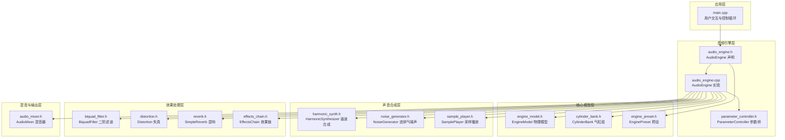
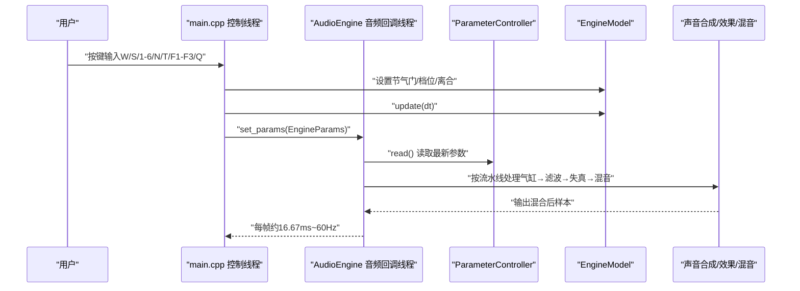
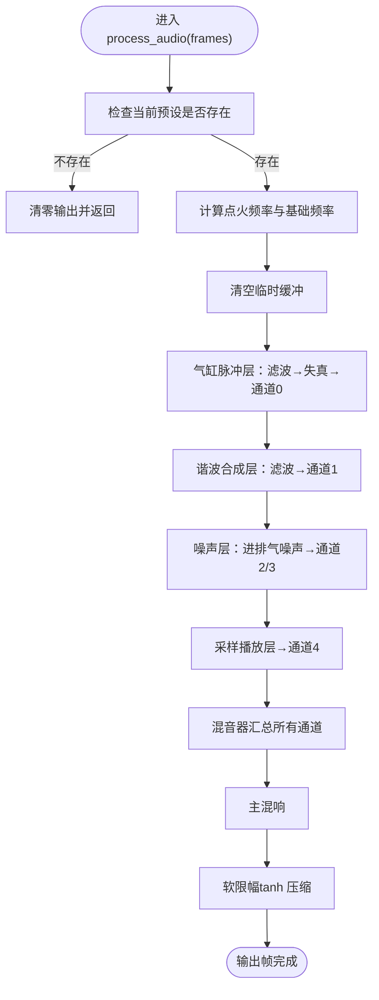
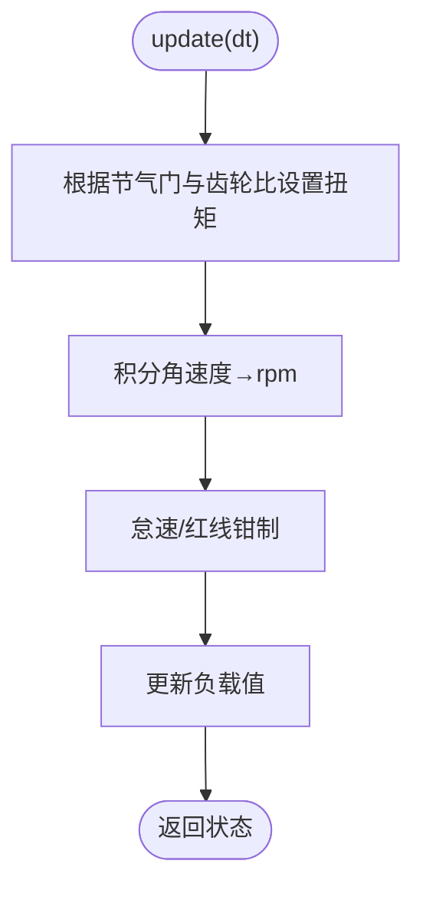
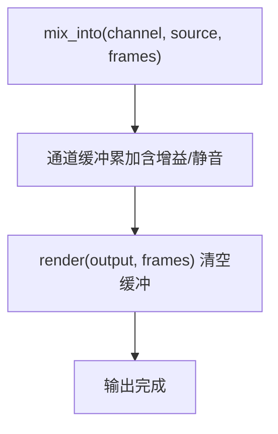
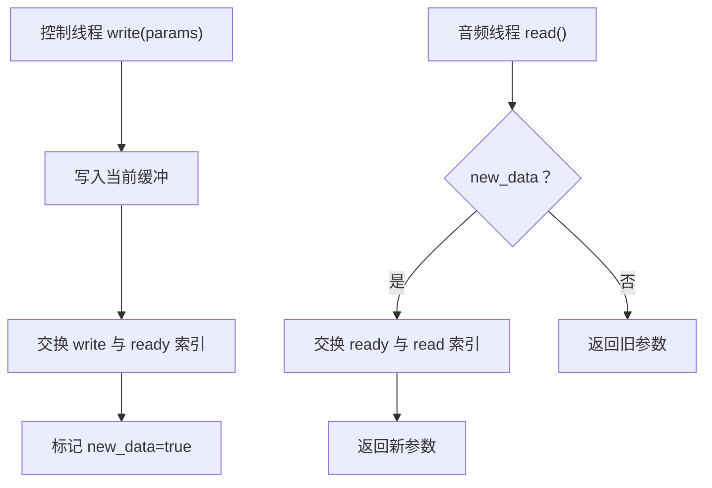
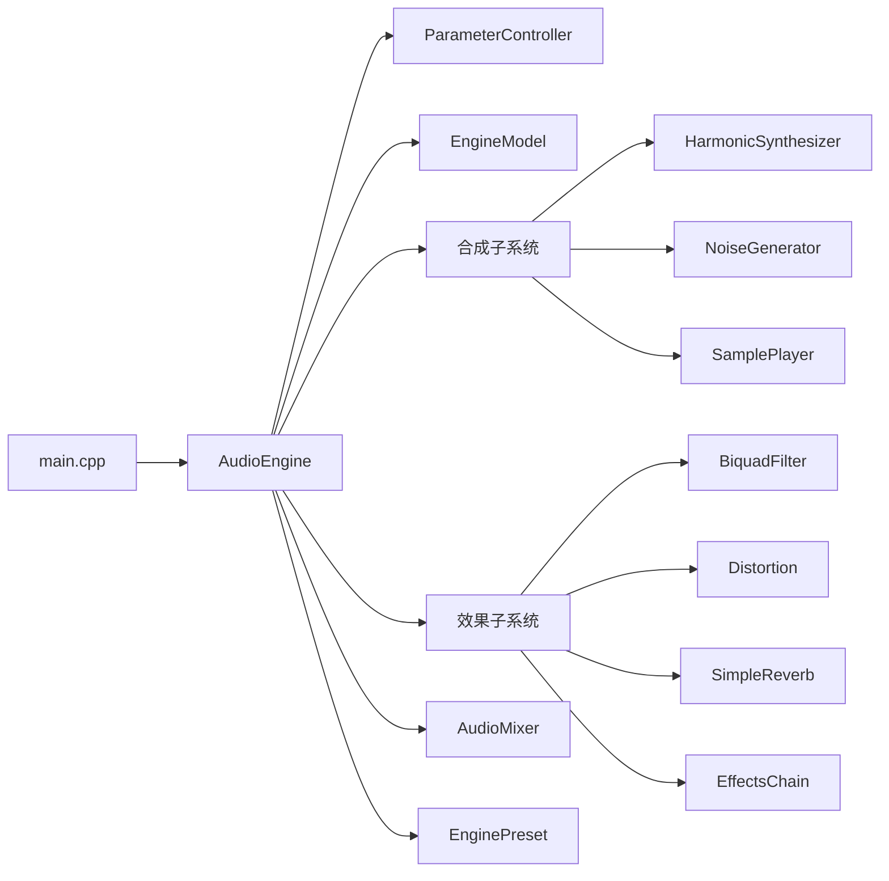

# 系统架构概览

<cite>
**本文档引用的文件**
- [src/main.cpp](file://src/main.cpp)
- [src/audio/audio_engine.h](file://src/audio/audio_engine.h)
- [src/audio/audio_engine.cpp](file://src/audio/audio_engine.cpp)
- [src/core/engine_model.h](file://src/core/engine_model.h)
- [src/core/parameter_controller.h](file://src/core/parameter_controller.h)
- [src/core/cylinder_bank.h](file://src/core/cylinder_bank.h)
- [src/synth/harmonic_synth.h](file://src/synth/harmonic_synth.h)
- [src/synth/noise_generator.h](file://src/synth/noise_generator.h)
- [src/synth/sample_player.h](file://src/synth/sample_player.h)
- [src/effects/biquad_filter.h](file://src/effects/biquad_filter.h)
- [src/effects/distortion.h](file://src/effects/distortion.h)
- [src/effects/reverb.h](file://src/effects/reverb.h)
- [src/effects/effects_chain.h](file://src/effects/effects_chain.h)
- [src/mixer/audio_mixer.h](file://src/mixer/audio_mixer.h)
- [src/presets/engine_preset.h](file://src/presets/engine_preset.h)
- [src/core/types.h](file://src/core/types.h)
- [src/core/constants.h](file://src/core/constants.h)
- [meson_options.txt](file://meson_options.txt)
</cite>

## 目录
1. [简介](#简介)
2. [项目结构](#项目结构)
3. [核心组件](#核心组件)
4. [架构总览](#架构总览)
5. [详细组件分析](#详细组件分析)
6. [依赖关系分析](#依赖关系分析)
7. [性能考量](#性能考量)
8. [故障排查指南](#故障排查指南)
9. [结论](#结论)
10. [附录](#附录)

## 简介
本项目是一个实时赛车声音引擎，目标是通过物理驱动的声音合成与效果处理，生成逼真的引擎声、进排气噪声与涡轮增压等效果。系统采用分层架构，将“物理建模”“声音合成”“效果处理”“混音输出”清晰分离，并通过参数桥接在控制线程与音频回调线程之间进行低延迟、无锁的数据交换。

设计理念与架构原则：
- 分层解耦：物理建模、声音合成、效果链、混音器、音频设备接口各司其职，降低耦合度。
- 实时优先：音频回调严格限制 CPU 占用，避免阻塞；参数传递采用三缓冲无锁通道。
- 可配置可扩展：预设系统统一管理引擎类型、谐波谱、滤波器与效果参数；效果链支持动态组合。
- 可移植与可测试：最小化外部依赖（仅使用 miniaudio），提供离线渲染与单元测试。

## 项目结构
项目采用按功能域分层的目录组织方式：
- src/main.cpp：演示程序入口，负责用户交互、参数更新与主循环。
- src/audio：音频引擎核心，封装设备初始化、回调、参数桥接与处理流水线。
- src/core：核心模型与常量定义，包含引擎物理模型、参数桥接、气缸组等。
- src/synth：声音合成子系统，包含谐波合成、噪声生成、采样播放。
- src/effects：效果处理子系统，包含滤波器、失真、混响与效果链。
- src/mixer：多声道混音器，提供通道增益、静音与混合输出。
- src/presets：引擎预设工厂，集中管理不同发动机类型的参数。
- tests：单元测试，覆盖混音器、引擎模型等关键模块。
- third_party：第三方库（miniaudio）。
- meson_options.txt：构建选项（采样率、缓冲帧数、是否构建示例与测试）。

图表来源
- [src/main.cpp:89-238](file://src/main.cpp#L89-L238)
- [src/audio/audio_engine.h:27-89](file://src/audio/audio_engine.h#L27-L89)
- [src/audio/audio_engine.cpp:102-160](file://src/audio/audio_engine.cpp#L102-L160)
- [src/core/engine_model.h:7-45](file://src/core/engine_model.h#L7-L45)
- [src/core/parameter_controller.h:20-58](file://src/core/parameter_controller.h#L20-L58)
- [src/core/cylinder_bank.h:9-38](file://src/core/cylinder_bank.h#L9-L38)
- [src/synth/harmonic_synth.h:8-25](file://src/synth/harmonic_synth.h#L8-L25)
- [src/synth/noise_generator.h:8-38](file://src/synth/noise_generator.h#L8-L38)
- [src/effects/biquad_filter.h](file://src/effects/biquad_filter.h)
- [src/effects/distortion.h:7-19](file://src/effects/distortion.h#L7-L19)
- [src/effects/reverb.h](file://src/effects/reverb.h)
- [src/effects/effects_chain.h:8-21](file://src/effects/effects_chain.h#L8-L21)
- [src/mixer/audio_mixer.h:9-34](file://src/mixer/audio_mixer.h#L9-L34)
- [src/presets/engine_preset.h:8-47](file://src/presets/engine_preset.h#L8-L47)

章节来源
- [src/main.cpp:89-238](file://src/main.cpp#L89-L238)
- [src/audio/audio_engine.h:27-89](file://src/audio/audio_engine.h#L27-L89)
- [src/audio/audio_engine.cpp:102-160](file://src/audio/audio_engine.cpp#L102-L160)
- [src/core/engine_model.h:7-45](file://src/core/engine_model.h#L7-L45)
- [src/core/parameter_controller.h:20-58](file://src/core/parameter_controller.h#L20-L58)
- [src/core/cylinder_bank.h:9-38](file://src/core/cylinder_bank.h#L9-L38)
- [src/synth/harmonic_synth.h:8-25](file://src/synth/harmonic_synth.h#L8-L25)
- [src/synth/noise_generator.h:8-38](file://src/synth/noise_generator.h#L8-L38)
- [src/effects/biquad_filter.h](file://src/effects/biquad_filter.h)
- [src/effects/distortion.h:7-19](file://src/effects/distortion.h#L7-L19)
- [src/effects/reverb.h](file://src/effects/reverb.h)
- [src/effects/effects_chain.h:8-21](file://src/effects/effects_chain.h#L8-L21)
- [src/mixer/audio_mixer.h:9-34](file://src/mixer/audio_mixer.h#L9-L34)
- [src/presets/engine_preset.h:8-47](file://src/presets/engine_preset.h#L8-L47)

## 核心组件
- 音频引擎核心（AudioEngine）
  - 负责设备初始化、音频回调、参数桥接、处理流水线调度与混音输出。
  - 关键职责：参数读取、预设应用、子模块配置、实时处理与软限幅。
- 物理建模系统（EngineModel）
  - 提供节气门、齿轮、离合状态下的引擎转速与负载计算。
  - 关键职责：固定步长更新、怠速/红线限制、齿轮比换算。
- 声音合成系统（HarmonicSynthesizer、NoiseGenerator、SamplePlayer）
  - 谐波合成：基于基础频率与负载生成叠加谐波。
  - 进排气噪声：带限白噪声，带通/低通滤波，幅度调制。
  - 采样播放：外置采样回放（如涡轮增压或排气脉冲）。
- 效果处理系统（BiquadFilter、Distortion、SimpleReverb、EffectsChain）
  - 二阶滤波：低通/带通参数化滤波。
  - 失真：非线性压缩与干湿混合。
  - 混响：简单房间模型。
  - 效果链：动态组合多个效果。
- 用户交互系统（main.cpp）
  - 键盘输入解析、节气门调节、档位切换、预设切换、状态显示与退出。

章节来源
- [src/audio/audio_engine.h:27-89](file://src/audio/audio_engine.h#L27-L89)
- [src/audio/audio_engine.cpp:102-160](file://src/audio/audio_engine.cpp#L102-L160)
- [src/core/engine_model.h:7-45](file://src/core/engine_model.h#L7-L45)
- [src/synth/harmonic_synth.h:8-25](file://src/synth/harmonic_synth.h#L8-L25)
- [src/synth/noise_generator.h:8-38](file://src/synth/noise_generator.h#L8-L38)
- [src/effects/biquad_filter.h](file://src/effects/biquad_filter.h)
- [src/effects/distortion.h:7-19](file://src/effects/distortion.h#L7-L19)
- [src/effects/reverb.h](file://src/effects/reverb.h)
- [src/effects/effects_chain.h:8-21](file://src/effects/effects_chain.h#L8-L21)
- [src/mixer/audio_mixer.h:9-34](file://src/mixer/audio_mixer.h#L9-L34)
- [src/main.cpp:89-238](file://src/main.cpp#L89-L238)

## 架构总览
系统采用“控制线程 + 音频回调线程”的双线程模型：
- 控制线程：处理用户输入、更新物理模型、写入参数桥。
- 音频回调线程：从参数桥读取最新参数、执行合成与效果处理、混音输出。

图表来源
- [src/main.cpp:146-233](file://src/main.cpp#L146-L233)
- [src/audio/audio_engine.cpp:102-160](file://src/audio/audio_engine.cpp#L102-L160)
- [src/core/parameter_controller.h:42-50](file://src/core/parameter_controller.h#L42-L50)
- [src/core/engine_model.h:15-22](file://src/core/engine_model.h#L15-L22)

## 详细组件分析

### 音频引擎核心（AudioEngine）
- 设计要点
  - 使用 miniaudio 的回调机制，确保严格的时间约束。
  - 三缓冲无锁参数桥，避免跨线程锁竞争。
  - 预设缓存与原子指针发布，保证音频线程读取一致性。
  - 处理流水线：气缸脉冲→排气滤波→失真→通道0；谐波→进气滤波→通道1；进排气噪声→通道2/3；采样→通道4；最终混音+主混响+软限幅。
- 关键流程

图表来源
- [src/audio/audio_engine.cpp:102-160](file://src/audio/audio_engine.cpp#L102-L160)

章节来源
- [src/audio/audio_engine.h:27-89](file://src/audio/audio_engine.h#L27-L89)
- [src/audio/audio_engine.cpp:18-68](file://src/audio/audio_engine.cpp#L18-L68)
- [src/audio/audio_engine.cpp:70-92](file://src/audio/audio_engine.cpp#L70-L92)
- [src/audio/audio_engine.cpp:102-160](file://src/audio/audio_engine.cpp#L102-L160)

### 物理建模系统（EngineModel）
- 设计要点
  - 固定步长更新，模拟引擎惯量、摩擦与最大扭矩。
  - 怠速/红线限制，齿轮比影响传动比与负载。
  - 节气门开度直接影响扭矩与加速度。
- 关键流程

图表来源
- [src/core/engine_model.h:15-22](file://src/core/engine_model.h#L15-L22)

章节来源
- [src/core/engine_model.h:7-45](file://src/core/engine_model.h#L7-L45)

### 声音合成系统
- 谐波合成（HarmonicSynthesizer）
  - 基于预设的谐波幅度谱，叠加多频正弦波，受负载调制。
- 进排气噪声（NoiseGenerator）
  - 带限白噪声，一阶带通滤波器，幅度随节气门开度变化。
- 采样播放（SamplePlayer）
  - 外部采样回放，用于涡轮增压或排气脉冲等效果。

章节来源
- [src/synth/harmonic_synth.h:8-25](file://src/synth/harmonic_synth.h#L8-L25)
- [src/synth/noise_generator.h:8-38](file://src/synth/noise_generator.h#L8-L38)
- [src/synth/sample_player.h](file://src/synth/sample_player.h)

### 效果处理系统
- 二阶滤波（BiquadFilter）
  - 支持低通/带通参数化滤波，用于模拟进排气共振。
- 失真（Distortion）
  - 非线性压缩与干湿混合，增强高转速的“咆哮感”。
- 混响（SimpleReverb）
  - 简单房间模型，营造空间感。
- 效果链（EffectsChain）
  - 动态组合多个效果，支持运行时调整。

章节来源
- [src/effects/biquad_filter.h](file://src/effects/biquad_filter.h)
- [src/effects/distortion.h:7-19](file://src/effects/distortion.h#L7-L19)
- [src/effects/reverb.h](file://src/effects/reverb.h)
- [src/effects/effects_chain.h:8-21](file://src/effects/effects_chain.h#L8-L21)

### 混音与输出（AudioMixer）
- 设计要点
  - 多通道累加缓冲，支持通道增益与静音。
  - 渲染时清空通道缓冲，避免泄漏。
- 关键流程

图表来源
- [src/mixer/audio_mixer.h:16-22](file://src/mixer/audio_mixer.h#L16-L22)

章节来源
- [src/mixer/audio_mixer.h:9-34](file://src/mixer/audio_mixer.h#L9-L34)

### 参数桥接（ParameterController）
- 设计要点
  - 三缓冲无锁参数桥，控制线程写、音频线程读，避免锁与分配。
  - 发布/就绪/读索引原子切换，确保可见性与顺序。
- 关键流程

图表来源
- [src/core/parameter_controller.h:32-50](file://src/core/parameter_controller.h#L32-L50)

章节来源
- [src/core/parameter_controller.h:20-58](file://src/core/parameter_controller.h#L20-L58)

### 预设系统（EnginePreset）
- 设计要点
  - 统一管理引擎类型（I4/V8交叉/平面）、点火相位、谐波谱、滤波器与效果参数。
  - 工厂函数提供默认预设，便于快速加载。
- 关键字段
  - 基础参数：气缸数、冲程、怠速/红线、惯量。
  - 点火模式：相位偏移与发火顺序。
  - 谐波谱：各次谐波幅度与数量。
  - 滤波器：进排气共振频率与品质因数。
  - 效果：失真驱动/混合、混响尺寸/阻尼/混合。
  - 噪声：进排气噪声中心频率、带宽与幅度。

章节来源
- [src/presets/engine_preset.h:8-47](file://src/presets/engine_preset.h#L8-L47)

## 依赖关系分析
- 模块内聚与耦合
  - AudioEngine 作为编排者，聚合各子系统但不直接暴露内部实现细节。
  - ParameterController 与 EngineModel 通过 EngineParams 解耦，避免直接耦合。
  - EffectsChain 以接口 IEffect 抽象，便于替换与扩展。
- 外部依赖
  - miniaudio：音频设备与回调。
  - C++ 标准库：容器、原子、时间工具。
- 数据流
  - 输入：用户按键 → 控制线程更新 EngineModel → set_params 写入参数桥 → 音频回调读取 → 合成/效果 → 输出。
  - 预设：load_preset 应用到各子模块参数。

图表来源
- [src/main.cpp:89-238](file://src/main.cpp#L89-L238)
- [src/audio/audio_engine.h:58-69](file://src/audio/audio_engine.h#L58-L69)
- [src/presets/engine_preset.h:49-52](file://src/presets/engine_preset.h#L49-L52)

章节来源
- [src/main.cpp:89-238](file://src/main.cpp#L89-L238)
- [src/audio/audio_engine.h:58-69](file://src/audio/audio_engine.h#L58-L69)

## 性能考量
- 缓冲区管理
  - 音频回调使用固定大小的临时缓冲（MAX_SCRATCH），避免堆分配与碎片。
  - 预设与参数通过原子指针与三缓冲避免频繁拷贝。
- 线程同步
  - ParameterController 采用三缓冲无锁通道，发布/就绪/读索引原子切换，减少锁竞争。
  - 预设指针使用原子发布，音频线程只读。
- 延迟控制
  - 控制循环固定约 16.67ms 步长，保证输入响应与渲染节奏一致。
  - 音频回调严格限制 CPU 时间，避免欠载/过载。
- 计算复杂度
  - 合成与效果处理均为 O(N)（N 为帧数），适合实时渲染。
  - 滤波器与失真为低阶算法，满足实时要求。
- 扩展性建议
  - 新增效果：实现 IEffect 接口并通过 EffectsChain 组合。
  - 新增引擎类型：新增 EnginePreset 并在 AudioEngine::load_preset 中应用。
  - 多声道输出：扩展 AudioMixer 通道数与路由策略。

[本节为通用性能讨论，无需特定文件引用]

## 故障排查指南
- 无法初始化音频设备
  - 检查设备权限与驱动状态；确认采样率与缓冲帧数配置。
  - 参考路径：[src/audio/audio_engine.cpp:18-44](file://src/audio/audio_engine.cpp#L18-L44)
- 声音断断续续或爆音
  - 检查缓冲帧数是否过大导致延迟；确认混响与失真参数是否过度。
  - 参考路径：[src/audio/audio_engine.cpp:155-159](file://src/audio/audio_engine.cpp#L155-L159)
- 参数未生效
  - 确认控制线程已调用 set_params，音频线程已读取最新参数。
  - 参考路径：[src/core/parameter_controller.h:32-50](file://src/core/parameter_controller.h#L32-L50)
- 预设切换无效
  - 确认 load_preset 已调用且子模块参数已更新。
  - 参考路径：[src/audio/audio_engine.cpp:70-92](file://src/audio/audio_engine.cpp#L70-L92)

章节来源
- [src/audio/audio_engine.cpp:18-44](file://src/audio/audio_engine.cpp#L18-L44)
- [src/audio/audio_engine.cpp:70-92](file://src/audio/audio_engine.cpp#L70-L92)
- [src/core/parameter_controller.h:32-50](file://src/core/parameter_controller.h#L32-L50)

## 结论
该赛车声音引擎通过清晰的分层架构与严格的实时约束，实现了从物理建模到声音合成再到效果处理的完整链路。参数桥接与预设系统提供了良好的扩展性与可维护性。未来可在多声道输出、更丰富的引擎类型与效果库、以及可视化调试工具等方面进一步演进。

[本节为总结性内容，无需特定文件引用]

## 附录
- 构建选项
  - 采样率：默认 48000 Hz
  - 缓冲帧数：默认 512 帧
  - 是否构建示例：默认开启
  - 是否构建测试：默认开启
- 参考路径：[meson_options.txt:1-5](file://meson_options.txt#L1-L5)

章节来源
- [meson_options.txt:1-5](file://meson_options.txt#L1-L5)