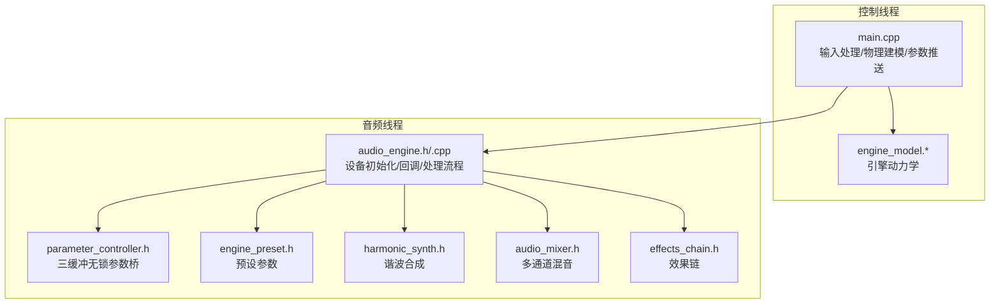
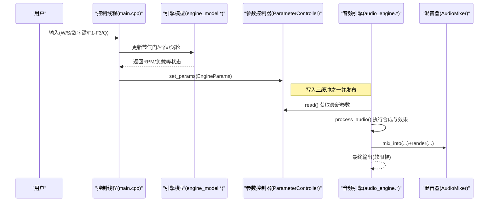
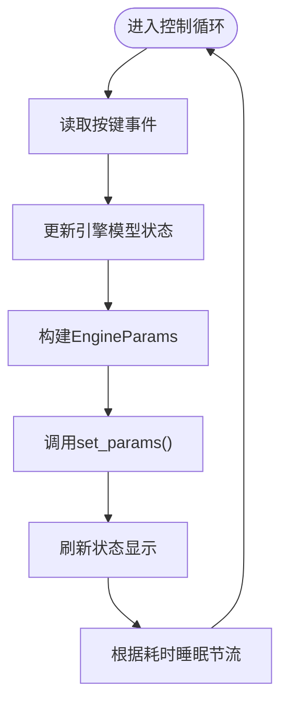
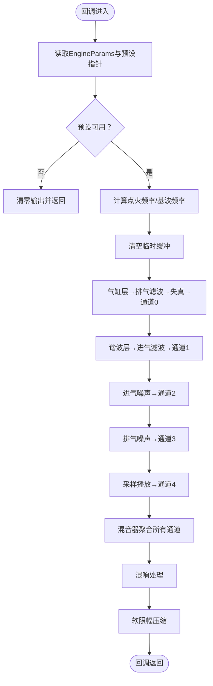
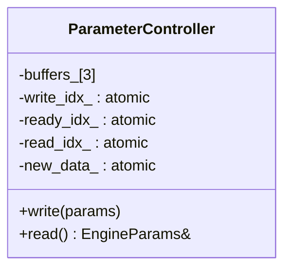
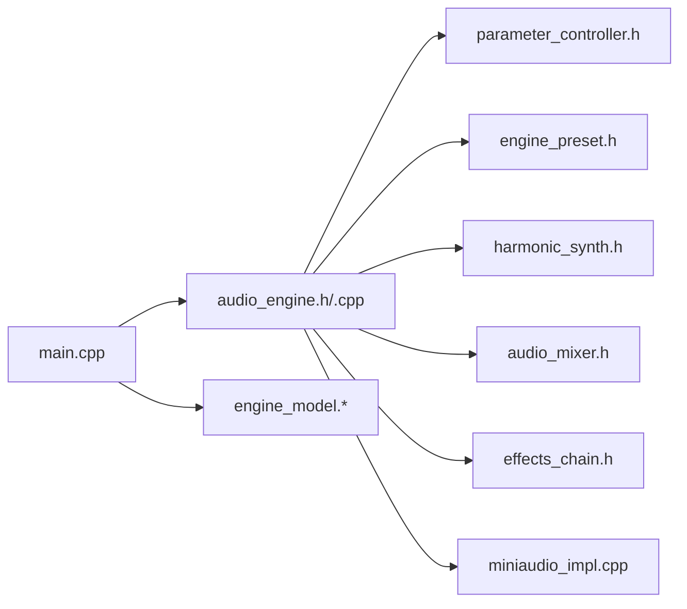

# 线程模型设计

<cite>
**本文引用的文件**
- [src/main.cpp](file://src/main.cpp)
- [src/audio/audio_engine.h](file://src/audio/audio_engine.h)
- [src/audio/audio_engine.cpp](file://src/audio/audio_engine.cpp)
- [src/core/parameter_controller.h](file://src/core/parameter_controller.h)
- [src/core/engine_model.h](file://src/core/engine_model.h)
- [src/core/engine_model.cpp](file://src/core/engine_model.cpp)
- [src/mixer/audio_mixer.h](file://src/mixer/audio_mixer.h)
- [src/syncthreads/harmonic_synth.h](file://src/synth/harmonic_synth.h)
- [src/effects/effects_chain.h](file://src/effects/effects_chain.h)
- [src/presets/engine_preset.h](file://src/presets/engine_preset.h)
- [src/core/constants.h](file://src/core/constants.h)
- [src/core/types.h](file://src/core/types.h)
- [src/audio/miniaudio_impl.cpp](file://src/audio/miniaudio_impl.cpp)
- [tests/test_parameter_controller.cpp](file://tests/test_parameter_controller.cpp)
</cite>

## 目录
1. [引言](#引言)
2. [项目结构](#项目结构)
3. [核心组件](#核心组件)
4. [架构总览](#架构总览)
5. [详细组件分析](#详细组件分析)
6. [依赖关系分析](#依赖关系分析)
7. [性能考虑](#性能考虑)
8. [故障排查指南](#故障排查指南)
9. [结论](#结论)
10. [附录](#附录)

## 引言
本设计文档聚焦赛车声音引擎的线程模型与实时音频系统架构，围绕“控制线程”与“音频线程”的职责划分、线程间通信机制（尤其是 ParameterController 的无锁设计）、参数发布与读取的时序保障、以及音频回调函数的线程安全与异常处理进行深入解析。同时给出实时性要求下的优先级与调度策略建议、死锁规避原则、性能优化与调试技巧。

## 项目结构
该工程采用按功能域分层的组织方式：顶层入口负责用户交互与物理建模；音频子系统通过 miniaudio 驱动设备回调；核心模块提供参数桥接与引擎模型；合成与效果链路在音频线程中执行；混音器统一汇聚多通道输出。

图表来源
- [src/main.cpp:89-239](file://src/main.cpp#L89-L239)
- [src/audio/audio_engine.h:27-89](file://src/audio/audio_engine.h#L27-L89)
- [src/audio/audio_engine.cpp:18-160](file://src/audio/audio_engine.cpp#L18-L160)
- [src/core/parameter_controller.h:20-58](file://src/core/parameter_controller.h#L20-L58)
- [src/core/engine_model.h:7-45](file://src/core/engine_model.h#L7-L45)
- [src/synth/harmonic_synth.h:8-25](file://src/synth/harmonic_synth.h#L8-L25)
- [src/mixer/audio_mixer.h:9-34](file://src/mixer/audio_mixer.h#L9-L34)
- [src/effects/effects_chain.h:8-21](file://src/effects/effects_chain.h#L8-L21)
- [src/presets/engine_preset.h:8-47](file://src/presets/engine_preset.h#L8-L47)

章节来源
- [src/main.cpp:89-239](file://src/main.cpp#L89-L239)
- [src/audio/audio_engine.h:27-89](file://src/audio/audio_engine.h#L27-L89)
- [src/audio/audio_engine.cpp:18-160](file://src/audio/audio_engine.cpp#L18-L160)
- [src/core/parameter_controller.h:20-58](file://src/core/parameter_controller.h#L20-L58)
- [src/core/engine_model.h:7-45](file://src/core/engine_model.h#L7-L45)
- [src/synth/harmonic_synth.h:8-25](file://src/synth/harmonic_synth.h#L8-L25)
- [src/mixer/audio_mixer.h:9-34](file://src/mixer/audio_mixer.h#L9-L34)
- [src/effects/effects_chain.h:8-21](file://src/effects/effects_chain.h#L8-L21)
- [src/presets/engine_preset.h:8-47](file://src/presets/engine_preset.h#L8-L47)

## 核心组件
- 控制线程（用户交互与物理建模）
  - 负责键盘输入解析、节气门/档位/涡轮等状态更新、引擎动力学计算、参数打包与推送。
  - 以约 60Hz 的固定节奏运行，确保参数变化平滑且可预测。
- 音频线程（实时音频回调）
  - 由 miniaudio 设备回调触发，负责参数读取、音频生成、效果处理与最终渲染。
  - 使用三缓冲无锁参数桥实现零拷贝、零分配的参数发布与消费。
- 参数控制器（ParameterController）
  - 三缓冲环形交换，写端与读端完全解耦，避免锁竞争与阻塞。
  - 原子布尔标记 new_data_ 用于提示读端是否需要切换缓冲区。
- 预设参数（EnginePreset）
  - 通过原子指针在音频线程安全可见，避免读端竞态。
- 混音器（AudioMixer）
  - 多通道累加后一次性渲染，减少分支判断与条件逻辑开销。
- 合成与效果链
  - 各模块独立处理，音频线程内顺序拼接，保证时序一致性。

章节来源
- [src/main.cpp:143-233](file://src/main.cpp#L143-L233)
- [src/audio/audio_engine.cpp:102-160](file://src/audio/audio_engine.cpp#L102-L160)
- [src/core/parameter_controller.h:20-58](file://src/core/parameter_controller.h#L20-L58)
- [src/presets/engine_preset.h:8-47](file://src/presets/engine_preset.h#L8-L47)
- [src/mixer/audio_mixer.h:9-34](file://src/mixer/audio_mixer.h#L9-L34)

## 架构总览
下图展示从用户输入到音频输出的完整时序路径，强调控制线程与音频线程的边界与协作点。

图表来源
- [src/main.cpp:146-214](file://src/main.cpp#L146-L214)
- [src/core/engine_model.cpp:21-52](file://src/core/engine_model.cpp#L21-L52)
- [src/core/parameter_controller.h:32-50](file://src/core/parameter_controller.h#L32-L50)
- [src/audio/audio_engine.cpp:94-160](file://src/audio/audio_engine.cpp#L94-L160)
- [src/mixer/audio_mixer.h:16-22](file://src/mixer/audio_mixer.h#L16-L22)

## 详细组件分析

### 控制线程职责与调度
- 输入处理：非阻塞读取键盘事件，支持跨平台兼容。
- 物理建模：以固定步长更新引擎状态，模拟扭矩、摩擦与惯量，维持 RPM 在怠速与红线之间。
- 参数推送：将当前状态封装为 EngineParams 并调用 AudioEngine::set_params，内部委托 ParameterController::write。
- 显示与节流：每帧刷新状态显示，并通过睡眠维持约 60Hz 的控制循环频率。

图表来源
- [src/main.cpp:146-233](file://src/main.cpp#L146-L233)
- [src/core/engine_model.cpp:21-52](file://src/core/engine_model.cpp#L21-L52)

章节来源
- [src/main.cpp:89-239](file://src/main.cpp#L89-L239)
- [src/core/engine_model.h:7-45](file://src/core/engine_model.h#L7-L45)
- [src/core/engine_model.cpp:21-52](file://src/core/engine_model.cpp#L21-L52)

### 音频线程职责与回调
- 设备初始化：配置采样率、缓冲帧数、单声道输出、数据回调函数。
- 回调函数：由 miniaudio 在音频线程中调用，内部委托 AudioEngine::process_audio。
- 参数读取：从 ParameterController 读取最新 EngineParams，同时加载当前预设指针。
- 处理流水线：气缸冲激层→排气滤波→失真→混音通道0；谐波合成层→进气滤波→混音通道1；进气/排气噪声→通道2/3；采样播放→通道4；最终混音+混响+软限幅输出。

图表来源
- [src/audio/audio_engine.cpp:18-45](file://src/audio/audio_engine.cpp#L18-L45)
- [src/audio/audio_engine.cpp:102-160](file://src/audio/audio_engine.cpp#L102-L160)
- [src/core/parameter_controller.h:42-50](file://src/core/parameter_controller.h#L42-L50)
- [src/presets/engine_preset.h:8-47](file://src/presets/engine_preset.h#L8-L47)

章节来源
- [src/audio/audio_engine.h:27-89](file://src/audio/audio_engine.h#L27-L89)
- [src/audio/audio_engine.cpp:18-68](file://src/audio/audio_engine.cpp#L18-L68)
- [src/audio/audio_engine.cpp:102-160](file://src/audio/audio_engine.cpp#L102-L160)

### ParameterController 线程安全设计
- 三缓冲结构：buffers_[3]，配合 write_idx_/ready_idx_/read_idx_ 三个原子索引，实现写端与读端无锁交换。
- 发布语义：写端完成一次完整写入后，通过 exchange 交换 ready 与 write，随后 release 写入新数据标记。
- 消费语义：读端仅在 new_data_ 为 true 时才交换 read 与 ready，确保读到完整的一帧参数。
- 初始状态：构造时将 buffers 初始化为空闲状态，索引按写-就绪-读顺序排列，new_data_ 初始为 false。

图表来源
- [src/core/parameter_controller.h:20-58](file://src/core/parameter_controller.h#L20-L58)

章节来源
- [src/core/parameter_controller.h:20-58](file://src/core/parameter_controller.h#L20-L58)
- [tests/test_parameter_controller.cpp:35-85](file://tests/test_parameter_controller.cpp#L35-L85)

### 原子变量与无锁数据结构选择
- 原子布尔 new_data_：轻量标记，避免忙等待，读端按需切换缓冲。
- 原子整型索引：保证多缓冲交换的可见性与顺序一致性。
- 原子指针 current_preset_：音频线程安全读取预设，避免竞态。
- 运行状态 running_：用于启动/停止设备，发布-获取内存序保证可见性。

章节来源
- [src/audio/audio_engine.h:56-73](file://src/audio/audio_engine.h#L56-L73)
- [src/audio/audio_engine.cpp:47-68](file://src/audio/audio_engine.cpp#L47-L68)
- [src/core/parameter_controller.h:26-39](file://src/core/parameter_controller.h#L26-L39)

### 实时性要求与调度策略
- 回调时延：miniaudio 回调在音频线程中被驱动，必须在回调内完成参数读取与音频处理，避免阻塞。
- 控制线程节拍：控制循环以固定周期推进，避免抖动导致参数更新不连续。
- 缓冲策略：MAX_SCRATCH 限制临时缓冲大小，防止栈溢出与缓存抖动。
- 优先级与调度：在实时系统中应提升音频线程优先级，避免系统调度导致的抖动；避免在音频线程中进行阻塞 I/O 或长时间计算。

章节来源
- [src/audio/audio_engine.h:76-82](file://src/audio/audio_engine.h#L76-L82)
- [src/main.cpp:143-233](file://src/main.cpp#L143-L233)
- [src/core/constants.h:15-17](file://src/core/constants.h#L15-L17)

### 死锁避免与异常处理
- 死锁规避：ParameterController 无锁设计消除了互斥锁带来的死锁风险；音频线程不持有任何锁，避免与控制线程互相等待。
- 异常处理：音频回调内不抛出异常；若发生错误，应在上层捕获并优雅降级（如静音输出）或停止设备。
- 资源释放：AudioEngine 提供 shutdown 流程，确保设备停止、反初始化与资源回收。

章节来源
- [src/audio/audio_engine.cpp:61-68](file://src/audio/audio_engine.cpp#L61-L68)
- [src/audio/audio_engine.cpp:108-111](file://src/audio/audio_engine.cpp#L108-L111)

## 依赖关系分析
- 控制线程依赖：main.cpp 依赖 engine_model.* 与 AudioEngine 接口；AudioEngine 依赖 miniaudio 实现。
- 音频线程依赖：AudioEngine 依赖 ParameterController、EnginePreset、各合成与效果模块、AudioMixer。
- 数据依赖：EngineParams 通过三缓冲在两线程间传递；EnginePreset 通过原子指针在音频线程可见。

图表来源
- [src/main.cpp:89-239](file://src/main.cpp#L89-L239)
- [src/audio/audio_engine.h:27-89](file://src/audio/audio_engine.h#L27-L89)
- [src/audio/audio_engine.cpp:18-160](file://src/audio/audio_engine.cpp#L18-L160)
- [src/core/parameter_controller.h:20-58](file://src/core/parameter_controller.h#L20-L58)
- [src/presets/engine_preset.h:8-47](file://src/presets/engine_preset.h#L8-L47)
- [src/synth/harmonic_synth.h:8-25](file://src/synth/harmonic_synth.h#L8-L25)
- [src/mixer/audio_mixer.h:9-34](file://src/mixer/audio_mixer.h#L9-L34)
- [src/effects/effects_chain.h:8-21](file://src/effects/effects_chain.h#L8-L21)
- [src/audio/miniaudio_impl.cpp:1-6](file://src/audio/miniaudio_impl.cpp#L1-L6)

章节来源
- [src/main.cpp:89-239](file://src/main.cpp#L89-L239)
- [src/audio/audio_engine.h:27-89](file://src/audio/audio_engine.h#L27-L89)
- [src/audio/audio_engine.cpp:18-160](file://src/audio/audio_engine.cpp#L18-L160)
- [src/core/parameter_controller.h:20-58](file://src/core/parameter_controller.h#L20-L58)
- [src/presets/engine_preset.h:8-47](file://src/presets/engine_preset.h#L8-L47)
- [src/synth/harmonic_synth.h:8-25](file://src/synth/harmonic_synth.h#L8-L25)
- [src/mixer/audio_mixer.h:9-34](file://src/mixer/audio_mixer.h#L9-L34)
- [src/effects/effects_chain.h:8-21](file://src/effects/effects_chain.h#L8-L21)
- [src/audio/miniaudio_impl.cpp:1-6](file://src/audio/miniaudio_impl.cpp#L1-L6)

## 性能考虑
- 无锁参数桥：三缓冲避免锁与分配，降低 CPU 缓存争用与上下文切换。
- 原子指针与布尔：new_data_ 与 current_preset_ 使用原子操作，最小化内存屏障开销。
- 固定缓冲大小：MAX_SCRATCH 限制临时缓冲，减少动态分配与 TLB 抖动。
- 单声道输出：简化混音与 I/O，降低带宽压力。
- 软限幅：在回调末尾进行 tanh 压缩，避免昂贵的峰值检测与削波逻辑。
- 预设参数原子发布：避免音频线程中的分支判断与重复加载。

章节来源
- [src/core/parameter_controller.h:18-20](file://src/core/parameter_controller.h#L18-L20)
- [src/audio/audio_engine.h:76-82](file://src/audio/audio_engine.h#L76-L82)
- [src/audio/audio_engine.cpp:155-159](file://src/audio/audio_engine.cpp#L155-L159)
- [src/presets/engine_preset.h:8-47](file://src/presets/engine_preset.h#L8-L47)

## 故障排查指南
- 参数不同步：检查控制线程是否频繁调用 set_params，音频线程是否正确 read；确认三缓冲索引交换顺序。
- 预设未生效：确认 AudioEngine::load_preset 已调用并发布 current_preset_，音频线程是否使用了原子加载。
- 回调卡顿：检查 process_audio 是否包含阻塞操作或过长计算；确认 MAX_SCRATCH 足够大且未越界。
- 资源泄漏：确保 shutdown 被调用，设备已停止并反初始化。
- 单元测试验证：使用 test_parameter_controller.cpp 验证并发读写的正确性与一致性。

章节来源
- [src/audio/audio_engine.cpp:70-92](file://src/audio/audio_engine.cpp#L70-L92)
- [src/audio/audio_engine.cpp:102-160](file://src/audio/audio_engine.cpp#L102-L160)
- [tests/test_parameter_controller.cpp:35-85](file://tests/test_parameter_controller.cpp#L35-L85)

## 结论
该线程模型通过“控制线程 + 音频线程 + 三缓冲无锁参数桥”的组合，在保证实时性的前提下实现了高吞吐与低延迟。参数发布与消费严格分离，避免锁与阻塞；音频回调内仅做纯计算与 I/O，确保稳定时序。结合原子变量与固定缓冲策略，系统具备良好的可扩展性与可维护性。

## 附录
- 关键类型定义：采样、帧数、采样率等基础类型定义清晰，便于跨模块一致使用。
- 默认配置：默认采样率与缓冲帧数可在编译期与运行时调整，满足不同硬件与实时性需求。

章节来源
- [src/core/types.h:7-9](file://src/core/types.h#L7-L9)
- [src/core/constants.h:15-16](file://src/core/constants.h#L15-L16)