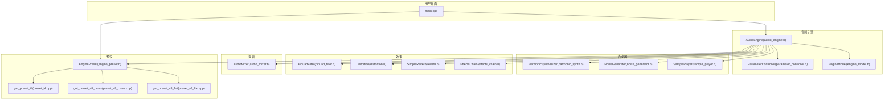
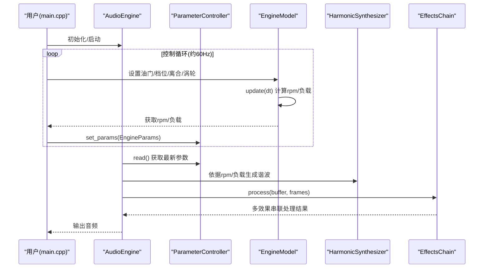
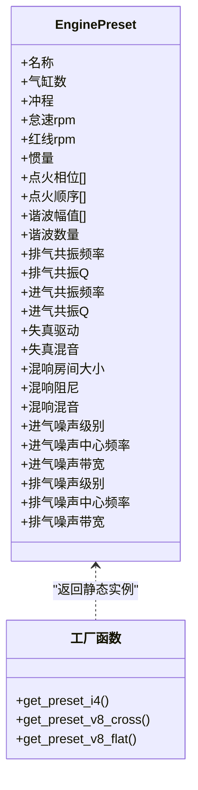
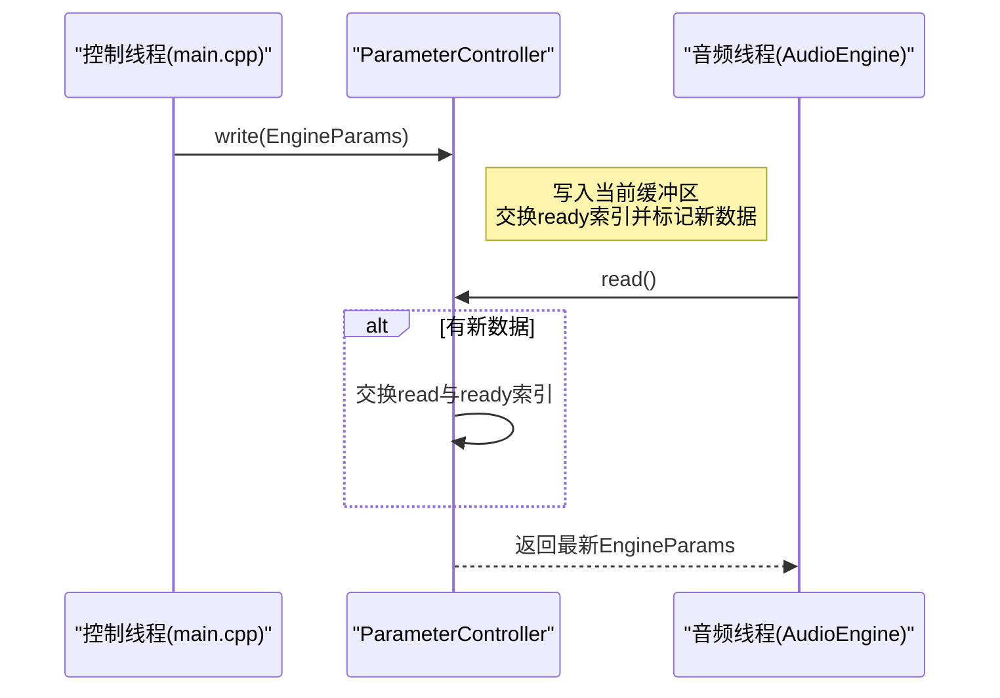
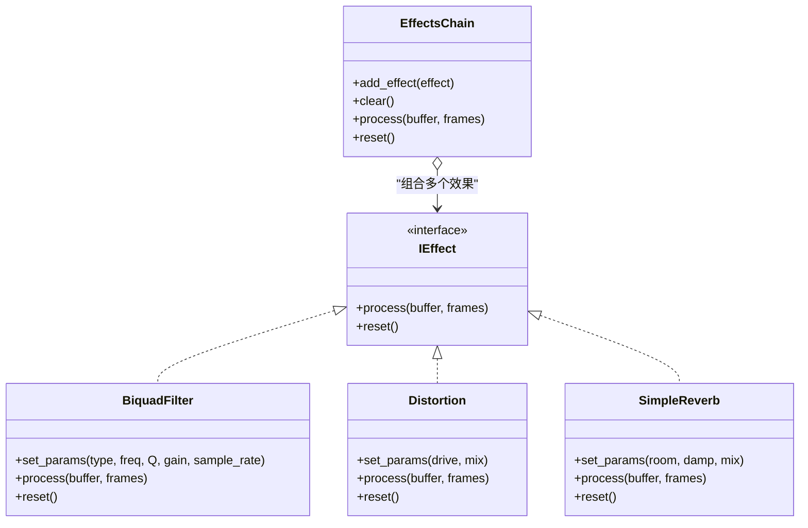
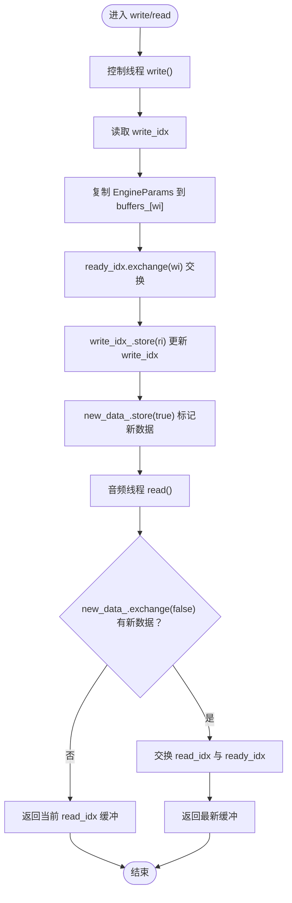
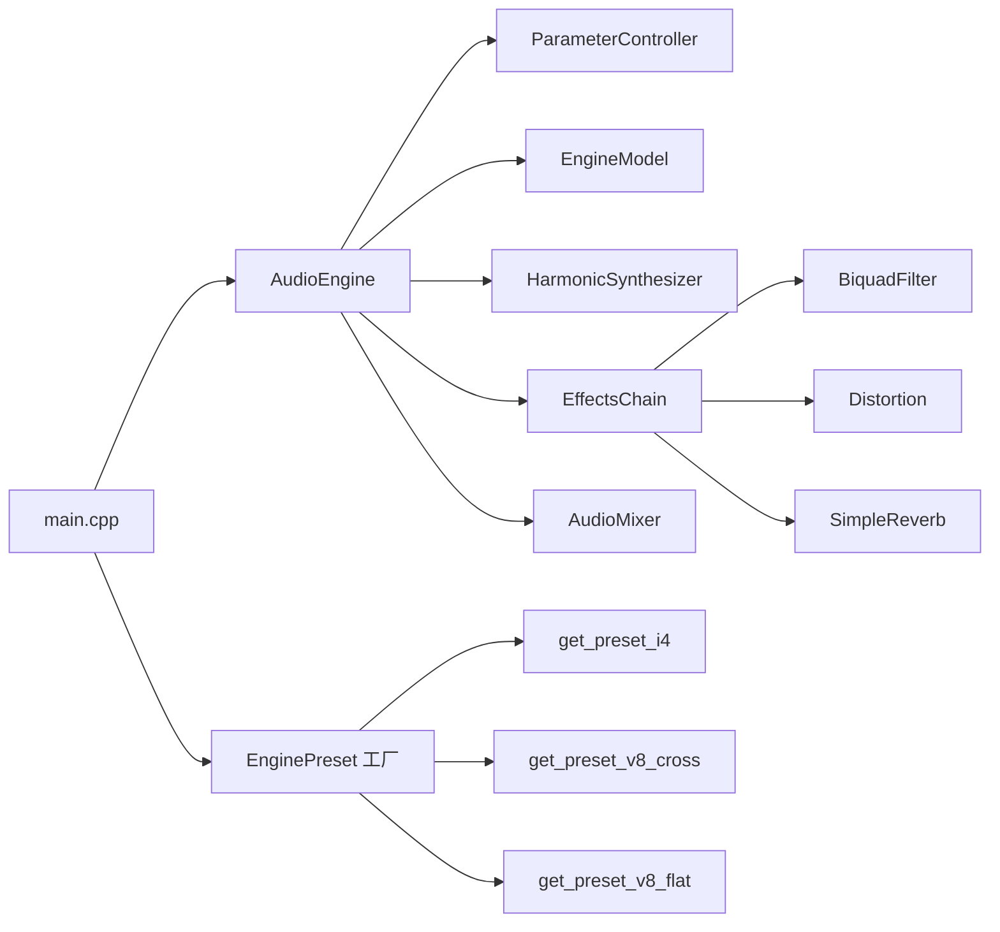

# 设计模式应用

<cite>
**本文引用的文件**
- [engine_preset.h](file://src/presets/engine_preset.h)
- [preset_i4.cpp](file://src/presets/preset_i4.cpp)
- [preset_v8_cross.cpp](file://src/presets/preset_v8_cross.cpp)
- [preset_v8_flat.cpp](file://src/presets/preset_v8_flat.cpp)
- [parameter_controller.h](file://src/core/parameter_controller.h)
- [effects_chain.h](file://src/effects/effects_chain.h)
- [effects_chain.cpp](file://src/effects/effects_chain.cpp)
- [biquad_filter.h](file://src/effects/biquad_filter.h)
- [audio_engine.h](file://src/audio/audio_engine.h)
- [engine_model.h](file://src/core/engine_model.h)
- [main.cpp](file://src/main.cpp)
- [types.h](file://src/core/types.h)
- [constants.h](file://src/core/constants.h)
- [test_effects_chain.cpp](file://tests/test_effects_chain.cpp)
- [test_parameter_controller.cpp](file://tests/test_parameter_controller.cpp)
</cite>

## 目录
1. [引言](#引言)
2. [项目结构](#项目结构)
3. [核心组件](#核心组件)
4. [架构总览](#架构总览)
5. [详细组件分析](#详细组件分析)
6. [依赖分析](#依赖分析)
7. [性能考虑](#性能考虑)
8. [故障排查指南](#故障排查指南)
9. [结论](#结论)
10. [附录](#附录)

## 引言
本文件聚焦于赛车声音引擎中的设计模式应用，围绕以下主题展开：  
- 工厂模式在“发动机预设系统”中的实现（EnginePreset 基类与具体预设工厂函数）。  
- 观察者模式在“参数控制系统”中的应用（ParameterController 与 AudioEngine 的松耦合通信）。  
- 组合模式在“效果链系统”中的使用（EffectsChain 的可插拔架构）。  

文档通过代码级图示、流程图与最佳实践建议，帮助读者快速理解并复用这些模式。

## 项目结构
项目采用按功能域分层的组织方式：  
- 核心模块：引擎物理模型、参数控制器、类型与常量定义。  
- 合成器模块：谐波合成、噪声生成、采样播放等音源合成单元。  
- 效果模块：滤波、失真、混响等效果，以及效果链组合。  
- 混音模块：多通道混合与输出。  
- 预设模块：不同发动机类型的预设数据与工厂函数。  
- 音频引擎：对外接口、设备回调、处理管线编排。  
- 示例与测试：控制台交互演示与单元测试。

**图表来源**
- [main.cpp:89-239](file://src/main.cpp#L89-L239)
- [audio_engine.h:27-92](file://src/audio/audio_engine.h#L27-L92)
- [parameter_controller.h:20-61](file://src/core/parameter_controller.h#L20-L61)
- [engine_model.h:7-48](file://src/core/engine_model.h#L7-L48)
- [effects_chain.h:8-24](file://src/effects/effects_chain.h#L8-L24)
- [effects_chain.cpp:5-30](file://src/effects/effects_chain.cpp#L5-L30)
- [biquad_filter.h:18-45](file://src/effects/biquad_filter.h#L18-L45)
- [engine_preset.h:8-55](file://src/presets/engine_preset.h#L8-L55)
- [preset_i4.cpp:5-56](file://src/presets/preset_i4.cpp#L5-L56)
- [preset_v8_cross.cpp:5-63](file://src/presets/preset_v8_cross.cpp#L5-L63)
- [preset_v8_flat.cpp:5-62](file://src/presets/preset_v8_flat.cpp#L5-L62)

**章节来源**
- [main.cpp:89-239](file://src/main.cpp#L89-L239)
- [audio_engine.h:27-92](file://src/audio/audio_engine.h#L27-L92)

## 核心组件
- 发动机预设系统：以 EnginePreset 结构体承载预设参数，并通过工厂函数返回静态实例，实现“按需获取、零拷贝”的预设读取。  
- 参数控制器：三缓冲无锁参数桥，控制线程写入、音频线程读取，避免同步开销与分配。  
- 效果链系统：基于 IEffect 接口的组合模式，支持动态添加/移除效果，形成可插拔处理链。  
- 音频引擎：编排各子模块，负责初始化、启动、停止、渲染与回调；暴露加载预设与设置参数的接口。

**章节来源**
- [engine_preset.h:8-55](file://src/presets/engine_preset.h#L8-L55)
- [parameter_controller.h:20-61](file://src/core/parameter_controller.h#L20-L61)
- [effects_chain.h:8-24](file://src/effects/effects_chain.h#L8-L24)
- [effects_chain.cpp:5-30](file://src/effects/effects_chain.cpp#L5-L30)
- [audio_engine.h:27-92](file://src/audio/audio_engine.h#L27-L92)

## 架构总览
音频引擎在主线程初始化后，启动音频设备回调。回调中由 AudioEngine 调度各子模块进行合成与处理，并通过 EffectsChain 将多个效果串联。参数控制器在控制线程更新 EngineParams，在音频线程安全读取，从而实现低延迟、无阻塞的参数传递。

**图表来源**
- [main.cpp:146-233](file://src/main.cpp#L146-L233)
- [audio_engine.h:27-92](file://src/audio/audio_engine.h#L27-L92)
- [parameter_controller.h:20-61](file://src/core/parameter_controller.h#L20-L61)
- [engine_model.h:7-48](file://src/core/engine_model.h#L7-L48)
- [effects_chain.cpp:17-27](file://src/effects/effects_chain.cpp#L17-L27)

## 详细组件分析

### 工厂模式：发动机预设系统
- 设计要点
  - EnginePreset 作为“产品”，包含气缸数、冲程、怠速/红线转速、惯量、点火相位与顺序、谐波幅值、滤波与效果参数、进排气噪声参数等。  
  - 工厂函数（如 get_preset_i4、get_preset_v8_cross、get_preset_v8_flat）返回静态 EnginePreset 的引用，确保只构造一次、多次读取，避免重复分配与拷贝。  
  - 具体预设类未在头文件中显式定义，而是通过独立 cpp 文件实现，形成“产品族”的集中管理。

- 代码示例路径
  - [EnginePreset 定义与工厂声明:8-55](file://src/presets/engine_preset.h#L8-L55)
  - [I4 预设工厂实现:5-56](file://src/presets/preset_i4.cpp#L5-L56)
  - [V8 交叉曲柄预设工厂实现:5-63](file://src/presets/preset_v8_cross.cpp#L5-L63)
  - [V8 平面曲柄预设工厂实现:5-62](file://src/presets/preset_v8_flat.cpp#L5-L62)

- 最佳实践
  - 使用静态局部变量保证单例式工厂返回的唯一实例。  
  - 将预设常量与计算逻辑封装在工厂内部，调用方仅通过函数名识别预设类型。  
  - 若需扩展新预设，新增 cpp 文件并在头文件中声明对应工厂函数，遵循开闭原则。

**图表来源**
- [engine_preset.h:8-55](file://src/presets/engine_preset.h#L8-L55)
- [preset_i4.cpp:5-56](file://src/presets/preset_i4.cpp#L5-L56)
- [preset_v8_cross.cpp:5-63](file://src/presets/preset_v8_cross.cpp#L5-L63)
- [preset_v8_flat.cpp:5-62](file://src/presets/preset_v8_flat.cpp#L5-L62)

**章节来源**
- [engine_preset.h:8-55](file://src/presets/engine_preset.h#L8-L55)
- [preset_i4.cpp:5-56](file://src/presets/preset_i4.cpp#L5-L56)
- [preset_v8_cross.cpp:5-63](file://src/presets/preset_v8_cross.cpp#L5-L63)
- [preset_v8_flat.cpp:5-62](file://src/presets/preset_v8_flat.cpp#L5-L62)

### 观察者模式：参数控制系统
- 设计要点
  - ParameterController 提供“发布-订阅”式的参数传递：控制线程发布 EngineParams，音频线程订阅读取。  
  - 采用三缓冲与原子变量实现无锁读写，避免互斥锁带来的时延与死锁风险。  
  - AudioEngine 在音频回调中通过 read() 获取最新参数，结合 EngineModel 的状态，驱动合成与效果处理。

- 代码示例路径
  - [参数控制器类与三缓冲实现:20-61](file://src/core/parameter_controller.h#L20-L61)
  - [音频引擎参数读取与使用:49-84](file://src/audio/audio_engine.h#L49-L84)
  - [主循环参数推送:206-214](file://src/main.cpp#L206-L214)

- 最佳实践
  - 控制线程只调用 write()，音频线程只调用 read()，严格分离职责。  
  - 参数结构应尽量小且固定，减少缓存行竞争与内存占用。  
  - 对于需要跨线程共享的状态，优先使用原子变量或无锁队列。

**图表来源**
- [parameter_controller.h:32-50](file://src/core/parameter_controller.h#L32-L50)
- [main.cpp:206-214](file://src/main.cpp#L206-L214)
- [audio_engine.h:49-84](file://src/audio/audio_engine.h#L49-L84)

**章节来源**
- [parameter_controller.h:20-61](file://src/core/parameter_controller.h#L20-L61)
- [audio_engine.h:49-84](file://src/audio/audio_engine.h#L49-L84)
- [main.cpp:206-214](file://src/main.cpp#L206-L214)

### 组合模式：效果链系统
- 设计要点
  - IEffect 为统一接口，定义 process 与 reset 方法，确保所有效果具备一致行为。  
  - EffectsChain 实现 IEffect，内部维护 IEffect 指针数组，按顺序依次处理帧缓冲，形成“链式”处理。  
  - 支持动态添加/清空效果，便于在运行时调整处理链。

- 代码示例路径
  - [IEffect 接口与 BiquadFilter 实现:18-45](file://src/effects/biquad_filter.h#L18-L45)
  - [EffectsChain 类与实现:8-24](file://src/effects/effects_chain.h#L8-L24)
  - [EffectsChain::process 与 reset:17-27](file://src/effects/effects_chain.cpp#L17-L27)
  - [效果链测试：空链透传、单链处理、重置:11-75](file://tests/test_effects_chain.cpp#L11-L75)

- 最佳实践
  - 将效果视为“黑盒”，通过统一接口组合，便于替换与扩展。  
  - 注意处理顺序：滤波通常在失真之前，混响通常在链尾。  
  - 对于需要状态的记忆型效果，确保在 reset 中正确清理内部状态。

**图表来源**
- [biquad_filter.h:18-45](file://src/effects/biquad_filter.h#L18-L45)
- [effects_chain.h:8-24](file://src/effects/effects_chain.h#L8-L24)
- [effects_chain.cpp:7-27](file://src/effects/effects_chain.cpp#L7-L27)

**章节来源**
- [biquad_filter.h:18-45](file://src/effects/biquad_filter.h#L18-L45)
- [effects_chain.h:8-24](file://src/effects/effects_chain.h#L8-L24)
- [effects_chain.cpp:7-27](file://src/effects/effects_chain.cpp#L7-L27)
- [test_effects_chain.cpp:11-75](file://tests/test_effects_chain.cpp#L11-L75)

### 参数控制器算法流程（并发安全）

**图表来源**
- [parameter_controller.h:32-50](file://src/core/parameter_controller.h#L32-L50)

**章节来源**
- [parameter_controller.h:20-61](file://src/core/parameter_controller.h#L20-L61)
- [test_parameter_controller.cpp:19-84](file://tests/test_parameter_controller.cpp#L19-L84)

## 依赖分析
- 模块内聚与耦合
  - AudioEngine 作为编排者，聚合多个子模块，但通过接口与常量层解耦，降低对具体实现的依赖。  
  - 预设模块与参数控制器之间无直接耦合，通过 EnginePreset 指针与 AudioEngine 的 load_preset 接口交互。  
  - 效果链通过 IEffect 抽象与具体效果类解耦，支持热插拔。

- 关键依赖关系
  - main.cpp 依赖 AudioEngine 与 EnginePreset 工厂函数。  
  - AudioEngine 依赖 EngineModel、ParameterController、合成器与效果模块。  
  - 效果链依赖 IEffect 及其派生类。

**图表来源**
- [main.cpp:89-239](file://src/main.cpp#L89-L239)
- [audio_engine.h:27-92](file://src/audio/audio_engine.h#L27-L92)
- [effects_chain.h:8-24](file://src/effects/effects_chain.h#L8-L24)
- [engine_preset.h:49-55](file://src/presets/engine_preset.h#L49-L55)

**章节来源**
- [main.cpp:89-239](file://src/main.cpp#L89-L239)
- [audio_engine.h:27-92](file://src/audio/audio_engine.h#L27-L92)
- [effects_chain.h:8-24](file://src/effects/effects_chain.h#L8-L24)
- [engine_preset.h:49-55](file://src/presets/engine_preset.h#L49-L55)

## 性能考虑
- 无锁参数桥
  - 三缓冲与原子变量避免了锁竞争，适合高频参数更新场景。  
  - 建议保持 EngineParams 小而固定，减少缓存行伪共享风险。  

- 效果链处理
  - 顺序处理每个效果，注意链长度与复杂度平衡，避免过长链导致延迟累积。  
  - 对于高采样率与大缓冲，优先选择高效的滤波实现与合理的 Q 值。  

- 预设加载
  - 预设为静态实例，加载时仅传递指针，避免深拷贝与频繁分配。  

- 合成与混音
  - 合成器与混音器使用固定大小的本地缓冲，减少堆分配与碎片化。  

[本节为通用性能建议，不直接分析具体文件]

## 故障排查指南
- 参数读取异常
  - 症状：音频线程读到不一致或越界参数。  
  - 排查：确认控制线程仅在控制循环中调用 write()，音频线程仅在回调中调用 read()；检查 EngineParams 字段范围与默认值。  
  - 参考测试：并发访问测试验证无撕裂读取。  
  - 参考路径：[参数控制器测试:35-84](file://tests/test_parameter_controller.cpp#L35-L84)

- 效果链问题
  - 症状：链路无效、状态未清理或输出异常。  
  - 排查：确认已正确 add_effect，处理前后的缓冲一致性；在重置场景调用 reset。  
  - 参考测试：空链透传、单链处理、重置测试。  
  - 参考路径：[效果链测试:11-75](file://tests/test_effects_chain.cpp#L11-L75)

- 预设切换
  - 症状：切换预设后参数未生效或引擎状态未更新。  
  - 排查：确认 AudioEngine.load_preset 已被调用，并同步更新 EngineModel 的 idle/redline/inertia。  
  - 参考路径：[主循环预设切换:169-189](file://src/main.cpp#L169-L189)

**章节来源**
- [test_parameter_controller.cpp:35-84](file://tests/test_parameter_controller.cpp#L35-L84)
- [test_effects_chain.cpp:11-75](file://tests/test_effects_chain.cpp#L11-L75)
- [main.cpp:169-189](file://src/main.cpp#L169-L189)

## 结论
本项目通过工厂模式、观察者模式与组合模式，构建了清晰、可扩展且高性能的声音引擎：  
- 工厂模式使预设管理简洁稳定；  
- 观察者模式（参数控制器）实现了控制与音频线程的松耦合；  
- 组合模式让效果链具备高度可插拔性。  
这些模式共同支撑了实时音频处理的低延迟与高可靠性。

[本节为总结性内容，不直接分析具体文件]

## 附录
- 关键类型与常量
  - 样本、帧数、采样率类型定义与全局常量。  
  - 参考路径：[类型定义:7-12](file://src/core/types.h#L7-L12)、[常量定义:8-20](file://src/core/constants.h#L8-L20)

- 预设工厂函数清单
  - I4、V8 交叉曲柄、V8 平面曲柄预设工厂函数声明与实现。  
  - 参考路径：[预设头文件:49-55](file://src/presets/engine_preset.h#L49-L55)、[I4 实现:5-56](file://src/presets/preset_i4.cpp#L5-L56)、[V8 交叉曲柄实现:5-63](file://src/presets/preset_v8_cross.cpp#L5-L63)、[V8 平面曲柄实现:5-62](file://src/presets/preset_v8_flat.cpp#L5-L62)

- 参数控制器与效果链接口
  - 参数控制器三缓冲读写流程与效果链组合接口。  
  - 参考路径：[参数控制器:20-61](file://src/core/parameter_controller.h#L20-L61)、[效果链:8-24](file://src/effects/effects_chain.h#L8-L24)

**章节来源**
- [types.h:7-12](file://src/core/types.h#L7-L12)
- [constants.h:8-20](file://src/core/constants.h#L8-L20)
- [engine_preset.h:49-55](file://src/presets/engine_preset.h#L49-L55)
- [preset_i4.cpp:5-56](file://src/presets/preset_i4.cpp#L5-L56)
- [preset_v8_cross.cpp:5-63](file://src/presets/preset_v8_cross.cpp#L5-L63)
- [preset_v8_flat.cpp:5-62](file://src/presets/preset_v8_flat.cpp#L5-L62)
- [parameter_controller.h:20-61](file://src/core/parameter_controller.h#L20-L61)
- [effects_chain.h:8-24](file://src/effects/effects_chain.h#L8-L24)