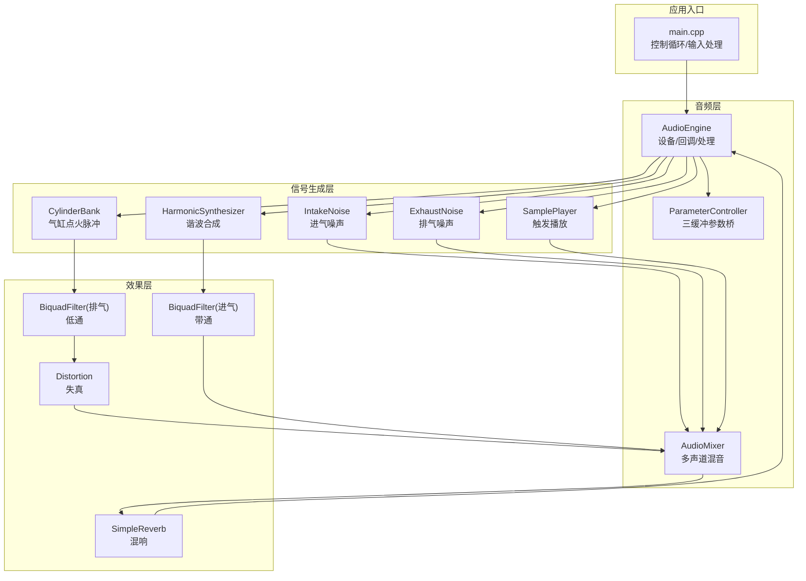
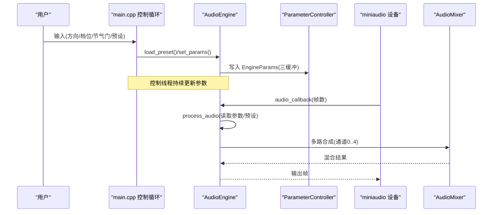
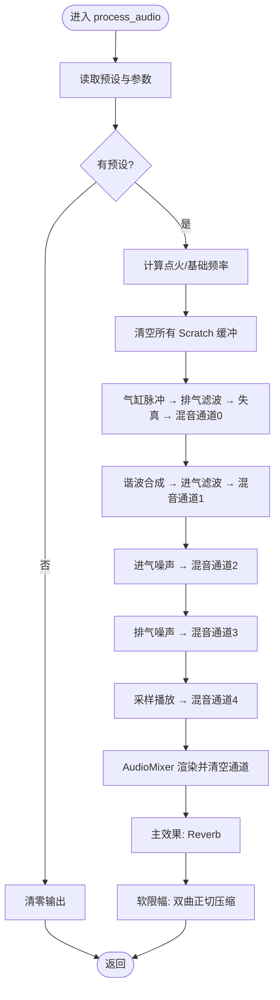
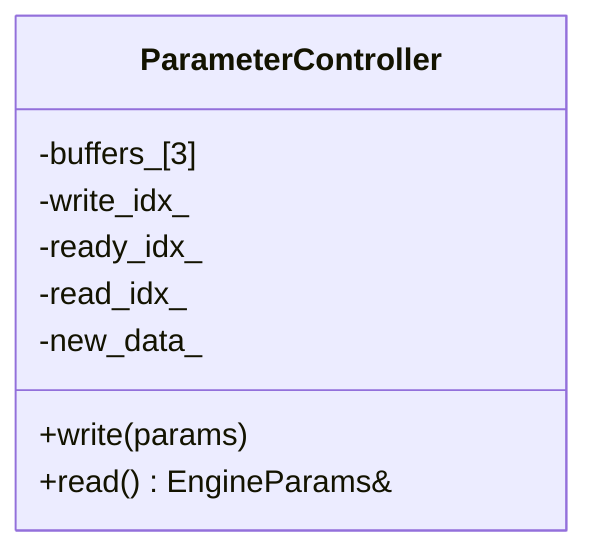
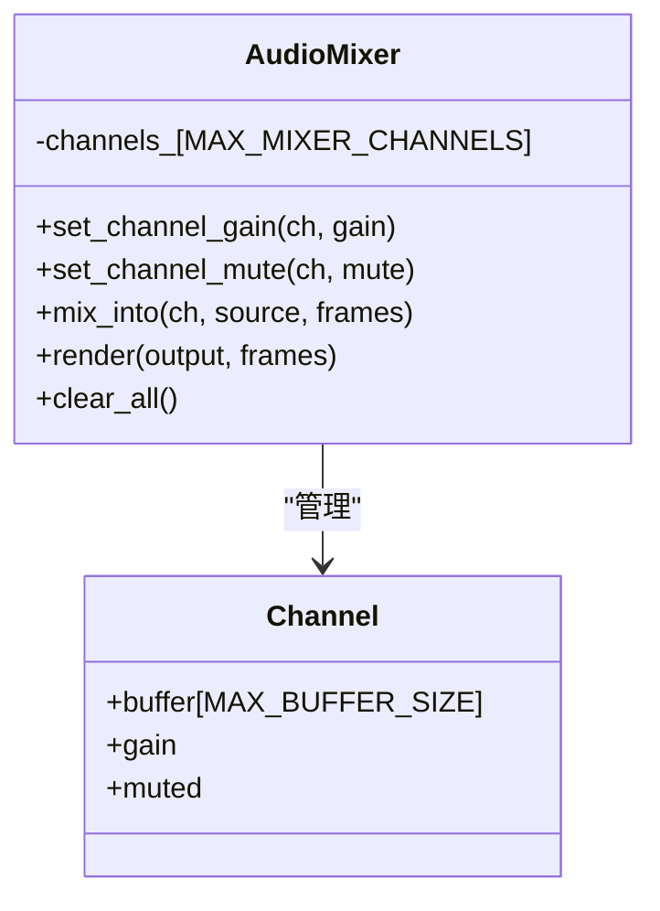
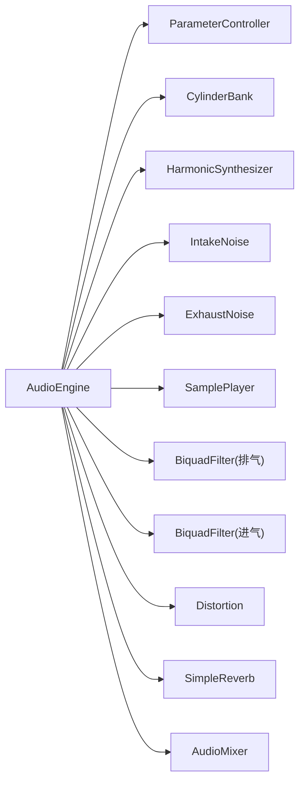

# 音频处理流水线

<cite>
**本文引用的文件**
- [src/audio/audio_engine.h](file://src/audio/audio_engine.h)
- [src/audio/audio_engine.cpp](file://src/audio/audio_engine.cpp)
- [src/audio/miniaudio_impl.cpp](file://src/audio/miniaudio_impl.cpp)
- [src/main.cpp](file://src/main.cpp)
- [src/mixer/audio_mixer.h](file://src/mixer/audio_mixer.h)
- [src/mixer/audio_mixer.cpp](file://src/mixer/audio_mixer.cpp)
- [src/synth/harmonic_synth.h](file://src/synth/harmonic_synth.h)
- [src/core/engine_model.h](file://src/core/engine_model.h)
- [src/core/constants.h](file://src/core/constants.h)
- [src/core/types.h](file://src/core/types.h)
- [src/effect/biquad_filter.h](file://src/effects/biquad_filter.h)
- [src/synth/noise_generator.h](file://src/synth/noise_generator.h)
- [src/synth/sample_player.h](file://src/synth/sample_player.h)
- [src/core/parameter_controller.h](file://src/core/parameter_controller.h)
- [src/presets/engine_preset.h](file://src/presets/engine_preset.h)
</cite>

## 目录
1. [简介](#简介)
2. [项目结构](#项目结构)
3. [核心组件](#核心组件)
4. [架构总览](#架构总览)
5. [详细组件分析](#详细组件分析)
6. [依赖关系分析](#依赖关系分析)
7. [性能与实时性保障](#性能与实时性保障)
8. [故障排查指南](#故障排查指南)
9. [结论](#结论)
10. [附录：参数与配置](#附录参数与配置)

## 简介
本文件系统化梳理赛车声音引擎的音频处理流水线，覆盖从 miniaudio 回调到最终音频输出的完整实时处理链路。重点说明：
- 实时音频处理流程与各子模块调用顺序
- 音频缓冲区管理（双缓冲思想、固定帧长、Scratch 缓冲）
- 线程模型与同步（控制线程与音频线程分离、参数桥接、原子操作）
- process_audio 的实现逻辑与数据流
- 性能优化策略与实时性保障

## 项目结构
项目采用按功能域分层组织：
- audio：设备初始化、回调封装、主引擎类
- core：物理模型、常量、类型、参数桥接
- synth：合成器、噪声生成器、采样播放器
- effects：滤波器、失真、混响等效果
- mixer：多声道混音器
- presets：引擎预设参数集合
- samples：示例音频样本
- tests：单元测试

图表来源
- [src/main.cpp:89-239](file://src/main.cpp#L89-L239)
- [src/audio/audio_engine.cpp:18-160](file://src/audio/audio_engine.cpp#L18-L160)
- [src/mixer/audio_mixer.cpp:22-47](file://src/mixer/audio_mixer.cpp#L22-L47)
- [src/core/parameter_controller.h:18-58](file://src/core/parameter_controller.h#L18-L58)

章节来源
- [src/main.cpp:89-239](file://src/main.cpp#L89-L239)
- [src/audio/audio_engine.h:20-92](file://src/audio/audio_engine.h#L20-L92)
- [src/audio/audio_engine.cpp:18-160](file://src/audio/audio_engine.cpp#L18-L160)

## 核心组件
- AudioEngine：音频引擎主控制器，负责设备初始化、回调注册、参数加载、实时处理流程调度。
- ParameterController：三缓冲无锁参数桥，控制线程写入，音频线程读取，避免锁与动态分配。
- AudioMixer：多声道累加式混音器，支持通道增益与静音，渲染后清空通道缓冲。
- CylinderBank：基于预设点火相位与冲程数生成气缸脉冲序列。
- HarmonicSynthesizer：谐波叠加合成，基础频率由转速决定，幅度由预设与负载决定。
- NoiseGenerator（进气/排气）：带限白噪声生成与一阶带通整形。
- SamplePlayer：锁-无队列触发，非实时安全的加载与触发，音频线程内只做播放混合。
- BiquadFilter：二阶滤波器（低通/带通等），直接形式II转置状态。
- Distortion/Reverb：非线性处理与空间混响。

章节来源
- [src/audio/audio_engine.h:27-89](file://src/audio/audio_engine.h#L27-L89)
- [src/core/parameter_controller.h:18-58](file://src/core/parameter_controller.h#L18-L58)
- [src/mixer/audio_mixer.h:9-34](file://src/mixer/audio_mixer.h#L9-L34)
- [src/core/cylinder_bank.h:9-38](file://src/core/cylinder_bank.h#L9-L38)
- [src/synth/harmonic_synth.h:8-25](file://src/synth/harmonic_synth.h#L8-L25)
- [src/synth/noise_generator.h:8-38](file://src/synth/noise_generator.h#L8-L38)
- [src/synth/sample_player.h:16-59](file://src/synth/sample_player.h#L16-L59)
- [src/effect/biquad_filter.h:25-42](file://src/effects/biquad_filter.h#L25-L42)

## 架构总览
音频系统采用“控制线程 + 音频线程”的分离模型：
- 控制线程：处理用户输入、更新物理模型、推送 EngineParams 到 ParameterController；负责预设切换与设备启停。
- 音频线程：miniaudio 回调触发，调用 AudioEngine::process_audio 完成完整信号链处理，并输出到声卡。

图表来源
- [src/main.cpp:146-233](file://src/main.cpp#L146-L233)
- [src/audio/audio_engine.cpp:24-32](file://src/audio/audio_engine.cpp#L24-L32)
- [src/audio/audio_engine.cpp:102-160](file://src/audio/audio_engine.cpp#L102-L160)
- [src/core/parameter_controller.h:32-50](file://src/core/parameter_controller.h#L32-L50)

## 详细组件分析

### AudioEngine：实时处理流水线
- 初始化与设备绑定：设置格式、通道、采样率、周期帧数、数据回调。
- 启动/停止/关闭：通过设备句柄控制运行状态，并使用原子标志确保线程安全。
- 参数与预设：预设在控制线程加载，音频线程通过原子指针读取；同时维护本地缓存副本用于线程内访问。
- 处理流程（process_audio）：
  1) 参数与预设读取：从 ParameterController 读取当前参数，从原子指针读取当前预设；若无预设则清零输出。
  2) 计算基础频率：根据 RPM、气缸数与冲程数计算点火频率，基础频率等于每秒转数。
  3) 清理 Scratch 缓冲：为后续合成与混音准备干净的中间缓冲。
  4) 气缸脉冲链：CylinderBank → 排气滤波 → 失真 → 混音通道0。
  5) 谐波合成链：HarmonicSynthesizer → 进气滤波 → 混音通道1。
  6) 噪声链：进气噪声 → 混音通道2；排气噪声 → 混音通道3。
  7) 采样播放：SamplePlayer → 混音通道4。
  8) 全局混音：AudioMixer 将通道累加到输出。
  9) 主效果：SimpleReverb 应用到总输出。
  10) 软限幅：双曲正切压缩，防止削波。
- 线程模型：音频线程仅在 process_audio 中读取参数与预设，避免在回调中进行昂贵操作。

图表来源
- [src/audio/audio_engine.cpp:102-160](file://src/audio/audio_engine.cpp#L102-L160)

章节来源
- [src/audio/audio_engine.cpp:18-68](file://src/audio/audio_engine.cpp#L18-L68)
- [src/audio/audio_engine.cpp:70-92](file://src/audio/audio_engine.cpp#L70-L92)
- [src/audio/audio_engine.cpp:102-160](file://src/audio/audio_engine.cpp#L102-L160)

### ParameterController：三缓冲参数桥
- 三个环形缓冲区，分别作为写入、就绪、读取索引，配合原子变量实现无锁发布/消费。
- 控制线程写入后交换“就绪”与“写入”索引，音频线程在每次读取时检查“新数据”标记并交换“读取”索引。
- 无锁、无堆分配，满足实时性要求。

图表来源
- [src/core/parameter_controller.h:18-58](file://src/core/parameter_controller.h#L18-L58)

章节来源
- [src/core/parameter_controller.h:18-58](file://src/core/parameter_controller.h#L18-L58)

### AudioMixer：多声道累加与渲染
- 每个通道维护独立缓冲、增益与静音状态。
- mix_into 将源缓冲逐样本累加至目标通道。
- render 对每个通道乘以增益并累加到输出，随后清空通道缓冲，避免跨帧泄漏。
- 支持最大通道数可配置，缓冲上限与处理长度受 MAX_BUFFER_SIZE 限制。

图表来源
- [src/mixer/audio_mixer.h:9-34](file://src/mixer/audio_mixer.h#L9-L34)
- [src/mixer/audio_mixer.cpp:22-47](file://src/mixer/audio_mixer.cpp#L22-L47)

章节来源
- [src/mixer/audio_mixer.h:9-34](file://src/mixer/audio_mixer.h#L9-L34)
- [src/mixer/audio_mixer.cpp:22-47](file://src/mixer/audio_mixer.cpp#L22-L47)

### CylinderBank：气缸点火脉冲生成
- 根据预设的相位偏移与冲程数，计算每个气缸的点火相位与脉冲形状。
- 输出为原始脉冲序列，供后续滤波与失真处理。

章节来源
- [src/core/cylinder_bank.h:9-38](file://src/core/cylinder_bank.h#L9-L38)

### HarmonicSynthesizer：谐波叠加合成
- 使用预设的谐波幅度与相位，对基础频率进行叠加合成。
- 输出为连续波形，经进气滤波后进入混音。

章节来源
- [src/synth/harmonic_synth.h:8-25](file://src/synth/harmonic_synth.h#L8-L25)

### 噪声生成器：进气/排气噪声
- 基于伪随机数生成带限噪声，结合一阶带通整形，模拟进气与排气的湍流噪声。
- 幅度随节气门开度变化，增强真实感。

章节来源
- [src/synth/noise_generator.h:8-38](file://src/synth/noise_generator.h#L8-L38)

### SamplePlayer：触发播放
- 提供触发接口（来自控制线程），内部使用 SPSC 锁-无队列存储触发事件。
- 音频线程内拉取队列并混合活动音色，支持变调与增益。

章节来源
- [src/synth/sample_player.h:16-59](file://src/synth/sample_player.h#L16-L59)

### BiquadFilter：二阶滤波器
- 支持多种滤波类型（低通/高通/带通/峰值等），使用直接形式II转置状态。
- 参数包含类型、截止频率、Q 值、增益与采样率。

章节来源
- [src/effect/biquad_filter.h:25-42](file://src/effects/biquad_filter.h#L25-L42)

### 主效果：混响与软限幅
- SimpleReverb 应用于总输出，营造空间感。
- 软限幅采用双曲正切压缩，避免削波并保持动态范围。

章节来源
- [src/audio/audio_engine.cpp:152-160](file://src/audio/audio_engine.cpp#L152-L160)

## 依赖关系分析
- AudioEngine 依赖 ParameterController、CylinderBank、HarmonicSynthesizer、NoiseGenerator、SamplePlayer、BiquadFilter、Distortion、SimpleReverb、AudioMixer。
- 所有子模块均实现 IEffect 接口或遵循混音协议，便于组合与替换。
- 预设 EnginePreset 在控制线程加载，音频线程通过原子指针读取，避免竞争。

图表来源
- [src/audio/audio_engine.h:58-69](file://src/audio/audio_engine.h#L58-L69)
- [src/audio/audio_engine.cpp:102-160](file://src/audio/audio_engine.cpp#L102-L160)

章节来源
- [src/audio/audio_engine.h:58-69](file://src/audio/audio_engine.h#L58-L69)
- [src/audio/audio_engine.cpp:102-160](file://src/audio/audio_engine.cpp#L102-L160)

## 性能与实时性保障
- 固定帧长与缓冲区管理
  - miniaudio 周期帧数由配置决定，AudioEngine 将处理长度裁剪至 MAX_SCRATCH，避免越界与溢出。
  - 各子模块内部缓冲上限受 MAX_BUFFER_SIZE 限制，确保渲染路径短小精悍。
- 无锁参数桥
  - ParameterController 使用三缓冲与原子索引，避免回调中阻塞与上下文切换。
- 原子预设指针
  - 预设在控制线程复制并发布指针，音频线程仅做读取，降低同步成本。
- 线程职责分离
  - 控制线程负责输入、物理模型与参数推送；音频线程专注信号生成与渲染。
- 优化建议
  - 优先使用栈上/静态缓冲（已实现），避免堆分配。
  - 减少分支与条件判断，尽量在初始化阶段完成参数设置。
  - 合理选择缓冲帧数：过小增加回调压力，过大增加延迟；默认值已平衡。
  - 预热与预加载：在启动时完成 SamplePlayer 样本加载，避免首次触发卡顿。
  - 降低混响与失真复杂度：在低端设备上可降低房间尺寸或混响混合比例。

[本节为通用性能指导，不直接分析具体文件]

## 故障排查指南
- 无法启动音频设备
  - 检查设备初始化返回值与错误日志；确认采样率与帧数配置合理。
  - 参考：[src/audio/audio_engine.cpp:24-44](file://src/audio/audio_engine.cpp#L24-L44)
- 无声或输出为零
  - 确认是否正确加载预设并发布到音频线程；检查参数桥是否正常工作。
  - 参考：[src/audio/audio_engine.cpp:106-111](file://src/audio/audio_engine.cpp#L106-L111)、[src/core/parameter_controller.h:43-50](file://src/core/parameter_controller.h#L43-L50)
- 延迟过大
  - 适当增大缓冲帧数；检查控制线程是否频繁写入参数导致频繁发布。
  - 参考：[src/main.cpp:146-233](file://src/main.cpp#L146-L233)
- 削波或爆音
  - 降低主音量或调整软限幅系数；检查混响与失真混合比例。
  - 参考：[src/audio/audio_engine.cpp:156-159](file://src/audio/audio_engine.cpp#L156-L159)
- 触发无效
  - 确认触发事件在控制线程发送，音频线程内 SamplePlayer 正常处理。
  - 参考：[src/synth/sample_player.h:23-24](file://src/synth/sample_player.h#L23-L24)、[src/synth/sample_player.h:58](file://src/synth/sample_player.h#L58)

章节来源
- [src/audio/audio_engine.cpp:24-44](file://src/audio/audio_engine.cpp#L24-L44)
- [src/audio/audio_engine.cpp:106-111](file://src/audio/audio_engine.cpp#L106-L111)
- [src/core/parameter_controller.h:43-50](file://src/core/parameter_controller.h#L43-L50)
- [src/main.cpp:146-233](file://src/main.cpp#L146-L233)
- [src/audio/audio_engine.cpp:156-159](file://src/audio/audio_engine.cpp#L156-L159)
- [src/synth/sample_player.h:23-24](file://src/synth/sample_player.h#L23-L24)
- [src/synth/sample_player.h:58](file://src/synth/sample_player.h#L58)

## 结论
该音频处理流水线通过清晰的模块划分与严格的线程职责分离，实现了稳定的实时音频生成。三缓冲参数桥与原子预设指针有效避免了回调中的同步开销；固定帧长与静态缓冲策略确保了可预测的实时性能。通过合理的滤波、合成与效果链组合，系统能够生成逼真的赛车引擎声。

[本节为总结性内容，不直接分析具体文件]

## 附录：参数与配置
- 默认采样率与缓冲帧数
  - 参考：[src/core/constants.h:15-16](file://src/core/constants.h#L15-L16)
- 类型定义
  - 参考：[src/core/types.h:7-9](file://src/core/types.h#L7-L9)
- 预设参数结构
  - 参考：[src/presets/engine_preset.h:8-47](file://src/presets/engine_preset.h#L8-L47)
- 物理模型参数
  - 参考：[src/core/engine_model.h:28-44](file://src/core/engine_model.h#L28-L44)

章节来源
- [src/core/constants.h:15-16](file://src/core/constants.h#L15-L16)
- [src/core/types.h:7-9](file://src/core/types.h#L7-L9)
- [src/presets/engine_preset.h:8-47](file://src/presets/engine_preset.h#L8-L47)
- [src/core/engine_model.h:28-44](file://src/core/engine_model.h#L28-L44)