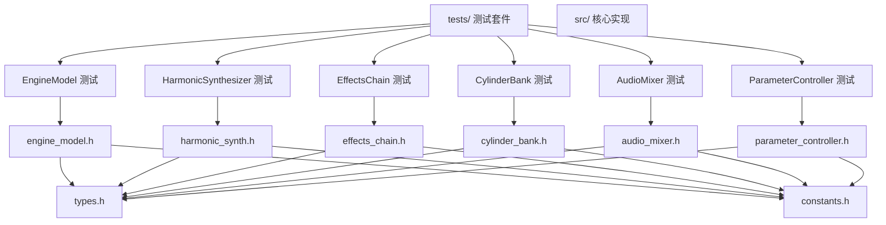
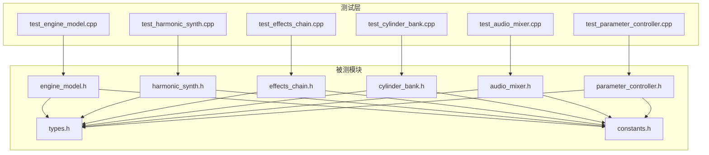
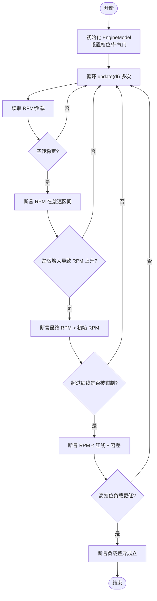
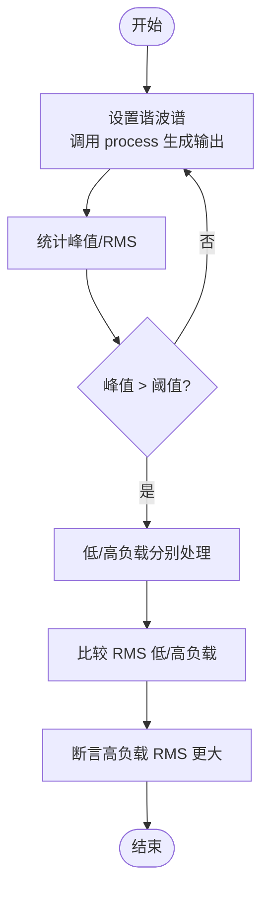
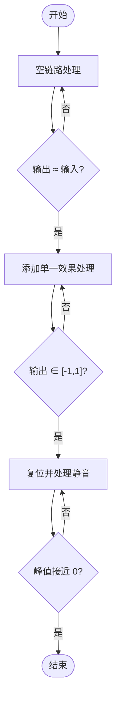
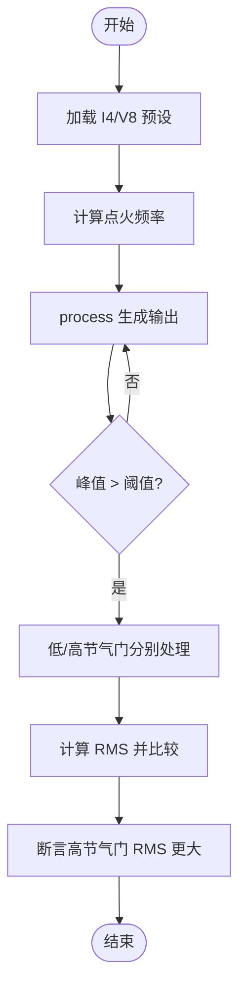
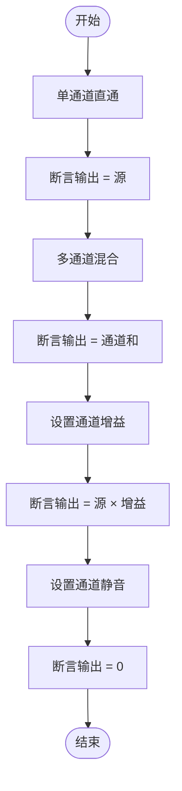
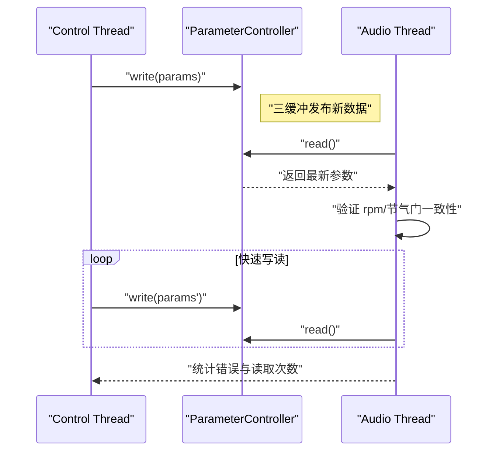
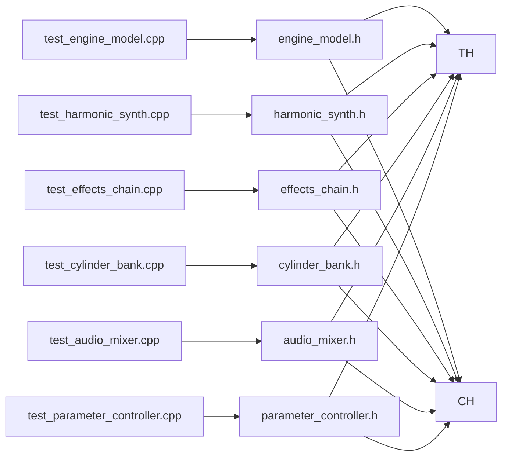

# 单元测试策略

<cite>
**本文引用的文件**
- [tests/test_engine_model.cpp](file://tests/test_engine_model.cpp)
- [tests/test_harmonic_synth.cpp](file://tests/test_harmonic_synth.cpp)
- [tests/test_effects_chain.cpp](file://tests/test_effects_chain.cpp)
- [tests/test_cylinder_bank.cpp](file://tests/test_cylinder_bank.cpp)
- [tests/test_audio_mixer.cpp](file://tests/test_audio_mixer.cpp)
- [tests/test_parameter_controller.cpp](file://tests/test_parameter_controller.cpp)
- [src/core/engine_model.h](file://src/core/engine_model.h)
- [src/synth/harmonic_synth.h](file://src/synth/harmonic_synth.h)
- [src/effects/effects_chain.h](file://src/effects/effects_chain.h)
- [src/core/cylinder_bank.h](file://src/core/cylinder_bank.h)
- [src/mixer/audio_mixer.h](file://src/mixer/audio_mixer.h)
- [src/core/parameter_controller.h](file://src/core/parameter_controller.h)
- [src/core/types.h](file://src/core/types.h)
- [src/core/constants.h](file://src/core/constants.h)
- [meson.build](file://meson.build)
- [tests/meson.build](file://tests/meson.build)
</cite>

## 目录
1. [引言](#引言)
2. [项目结构](#项目结构)
3. [核心组件](#核心组件)
4. [架构总览](#架构总览)
5. [详细组件分析](#详细组件分析)
6. [依赖关系分析](#依赖关系分析)
7. [性能考量](#性能考量)
8. [故障排查指南](#故障排查指南)
9. [结论](#结论)
10. [附录](#附录)

## 引言
本文件系统化梳理赛车声音引擎项目的单元测试策略与实施细节，覆盖测试框架理念、组织结构、命名规范、断言机制与测试数据准备方法，并针对以下模块逐一给出测试重点与流程图示例：EngineModel（物理计算验证）、HarmonicSynthesizer（音频质量测试）、EffectsChain（信号处理验证）、CylinderBank（时序准确性测试）、AudioMixer（混音算法验证）、ParameterController（线程安全性测试）。同时提供测试覆盖率分析方法、质量指标评估标准、测试环境搭建指南与运行命令，以及测试用例编写原则与最佳实践。

## 项目结构
测试代码位于 tests/ 目录，按功能模块一一对应到被测组件；各模块测试文件独立编译为可执行程序，便于定位问题与并行运行。核心源码位于 src/ 下，包含核心模型、合成器、效果链、混音器与参数控制器等模块头文件，类型与常量定义集中在 core 子目录。

图表来源
- [tests/test_engine_model.cpp:1-76](file://tests/test_engine_model.cpp#L1-L76)
- [tests/test_harmonic_synth.cpp:1-81](file://tests/test_harmonic_synth.cpp#L1-L81)
- [tests/test_effects_chain.cpp:1-85](file://tests/test_effects_chain.cpp#L1-L85)
- [tests/test_cylinder_bank.cpp:1-84](file://tests/test_cylinder_bank.cpp#L1-L84)
- [tests/test_audio_mixer.cpp:1-96](file://tests/test_audio_mixer.cpp#L1-L96)
- [tests/test_parameter_controller.cpp:1-95](file://tests/test_parameter_controller.cpp#L1-L95)
- [src/core/engine_model.h:1-48](file://src/core/engine_model.h#L1-L48)
- [src/synth/harmonic_synth.h:1-28](file://src/synth/harmonic_synth.h#L1-L28)
- [src/effects/effects_chain.h:1-24](file://src/effects/effects_chain.h#L1-L24)
- [src/core/cylinder_bank.h:1-41](file://src/core/cylinder_bank.h#L1-L41)
- [src/mixer/audio_mixer.h:1-37](file://src/mixer/audio_mixer.h#L1-L37)
- [src/core/parameter_controller.h:1-61](file://src/core/parameter_controller.h#L1-L61)
- [src/core/types.h:1-12](file://src/core/types.h#L1-L12)
- [src/core/constants.h:1-20](file://src/core/constants.h#L1-L20)

章节来源
- [tests/test_engine_model.cpp:1-76](file://tests/test_engine_model.cpp#L1-L76)
- [tests/test_harmonic_synth.cpp:1-81](file://tests/test_harmonic_synth.cpp#L1-L81)
- [tests/test_effects_chain.cpp:1-85](file://tests/test_effects_chain.cpp#L1-L85)
- [tests/test_cylinder_bank.cpp:1-84](file://tests/test_cylinder_bank.cpp#L1-L84)
- [tests/test_audio_mixer.cpp:1-96](file://tests/test_audio_mixer.cpp#L1-L96)
- [tests/test_parameter_controller.cpp:1-95](file://tests/test_parameter_controller.cpp#L1-L95)
- [src/core/engine_model.h:1-48](file://src/core/engine_model.h#L1-L48)
- [src/synth/harmonic_synth.h:1-28](file://src/synth/harmonic_synth.h#L1-L28)
- [src/effects/effects_chain.h:1-24](file://src/effects/effects_chain.h#L1-L24)
- [src/core/cylinder_bank.h:1-41](file://src/core/cylinder_bank.h#L1-L41)
- [src/mixer/audio_mixer.h:1-37](file://src/mixer/audio_mixer.h#L1-L37)
- [src/core/parameter_controller.h:1-61](file://src/core/parameter_controller.h#L1-L61)
- [src/core/types.h:1-12](file://src/core/types.h#L1-L12)
- [src/core/constants.h:1-20](file://src/core/constants.h#L1-L20)

## 核心组件
- 测试框架理念与组织结构
  - 每个模块一个独立测试文件，采用“功能-文件”映射，便于维护与并行执行。
  - 使用 C 风格断言与打印输出作为断言机制，配合 printf 输出通过信息，失败时 assert 抛出。
  - 测试数据准备遵循“确定性输入 + 显式边界条件 + 统计性校验”的原则。
- 命名规范
  - 测试函数以 test_ 前缀命名，语义清晰描述被测行为或场景。
  - 被测类/接口与测试文件一一对应，如 EngineModel 对应 test_engine_model.cpp。
- 断言机制
  - assert 用于严格条件判断；对浮点比较使用容差阈值；对数组/缓冲区逐元素比较时使用容差。
- 测试数据准备
  - 固定帧长与采样率，构造正弦波、单位脉冲、零信号等典型输入。
  - 使用预设配置（如 I4/V8）进行真实场景下的信号生成与验证。
  - 多组输入对比（如低/高负载、不同档位）以验证相对关系。

章节来源
- [tests/test_engine_model.cpp:1-76](file://tests/test_engine_model.cpp#L1-L76)
- [tests/test_harmonic_synth.cpp:1-81](file://tests/test_harmonic_synth.cpp#L1-L81)
- [tests/test_effects_chain.cpp:1-85](file://tests/test_effects_chain.cpp#L1-L85)
- [tests/test_cylinder_bank.cpp:1-84](file://tests/test_cylinder_bank.cpp#L1-L84)
- [tests/test_audio_mixer.cpp:1-96](file://tests/test_audio_mixer.cpp#L1-L96)
- [tests/test_parameter_controller.cpp:1-95](file://tests/test_parameter_controller.cpp#L1-L95)

## 架构总览
下图展示测试与被测模块之间的依赖关系与交互方式。测试通过直接包含被测头文件调用其接口，不引入外部框架，保持最小化与可移植性。

图表来源
- [tests/test_engine_model.cpp:1-76](file://tests/test_engine_model.cpp#L1-L76)
- [tests/test_harmonic_synth.cpp:1-81](file://tests/test_harmonic_synth.cpp#L1-L81)
- [tests/test_effects_chain.cpp:1-85](file://tests/test_effects_chain.cpp#L1-L85)
- [tests/test_cylinder_bank.cpp:1-84](file://tests/test_cylinder_bank.cpp#L1-L84)
- [tests/test_audio_mixer.cpp:1-96](file://tests/test_audio_mixer.cpp#L1-L96)
- [tests/test_parameter_controller.cpp:1-95](file://tests/test_parameter_controller.cpp#L1-L95)
- [src/core/engine_model.h:1-48](file://src/core/engine_model.h#L1-L48)
- [src/synth/harmonic_synth.h:1-28](file://src/synth/harmonic_synth.h#L1-L28)
- [src/effects/effects_chain.h:1-24](file://src/effects/effects_chain.h#L1-L24)
- [src/core/cylinder_bank.h:1-41](file://src/core/cylinder_bank.h#L1-L41)
- [src/mixer/audio_mixer.h:1-37](file://src/mixer/audio_mixer.h#L1-L37)
- [src/core/parameter_controller.h:1-61](file://src/core/parameter_controller.h#L1-L61)
- [src/core/types.h:1-12](file://src/core/types.h#L1-L12)
- [src/core/constants.h:1-20](file://src/core/constants.h#L1-L20)

## 详细组件分析

### EngineModel 物理计算验证
- 测试重点
  - 空转 RPM 的稳定范围与收敛性。
  - 加速踏板增大是否导致 RPM 上升。
  - 红线限制生效与数值边界。
  - 不同档位对负载的影响差异。
- 关键流程与断言
  - 初始化与设置档位/节气门后，固定步长时间多次更新，观察 RPM 变化趋势与上限。
  - 通过前后 RPM 对比验证单调性；通过最大 RPM 与红线阈值比较验证限幅。
  - 通过两次不同档位的负载读数对比，验证档位影响。
- 数据准备
  - 固定时间步长与采样率；多次 update 后取最终状态。
- 期望结果
  - 空转稳定在怠速区间；高踏板下 RPM 上升；超过红线时被钳制；高挡位负载更低。

图表来源
- [tests/test_engine_model.cpp:8-65](file://tests/test_engine_model.cpp#L8-L65)
- [src/core/engine_model.h:7-45](file://src/core/engine_model.h#L7-L45)

章节来源
- [tests/test_engine_model.cpp:1-76](file://tests/test_engine_model.cpp#L1-L76)
- [src/core/engine_model.h:1-48](file://src/core/engine_model.h#L1-L48)

### HarmonicSynthesizer 音频质量测试
- 测试重点
  - 有谐波配置时产生有效输出，峰值幅度大于阈值。
  - 负载调制对输出能量的影响（RMS）。
  - 零谐波时应静音。
- 关键流程与断言
  - 设置谐波谱，调用 process 生成样本，统计峰值幅度或 RMS，断言满足预期。
  - 两次相同输入但不同负载，比较输出 RMS，验证负载增强效应。
- 数据准备
  - 固定帧长与采样率；构造正弦激励频率；设置不同负载。
- 期望结果
  - 有谐波时非零输出；高负载 RMS 更大；无谐波时接近静音。

图表来源
- [tests/test_harmonic_synth.cpp:9-71](file://tests/test_harmonic_synth.cpp#L9-L71)
- [src/synth/harmonic_synth.h:8-25](file://src/synth/harmonic_synth.h#L8-L25)

章节来源
- [tests/test_harmonic_synth.cpp:1-81](file://tests/test_harmonic_synth.cpp#L1-L81)
- [src/synth/harmonic_synth.h:1-28](file://src/synth/harmonic_synth.h#L1-L28)

### EffectsChain 信号处理验证
- 测试重点
  - 空链路直通（无效果时输出与输入一致）。
  - 单一效果链路（如重失真）输出有界。
  - 效果链复位后残留状态清零。
- 关键流程与断言
  - 构造正弦波输入，空链路处理后逐点比较误差；单链路处理后断言输出在 [-1,1] 区间；复位后处理静音，断言峰值接近零。
- 数据准备
  - 正弦波输入；重失真参数；复位前后静音输入。
- 期望结果
  - 空链路恒等；重失真有界；复位清除残留。

图表来源
- [tests/test_effects_chain.cpp:11-75](file://tests/test_effects_chain.cpp#L11-L75)
- [src/effects/effects_chain.h:8-21](file://src/effects/effects_chain.h#L8-L21)

章节来源
- [tests/test_effects_chain.cpp:1-85](file://tests/test_effects_chain.cpp#L1-L85)
- [src/effects/effects_chain.h:1-24](file://src/effects/effects_chain.h#L1-L24)

### CylinderBank 时序准确性测试
- 测试重点
  - I4/V8 预设均能产生非零输出。
  - 节气门开度增大导致输出更响（RMS 提升）。
- 关键流程与断言
  - 使用预设配置，计算理论点火频率，process 后统计峰值；高节气门与低节气门分别处理，比较 RMS。
- 数据准备
  - 使用 I4/V8 预设；设定固定点火频率；构造等长缓冲区。
- 期望结果
  - 非零峰值；高节气门 RMS 更大。

图表来源
- [tests/test_cylinder_bank.cpp:10-74](file://tests/test_cylinder_bank.cpp#L10-L74)
- [src/core/cylinder_bank.h:9-38](file://src/core/cylinder_bank.h#L9-L38)

章节来源
- [tests/test_cylinder_bank.cpp:1-84](file://tests/test_cylinder_bank.cpp#L1-L84)
- [src/core/cylinder_bank.h:1-41](file://src/core/cylinder_bank.h#L1-L41)

### AudioMixer 混音算法验证
- 测试重点
  - 单通道直通：叠加后与源一致。
  - 多通道混合：各通道叠加和等于目标值。
  - 通道增益控制：输出按增益缩放。
  - 静音控制：静音通道输出为零。
- 关键流程与断言
  - mix_into 叠加到通道缓冲，render 后与期望值逐点比较；增益与静音通过设置后验证。
- 数据准备
  - 固定帧长与采样率；构造单位幅度源信号。
- 期望结果
  - 直通、叠加、增益、静音均符合预期。

图表来源
- [tests/test_audio_mixer.cpp:9-85](file://tests/test_audio_mixer.cpp#L9-L85)
- [src/mixer/audio_mixer.h:9-34](file://src/mixer/audio_mixer.h#L9-L34)

章节来源
- [tests/test_audio_mixer.cpp:1-96](file://tests/test_audio_mixer.cpp#L1-L96)
- [src/mixer/audio_mixer.h:1-37](file://src/mixer/audio_mixer.h#L1-L37)

### ParameterController 线程安全性测试
- 测试重点
  - 初始状态正确。
  - 写入-读取往返一致性。
  - 并发写读：多线程快速交替写读，验证无撕裂读取与数据一致性。
- 关键流程与断言
  - 控制线程写入 EngineParams，音频线程读取并验证 rpm/节气门一致性；统计错误次数与读取次数，断言错误为零且读取足够频繁。
- 数据准备
  - 使用原子变量控制运行；构造连续变化的 rpm/节气门/档位组合。
- 期望结果
  - 无错误；读取足够频繁；数据一致性满足阈值。

图表来源
- [tests/test_parameter_controller.cpp:35-84](file://tests/test_parameter_controller.cpp#L35-L84)
- [src/core/parameter_controller.h:20-58](file://src/core/parameter_controller.h#L20-L58)

章节来源
- [tests/test_parameter_controller.cpp:1-95](file://tests/test_parameter_controller.cpp#L1-L95)
- [src/core/parameter_controller.h:1-61](file://src/core/parameter_controller.h#L1-L61)

## 依赖关系分析
- 模块内聚与耦合
  - 各测试文件仅依赖对应被测头文件，耦合度低，内聚性强。
  - 被测模块共享 types.h 与 constants.h，确保类型与常量一致性。
- 外部依赖
  - 测试未引入第三方框架，仅使用标准库断言与线程支持。
- 潜在环依赖
  - 当前结构无环依赖，测试与被测模块单向依赖。

图表来源
- [tests/test_engine_model.cpp:1-76](file://tests/test_engine_model.cpp#L1-L76)
- [tests/test_harmonic_synth.cpp:1-81](file://tests/test_harmonic_synth.cpp#L1-L81)
- [tests/test_effects_chain.cpp:1-85](file://tests/test_effects_chain.cpp#L1-L85)
- [tests/test_cylinder_bank.cpp:1-84](file://tests/test_cylinder_bank.cpp#L1-L84)
- [tests/test_audio_mixer.cpp:1-96](file://tests/test_audio_mixer.cpp#L1-L96)
- [tests/test_parameter_controller.cpp:1-95](file://tests/test_parameter_controller.cpp#L1-L95)
- [src/core/engine_model.h:1-48](file://src/core/engine_model.h#L1-L48)
- [src/synth/harmonic_synth.h:1-28](file://src/synth/harmonic_synth.h#L1-L28)
- [src/effects/effects_chain.h:1-24](file://src/effects/effects_chain.h#L1-L24)
- [src/core/cylinder_bank.h:1-41](file://src/core/cylinder_bank.h#L1-L41)
- [src/mixer/audio_mixer.h:1-37](file://src/mixer/audio_mixer.h#L1-L37)
- [src/core/parameter_controller.h:1-61](file://src/core/parameter_controller.h#L1-L61)
- [src/core/types.h:1-12](file://src/core/types.h#L1-L12)
- [src/core/constants.h:1-20](file://src/core/constants.h#L1-L20)

章节来源
- [tests/test_engine_model.cpp:1-76](file://tests/test_engine_model.cpp#L1-L76)
- [tests/test_harmonic_synth.cpp:1-81](file://tests/test_harmonic_synth.cpp#L1-L81)
- [tests/test_effects_chain.cpp:1-85](file://tests/test_effects_chain.cpp#L1-L85)
- [tests/test_cylinder_bank.cpp:1-84](file://tests/test_cylinder_bank.cpp#L1-L84)
- [tests/test_audio_mixer.cpp:1-96](file://tests/test_audio_mixer.cpp#L1-L96)
- [tests/test_parameter_controller.cpp:1-95](file://tests/test_parameter_controller.cpp#L1-L95)
- [src/core/types.h:1-12](file://src/core/types.h#L1-L12)
- [src/core/constants.h:1-20](file://src/core/constants.h#L1-L20)

## 性能考量
- 测试执行效率
  - 每个测试独立编译为可执行，便于并行运行与快速定位失败模块。
  - 测试中使用固定帧长与采样率，避免动态分配带来的抖动。
- 时间复杂度
  - 大多数测试为 O(N)（N 为帧数），涉及统计（峰值/RMS）时亦为线性复杂度。
- 内存占用
  - 测试使用栈上固定大小缓冲区，避免堆分配；常量数组与静态常量减少内存压力。
- 并发测试
  - ParameterController 并发测试通过原子变量与三缓冲机制保证无锁访问，降低竞争开销。

## 故障排查指南
- 常见问题与定位
  - 断言失败：检查输入参数（如档位、节气门、频率）与断言阈值；确认是否使用了正确的采样率与帧长。
  - 浮点比较失败：使用容差比较而非精确相等；对 RMS/峰值统计需考虑量化噪声。
  - 并发读写异常：确认控制线程与音频线程职责分离；核对三缓冲索引交换顺序与内存序。
- 日志与输出
  - 所有测试在通过时输出明确提示信息，失败由断言触发；建议在本地调试时保留输出以便快速定位。
- 修复建议
  - 若物理模型或合成器行为改变，相应调整测试阈值或场景；保持测试与实现同步演进。

章节来源
- [tests/test_engine_model.cpp:1-76](file://tests/test_engine_model.cpp#L1-L76)
- [tests/test_harmonic_synth.cpp:1-81](file://tests/test_harmonic_synth.cpp#L1-L81)
- [tests/test_effects_chain.cpp:1-85](file://tests/test_effects_chain.cpp#L1-L85)
- [tests/test_cylinder_bank.cpp:1-84](file://tests/test_cylinder_bank.cpp#L1-L84)
- [tests/test_audio_mixer.cpp:1-96](file://tests/test_audio_mixer.cpp#L1-L96)
- [tests/test_parameter_controller.cpp:1-95](file://tests/test_parameter_controller.cpp#L1-L95)

## 结论
本测试策略以“模块化、最小依赖、显式断言、并发安全”为核心设计原则，覆盖物理建模、音频合成、信号处理、时序生成、混音算法与参数桥接等关键路径。通过固定输入、统计校验与并发验证，确保各模块在功能正确性与实时性上的稳定性。建议持续完善覆盖率与回归测试，结合持续集成流水线自动化执行。

## 附录

### 测试环境搭建与运行命令
- 构建系统
  - 使用 Meson 构建系统，根目录与 tests 目录均有构建脚本，可独立构建测试套件。
- 运行命令
  - 在项目根目录执行构建与运行测试的命令序列，确保各测试二进制可执行。
- 注意事项
  - 确保编译器支持 C++17（测试中使用了线程与原子操作）；在 Windows 上推荐使用 MSVC 或 GCC/Clang。

章节来源
- [meson.build](file://meson.build)
- [tests/meson.build](file://tests/meson.build)

### 测试覆盖率分析方法与质量指标
- 覆盖率分析方法
  - 使用编译器内置覆盖率工具（如 GCC/Clang 的 -fprofile-arcs/-ftest-coverage 或 MSVC 的 /Fa+符号信息）生成覆盖率报告。
  - 将覆盖率报告与源码行号关联，识别未覆盖分支与路径。
- 质量指标评估标准
  - 行覆盖率：≥ 80%
  - 分支覆盖率：≥ 70%
  - 场景覆盖率：关键路径（空转、满负荷、档位切换、并发读写）均覆盖
  - 回归测试：新增功能必须配套新增测试用例，失败用例不得合并主干

### 测试用例编写原则与最佳实践
- 原则
  - 每个测试聚焦单一行为或边界条件；命名清晰表达意图。
  - 输入确定、过程可重复、断言明确；避免隐式假设。
  - 使用容差比较浮点结果；对数组逐元素断言时记录失败位置。
- 最佳实践
  - 先写失败场景（边界、异常），再写正常场景。
  - 并发测试中分离控制线程与音频线程职责，避免共享可变状态。
  - 将测试数据集中管理（如预设、阈值），便于维护与复用。
  - 保持测试独立性，避免跨测试的副作用；必要时在 setUp/tearDown 中清理状态。