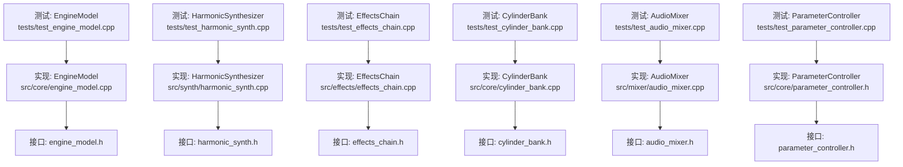
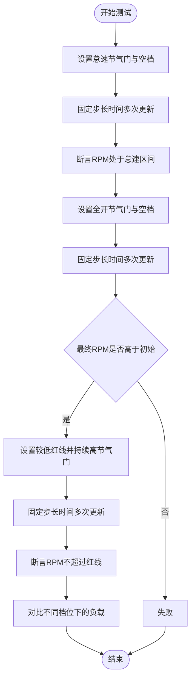
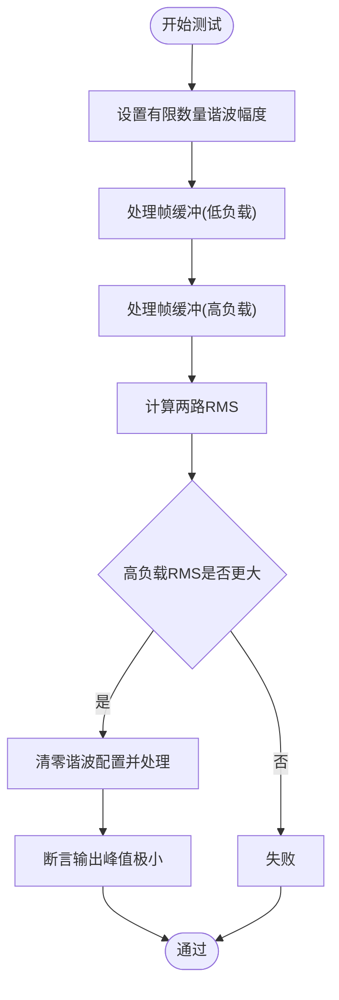
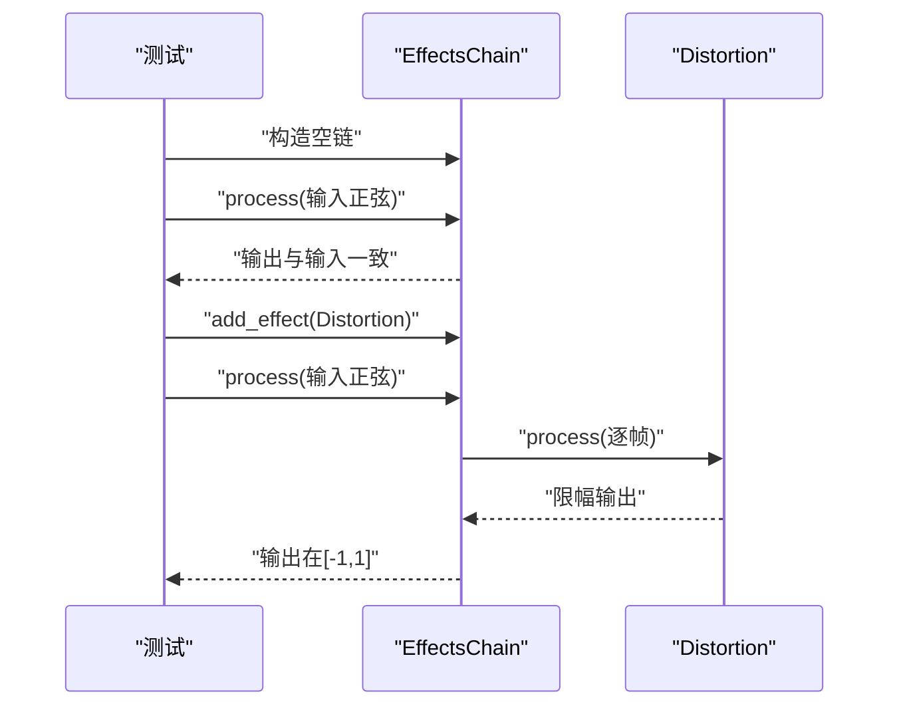
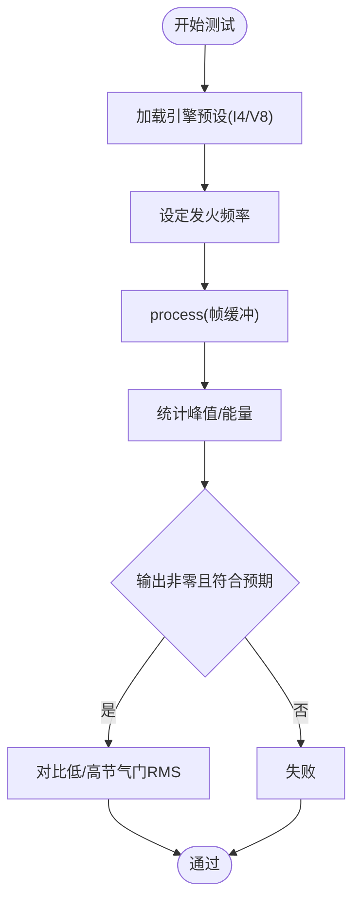
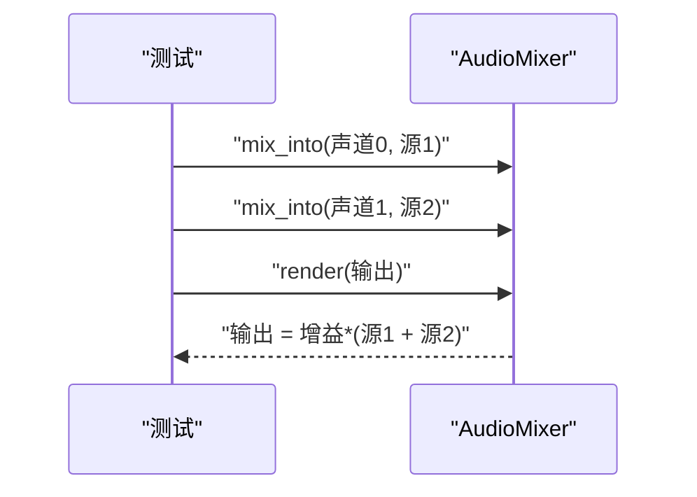
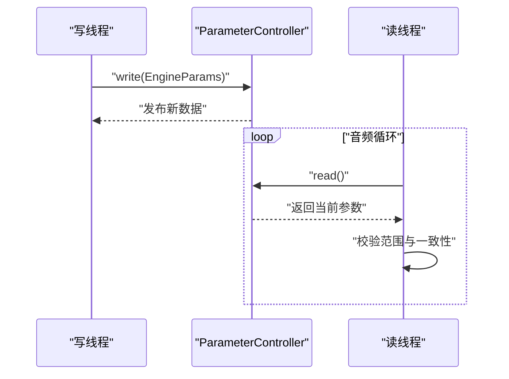
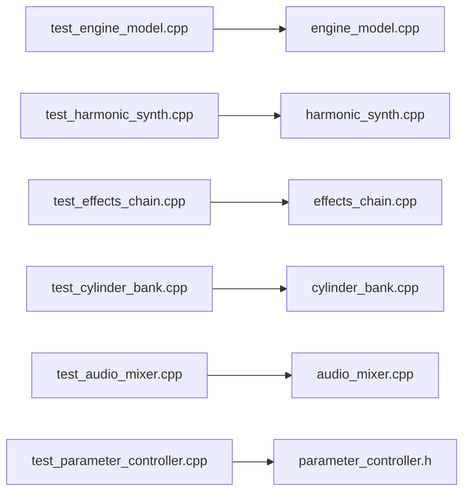

# 模块特定测试

<cite>
**本文引用的文件**
- [tests/test_engine_model.cpp](file://tests/test_engine_model.cpp)
- [src/core/engine_model.h](file://src/core/engine_model.h)
- [src/core/engine_model.cpp](file://src/core/engine_model.cpp)
- [tests/test_harmonic_synth.cpp](file://tests/test_harmonic_synth.cpp)
- [src/synth/harmonic_synth.h](file://src/synth/harmonic_synth.h)
- [src/synth/harmonic_synth.cpp](file://src/synth/harmonic_synth.cpp)
- [tests/test_effects_chain.cpp](file://tests/test_effects_chain.cpp)
- [src/effects/effects_chain.h](file://src/effects/effects_chain.h)
- [src/effects/effects_chain.cpp](file://src/effects/effects_chain.cpp)
- [tests/test_cylinder_bank.cpp](file://tests/test_cylinder_bank.cpp)
- [src/core/cylinder_bank.h](file://src/core/cylinder_bank.h)
- [src/core/cylinder_bank.cpp](file://src/core/cylinder_bank.cpp)
- [tests/test_audio_mixer.cpp](file://tests/test_audio_mixer.cpp)
- [src/mixer/audio_mixer.h](file://src/mixer/audio_mixer.h)
- [src/mixer/audio_mixer.cpp](file://src/mixer/audio_mixer.cpp)
- [tests/test_parameter_controller.cpp](file://tests/test_parameter_controller.cpp)
- [src/core/parameter_controller.h](file://src/core/parameter_controller.h)
</cite>

## 目录
1. [简介](#简介)
2. [项目结构](#项目结构)
3. [核心组件](#核心组件)
4. [架构总览](#架构总览)
5. [详细组件分析](#详细组件分析)
6. [依赖关系分析](#依赖关系分析)
7. [性能考量](#性能考量)
8. [故障排查指南](#故障排查指南)
9. [结论](#结论)

## 简介
本文件聚焦于各模块的特定测试用例，系统性阐述以下测试目标与设计思路：
- EngineModel：怠速RPM验证、节气门响应测试、红线限制测试、齿轮负载影响测试
- HarmonicSynthesizer：音频质量测试（谐波频率准确性、相位一致性、音量/音色随负载变化）
- EffectsChain：信号处理测试（空链直通、单效果链边界、链重置状态清理）
- CylinderBank：时序测试（点火时序精度、气缸触发同步性、相位控制）
- AudioMixer：混音测试（声道平衡、增益控制、静音、渲染输出）
- ParameterController：并发测试（三缓冲无锁参数桥、读写并发一致性）

## 项目结构
测试与被测模块按功能分层组织，测试文件位于 tests/，核心实现位于 src/ 下对应子目录。

```mermaid
graph TB
subgraph "测试层"
T_EM["tests/test_engine_model.cpp"]
T_HS["tests/test_harmonic_synth.cpp"]
T_EC["tests/test_effects_chain.cpp"]
T_CB["tests/test_cylinder_bank.cpp"]
T_AM["tests/test_audio_mixer.cpp"]
T_PC["tests/test_parameter_controller.cpp"]
end
subgraph "核心实现"
EM_H["src/core/engine_model.h"]
EM_CPP["src/core/engine_model.cpp"]
HS_H["src/synth/harmonic_synth.h"]
HS_CPP["src/synth/harmonic_synth.cpp"]
EC_H["src/effects/effects_chain.h"]
EC_CPP["src/effects/effects_chain.cpp"]
CB_H["src/core/cylinder_bank.h"]
CB_CPP["src/core/cylinder_bank.cpp"]
AM_H["src/mixer/audio_mixer.h"]
AM_CPP["src/mixer/audio_mixer.cpp"]
PC_H["src/core/parameter_controller.h"]
end
T_EM --> EM_H
T_EM --> EM_CPP
T_HS --> HS_H
T_HS --> HS_CPP
T_EC --> EC_H
T_EC --> EC_CPP
T_CB --> CB_H
T_CB --> CB_CPP
T_AM --> AM_H
T_AM --> AM_CPP
T_PC --> PC_H
```

图表来源
- [tests/test_engine_model.cpp:1-76](file://tests/test_engine_model.cpp#L1-L76)
- [src/core/engine_model.h:1-48](file://src/core/engine_model.h#L1-L48)
- [src/core/engine_model.cpp:1-55](file://src/core/engine_model.cpp#L1-L55)
- [tests/test_harmonic_synth.cpp:1-81](file://tests/test_harmonic_synth.cpp#L1-L81)
- [src/synth/harmonic_synth.h:1-28](file://src/synth/harmonic_synth.h#L1-L28)
- [src/synth/harmonic_synth.cpp:1-63](file://src/synth/harmonic_synth.cpp#L1-L63)
- [tests/test_effects_chain.cpp:1-85](file://tests/test_effects_chain.cpp#L1-L85)
- [src/effects/effects_chain.h:1-24](file://src/effects/effects_chain.h#L1-L24)
- [src/effects/effects_chain.cpp:1-30](file://src/effects/effects_chain.cpp#L1-L30)
- [tests/test_cylinder_bank.cpp:1-84](file://tests/test_cylinder_bank.cpp#L1-L84)
- [src/core/cylinder_bank.h:1-41](file://src/core/cylinder_bank.h#L1-L41)
- [src/core/cylinder_bank.cpp:1-81](file://src/core/cylinder_bank.cpp#L1-L81)
- [tests/test_audio_mixer.cpp:1-96](file://tests/test_audio_mixer.cpp#L1-L96)
- [src/mixer/audio_mixer.h:1-37](file://src/mixer/audio_mixer.h#L1-L37)
- [src/mixer/audio_mixer.cpp:1-58](file://src/mixer/audio_mixer.cpp#L1-L58)
- [tests/test_parameter_controller.cpp:1-95](file://tests/test_parameter_controller.cpp#L1-L95)
- [src/core/parameter_controller.h:1-61](file://src/core/parameter_controller.h#L1-L61)

章节来源
- [tests/test_engine_model.cpp:1-76](file://tests/test_engine_model.cpp#L1-L76)
- [tests/test_harmonic_synth.cpp:1-81](file://tests/test_harmonic_synth.cpp#L1-L81)
- [tests/test_effects_chain.cpp:1-85](file://tests/test_effects_chain.cpp#L1-L85)
- [tests/test_cylinder_bank.cpp:1-84](file://tests/test_cylinder_bank.cpp#L1-L84)
- [tests/test_audio_mixer.cpp:1-96](file://tests/test_audio_mixer.cpp#L1-L96)
- [tests/test_parameter_controller.cpp:1-95](file://tests/test_parameter_controller.cpp#L1-L95)

## 核心组件
- EngineModel：基于节气门、齿轮比、惯量、摩擦与最大扭矩的RPM动力学模型；包含怠速与红线限制逻辑。
- HarmonicSynthesizer：加法合成，生成基波及其谐波，支持按负载对不同频段谐波进行调制，维护各谐波相位。
- EffectsChain：效果链容器，顺序调用链上各效果的process/reset，支持清空与重置。
- CylinderBank：基于曲轴相位与时序的多气缸点火建模，根据转速与节气门调整脉冲形状与幅度。
- AudioMixer：多声道累加混音，支持每声道增益与静音，渲染后清空通道缓冲。
- ParameterController：三缓冲无锁参数桥，控制线程写入、音频线程读取，避免锁与分配。

章节来源
- [src/core/engine_model.h:1-48](file://src/core/engine_model.h#L1-L48)
- [src/core/engine_model.cpp:1-55](file://src/core/engine_model.cpp#L1-L55)
- [src/synth/harmonic_synth.h:1-28](file://src/synth/harmonic_synth.h#L1-L28)
- [src/synth/harmonic_synth.cpp:1-63](file://src/synth/harmonic_synth.cpp#L1-L63)
- [src/effects/effects_chain.h:1-24](file://src/effects/effects_chain.h#L1-L24)
- [src/effects/effects_chain.cpp:1-30](file://src/effects/effects_chain.cpp#L1-L30)
- [src/core/cylinder_bank.h:1-41](file://src/core/cylinder_bank.h#L1-L41)
- [src/core/cylinder_bank.cpp:1-81](file://src/core/cylinder_bank.cpp#L1-L81)
- [src/mixer/audio_mixer.h:1-37](file://src/mixer/audio_mixer.h#L1-L37)
- [src/mixer/audio_mixer.cpp:1-58](file://src/mixer/audio_mixer.cpp#L1-L58)
- [src/core/parameter_controller.h:1-61](file://src/core/parameter_controller.h#L1-L61)

## 架构总览
下图展示测试与实现之间的映射关系，以及关键数据流与控制流。

图表来源
- [tests/test_engine_model.cpp:1-76](file://tests/test_engine_model.cpp#L1-L76)
- [src/core/engine_model.cpp:1-55](file://src/core/engine_model.cpp#L1-L55)
- [src/core/engine_model.h:1-48](file://src/core/engine_model.h#L1-L48)
- [tests/test_harmonic_synth.cpp:1-81](file://tests/test_harmonic_synth.cpp#L1-L81)
- [src/synth/harmonic_synth.cpp:1-63](file://src/synth/harmonic_synth.cpp#L1-L63)
- [src/synth/harmonic_synth.h:1-28](file://src/synth/harmonic_synth.h#L1-L28)
- [tests/test_effects_chain.cpp:1-85](file://tests/test_effects_chain.cpp#L1-L85)
- [src/effects/effects_chain.cpp:1-30](file://src/effects/effects_chain.cpp#L1-L30)
- [src/effects/effects_chain.h:1-24](file://src/effects/effects_chain.h#L1-L24)
- [tests/test_cylinder_bank.cpp:1-84](file://tests/test_cylinder_bank.cpp#L1-L84)
- [src/core/cylinder_bank.cpp:1-81](file://src/core/cylinder_bank.cpp#L1-L81)
- [src/core/cylinder_bank.h:1-41](file://src/core/cylinder_bank.h#L1-L41)
- [tests/test_audio_mixer.cpp:1-96](file://tests/test_audio_mixer.cpp#L1-L96)
- [src/mixer/audio_mixer.cpp:1-58](file://src/mixer/audio_mixer.cpp#L1-L58)
- [src/mixer/audio_mixer.h:1-37](file://src/mixer/audio_mixer.h#L1-L37)
- [tests/test_parameter_controller.cpp:1-95](file://tests/test_parameter_controller.cpp#L1-L95)
- [src/core/parameter_controller.h:1-61](file://src/core/parameter_controller.h#L1-L61)

## 详细组件分析

### EngineModel 测试用例设计
- 怠速RPM验证：在怠速节气门与空档状态下运行若干帧，断言稳定后的RPM落在怠速区间内，验证怠速调节与回正机制。
- 节气门响应测试：全开节气门且挂空档，断言RPM单调递增，验证驱动力与摩擦阻力的动态平衡。
- 红线限制测试：设置较低红线阈值并持续高节气门，断言RPM不超过红线上限，验证硬限幅保护。
- 齿轮负载影响测试：相同节气门下比较不同档位的负载值，验证齿轮比对负载的正比关系与档位耦合。

图表来源
- [tests/test_engine_model.cpp:8-48](file://tests/test_engine_model.cpp#L8-L48)
- [src/core/engine_model.cpp:21-52](file://src/core/engine_model.cpp#L21-L52)

章节来源
- [tests/test_engine_model.cpp:8-48](file://tests/test_engine_model.cpp#L8-L48)
- [src/core/engine_model.h:24-44](file://src/core/engine_model.h#L24-L44)
- [src/core/engine_model.cpp:21-52](file://src/core/engine_model.cpp#L21-L52)

### HarmonicSynthesizer 音频质量测试
- 输出存在性测试：设置有限数量谐波幅度，断言输出峰值超过阈值，验证加法合成产生有效信号。
- 负载调制测试：相同基频与采样率下，分别以低/高负载处理，计算RMS并断言高负载RMS更大，验证高次谐波受负载更强调制。
- 零谐波静音测试：不设置任何谐波，断言输出峰值极小，验证无谐波时应近似静音。

图表来源
- [tests/test_harmonic_synth.cpp:9-54](file://tests/test_harmonic_synth.cpp#L9-L54)
- [src/synth/harmonic_synth.cpp:26-60](file://src/synth/harmonic_synth.cpp#L26-L60)

章节来源
- [tests/test_harmonic_synth.cpp:9-71](file://tests/test_harmonic_synth.cpp#L9-L71)
- [src/synth/harmonic_synth.h:12-17](file://src/synth/harmonic_synth.h#L12-L17)
- [src/synth/harmonic_synth.cpp:26-60](file://src/synth/harmonic_synth.cpp#L26-L60)

### EffectsChain 信号处理测试
- 空链直通测试：向空链输入正弦波，断言输出与输入完全一致，验证空链即直通。
- 单效果链测试：添加重失真效果，断言输出值均在[-1,1]范围内，验证tanh类限幅的有界性。
- 链重置测试：先注入冲激输入并处理，随后调用reset，再输入静音，断言输出峰值接近零，验证状态清理。

图表来源
- [tests/test_effects_chain.cpp:11-49](file://tests/test_effects_chain.cpp#L11-L49)
- [src/effects/effects_chain.cpp:17-21](file://src/effects/effects_chain.cpp#L17-L21)

章节来源
- [tests/test_effects_chain.cpp:11-75](file://tests/test_effects_chain.cpp#L11-L75)
- [src/effects/effects_chain.h:8-21](file://src/effects/effects_chain.h#L8-L21)
- [src/effects/effects_chain.cpp:17-27](file://src/effects/effects_chain.cpp#L17-L27)

### CylinderBank 时序测试
- I4/V8输出测试：使用预设I4与V8，设定对应发火频率，断言输出非全零，验证多气缸脉冲叠加。
- 节气门响度测试：相同发火频率下，低/高节气门分别处理，计算RMS并断言高节气门RMS更大，验证脉冲幅度与衰减随节气门变化。
- 同步与相位控制：通过曲轴相位增量与各气缸相位偏移，确保发火相位检测与脉冲包络正确。

图表来源
- [tests/test_cylinder_bank.cpp:10-74](file://tests/test_cylinder_bank.cpp#L10-L74)
- [src/core/cylinder_bank.cpp:28-78](file://src/core/cylinder_bank.cpp#L28-L78)

章节来源
- [tests/test_cylinder_bank.cpp:10-74](file://tests/test_cylinder_bank.cpp#L10-L74)
- [src/core/cylinder_bank.h:13-19](file://src/core/cylinder_bank.h#L13-L19)
- [src/core/cylinder_bank.cpp:28-78](file://src/core/cylinder_bank.cpp#L28-L78)

### AudioMixer 混音测试
- 单声道直通：向单一声道混入恒定源，断言渲染输出与源一致，验证累加与渲染流程。
- 多声道混合：两声道分别混入不同常数，断言总输出等于两者之和，验证多声道累加。
- 增益控制：设置通道增益后渲染，断言输出等于源乘以增益，验证增益生效。
- 静音测试：启用静音后混入信号，断言渲染输出为零，验证静音逻辑。

图表来源
- [tests/test_audio_mixer.cpp:9-85](file://tests/test_audio_mixer.cpp#L9-L85)
- [src/mixer/audio_mixer.cpp:22-47](file://src/mixer/audio_mixer.cpp#L22-L47)

章节来源
- [tests/test_audio_mixer.cpp:9-85](file://tests/test_audio_mixer.cpp#L9-L85)
- [src/mixer/audio_mixer.h:13-22](file://src/mixer/audio_mixer.h#L13-L22)
- [src/mixer/audio_mixer.cpp:22-47](file://src/mixer/audio_mixer.cpp#L22-L47)

### ParameterController 并发测试
- 初始状态：构造控制器，读取默认参数，断言初始值合理。
- 写读往返：写入一组参数，立即读取并断言一致，验证单次写读正确性。
- 并发访问：启动写线程与读线程，写线程快速更新rpm/throttle/gear，读线程持续校验一致性（范围与相关性），限定时间后断言错误计数为零，验证三缓冲无锁参数桥的正确性与无撕裂读。

图表来源
- [tests/test_parameter_controller.cpp:35-85](file://tests/test_parameter_controller.cpp#L35-L85)
- [src/core/parameter_controller.h:33-50](file://src/core/parameter_controller.h#L33-L50)

章节来源
- [tests/test_parameter_controller.cpp:10-85](file://tests/test_parameter_controller.cpp#L10-L85)
- [src/core/parameter_controller.h:18-58](file://src/core/parameter_controller.h#L18-L58)

## 依赖关系分析
- 测试到实现的直接依赖：各测试文件包含对应头文件并调用实现中的公开接口。
- 关键依赖点：
  - EngineModel 依赖常量与类型定义，实现中使用夹紧与物理公式。
  - HarmonicSynthesizer 依赖常量与类型，实现中维护相位与幅度数组。
  - EffectsChain 依赖 IEffect 接口与常量，实现中顺序调用链上效果。
  - CylinderBank 依赖预设与常量，实现中计算曲轴相位与脉冲包络。
  - AudioMixer 依赖常量与类型，实现中累加与增益。
  - ParameterController 依赖原子变量与三缓冲策略，实现中无锁交换索引。

图表来源
- [tests/test_engine_model.cpp:1-76](file://tests/test_engine_model.cpp#L1-L76)
- [src/core/engine_model.cpp:1-55](file://src/core/engine_model.cpp#L1-L55)
- [tests/test_harmonic_synth.cpp:1-81](file://tests/test_harmonic_synth.cpp#L1-L81)
- [src/synth/harmonic_synth.cpp:1-63](file://src/synth/harmonic_synth.cpp#L1-L63)
- [tests/test_effects_chain.cpp:1-85](file://tests/test_effects_chain.cpp#L1-L85)
- [src/effects/effects_chain.cpp:1-30](file://src/effects/effects_chain.cpp#L1-L30)
- [tests/test_cylinder_bank.cpp:1-84](file://tests/test_cylinder_bank.cpp#L1-L84)
- [src/core/cylinder_bank.cpp:1-81](file://src/core/cylinder_bank.cpp#L1-L81)
- [tests/test_audio_mixer.cpp:1-96](file://tests/test_audio_mixer.cpp#L1-L96)
- [src/mixer/audio_mixer.cpp:1-58](file://src/mixer/audio_mixer.cpp#L1-L58)
- [tests/test_parameter_controller.cpp:1-95](file://tests/test_parameter_controller.cpp#L1-L95)
- [src/core/parameter_controller.h:1-61](file://src/core/parameter_controller.h#L1-L61)

## 性能考量
- 固定步长更新：EngineModel、HarmonicSynthesizer、CylinderBank、EffectsChain、AudioMixer均采用固定帧长与逐样本/逐帧处理，便于可重复测试与实时性保障。
- 无锁参数桥：ParameterController 使用三缓冲与原子操作，避免锁与分配，适合高频读写场景。
- 有界输出：EffectsChain 中的失真效果采用双曲函数限幅，保证输出在[-1,1]范围内，避免溢出。
- 谐波调制：HarmonicSynthesizer 对高次谐波施加强负载调制，模拟真实引擎声音随转速与负荷的变化。

## 故障排查指南
- EngineModel
  - 若怠速不稳定：检查怠速与回正系数、惯量与摩擦参数是否合理。
  - 若红线无效：确认红限幅逻辑与更新频率是否匹配。
- HarmonicSynthesizer
  - 若输出无声：确认谐波配置数量与幅度非零，或基频大于零。
  - 若音色异常：检查相位推进与幅度调制策略。
- EffectsChain
  - 若空链不直通：检查process实现是否遍历链上效果。
  - 若重置无效：确认各效果的reset实现与调用顺序。
- CylinderBank
  - 若发火相位错乱：检查曲轴相位增量与气缸相位偏移。
  - 若脉冲幅度异常：核对节气门对持续时间、衰减与幅度的影响。
- AudioMixer
  - 若混音失衡：检查各声道增益与静音标志。
  - 若渲染后仍有残留：确认渲染后是否清空通道缓冲。
- ParameterController
  - 若读到部分更新：检查三缓冲索引交换与内存序。
  - 若并发错误：确认写线程与读线程职责分离与时间窗口设置。

章节来源
- [src/core/engine_model.cpp:43-51](file://src/core/engine_model.cpp#L43-L51)
- [src/synth/harmonic_synth.cpp:38-47](file://src/synth/harmonic_synth.cpp#L38-L47)
- [src/effects/effects_chain.cpp:17-27](file://src/effects/effects_chain.cpp#L17-L27)
- [src/core/cylinder_bank.cpp:34-77](file://src/core/cylinder_bank.cpp#L34-L77)
- [src/mixer/audio_mixer.cpp:31-47](file://src/mixer/audio_mixer.cpp#L31-L47)
- [src/core/parameter_controller.h:33-50](file://src/core/parameter_controller.h#L33-L50)

## 结论
上述测试覆盖了各模块的关键行为与边界条件：EngineModel 的动力学稳定性与限制保护、HarmonicSynthesizer 的谐波与负载调制、EffectsChain 的链式处理与状态管理、CylinderBank 的时序与相位控制、AudioMixer 的声道混合与增益、ParameterController 的并发一致性。这些测试为模块的正确性与鲁棒性提供了基础保障，并可作为回归测试与集成测试的参考。