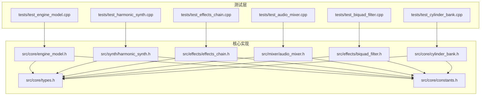
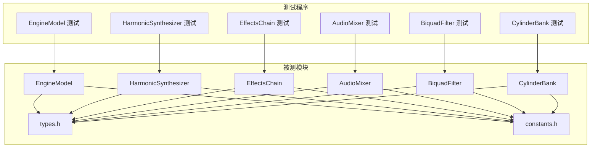
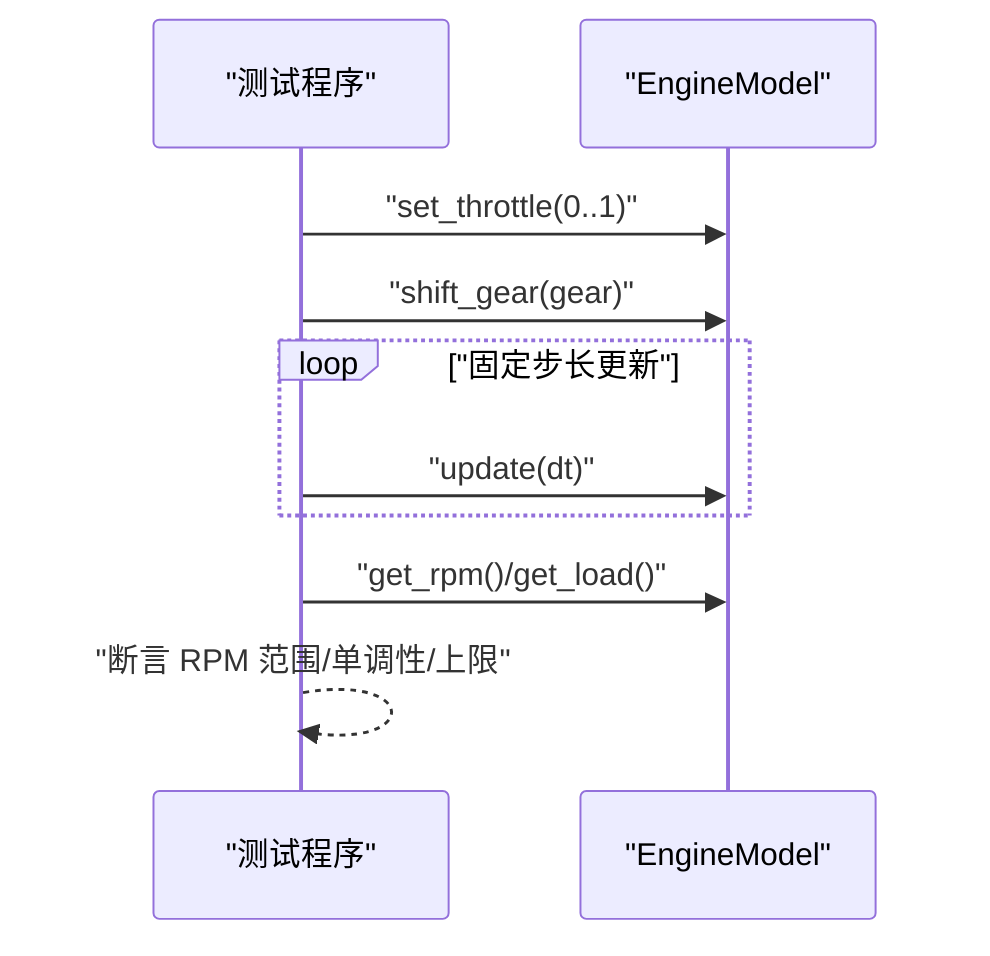
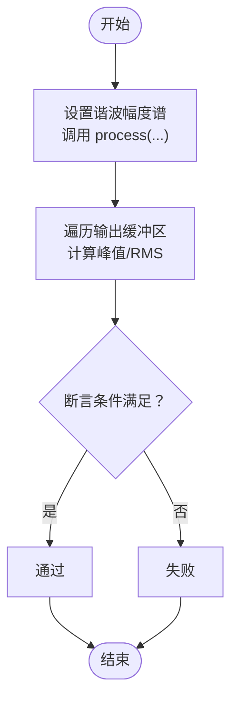
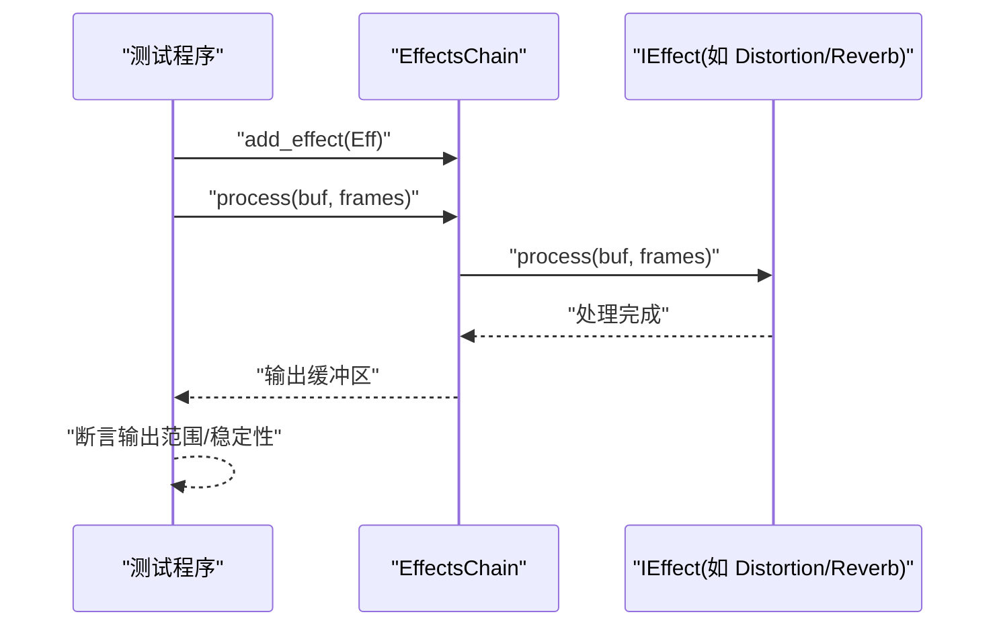
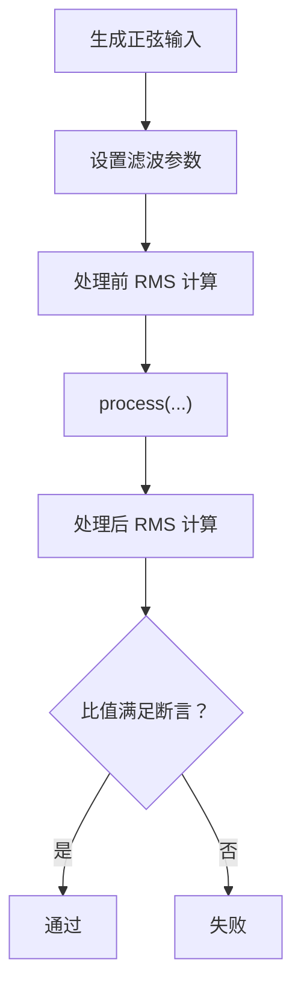
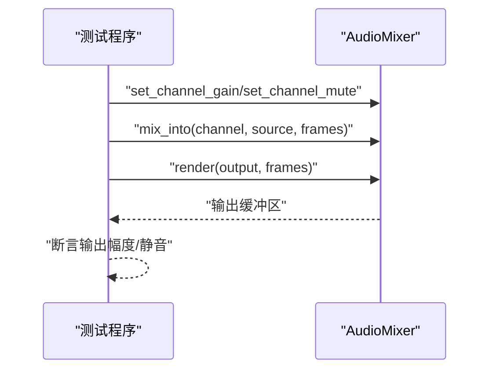
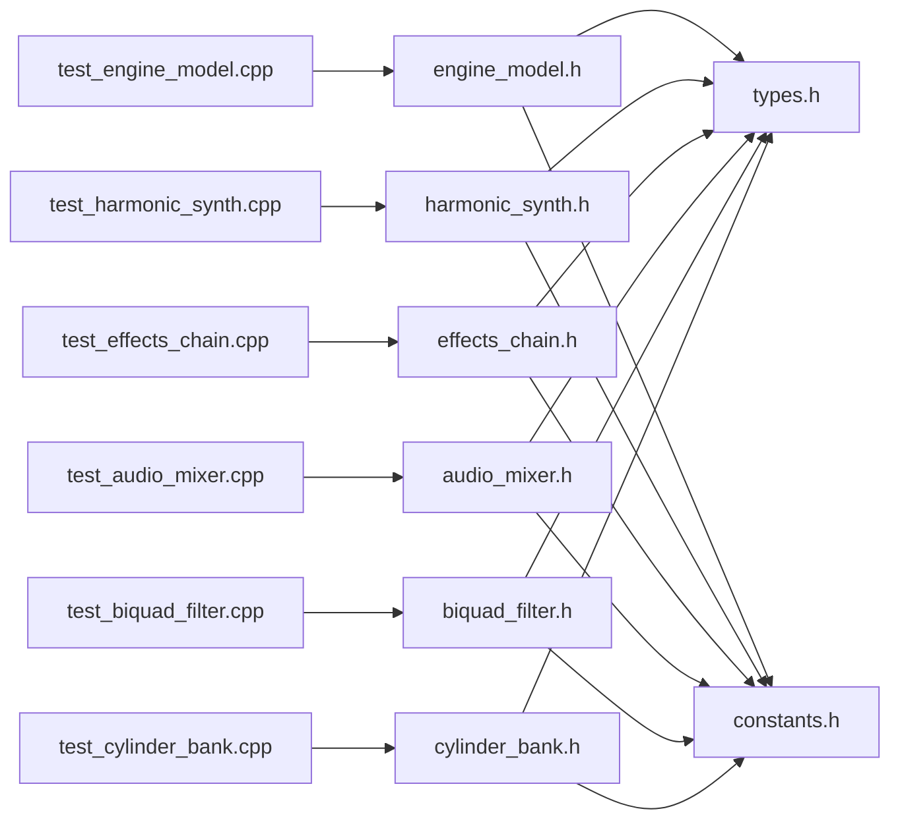

# 测试和质量保证

<cite>
**本文引用的文件**
- [tests/test_engine_model.cpp](file://tests/test_engine_model.cpp)
- [tests/test_harmonic_synth.cpp](file://tests/test_harmonic_synth.cpp)
- [tests/test_effects_chain.cpp](file://tests/test_effects_chain.cpp)
- [tests/test_audio_mixer.cpp](file://tests/test_audio_mixer.cpp)
- [tests/test_biquad_filter.cpp](file://tests/test_biquad_filter.cpp)
- [tests/test_cylinder_bank.cpp](file://tests/test_cylinder_bank.cpp)
- [src/core/engine_model.h](file://src/core/engine_model.h)
- [src/synth/harmonic_synth.h](file://src/synth/harmonic_synth.h)
- [src/effects/effects_chain.h](file://src/effects/effects_chain.h)
- [src/mixer/audio_mixer.h](file://src/mixer/audio_mixer.h)
- [src/effects/biquad_filter.h](file://src/effects/biquad_filter.h)
- [src/core/cylinder_bank.h](file://src/core/cylinder_bank.h)
- [src/core/types.h](file://src/core/types.h)
- [src/core/constants.h](file://src/core/constants.h)
- [meson_options.txt](file://meson_options.txt)
</cite>

## 目录
1. [引言](#引言)
2. [项目结构](#项目结构)
3. [核心组件](#核心组件)
4. [架构总览](#架构总览)
5. [详细组件分析](#详细组件分析)
6. [依赖分析](#依赖分析)
7. [性能考虑](#性能考虑)
8. [故障排查指南](#故障排查指南)
9. [结论](#结论)
10. [附录](#附录)

## 引言
本文件面向测试与质量保证体系，系统化梳理当前单元测试框架的组织方式、断言机制与测试数据准备策略；深入解析各模块的测试策略（如 EngineModel 的物理计算验证、HarmonicSynthesizer 的音频质量测试、EffectsChain 的信号处理验证）；阐述测试覆盖率与质量指标评估方法；提供测试环境搭建、运行与持续集成配置建议；给出性能与基准测试方法、测试用例编写指南与最佳实践，并说明如何扩展测试套件以覆盖新功能模块。

## 项目结构
测试代码集中于 tests/ 目录，按功能模块划分独立可执行测试程序，每个测试程序聚焦一个核心类或子系统，采用 C 风格断言进行结果校验。核心源码位于 src/ 下，按领域分层组织：core（物理建模与类型常量）、synth（谐波合成器）、effects（效果链与滤波器）、mixer（混音器）、presets（预设）等。类型与常量定义在 core/types.h 与 core/constants.h 中，供所有模块共享。

图表来源
- [tests/test_engine_model.cpp:1-76](file://tests/test_engine_model.cpp#L1-L76)
- [tests/test_harmonic_synth.cpp:1-81](file://tests/test_harmonic_synth.cpp#L1-L81)
- [tests/test_effects_chain.cpp:1-85](file://tests/test_effects_chain.cpp#L1-L85)
- [tests/test_audio_mixer.cpp:1-96](file://tests/test_audio_mixer.cpp#L1-L96)
- [tests/test_biquad_filter.cpp:1-100](file://tests/test_biquad_filter.cpp#L1-L100)
- [tests/test_cylinder_bank.cpp:1-84](file://tests/test_cylinder_bank.cpp#L1-L84)
- [src/core/engine_model.h:1-48](file://src/core/engine_model.h#L1-L48)
- [src/synth/harmonic_synth.h:1-28](file://src/synth/harmonic_synth.h#L1-L28)
- [src/effects/effects_chain.h:1-24](file://src/effects/effects_chain.h#L1-L24)
- [src/mixer/audio_mixer.h:1-37](file://src/mixer/audio_mixer.h#L1-L37)
- [src/effects/biquad_filter.h:1-45](file://src/effects/biquad_filter.h#L1-L45)
- [src/core/cylinder_bank.h:1-41](file://src/core/cylinder_bank.h#L1-L41)
- [src/core/types.h:1-12](file://src/core/types.h#L1-L12)
- [src/core/constants.h:1-20](file://src/core/constants.h#L1-L20)

章节来源
- [tests/test_engine_model.cpp:1-76](file://tests/test_engine_model.cpp#L1-L76)
- [tests/test_harmonic_synth.cpp:1-81](file://tests/test_harmonic_synth.cpp#L1-L81)
- [tests/test_effects_chain.cpp:1-85](file://tests/test_effects_chain.cpp#L1-L85)
- [tests/test_audio_mixer.cpp:1-96](file://tests/test_audio_mixer.cpp#L1-L96)
- [tests/test_biquad_filter.cpp:1-100](file://tests/test_biquad_filter.cpp#L1-L100)
- [tests/test_cylinder_bank.cpp:1-84](file://tests/test_cylinder_bank.cpp#L1-L84)
- [src/core/engine_model.h:1-48](file://src/core/engine_model.h#L1-L48)
- [src/synth/harmonic_synth.h:1-28](file://src/synth/harmonic_synth.h#L1-L28)
- [src/effects/effects_chain.h:1-24](file://src/effects/effects_chain.h#L1-L24)
- [src/mixer/audio_mixer.h:1-37](file://src/mixer/audio_mixer.h#L1-L37)
- [src/effects/biquad_filter.h:1-45](file://src/effects/biquad_filter.h#L1-L45)
- [src/core/cylinder_bank.h:1-41](file://src/core/cylinder_bank.h#L1-L41)
- [src/core/types.h:1-12](file://src/core/types.h#L1-L12)
- [src/core/constants.h:1-20](file://src/core/constants.h#L1-L20)

## 核心组件
- EngineModel：引擎转速与负载的物理模型，提供设置节气门、档位、惯性、怠速/红线限制等接口，并以固定步长更新状态。
- HarmonicSynthesizer：基于谐波叠加的合成器，支持设置谐波幅度谱、根据负载调制输出、重置状态。
- EffectsChain：效果链容器，聚合多个 IEffect 实现，支持添加、清空、顺序处理与重置。
- BiquadFilter：通用二阶滤波器，实现多种滤波类型参数设置与处理。
- AudioMixer：多通道混音器，支持通道增益、静音、混合与渲染。
- CylinderBank：气缸组发声单元，依据引擎预设生成点火激励并叠加到输出缓冲区。
- 类型与常量：统一的采样、帧数、采样率类型定义与全局常量（最大通道数、谐波数、效果数等）。

章节来源
- [src/core/engine_model.h:1-48](file://src/core/engine_model.h#L1-L48)
- [src/synth/harmonic_synth.h:1-28](file://src/synth/harmonic_synth.h#L1-L28)
- [src/effects/effects_chain.h:1-24](file://src/effects/effects_chain.h#L1-L24)
- [src/effects/biquad_filter.h:1-45](file://src/effects/biquad_filter.h#L1-L45)
- [src/mixer/audio_mixer.h:1-37](file://src/mixer/audio_mixer.h#L1-L37)
- [src/core/cylinder_bank.h:1-41](file://src/core/cylinder_bank.h#L1-L41)
- [src/core/types.h:1-12](file://src/core/types.h#L1-L12)
- [src/core/constants.h:1-20](file://src/core/constants.h#L1-L20)

## 架构总览
测试与被测模块之间的关系如下：

图表来源
- [tests/test_engine_model.cpp:1-76](file://tests/test_engine_model.cpp#L1-L76)
- [tests/test_harmonic_synth.cpp:1-81](file://tests/test_harmonic_synth.cpp#L1-L81)
- [tests/test_effects_chain.cpp:1-85](file://tests/test_effects_chain.cpp#L1-L85)
- [tests/test_biquad_filter.cpp:1-100](file://tests/test_biquad_filter.cpp#L1-L100)
- [tests/test_audio_mixer.cpp:1-96](file://tests/test_audio_mixer.cpp#L1-L96)
- [tests/test_cylinder_bank.cpp:1-84](file://tests/test_cylinder_bank.cpp#L1-L84)
- [src/core/engine_model.h:1-48](file://src/core/engine_model.h#L1-L48)
- [src/synth/harmonic_synth.h:1-28](file://src/synth/harmonic_synth.h#L1-L28)
- [src/effects/effects_chain.h:1-24](file://src/effects/effects_chain.h#L1-L24)
- [src/effects/biquad_filter.h:1-45](file://src/effects/biquad_filter.h#L1-L45)
- [src/mixer/audio_mixer.h:1-37](file://src/mixer/audio_mixer.h#L1-L37)
- [src/core/cylinder_bank.h:1-41](file://src/core/cylinder_bank.h#L1-L41)
- [src/core/types.h:1-12](file://src/core/types.h#L1-L12)
- [src/core/constants.h:1-20](file://src/core/constants.h#L1-L20)

## 详细组件分析

### EngineModel 测试策略
- 怠速稳定性：在零节气门与空档状态下运行若干控制周期，断言稳定后的 RPM 范围。
- 加速响应：高节气门下运行，断言 RPM 升高。
- 红线限制：设置较低红线并长时间加速，断言 RPM 不超过上限。
- 档位负载影响：相同 RPM 区间内不同档位下的负载差异，通过对比两次运行的负载值验证档比对负载的影响。

图表来源
- [tests/test_engine_model.cpp:8-48](file://tests/test_engine_model.cpp#L8-L48)
- [src/core/engine_model.h:11-26](file://src/core/engine_model.h#L11-L26)

章节来源
- [tests/test_engine_model.cpp:1-76](file://tests/test_engine_model.cpp#L1-L76)
- [src/core/engine_model.h:1-48](file://src/core/engine_model.h#L1-L48)

### HarmonicSynthesizer 测试策略
- 输出存在性：设置非零谐波幅度谱，断言输出峰值大于阈值。
- 负载调制：相同基频与采样率下，低/高负载分别生成输出，断言高负载 RMS 大于低负载。
- 零谐波静音：不设置谐波时，断言输出峰值接近静音。

图表来源
- [tests/test_harmonic_synth.cpp:9-71](file://tests/test_harmonic_synth.cpp#L9-L71)
- [src/synth/harmonic_synth.h:12-17](file://src/synth/harmonic_synth.h#L12-L17)

章节来源
- [tests/test_harmonic_synth.cpp:1-81](file://tests/test_harmonic_synth.cpp#L1-L81)
- [src/synth/harmonic_synth.h:1-28](file://src/synth/harmonic_synth.h#L1-L28)

### EffectsChain 测试策略
- 空链路直通：输入正弦波，处理后与原输入逐样本比较，断言误差极小。
- 单效应链路：向链路添加重失真，断言输出幅值有界（双曲正切钳幅）。
- 链路重置：对含混响的效果链路进行处理后重置，再输入静音，断言输出峰值趋近静音。

图表来源
- [tests/test_effects_chain.cpp:11-75](file://tests/test_effects_chain.cpp#L11-L75)
- [src/effects/effects_chain.h:12-16](file://src/effects/effects_chain.h#L12-L16)
- [src/effects/biquad_filter.h:18-23](file://src/effects/biquad_filter.h#L18-L23)

章节来源
- [tests/test_effects_chain.cpp:1-85](file://tests/test_effects_chain.cpp#L1-L85)
- [src/effects/effects_chain.h:1-24](file://src/effects/effects_chain.h#L1-L24)
- [src/effects/biquad_filter.h:1-45](file://src/effects/biquad_filter.h#L1-L45)

### BiquadFilter 测试策略
- 低通滤波高频衰减：构造 200Hz 与 5000Hz 正弦输入，断言低频比值接近 1，高频比值显著下降。
- 高通滤波低频衰减：构造 100Hz 输入，断言输出比值小于阈值。
- 接近直通：提高低通截止频率至接近奈奎斯特定率，断言输出 RMS 比值接近 1。

图表来源
- [tests/test_biquad_filter.cpp:10-90](file://tests/test_biquad_filter.cpp#L10-L90)
- [src/effects/biquad_filter.h:29-33](file://src/effects/biquad_filter.h#L29-L33)

章节来源
- [tests/test_biquad_filter.cpp:1-100](file://tests/test_biquad_filter.cpp#L1-L100)
- [src/effects/biquad_filter.h:1-45](file://src/effects/biquad_filter.h#L1-L45)

### AudioMixer 测试策略
- 单通道直通：向单一通道写入固定样本，渲染后断言与输入一致。
- 多通道混合：两通道分别注入不同幅度样本，断言混合输出等于两者之和。
- 增益控制：设置通道增益，断言输出幅度按比例缩放。
- 静音：启用静音后断言输出趋近静音。

图表来源
- [tests/test_audio_mixer.cpp:9-85](file://tests/test_audio_mixer.cpp#L9-L85)
- [src/mixer/audio_mixer.h:13-20](file://src/mixer/audio_mixer.h#L13-L20)

章节来源
- [tests/test_audio_mixer.cpp:1-96](file://tests/test_audio_mixer.cpp#L1-L96)
- [src/mixer/audio_mixer.h:1-37](file://src/mixer/audio_mixer.h#L1-L37)

### CylinderBank 测试策略
- I4/V8 输出：使用对应预设，按典型转速计算点火频率，断言输出峰值大于阈值。
- 节气门响度：相同点火频率下，低/高节气门分别生成输出，断言高节气门 RMS 更大。

章节来源
- [tests/test_cylinder_bank.cpp:1-84](file://tests/test_cylinder_bank.cpp#L1-L84)
- [src/core/cylinder_bank.h:13-19](file://src/core/cylinder_bank.h#L13-L19)

## 依赖分析
- 测试与被测模块之间为“单测程序-类”一一对应关系，耦合度低，便于隔离与并行执行。
- 所有模块共享 types.h 与 constants.h，确保测试与实现的数据类型与常量一致。
- EffectsChain 依赖 IEffect 接口，测试中通过具体实现（如 Distortion、Reverb）注入链路，验证组合式处理流程。

图表来源
- [tests/test_engine_model.cpp:1-76](file://tests/test_engine_model.cpp#L1-L76)
- [tests/test_harmonic_synth.cpp:1-81](file://tests/test_harmonic_synth.cpp#L1-L81)
- [tests/test_effects_chain.cpp:1-85](file://tests/test_effects_chain.cpp#L1-L85)
- [tests/test_biquad_filter.cpp:1-100](file://tests/test_biquad_filter.cpp#L1-L100)
- [tests/test_audio_mixer.cpp:1-96](file://tests/test_audio_mixer.cpp#L1-L96)
- [tests/test_cylinder_bank.cpp:1-84](file://tests/test_cylinder_bank.cpp#L1-L84)
- [src/core/engine_model.h:1-48](file://src/core/engine_model.h#L1-L48)
- [src/synth/harmonic_synth.h:1-28](file://src/synth/harmonic_synth.h#L1-L28)
- [src/effects/effects_chain.h:1-24](file://src/effects/effects_chain.h#L1-L24)
- [src/effects/biquad_filter.h:1-45](file://src/effects/biquad_filter.h#L1-L45)
- [src/mixer/audio_mixer.h:1-37](file://src/mixer/audio_mixer.h#L1-L37)
- [src/core/cylinder_bank.h:1-41](file://src/core/cylinder_bank.h#L1-L41)
- [src/core/types.h:1-12](file://src/core/types.h#L1-L12)
- [src/core/constants.h:1-20](file://src/core/constants.h#L1-L20)

章节来源
- [tests/test_engine_model.cpp:1-76](file://tests/test_engine_model.cpp#L1-L76)
- [tests/test_harmonic_synth.cpp:1-81](file://tests/test_harmonic_synth.cpp#L1-L81)
- [tests/test_effects_chain.cpp:1-85](file://tests/test_effects_chain.cpp#L1-L85)
- [tests/test_biquad_filter.cpp:1-100](file://tests/test_biquad_filter.cpp#L1-L100)
- [tests/test_audio_mixer.cpp:1-96](file://tests/test_audio_mixer.cpp#L1-L96)
- [tests/test_cylinder_bank.cpp:1-84](file://tests/test_cylinder_bank.cpp#L1-L84)
- [src/core/engine_model.h:1-48](file://src/core/engine_model.h#L1-L48)
- [src/synth/harmonic_synth.h:1-28](file://src/synth/harmonic_synth.h#L1-L28)
- [src/effects/effects_chain.h:1-24](file://src/effects/effects_chain.h#L1-L24)
- [src/effects/biquad_filter.h:1-45](file://src/effects/biquad_filter.h#L1-L45)
- [src/mixer/audio_mixer.h:1-37](file://src/mixer/audio_mixer.h#L1-L37)
- [src/core/cylinder_bank.h:1-41](file://src/core/cylinder_bank.h#L1-L41)
- [src/core/types.h:1-12](file://src/core/types.h#L1-L12)
- [src/core/constants.h:1-20](file://src/core/constants.h#L1-L20)

## 性能考虑
- 测试运行时间：多数测试通过固定帧数与固定步长模拟，避免长时循环导致 CI 时间过长。
- 内存占用：测试中使用栈上缓冲区，大小由常量决定，避免动态分配。
- 断言粒度：针对关键指标（峰值、RMS、范围）进行断言，兼顾准确性与效率。
- 可扩展性：测试程序独立编译，便于并行执行与选择性运行。

## 故障排查指南
- 断言失败定位：优先检查输入参数（如节气门、档位、滤波参数、采样率），确认与默认常量一致。
- 浮点误差：对于比较型断言，适当放宽容差（如允许微小浮点误差）。
- 状态重置：涉及状态机的模块（如 EffectsChain、BiquadFilter、CylinderBank）需在每次测试前调用 reset 或 clear。
- 并发与线程：当前测试为单线程，若后续引入并发，需确保测试用例无竞态。

## 结论
本测试体系以模块化测试程序为核心，围绕 EngineModel、HarmonicSynthesizer、EffectsChain、BiquadFilter、AudioMixer、CylinderBank 六大模块构建了覆盖物理建模、音频合成、信号处理与混音的关键测试集。通过断言 RPM 范围、输出峰值、RMS 比值与幅值有界等指标，有效验证了功能正确性与稳定性。建议在现有基础上完善覆盖率统计与持续集成流水线，以进一步提升质量保障水平。

## 附录

### 测试环境搭建与运行
- 构建选项：可通过 Meson 选项自定义采样率、缓冲帧数、是否构建测试与演示应用。
- 运行方式：每个测试程序独立可执行，直接运行即可查看断言结果与通过信息。

章节来源
- [meson_options.txt:1-5](file://meson_options.txt#L1-L5)

### 持续集成与自动化测试
- 建议在 CI 中并行执行各测试程序，收集断言日志与退出码。
- 可结合覆盖率工具（如 gcov/lcov）统计覆盖率，设定阈值以保证关键路径被覆盖。
- 将测试结果与质量指标（断言通过率、覆盖率）纳入制品报告。

### 性能测试与基准测试
- 基准方法：固定帧数与循环次数，测量 process 调用耗时，统计平均与方差。
- 关注点：EffectsChain 的链路长度、HarmonicSynthesizer 的谐波数量、AudioMixer 的通道数与缓冲大小。
- 建议：在 CI 中加入回归检测，防止性能退化。

### 测试用例编写指南与最佳实践
- 单一职责：每个测试函数聚焦一个行为或边界条件。
- 可重复性：使用确定性输入（固定种子/固定缓冲初始化）。
- 边界覆盖：包含零值、极值、临界值（如红线 RPM、最大增益、最小/最大 Q 值）。
- 状态管理：涉及状态的模块务必在测试前后调用 reset/clear。
- 断言策略：优先断言可观测输出（峰值、RMS、范围），避免脆弱的相位/偏移断言。

### 如何扩展测试套件
- 新增模块：在 tests/ 下新增独立测试程序，遵循现有命名与断言风格。
- 接口一致性：若模块实现 IEffect 或类似接口，优先补充 EffectsChain 组合测试。
- 数据驱动：对多参数场景（如不同档位、不同 Q 值）采用参数化测试模板。
- 预设与真实场景：结合 presets 提供的引擎配置，模拟真实工况下的输出特征。