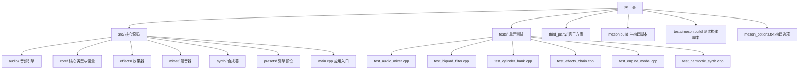
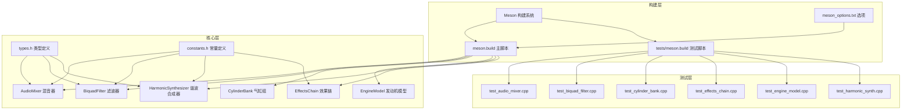
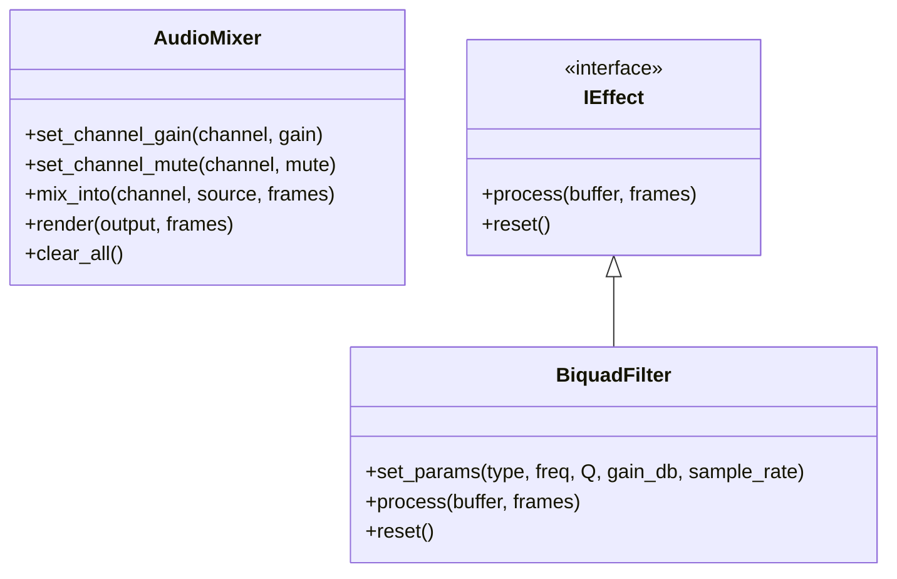
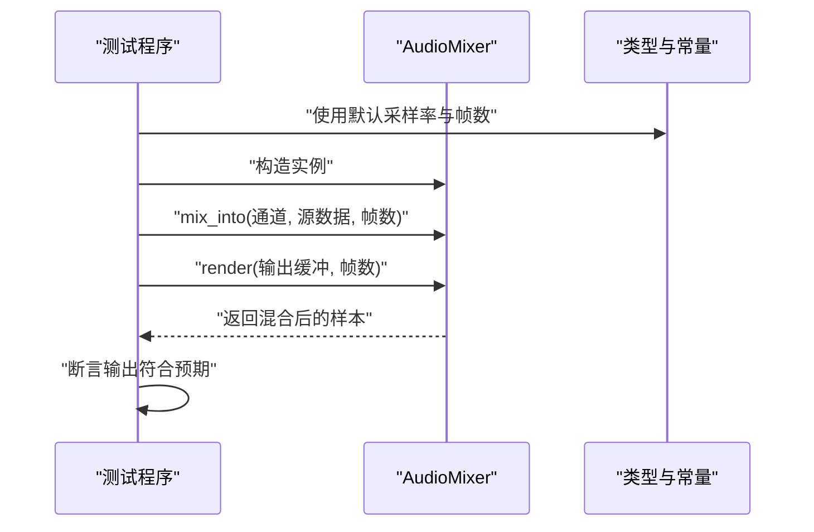
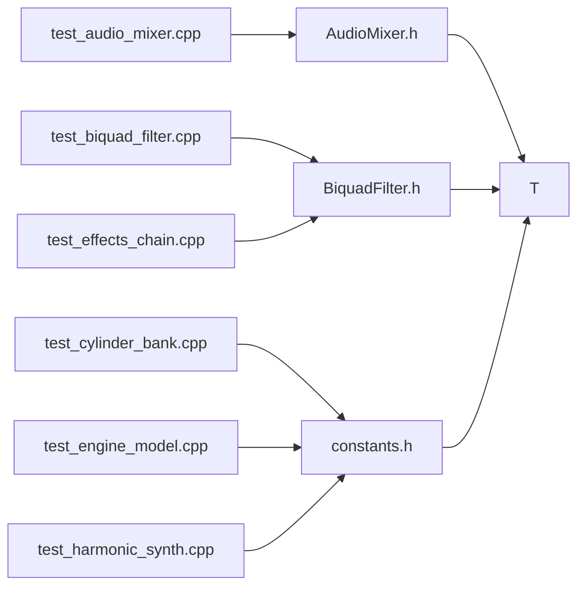

# 测试环境配置

<cite>
**本文引用的文件**
- [meson_options.txt](file://meson_options.txt)
- [meson.build](file://meson.build)
- [tests/meson.build](file://tests/meson.build)
- [src/main.cpp](file://src/main.cpp)
- [src/core/constants.h](file://src/core/constants.h)
- [src/core/types.h](file://src/core/types.h)
- [src/mixer/audio_mixer.h](file://src/mixer/audio_mixer.h)
- [src/effects/biquad_filter.h](file://src/effects/biquad_filter.h)
- [tests/test_audio_mixer.cpp](file://tests/test_audio_mixer.cpp)
- [tests/test_biquad_filter.cpp](file://tests/test_biquad_filter.cpp)
- [tests/test_cylinder_bank.cpp](file://tests/test_cylinder_bank.cpp)
- [tests/test_effects_chain.cpp](file://tests/test_effects_chain.cpp)
- [tests/test_engine_model.cpp](file://tests/test_engine_model.cpp)
- [tests/test_harmonic_synth.cpp](file://tests/test_harmonic_synth.cpp)
</cite>

## 目录
1. [简介](#简介)
2. [项目结构](#项目结构)
3. [核心组件](#核心组件)
4. [架构总览](#架构总览)
5. [详细组件分析](#详细组件分析)
6. [依赖关系分析](#依赖关系分析)
7. [性能考虑](#性能考虑)
8. [故障排查指南](#故障排查指南)
9. [结论](#结论)
10. [附录](#附录)

## 简介
本文件面向测试环境配置与执行，围绕以下目标展开：  
- 解释测试编译选项的配置方法（编译器标志、优化级别、调试信息）  
- 说明测试依赖的安装与配置（开发工具链与第三方库）  
- 阐述测试数据准备与管理（音频样本格式与存储位置）  
- 明确测试执行环境要求（操作系统兼容性、硬件配置、性能基准）  
- 提供测试脚本使用方法与自动化测试配置选项  
- 说明在 Windows、Linux、macOS 平台上的差异与特殊配置  

## 项目结构
该仓库采用 Meson 构建系统，测试代码位于 tests/ 目录，核心源码位于 src/ 目录。测试用例以独立可执行程序形式组织，每个测试文件包含 main() 入口并直接断言验证结果。

图表来源
- [meson.build](file://meson.build)
- [tests/meson.build](file://tests/meson.build)
- [src/main.cpp](file://src/main.cpp)

章节来源
- [meson.build](file://meson.build)
- [tests/meson.build](file://tests/meson.build)
- [meson_options.txt](file://meson_options.txt)

## 核心组件
- 测试编译与选项
  - 通过 Meson 选项控制采样率、缓冲帧数、是否构建演示与测试等。默认启用测试构建。
  - 可通过 Meson 命令行参数覆盖选项值，或在构建目录中使用 meson configure 查看当前配置。
- 默认采样率与缓冲大小
  - 默认采样率为 48000 Hz，缓冲大小为 512 帧；这些常量定义于核心头文件，测试用例也沿用相同采样率进行信号处理。
- 类型与数据流
  - 核心类型定义了单精度浮点样本、帧计数与采样率，贯穿混音器、滤波器、合成器等模块。
- 测试用例组织
  - 每个测试文件自含 main()，直接断言并打印通过信息，便于独立运行与 CI 集成。

章节来源
- [meson_options.txt](file://meson_options.txt)
- [src/core/constants.h](file://src/core/constants.h)
- [src/core/types.h](file://src/core/types.h)
- [tests/test_audio_mixer.cpp](file://tests/test_audio_mixer.cpp)
- [tests/test_biquad_filter.cpp](file://tests/test_biquad_filter.cpp)
- [tests/test_cylinder_bank.cpp](file://tests/test_cylinder_bank.cpp)
- [tests/test_effects_chain.cpp](file://tests/test_effects_chain.cpp)
- [tests/test_engine_model.cpp](file://tests/test_engine_model.cpp)
- [tests/test_harmonic_synth.cpp](file://tests/test_harmonic_synth.cpp)

## 架构总览
测试体系由“构建系统 + 核心模块 + 测试用例”三层组成。构建系统负责编译与链接，核心模块提供被测功能，测试用例通过断言验证行为正确性。

图表来源
- [meson.build](file://meson.build)
- [tests/meson.build](file://tests/meson.build)
- [meson_options.txt](file://meson_options.txt)
- [src/core/types.h](file://src/core/types.h)
- [src/core/constants.h](file://src/core/constants.h)
- [src/mixer/audio_mixer.h](file://src/mixer/audio_mixer.h)
- [src/effects/biquad_filter.h](file://src/effects/biquad_filter.h)
- [tests/test_audio_mixer.cpp](file://tests/test_audio_mixer.cpp)
- [tests/test_biquad_filter.cpp](file://tests/test_biquad_filter.cpp)
- [tests/test_cylinder_bank.cpp](file://tests/test_cylinder_bank.cpp)
- [tests/test_effects_chain.cpp](file://tests/test_effects_chain.cpp)
- [tests/test_engine_model.cpp](file://tests/test_engine_model.cpp)
- [tests/test_harmonic_synth.cpp](file://tests/test_harmonic_synth.cpp)

## 详细组件分析

### 测试编译与构建选项
- 选项来源与含义
  - 采样率：决定音频处理的频率分辨率与带宽
  - 缓冲帧数：影响延迟与吞吐平衡
  - 构建演示与测试：控制是否生成示例应用与测试可执行文件
- 配置方式
  - 在构建目录中使用 Meson 配置命令查看/修改选项
  - 通过命令行参数覆盖默认值
- 优化与调试
  - 推荐在测试环境中开启调试符号以便定位问题
  - 可根据需要调整优化级别以平衡速度与可读性

章节来源
- [meson_options.txt](file://meson_options.txt)
- [meson.build](file://meson.build)
- [tests/meson.build](file://tests/meson.build)

### 测试用例与断言策略
- 断言风格
  - 使用标准断言检查数值范围与边界条件
  - 通过 RMS 或峰值检测验证输出幅度与混音叠加
- 数据准备
  - 测试用例内部生成正弦波或固定幅度信号，避免外部依赖
  - 采样率统一使用默认值，确保跨平台一致性
- 执行流程
  - 每个测试文件包含 main()，直接运行即可执行全部断言

章节来源
- [tests/test_audio_mixer.cpp](file://tests/test_audio_mixer.cpp)
- [tests/test_biquad_filter.cpp](file://tests/test_biquad_filter.cpp)
- [tests/test_cylinder_bank.cpp](file://tests/test_cylinder_bank.cpp)
- [tests/test_effects_chain.cpp](file://tests/test_effects_chain.cpp)
- [tests/test_engine_model.cpp](file://tests/test_engine_model.cpp)
- [tests/test_harmonic_synth.cpp](file://tests/test_harmonic_synth.cpp)

### 关键类与接口（混音器与滤波器）

图表来源
- [src/mixer/audio_mixer.h](file://src/mixer/audio_mixer.h)
- [src/effects/biquad_filter.h](file://src/effects/biquad_filter.h)

章节来源
- [src/mixer/audio_mixer.h](file://src/mixer/audio_mixer.h)
- [src/effects/biquad_filter.h](file://src/effects/biquad_filter.h)

### 测试执行序列（以混音器为例）

图表来源
- [tests/test_audio_mixer.cpp](file://tests/test_audio_mixer.cpp)
- [src/mixer/audio_mixer.h](file://src/mixer/audio_mixer.h)
- [src/core/types.h](file://src/core/types.h)
- [src/core/constants.h](file://src/core/constants.h)

## 依赖关系分析
- 内部依赖
  - 测试用例依赖核心类型与常量，确保采样率与帧数一致
  - 混音器与滤波器实现遵循统一的数据流接口
- 外部依赖
  - 项目未声明额外第三方库，测试不依赖外部音频文件
- 构建依赖
  - Meson 主脚本与测试脚本分别控制演示与测试的构建

图表来源
- [tests/test_audio_mixer.cpp](file://tests/test_audio_mixer.cpp)
- [tests/test_biquad_filter.cpp](file://tests/test_biquad_filter.cpp)
- [tests/test_cylinder_bank.cpp](file://tests/test_cylinder_bank.cpp)
- [tests/test_effects_chain.cpp](file://tests/test_effects_chain.cpp)
- [tests/test_engine_model.cpp](file://tests/test_engine_model.cpp)
- [tests/test_harmonic_synth.cpp](file://tests/test_harmonic_synth.cpp)
- [src/mixer/audio_mixer.h](file://src/mixer/audio_mixer.h)
- [src/effects/biquad_filter.h](file://src/effects/biquad_filter.h)
- [src/core/constants.h](file://src/core/constants.h)
- [src/core/types.h](file://src/core/types.h)

章节来源
- [tests/test_audio_mixer.cpp](file://tests/test_audio_mixer.cpp)
- [tests/test_biquad_filter.cpp](file://tests/test_biquad_filter.cpp)
- [tests/test_cylinder_bank.cpp](file://tests/test_cylinder_bank.cpp)
- [tests/test_effects_chain.cpp](file://tests/test_effects_chain.cpp)
- [tests/test_engine_model.cpp](file://tests/test_engine_model.cpp)
- [tests/test_harmonic_synth.cpp](file://tests/test_harmonic_synth.cpp)
- [src/mixer/audio_mixer.h](file://src/mixer/audio_mixer.h)
- [src/effects/biquad_filter.h](file://src/effects/biquad_filter.h)
- [src/core/constants.h](file://src/core/constants.h)
- [src/core/types.h](file://src/core/types.h)

## 性能考虑
- 帧大小与延迟
  - 默认 512 帧的缓冲有助于降低 CPU 占用，但会增加端到端延迟
  - 更小的缓冲帧数可降低延迟，但对 CPU 压力更大
- 采样率与计算复杂度
  - 48 kHz 的采样率在桌面与移动设备上均较常见，兼顾质量与性能
- 断言开销
  - 测试用例中的断言仅在调试构建中有效，发布构建可通过编译选项关闭断言以减少开销

## 故障排查指南
- 构建失败
  - 确认已安装 Meson 与 Ninja，并具备 C++ 编译器
  - 若默认选项不符合预期，使用 Meson 配置命令调整采样率与缓冲大小
- 运行时错误
  - 若音频设备初始化失败，检查平台音频驱动与权限
  - 对于键盘输入（非 Windows），确认终端原始模式设置正常
- 测试失败
  - 检查断言阈值与期望范围是否与实现一致
  - 对于数值比较，注意浮点误差与单位采样率的一致性

章节来源
- [src/main.cpp](file://src/main.cpp)
- [tests/test_audio_mixer.cpp](file://tests/test_audio_mixer.cpp)
- [tests/test_biquad_filter.cpp](file://tests/test_biquad_filter.cpp)

## 结论
本项目测试环境以 Meson 为核心，通过少量可配置选项即可完成测试构建与运行。测试用例自包含、无外部音频依赖，适合在多平台环境下快速执行。建议在持续集成中启用调试符号与严格断言，以提升问题定位效率。

## 附录

### 平台差异与特殊配置
- Windows
  - 使用原生命键盘输入与控制台交互
  - 需要可用的音频驱动与权限
- Linux/macOS
  - 使用非阻塞键盘输入与终端原始模式
  - 需要合适的音频后端（如 ALSA/PulseAudio 或 CoreAudio）

章节来源
- [src/main.cpp](file://src/main.cpp)

### 测试数据准备与管理
- 生成式测试数据
  - 测试用例内部生成正弦波与固定幅度信号，无需外部音频文件
- 采样率与帧数
  - 统一使用默认采样率与缓冲帧数，保证跨平台一致性

章节来源
- [tests/test_biquad_filter.cpp](file://tests/test_biquad_filter.cpp)
- [tests/test_cylinder_bank.cpp](file://tests/test_cylinder_bank.cpp)
- [tests/test_harmonic_synth.cpp](file://tests/test_harmonic_synth.cpp)
- [src/core/constants.h](file://src/core/constants.h)

### 自动化测试与脚本使用
- 构建与运行
  - 使用 Meson 生成构建系统并编译测试
  - 在构建目录中直接运行各测试可执行文件
- CI 集成
  - 将测试可执行文件纳入流水线，收集断言结果与日志

章节来源
- [meson.build](file://meson.build)
- [tests/meson.build](file://tests/meson.build)