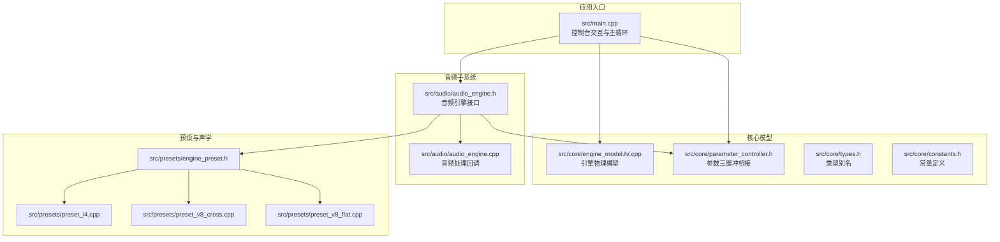
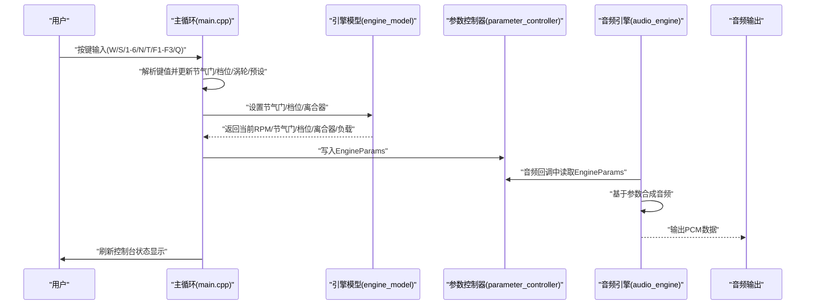
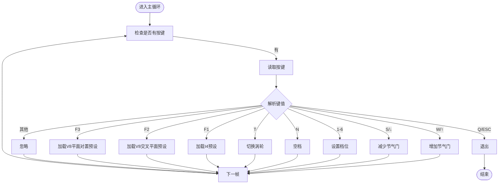
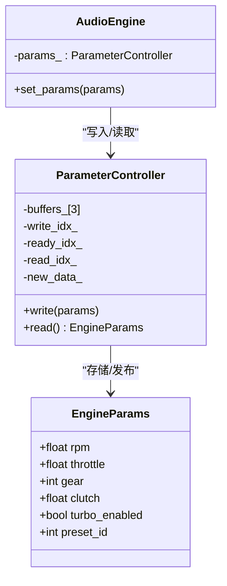
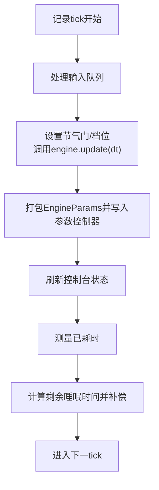
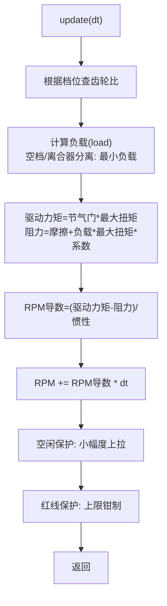
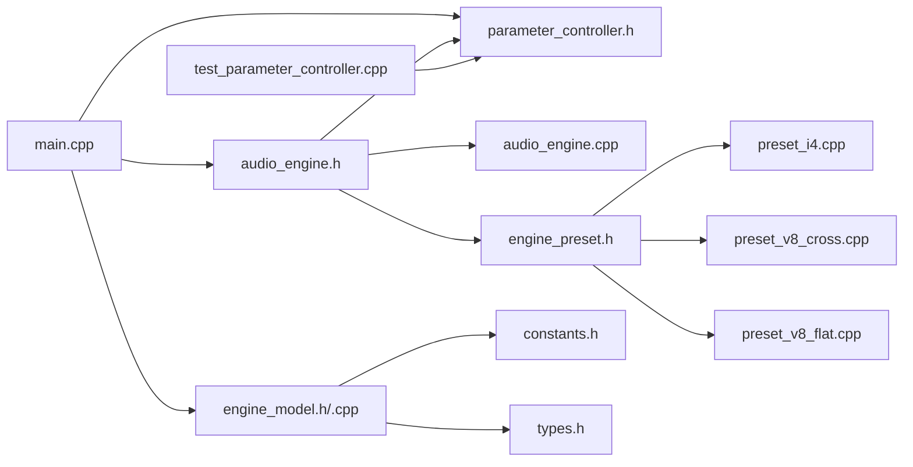

# 用户交互系统

<cite>
**本文引用的文件**
- [src/main.cpp](file://src/main.cpp)
- [src/core/parameter_controller.h](file://src/core/parameter_controller.h)
- [src/core/engine_model.h](file://src/core/engine_model.h)
- [src/core/engine_model.cpp](file://src/core/engine_model.cpp)
- [src/audio/audio_engine.h](file://src/audio/audio_engine.h)
- [src/audio/audio_engine.cpp](file://src/audio/audio_engine.cpp)
- [src/core/constants.h](file://src/core/constants.h)
- [src/core/types.h](file://src/core/types.h)
- [src/presets/engine_preset.h](file://src/presets/engine_preset.h)
- [src/presets/preset_i4.cpp](file://src/presets/preset_i4.cpp)
- [src/presets/preset_v8_cross.cpp](file://src/presets/preset_v8_cross.cpp)
- [src/presets/preset_v8_flat.cpp](file://src/presets/preset_v8_flat.cpp)
- [tests/test_parameter_controller.cpp](file://tests/test_parameter_controller.cpp)
</cite>

## 目录
1. [简介](#简介)
2. [项目结构](#项目结构)
3. [核心组件](#核心组件)
4. [架构总览](#架构总览)
5. [详细组件分析](#详细组件分析)
6. [依赖关系分析](#依赖关系分析)
7. [性能考量](#性能考量)
8. [故障排查指南](#故障排查指南)
9. [结论](#结论)
10. [附录：用户操作指南与最佳实践](#附录用户操作指南与最佳实践)

## 简介
本文件面向“用户交互系统”的技术文档，聚焦于控制台界面的实现与实时参数控制系统。内容涵盖：
- 跨平台键盘输入处理（Windows 与类 Unix 系统）
- 非阻塞输入读取与特殊键处理
- 实时参数控制（节气门、档位、涡轮增压等）
- 参数更新机制（平滑过渡、状态同步、用户反馈）
- 控制循环设计（约 60Hz、时间步长管理、性能优化）
- 错误处理与异常情况处理
- 扩展至图形化界面或其它输入设备的建议

## 项目结构
该工程采用分层模块化组织，用户交互位于顶层入口程序中，通过参数控制器与音频引擎进行解耦，核心物理模型独立于渲染与输入。

图表来源
- [src/main.cpp:89-239](file://src/main.cpp#L89-L239)
- [src/core/engine_model.h:7-48](file://src/core/engine_model.h#L7-L48)
- [src/core/engine_model.cpp:21-52](file://src/core/engine_model.cpp#L21-L52)
- [src/core/parameter_controller.h:18-58](file://src/core/parameter_controller.h#L18-L58)
- [src/audio/audio_engine.h:27-89](file://src/audio/audio_engine.h#L27-L89)
- [src/audio/audio_engine.cpp:102-160](file://src/audio/audio_engine.cpp#L102-L160)
- [src/presets/engine_preset.h:8-47](file://src/presets/engine_preset.h#L8-L47)
- [src/presets/preset_i4.cpp:5-56](file://src/presets/preset_i4.cpp#L5-L56)
- [src/presets/preset_v8_cross.cpp:5-63](file://src/presets/preset_v8_cross.cpp#L5-L63)
- [src/presets/preset_v8_flat.cpp:5-62](file://src/presets/preset_v8_flat.cpp#L5-L62)

章节来源
- [src/main.cpp:89-239](file://src/main.cpp#L89-L239)
- [src/core/engine_model.h:7-48](file://src/core/engine_model.h#L7-L48)
- [src/core/engine_model.cpp:21-52](file://src/core/engine_model.cpp#L21-L52)
- [src/core/parameter_controller.h:18-58](file://src/core/parameter_controller.h#L18-L58)
- [src/audio/audio_engine.h:27-89](file://src/audio/audio_engine.h#L27-L89)
- [src/audio/audio_engine.cpp:102-160](file://src/audio/audio_engine.cpp#L102-L160)
- [src/presets/engine_preset.h:8-47](file://src/presets/engine_preset.h#L8-L47)
- [src/presets/preset_i4.cpp:5-56](file://src/presets/preset_i4.cpp#L5-L56)
- [src/presets/preset_v8_cross.cpp:5-63](file://src/presets/preset_v8_cross.cpp#L5-L63)
- [src/presets/preset_v8_flat.cpp:5-62](file://src/presets/preset_v8_flat.cpp#L5-L62)

## 核心组件
- 控制台交互与输入处理：负责跨平台键盘输入、特殊键识别、状态更新与用户反馈刷新。
- 引擎物理模型：根据节气门、档位、离合器状态计算 RPM、负载等。
- 参数控制器：三缓冲无锁参数桥接，控制线程写入、音频线程读取。
- 音频引擎：音频回调中读取参数，合成引擎声学信号并输出。
- 预设系统：提供不同发动机类型的声学与几何参数集合。

章节来源
- [src/main.cpp:54-81](file://src/main.cpp#L54-L81)
- [src/core/engine_model.h:11-26](file://src/core/engine_model.h#L11-L26)
- [src/core/engine_model.cpp:21-52](file://src/core/engine_model.cpp#L21-L52)
- [src/core/parameter_controller.h:18-58](file://src/core/parameter_controller.h#L18-L58)
- [src/audio/audio_engine.h:27-89](file://src/audio/audio_engine.h#L27-L89)
- [src/audio/audio_engine.cpp:94-160](file://src/audio/audio_engine.cpp#L94-L160)
- [src/presets/engine_preset.h:8-47](file://src/presets/engine_preset.h#L8-L47)

## 架构总览
下图展示了从用户输入到音频输出的端到端流程，以及参数在控制线程与音频线程之间的传递路径。

图表来源
- [src/main.cpp:146-233](file://src/main.cpp#L146-L233)
- [src/core/engine_model.h:11-26](file://src/core/engine_model.h#L11-L26)
- [src/core/parameter_controller.h:32-50](file://src/core/parameter_controller.h#L32-L50)
- [src/audio/audio_engine.cpp:102-160](file://src/audio/audio_engine.cpp#L102-L160)

## 详细组件分析

### 控制台输入与跨平台键盘处理
- Windows 平台使用控制台非阻塞检测与扩展键处理，箭头键与功能键映射为内部码。
- 类 Unix 平台通过原始模式与 select 实现非阻塞读取，结合 read 获取字符。
- 输入循环在每次迭代中尽可能消耗输入队列，避免积压。

图表来源
- [src/main.cpp:146-194](file://src/main.cpp#L146-L194)
- [src/main.cpp:54-81](file://src/main.cpp#L54-L81)

章节来源
- [src/main.cpp:11-81](file://src/main.cpp#L11-L81)
- [src/main.cpp:146-194](file://src/main.cpp#L146-L194)

### 实时参数控制系统
- 节气门：按固定步进增减，范围限制在 0~1。
- 档位：1-6 档，空档用 0 表示；档位影响驱动负载。
- 涡轮增压：布尔开关，切换即生效。
- 预设：F1/F2/F3 切换不同发动机声学特性与参数集。

参数更新在主循环中完成，随后打包为 EngineParams 写入参数控制器，供音频线程读取。

章节来源
- [src/main.cpp:138-141](file://src/main.cpp#L138-L141)
- [src/main.cpp:152-194](file://src/main.cpp#L152-L194)
- [src/core/parameter_controller.h:9-16](file://src/core/parameter_controller.h#L9-L16)

### 参数更新机制与状态同步
- 三缓冲无锁桥接：控制线程写入一个缓冲，音频线程原子交换读取索引，确保零分配、零拷贝的参数传递。
- 参数读取一致性：音频线程在读取前会根据新数据标记进行一次原子交换，保证不会读到半更新的数据。
- 用户反馈：控制台每帧刷新显示 RPM、档位、节气门百分比、负载、涡轮状态与当前预设名称。

图表来源
- [src/core/parameter_controller.h:18-58](file://src/core/parameter_controller.h#L18-L58)
- [src/core/parameter_controller.h:9-16](file://src/core/parameter_controller.h#L9-L16)
- [src/audio/audio_engine.h:37-43](file://src/audio/audio_engine.h#L37-L43)

章节来源
- [src/core/parameter_controller.h:18-58](file://src/core/parameter_controller.h#L18-L58)
- [src/audio/audio_engine.cpp:94-100](file://src/audio/audio_engine.cpp#L94-L100)
- [src/main.cpp:206-214](file://src/main.cpp#L206-L214)

### 控制循环设计与性能优化
- 固定频率：约 60Hz（周期约为 16.667ms），通过 steady_clock 记录起止时间并补偿休眠。
- 时间步长：dt = 1/60 秒，用于引擎模型积分。
- 性能优化：
  - 使用原子变量与三缓冲避免锁竞争与内存分配。
  - 原始模式与非阻塞 select 减少系统调用开销。
  - 控制台刷新仅输出必要字段，避免频繁格式化。

图表来源
- [src/main.cpp:143-144](file://src/main.cpp#L143-L144)
- [src/main.cpp:146-233](file://src/main.cpp#L146-L233)
- [src/core/engine_model.cpp:21-52](file://src/core/engine_model.cpp#L21-L52)
- [src/core/parameter_controller.h:32-50](file://src/core/parameter_controller.h#L32-L50)

章节来源
- [src/main.cpp:143-144](file://src/main.cpp#L143-L144)
- [src/main.cpp:203-232](file://src/main.cpp#L203-L232)
- [src/core/engine_model.cpp:21-52](file://src/core/engine_model.cpp#L21-L52)

### 引擎物理模型与节气门/档位/离合器交互
- 节气门直接影响驱动力矩，进而决定 RPM 变化率。
- 档位通过齿轮比影响驱动负载，空档或离合器分离时负载最小。
- 离合器状态参与负载计算，影响扭矩传递效率。
- 空闲与红线保护：空闲转速下有轻微上拉，超过红线直接限幅。

图表来源
- [src/core/engine_model.cpp:21-52](file://src/core/engine_model.cpp#L21-L52)
- [src/core/engine_model.h:42-44](file://src/core/engine_model.h#L42-L44)

章节来源
- [src/core/engine_model.cpp:21-52](file://src/core/engine_model.cpp#L21-L52)
- [src/core/engine_model.h:24-44](file://src/core/engine_model.h#L24-L44)

### 预设系统与声学参数
- 预设包含气缸数、冲程、空闲/红线转速、惯量、点火相位与顺序、谐波谱、滤波器与失真、混响、进排气噪声等。
- 不同预设（I4、V8 交叉平面、V8 平面对置）具有不同的声学特征与参数边界。
- 音频引擎在加载预设后配置各子模块参数。

章节来源
- [src/presets/engine_preset.h:8-47](file://src/presets/engine_preset.h#L8-L47)
- [src/presets/preset_i4.cpp:5-56](file://src/presets/preset_i4.cpp#L5-L56)
- [src/presets/preset_v8_cross.cpp:5-63](file://src/presets/preset_v8_cross.cpp#L5-L63)
- [src/presets/preset_v8_flat.cpp:5-62](file://src/presets/preset_v8_flat.cpp#L5-L62)
- [src/audio/audio_engine.cpp:70-92](file://src/audio/audio_engine.cpp#L70-L92)

## 依赖关系分析
- 主入口依赖引擎模型、参数控制器与音频引擎。
- 音频引擎依赖参数控制器、预设与各合成/效果模块。
- 引擎模型依赖常量与类型定义。
- 测试覆盖参数控制器并发一致性。

图表来源
- [src/main.cpp:89-239](file://src/main.cpp#L89-L239)
- [src/core/engine_model.h:7-48](file://src/core/engine_model.h#L7-L48)
- [src/core/engine_model.cpp:1-55](file://src/core/engine_model.cpp#L1-L55)
- [src/core/parameter_controller.h:18-58](file://src/core/parameter_controller.h#L18-L58)
- [src/audio/audio_engine.h:27-89](file://src/audio/audio_engine.h#L27-L89)
- [src/audio/audio_engine.cpp:1-163](file://src/audio/audio_engine.cpp#L1-L163)
- [src/presets/engine_preset.h:8-47](file://src/presets/engine_preset.h#L8-L47)
- [src/presets/preset_i4.cpp:1-59](file://src/presets/preset_i4.cpp#L1-L59)
- [src/presets/preset_v8_cross.cpp:1-66](file://src/presets/preset_v8_cross.cpp#L1-L66)
- [src/presets/preset_v8_flat.cpp:1-65](file://src/presets/preset_v8_flat.cpp#L1-L65)
- [tests/test_parameter_controller.cpp:1-95](file://tests/test_parameter_controller.cpp#L1-L95)

章节来源
- [src/main.cpp:89-239](file://src/main.cpp#L89-L239)
- [src/core/engine_model.h:7-48](file://src/core/engine_model.h#L7-L48)
- [src/core/engine_model.cpp:1-55](file://src/core/engine_model.cpp#L1-L55)
- [src/core/parameter_controller.h:18-58](file://src/core/parameter_controller.h#L18-L58)
- [src/audio/audio_engine.h:27-89](file://src/audio/audio_engine.h#L27-L89)
- [src/audio/audio_engine.cpp:1-163](file://src/audio/audio_engine.cpp#L1-L163)
- [src/presets/engine_preset.h:8-47](file://src/presets/engine_preset.h#L8-L47)
- [src/presets/preset_i4.cpp:1-59](file://src/presets/preset_i4.cpp#L1-L59)
- [src/presets/preset_v8_cross.cpp:1-66](file://src/presets/preset_v8_cross.cpp#L1-L66)
- [src/presets/preset_v8_flat.cpp:1-65](file://src/presets/preset_v8_flat.cpp#L1-L62)
- [tests/test_parameter_controller.cpp:1-95](file://tests/test_parameter_controller.cpp#L1-L95)

## 性能考量
- 控制线程与音频线程完全解耦，避免锁争用。
- 三缓冲无锁参数桥接，避免分配与拷贝。
- 非阻塞输入减少系统调用等待。
- 固定频率循环与睡眠补偿，稳定帧率。
- 建议：
  - 在高负载场景下适当增大音频缓冲帧数以降低回调压力。
  - 对于更复杂的输入设备，优先考虑事件驱动而非轮询。

## 故障排查指南
- 无法初始化音频设备
  - 现象：启动即失败并退出。
  - 排查：确认音频驱动可用、权限足够、采样率与缓冲帧数合理。
  - 参考位置：[src/main.cpp:110-113](file://src/main.cpp#L110-L113)，[src/audio/audio_engine.cpp:18-45](file://src/audio/audio_engine.cpp#L18-L45)
- 输入无响应
  - 现象：按键无效。
  - 排查：Windows 下确认 _kbhit/_getch 正常；类 Unix 下确认原始模式与 select 设置正确。
  - 参考位置：[src/main.cpp:54-81](file://src/main.cpp#L54-L81)
- 参数读取不一致或撕裂
  - 现象：音频线程读到部分更新的参数。
  - 排查：确保使用参数控制器的 read/write 接口；测试可参考并发读写测试。
  - 参考位置：[src/core/parameter_controller.h:32-50](file://src/core/parameter_controller.h#L32-L50)，[tests/test_parameter_controller.cpp:35-84](file://tests/test_parameter_controller.cpp#L35-L84)
- 帧率不稳定导致音调漂移
  - 现象：节气门变化与 RPM 变化不同步。
  - 排查：检查控制循环睡眠补偿逻辑与 dt 是否恒定。
  - 参考位置：[src/main.cpp:227-232](file://src/main.cpp#L227-L232)

章节来源
- [src/main.cpp:110-113](file://src/main.cpp#L110-L113)
- [src/audio/audio_engine.cpp:18-45](file://src/audio/audio_engine.cpp#L18-L45)
- [src/main.cpp:54-81](file://src/main.cpp#L54-L81)
- [src/core/parameter_controller.h:32-50](file://src/core/parameter_controller.h#L32-L50)
- [tests/test_parameter_controller.cpp:35-84](file://tests/test_parameter_controller.cpp#L35-L84)
- [src/main.cpp:227-232](file://src/main.cpp#L227-L232)

## 结论
该用户交互系统通过跨平台非阻塞输入、三缓冲无锁参数桥接与固定频率控制循环，实现了低延迟、高稳定性的实时参数控制。配合多预设声学模型，能够在控制台环境中提供丰富的驾驶与声学体验。未来可在此基础上扩展图形界面与多输入源支持，同时保持参数桥接与控制循环的稳定性。

## 附录：用户操作指南与最佳实践
- 快捷键说明
  - W/↑：提升节气门
  - S/↓：降低节气门
  - 1-6：挂入对应档位
  - N：空档
  - T：切换涡轮增压
  - F1：加载 I4 预设
  - F2：加载 V8 交叉平面预设
  - F3：加载 V8 平面对置预设
  - Q/ESC：退出
- 最佳实践
  - 保持稳定的 60Hz 控制频率，避免手动修改 dt。
  - 使用预设切换快速对比不同声学特征。
  - 在高负载场景下适当提高音频缓冲帧数以降低回调压力。
  - 如需扩展图形界面，建议复用现有参数控制器与引擎模型，保持控制逻辑不变。
- 扩展建议
  - 图形界面：使用事件驱动替代轮询，参数仍通过参数控制器发布。
  - 其它输入设备：如手柄、触摸屏，统一映射到 EngineParams 字段并通过参数控制器发布。
  - 多线程：若引入更多后台任务，注意与音频线程的同步与锁策略。