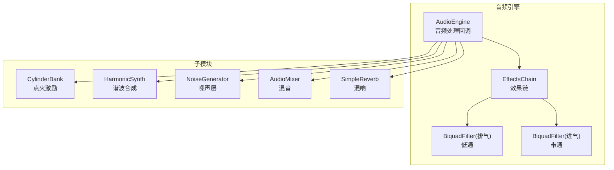
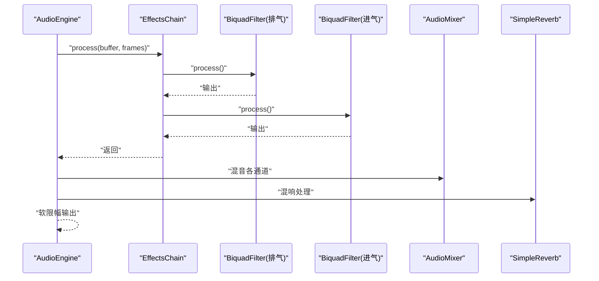
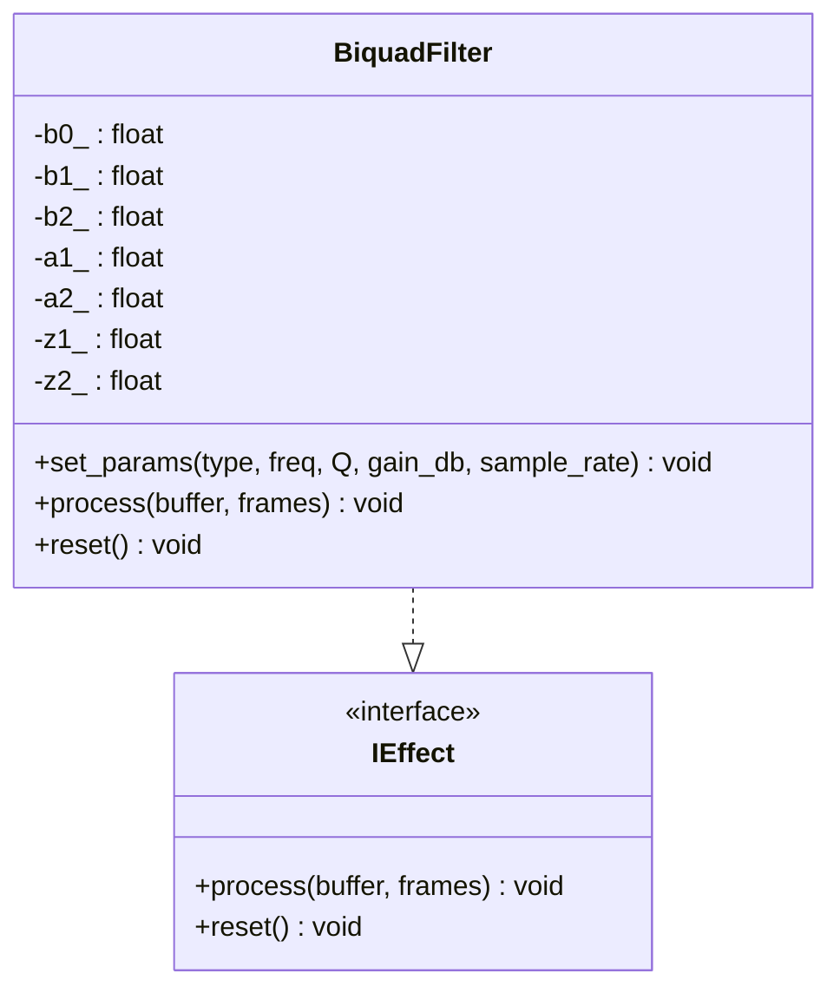
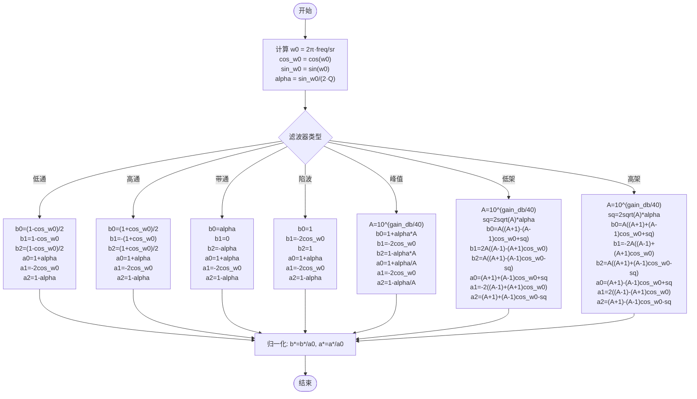
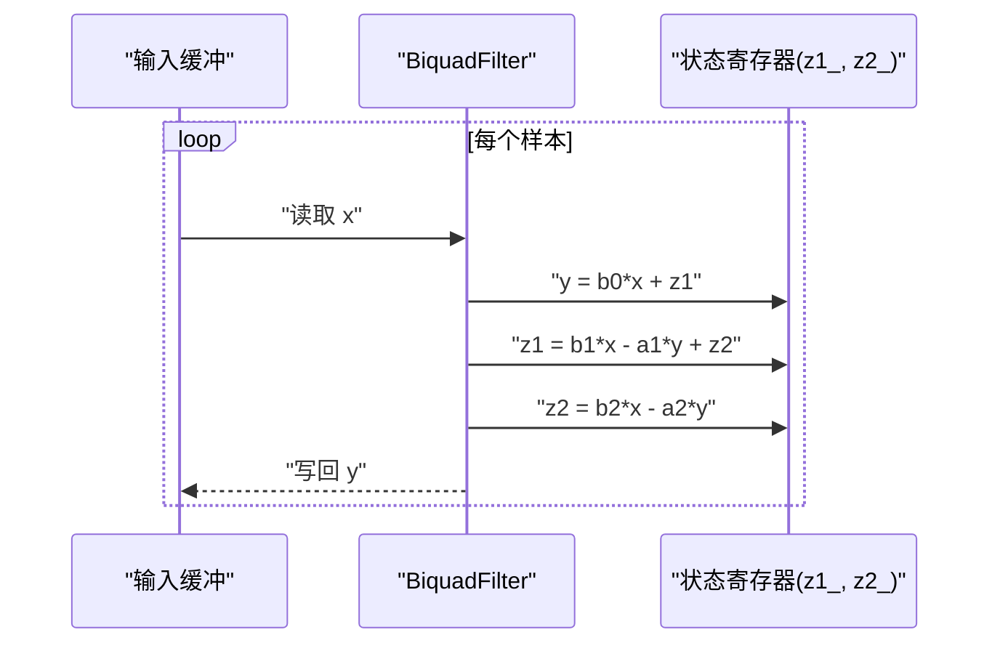
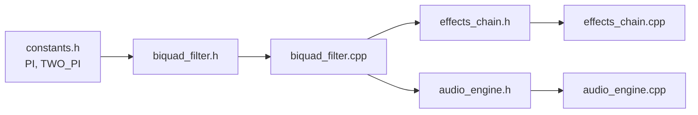

# 双二阶滤波器

<cite>
**本文引用的文件**
- [biquad_filter.h](file://src/effects/biquad_filter.h)
- [biquad_filter.cpp](file://src/effects/biquad_filter.cpp)
- [test_biquad_filter.cpp](file://tests/test_biquad_filter.cpp)
- [constants.h](file://src/core/constants.h)
- [effects_chain.h](file://src/effects/effects_chain.h)
- [effects_chain.cpp](file://src/effects/effects_chain.cpp)
- [audio_engine.h](file://src/audio/audio_engine.h)
- [audio_engine.cpp](file://src/audio/audio_engine.cpp)
</cite>

## 目录
1. [简介](#简介)
2. [项目结构](#项目结构)
3. [核心组件](#核心组件)
4. [架构总览](#架构总览)
5. [详细组件分析](#详细组件分析)
6. [依赖关系分析](#依赖关系分析)
7. [性能与实时性考量](#性能与实时性考量)
8. [故障排查指南](#故障排查指南)
9. [结论](#结论)
10. [附录：参数调优与应用场景](#附录参数调优与应用场景)

## 简介
本文件围绕双二阶（Biquad）滤波器在赛车音效引擎中的实现与应用进行系统化技术说明。内容涵盖：
- 数学模型：传递函数、差分方程、直接IIR形式（直接型II转置状态变量）
- 系数计算：基于角频率、品质因数Q与增益（dB）的通用推导
- 滤波器类型：低通、高通、带通、陷波、峰值、低架、高架
- 频率响应特性与参数设置建议
- 稳定性与数值精度分析
- 实时处理能力与性能特征
- 参数调优指南与典型应用场景（结合引擎中进排气建模）

## 项目结构
该工程采用模块化组织，滤波器位于 effects 子目录，作为可插拔效果单元参与音频处理链路；在音频引擎中通过预设参数配置进排气滤波器，并串联到主混音流程中。

图表来源
- [audio_engine.cpp:102-160](file://src/audio/audio_engine.cpp#L102-L160)
- [effects_chain.cpp:17-27](file://src/effects/effects_chain.cpp#L17-L27)
- [biquad_filter.h:25-42](file://src/effects/biquad_filter.h#L25-L42)

章节来源
- [audio_engine.h:27-92](file://src/audio/audio_engine.h#L27-L92)
- [audio_engine.cpp:70-92](file://src/audio/audio_engine.cpp#L70-L92)
- [effects_chain.h:8-21](file://src/effects/effects_chain.h#L8-L21)
- [effects_chain.cpp:17-27](file://src/effects/effects_chain.cpp#L17-L27)

## 核心组件
- IEffect 接口：统一的音频效果处理与重置接口，便于效果链组合
- BiquadFilter：双二阶滤波器实现，支持多种滤波器类型与参数设置
- EffectsChain：效果链容器，按顺序串行处理缓冲区数据
- AudioEngine：音频引擎，负责参数读取、子模块配置与处理流程编排

章节来源
- [biquad_filter.h:17-42](file://src/effects/biquad_filter.h#L17-L42)
- [effects_chain.h:8-21](file://src/effects/effects_chain.h#L8-L21)
- [audio_engine.h:27-92](file://src/audio/audio_engine.h#L27-L92)

## 架构总览
滤波器在引擎中的位置如下：点火激励经排气滤波（低通）→ 失真 → 混音通道0；谐波合成经进气滤波（带通）→ 混音通道1；噪声层分别进入通道2/3；最终由混音器汇总并叠加混响，最后软限幅输出。

图表来源
- [audio_engine.cpp:102-160](file://src/audio/audio_engine.cpp#L102-L160)
- [effects_chain.cpp:17-27](file://src/effects/effects_chain.cpp#L17-L27)
- [biquad_filter.cpp:103-111](file://src/effects/biquad_filter.cpp#L103-L111)

## 详细组件分析

### BiquadFilter 类与数学模型
- 差分方程（直接型II转置）：以当前输入与历史状态 z1_, z2_ 计算当前输出 y，再更新状态
- 传递函数：有理分式形式，分子与分母均为二次多项式，系数为 b0,b1,b2 与 a1,a2
- 状态变量：z1_, z2_ 保存上一时刻的内部状态，实现零极点对消与数值稳定

图表来源
- [biquad_filter.h:25-42](file://src/effects/biquad_filter.h#L25-L42)

章节来源
- [biquad_filter.h:25-42](file://src/effects/biquad_filter.h#L25-L42)
- [biquad_filter.cpp:103-111](file://src/effects/biquad_filter.cpp#L103-L111)

### 系数计算与滤波器类型
- 角频率与品质因数：使用角频率 w0 与 Q 值计算 alpha，进而得到各类滤波器的 b/a 系数
- 归一化：除以 a0，确保单位增益
- 支持类型：低通、高通、带通、陷波、峰值、低架、高架

图表来源
- [biquad_filter.cpp:11-101](file://src/effects/biquad_filter.cpp#L11-L101)

章节来源
- [biquad_filter.cpp:11-101](file://src/effects/biquad_filter.cpp#L11-L101)

### 处理流程与时序
- process 循环：逐样本执行差分方程，更新内部状态
- reset：清零内部状态，避免跨段处理的瞬态延续

图表来源
- [biquad_filter.cpp:103-111](file://src/effects/biquad_filter.cpp#L103-L111)

章节来源
- [biquad_filter.cpp:103-111](file://src/effects/biquad_filter.cpp#L103-L111)

### 频率响应与参数特性
- 截止频率 f0：决定通带/阻带边界，受采样率影响
- 品质因数 Q：控制带宽与峰值/凹陷深度，Q 越大，过渡越陡峭
- 峰值/低架/高架滤波器引入增益（dB），通过 A=10^(gain_db/40) 控制提升或衰减幅度
- 测试用例验证了低通抑制高频、高通抑制低频以及近带通（极高截止）接近直通的行为

章节来源
- [test_biquad_filter.cpp:25-90](file://tests/test_biquad_filter.cpp#L25-L90)

## 依赖关系分析
- BiquadFilter 依赖常量定义（π、2π）
- EffectsChain 将多个 IEffect 组合，BiquadFilter 作为其中一项
- AudioEngine 在加载预设时配置进排气滤波器参数，并将其加入效果链

图表来源
- [constants.h:8-9](file://src/core/constants.h#L8-L9)
- [biquad_filter.h:3](file://src/effects/biquad_filter.h#L3)
- [effects_chain.h:3](file://src/effects/effects_chain.h#L3)
- [audio_engine.h:11](file://src/audio/audio_engine.h#L11)

章节来源
- [constants.h:8-9](file://src/core/constants.h#L8-L9)
- [biquad_filter.h:3](file://src/effects/biquad_filter.h#L3)
- [effects_chain.h:3](file://src/effects/effects_chain.h#L3)
- [audio_engine.h:11](file://src/audio/audio_engine.h#L11)

## 性能与实时性考量
- 复杂度：单帧 O(N) 样本处理，每样本仅一次乘加与一次状态更新，适合实时
- 缓冲策略：AudioEngine 使用固定大小的临时缓冲（最大 4096 样本），避免动态分配
- 效果链：EffectsChain 顺序串行处理，便于扩展与维护
- 采样率：默认 48kHz，周期长度 512，满足大多数音频实时需求
- 数值稳定性：直接型II转置实现，状态变量在 reset 时清零，减少累积误差

章节来源
- [audio_engine.cpp:76-82](file://src/audio/audio_engine.cpp#L76-L82)
- [effects_chain.cpp:17-27](file://src/effects/effects_chain.cpp#L17-L27)
- [biquad_filter.cpp:103-111](file://src/effects/biquad_filter.cpp#L103-L111)

## 故障排查指南
- 无输出或异常静音
  - 检查是否正确设置采样率与帧数
  - 确认滤波器已 reset 或状态未被外部污染
- 频响不符合预期
  - 核对截止频率与 Q 值范围（Q 过小可能导致带宽过宽，过大可能导致不稳定或过度衰减）
  - 对于峰值/架式滤波器，确认增益（dB）设置是否合理
- 高频噪声或失真
  - 降低 Q 值或提高截止频率
  - 确保输入信号幅度适中，避免饱和
- 实时处理卡顿
  - 检查帧长度与 CPU 占用，必要时增大缓冲或减少效果数量

章节来源
- [test_biquad_filter.cpp:25-90](file://tests/test_biquad_filter.cpp#L25-L90)
- [biquad_filter.cpp:113-115](file://src/effects/biquad_filter.cpp#L113-L115)

## 结论
本实现采用标准双二阶滤波器结构，通过直接型II转置实现高效稳定的实时处理。通过对不同滤波器类型的系数推导与归一化，能够覆盖常见的音频均衡与建模需求。结合引擎中的进排气建模，滤波器有效提升了声音的真实感与层次感。

## 附录：参数调优与应用场景

### 参数设置要点
- 截止频率 f0
  - 低通：用于抑制高频噪声或塑造尾气“闷”感
  - 高通：去除低频 rumble 或强调进气“尖锐”感
  - 带通：突出特定频段（如进气共振）
- 品质因数 Q
  - 较小 Q：平滑过渡，适合自然的渐变
  - 较大 Q：窄带增强/衰减，适合强调特定频率
- 峰值/架式增益（dB）
  - 正增益：突出某频段，营造“明亮”或“空洞”
  - 负增益：衰减某频段，营造“沉稳”

### 典型应用场景（结合引擎）
- 排气建模（低通）
  - 作用：抑制高频，模拟排气管的“闷”声
  - 参数：截止频率与 Q 根据预设调整，配合失真形成典型排气音色
- 进气建模（带通）
  - 作用：强调进气阶段的“呼吸感”，与谐波合成相辅相成
  - 参数：中心频率与 Q 与节气门开度/转速相关

章节来源
- [audio_engine.cpp:79-82](file://src/audio/audio_engine.cpp#L79-L82)
- [audio_engine.cpp:127-136](file://src/audio/audio_engine.cpp#L127-L136)