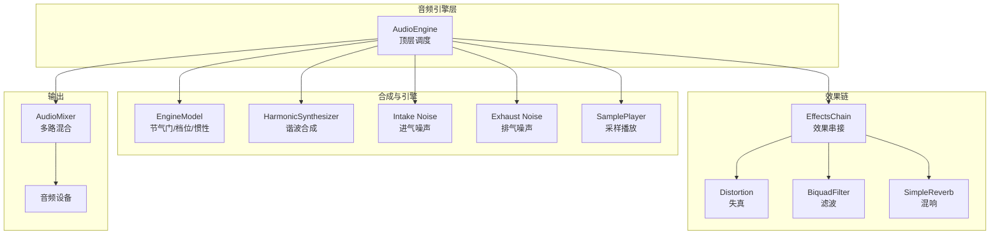
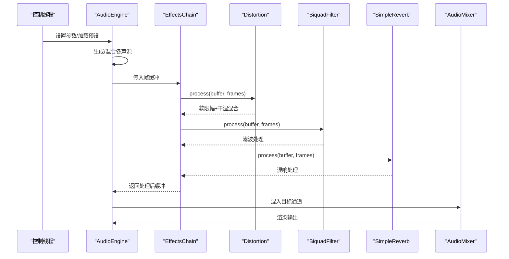
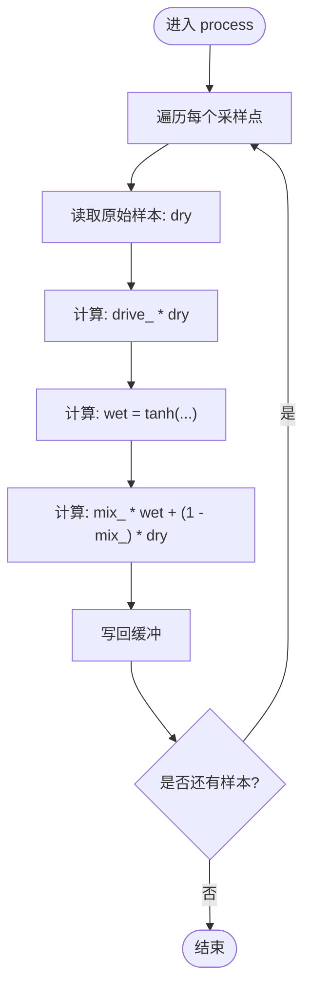
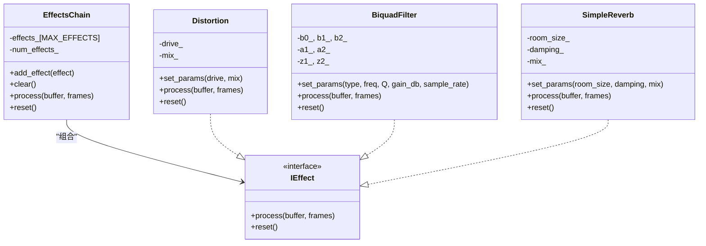
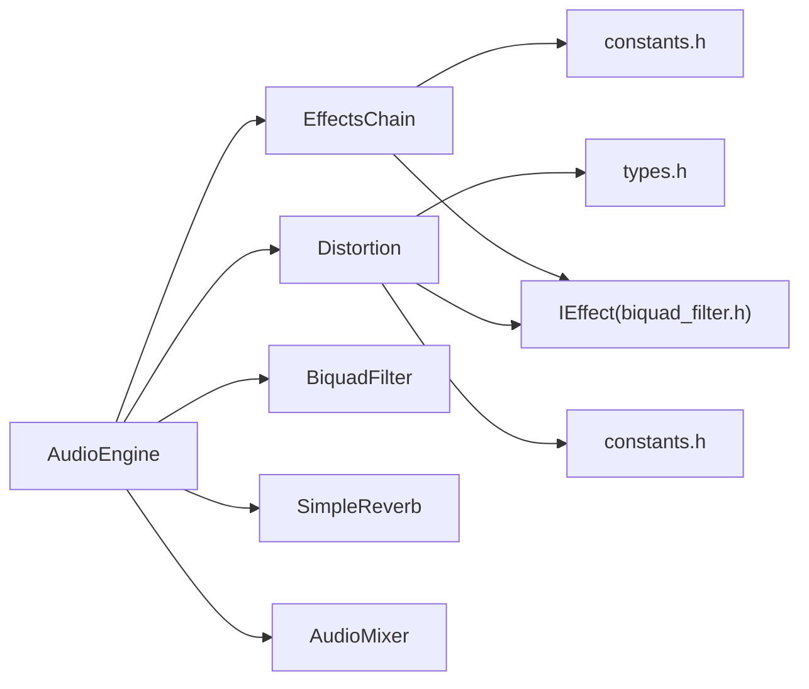

# 失真效果处理

<cite>
**本文引用的文件**
- [distortion.h](file://src/effects/distortion.h)
- [distortion.cpp](file://src/effects/distortion.cpp)
- [effects_chain.h](file://src/effects/effects_chain.h)
- [effects_chain.cpp](file://src/effects/effects_chain.cpp)
- [biquad_filter.h](file://src/effects/biquad_filter.h)
- [biquad_filter.cpp](file://src/effects/biquad_filter.cpp)
- [audio_engine.h](file://src/audio/audio_engine.h)
- [engine_preset.h](file://src/presets/engine_preset.h)
- [types.h](file://src/core/types.h)
- [constants.h](file://src/core/constants.h)
- [test_effects_chain.cpp](file://tests/test_effects_chain.cpp)
- [reverb.h](file://src/effects/reverb.h)
- [noise_generator.h](file://src/synth/noise_generator.h)
</cite>

## 目录
1. [引言](#引言)
2. [项目结构](#项目结构)
3. [核心组件](#核心组件)
4. [架构总览](#架构总览)
5. [详细组件分析](#详细组件分析)
6. [依赖关系分析](#依赖关系分析)
7. [性能考虑](#性能考虑)
8. [故障排查指南](#故障排查指南)
9. [结论](#结论)
10. [附录](#附录)

## 引言
本文件聚焦于赛车声音引擎中的“失真效果”处理，围绕 Distortion 类的算法实现进行深入解析，涵盖软限幅、波形整形与谐波失真等原理；同时结合项目中“效果链”（EffectsChain）的组织方式，说明失真在汽车引擎声音模拟中的应用路径与参数调优策略，并给出实时处理性能与伪影规避建议。

## 项目结构
本项目采用模块化分层设计：合成器与引擎模型负责生成基础声学信号；混音器负责多通道混合；效果链统一编排滤波、失真、混响等效果；音频引擎作为顶层调度者，连接各子模块并驱动实时回调。

图表来源
- [audio_engine.h:27-84](file://src/audio/audio_engine.h#L27-L84)
- [effects_chain.h:8-21](file://src/effects/effects_chain.h#L8-L21)
- [distortion.h:7-19](file://src/effects/distortion.h#L7-L19)
- [biquad_filter.h:25-42](file://src/effects/biquad_filter.h#L25-L42)
- [reverb.h:9-73](file://src/effects/reverb.h#L9-L73)
- [audio_mixer.h:9-34](file://src/mixer/audio_mixer.h#L9-L34)

章节来源
- [audio_engine.h:27-84](file://src/audio/audio_engine.h#L27-L84)
- [effects_chain.h:8-21](file://src/effects/effects_chain.h#L8-L21)
- [distortion.h:7-19](file://src/effects/distortion.h#L7-L19)
- [biquad_filter.h:25-42](file://src/effects/biquad_filter.h#L25-L42)
- [reverb.h:9-73](file://src/effects/reverb.h#L9-L73)
- [audio_mixer.h:9-34](file://src/mixer/audio_mixer.h#L9-L34)

## 核心组件
- Distortion（失真）
  - 提供驱动（drive）与干湿比（mix）两个参数，内部以双曲正切函数实现软限幅，再与原始信号线性混合。
  - 状态：无状态，无需复位。
- EffectsChain（效果链）
  - 将多个 IEffect 实例按顺序串接，依次处理帧缓冲。
- BiquadFilter（滤波器）
  - 基于双二阶滤波器（Direct Form II Transposed），支持低通、高通、带通、陷波、峰值、低 shelf、高 shelf 等类型。
- AudioEngine（音频引擎）
  - 组织引擎模型、合成器、噪声源、滤波器、失真、混响与混音器，提供实时回调处理与预设加载能力。
- 预设（EnginePreset）
  - 包含失真驱动与干湿比等效果参数，便于快速切换不同音色风格。

章节来源
- [distortion.h:7-19](file://src/effects/distortion.h#L7-L19)
- [distortion.cpp:9-24](file://src/effects/distortion.cpp#L9-L24)
- [effects_chain.h:8-21](file://src/effects/effects_chain.h#L8-L21)
- [effects_chain.cpp:17-27](file://src/effects/effects_chain.cpp#L17-L27)
- [biquad_filter.h:25-42](file://src/effects/biquad_filter.h#L25-L42)
- [audio_engine.h:58-69](file://src/audio/audio_engine.h#L58-L69)
- [engine_preset.h:33-38](file://src/presets/engine_preset.h#L33-L38)

## 架构总览
失真效果在引擎中的位置与数据流如下：

图表来源
- [audio_engine.h:58-69](file://src/audio/audio_engine.h#L58-L69)
- [effects_chain.cpp:17-21](file://src/effects/effects_chain.cpp#L17-L21)
- [distortion.cpp:14-20](file://src/effects/distortion.cpp#L14-L20)
- [biquad_filter.cpp:103-111](file://src/effects/biquad_filter.cpp#L103-L111)
- [reverb.h:9-73](file://src/effects/reverb.h#L9-L73)

## 详细组件分析

### Distortion 类算法与实现
- 参数
  - drive：驱动强度，用于放大输入信号，实现软限幅与波形整形。
  - mix：干湿比，0 表示纯干声，1 表示纯湿声。
- 处理流程
  - 对每个采样点执行：dry = 原始样本；wet = tanh(drive × dry)；输出 = mix × wet + (1 − mix) × dry。
  - tanh 函数提供平滑的软限幅，抑制过载导致的硬削波伪影。
- 状态与复位
  - 无内部状态，process 为纯函数式处理，reset 不做任何操作。
- 复杂度
  - 时间复杂度 O(N)，空间复杂度 O(1)。

图表来源
- [distortion.cpp:14-20](file://src/effects/distortion.cpp#L14-L20)

章节来源
- [distortion.h:7-19](file://src/effects/distortion.h#L7-L19)
- [distortion.cpp:9-24](file://src/effects/distortion.cpp#L9-L24)

### EffectsChain 效果串接
- 功能
  - 顺序执行已添加的效果，支持清空与重置。
- 使用方式
  - 在 AudioEngine 中将 Distortion、BiquadFilter、SimpleReverb 等按顺序加入链表，形成完整的处理管线。
- 状态
  - 各效果独立 reset，链表自身不保存状态。

图表来源
- [effects_chain.h:8-21](file://src/effects/effects_chain.h#L8-L21)
- [biquad_filter.h:18-42](file://src/effects/biquad_filter.h#L18-L42)
- [distortion.h:7-19](file://src/effects/distortion.h#L7-L19)
- [reverb.h:9-73](file://src/effects/reverb.h#L9-L73)

章节来源
- [effects_chain.h:8-21](file://src/effects/effects_chain.h#L8-L21)
- [effects_chain.cpp:7-27](file://src/effects/effects_chain.cpp#L7-L27)
- [biquad_filter.h:18-42](file://src/effects/biquad_filter.h#L18-L42)
- [biquad_filter.cpp:103-111](file://src/effects/biquad_filter.cpp#L103-L111)
- [distortion.h:7-19](file://src/effects/distortion.h#L7-L19)
- [distortion.cpp:14-20](file://src/effects/distortion.cpp#L14-L20)
- [reverb.h:9-73](file://src/effects/reverb.h#L9-L73)

### 滤波与混响（辅助音色塑造）
- BiquadFilter
  - 支持多种滤波类型，基于双二阶差分方程，Direct Form II Transposed 结构保证数值稳定。
  - 适合在失真之后进行音色修饰，例如衰减高频或提升中频以增强粗糙感。
- SimpleReverb
  - Schröeder 混响：4 个梳状滤波器 + 2 个全通滤波器，用于营造空间感与尾音。

章节来源
- [biquad_filter.h:25-42](file://src/effects/biquad_filter.h#L25-L42)
- [biquad_filter.cpp:11-101](file://src/effects/biquad_filter.cpp#L11-L101)
- [reverb.h:9-73](file://src/effects/reverb.h#L9-L73)

### 预设与参数映射
- EnginePreset 中包含失真驱动与干湿比等效果参数，AudioEngine 在加载预设时会设置对应效果实例的参数，从而快速切换不同音色风格。

章节来源
- [engine_preset.h:33-38](file://src/presets/engine_preset.h#L33-L38)
- [audio_engine.h:58-69](file://src/audio/audio_engine.h#L58-L69)

## 依赖关系分析
- Distortion 依赖
  - types.h：采样类型定义。
  - constants.h：数学常量与全局常量（如 PI）。
  - biquad_filter.h：接口约定（IEffect）。
- EffectsChain 依赖
  - IEffect 接口与 MAX_EFFECTS 常量。
- AudioEngine 依赖
  - 各子模块头文件，组织合成、效果与混音。

图表来源
- [distortion.h:3](file://src/effects/distortion.h#L3)
- [effects_chain.h:3](file://src/effects/effects_chain.h#L3)
- [audio_engine.h:11-16](file://src/audio/audio_engine.h#L11-L16)
- [types.h:7-9](file://src/core/types.h#L7-L9)
- [constants.h:8-17](file://src/core/constants.h#L8-L17)

章节来源
- [distortion.h:3](file://src/effects/distortion.h#L3)
- [effects_chain.h:3](file://src/effects/effects_chain.h#L3)
- [audio_engine.h:11-16](file://src/audio/audio_engine.h#L11-L16)
- [types.h:7-9](file://src/core/types.h#L7-L9)
- [constants.h:8-17](file://src/core/constants.h#L8-L17)

## 性能考虑
- 单帧复杂度
  - Distortion：O(N) 时间，O(1) 额外空间；单次 tanh 与乘加运算。
  - BiquadFilter：O(N) 时间，O(1) 额外空间；两次乘加与状态寄存器更新。
  - EffectsChain：O(K×N)，K 为链上效果数。
- 缓冲与块大小
  - 默认缓冲帧数与采样率由 constants.h 定义，影响每回调的处理量与 CPU 占用。
- 优化建议
  - 合理选择缓冲帧数：增大可降低回调次数但增加延迟；减小可降低延迟但提高 CPU。
  - 将昂贵效果（如混响）放在链末端，减少重复拷贝。
  - 使用合适的 drive 与 mix：过高的 drive 可能导致多次 tanh 计算开销与饱和区域的无效运算。
- 测试验证
  - 单效果链测试确保输出有界且行为符合预期。

章节来源
- [distortion.cpp:14-20](file://src/effects/distortion.cpp#L14-L20)
- [biquad_filter.cpp:103-111](file://src/effects/biquad_filter.cpp#L103-L111)
- [effects_chain.cpp:17-21](file://src/effects/effects_chain.cpp#L17-L21)
- [constants.h:15-16](file://src/core/constants.h#L15-L16)
- [test_effects_chain.cpp:30-49](file://tests/test_effects_chain.cpp#L30-L49)

## 故障排查指南
- 输出溢出或削波
  - 症状：失真后出现尖锐的硬限幅伪影。
  - 排查：确认 drive 参数未过高；检查混响前是否已有过度饱和。
  - 解决：降低 drive 或在混响前加入轻度高通/低通滤波以削减极端频率成分。
- 音色偏薄或发闷
  - 症状：过度失真导致高频损失。
  - 排查：检查滤波器设置与混响参数。
  - 解决：在失真后加入适度的高通或峰值均衡，提升高频细节。
- 噪声与伪影
  - 症状：爆音、嗡鸣或不稳定音色。
  - 排查：检查输入信号电平与 drive 的匹配；确认混响反馈与阻尼参数合理。
  - 解决：降低 room_size 与 damping，或在失真前加入轻微压缩。
- 实时稳定性
  - 症状：卡顿或断续。
  - 排查：检查缓冲帧数与 CPU 占用；确认链上效果数量与参数。
  - 解决：适当减少效果数量或增大缓冲帧数。

章节来源
- [distortion.cpp:9-12](file://src/effects/distortion.cpp#L9-L12)
- [biquad_filter.cpp:11-101](file://src/effects/biquad_filter.cpp#L11-L101)
- [reverb.h:19-21](file://src/effects/reverb.h#L19-L21)
- [test_effects_chain.cpp:11-27](file://tests/test_effects_chain.cpp#L11-L27)

## 结论
Distortion 在本项目中以简洁高效的 tanh 软限幅为核心，配合 EffectsChain 形成可扩展的效果管线。通过合理设置 drive 与 mix，并结合滤波与混响，可在汽车引擎声音模拟中有效增强粗糙感与真实感。性能方面，其线性复杂度与无状态特性使其适合实时处理；配合合理的缓冲与参数调优，可兼顾音质与效率。

## 附录

### 失真在引擎声音模拟中的应用要点
- 过载失真（Overdrive）
  - 通过提升 drive 实现更强烈的软限幅，使波形更接近硬限幅的“金属感”，适合表现高转速或涡轮增压下的粗砺质感。
- 晶体管失真（Transistor-like）
  - 使用适中的 drive 与 mix，配合高通滤波提升高频细节，模拟早期电子管/晶体管电路的温暖与厚度。
- 管子失真（Tube-like）
  - 采用较低 drive 与柔和的 tanh 特性，保留更多原始动态，辅以轻微峰值均衡与混响，营造圆润的厚实感。

### 失真参数调优指南
- drive
  - 低值（1.0–1.5）：细腻、自然，适合日常驾驶或低转速场景。
  - 中值（1.5–2.5）：平衡的粗糙感与保真度，通用场景首选。
  - 高值（>2.5）：强失真，注意与后续滤波/混响的搭配，避免过度削波。
- mix
  - 低值（<0.3）：强调原始干净音色，失真作为微妙修饰。
  - 中值（0.3–0.7）：干湿平衡，突出失真带来的音色变化。
  - 高值（>0.7）：强调失真效果，需谨慎控制 drive 以避免削波。

### 音质评估方法
- 主观听感
  - 对比不同 drive 与 mix 下的粗糙感、清晰度与动态范围。
- 客观测量
  - FFT 分析谐波含量，观察 2 次、3 次及更高次谐波的相对能量变化。
  - 动态范围与 THD+N（总谐波失真+噪声）指标，确保在可接受范围内。

### 避免伪影与保持清晰度
- 输入电平管理
  - 在进入 Distortion 前控制整体增益，避免过载。
- 滤波前置
  - 在失真前加入高通/低通滤波，去除极端频率，减少削波与混叠伪影。
- 平衡混响
  - 控制混响的 room_size 与 damping，避免反馈环导致的自激或“雾化”效应。