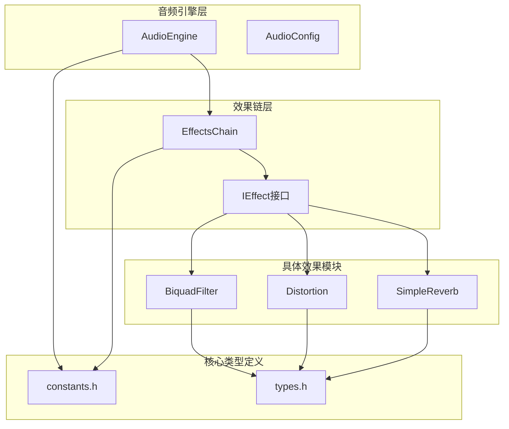
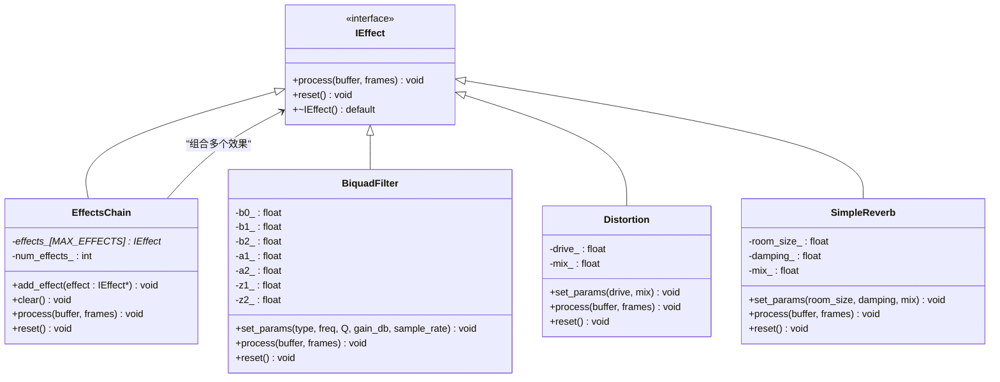
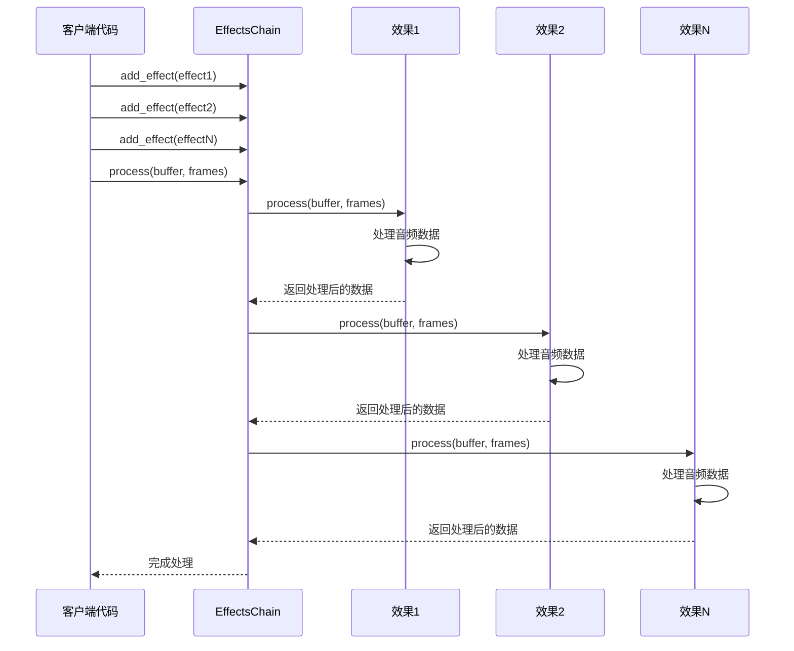
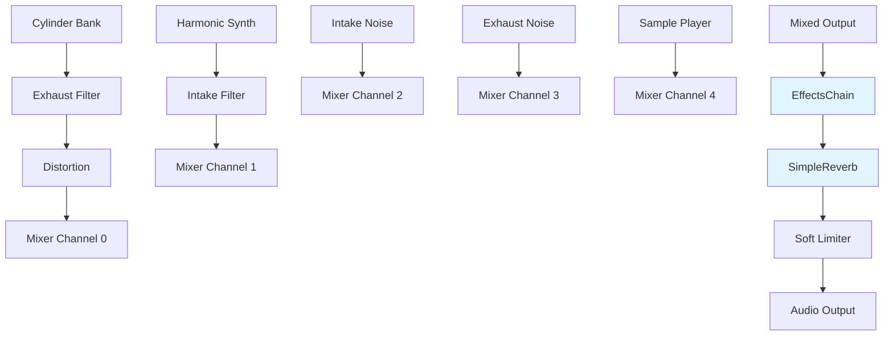
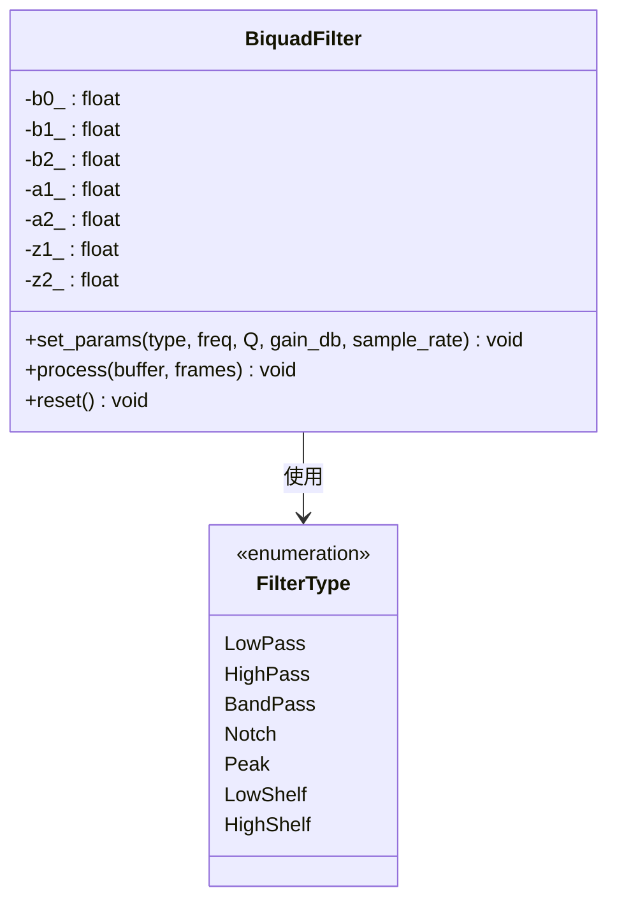
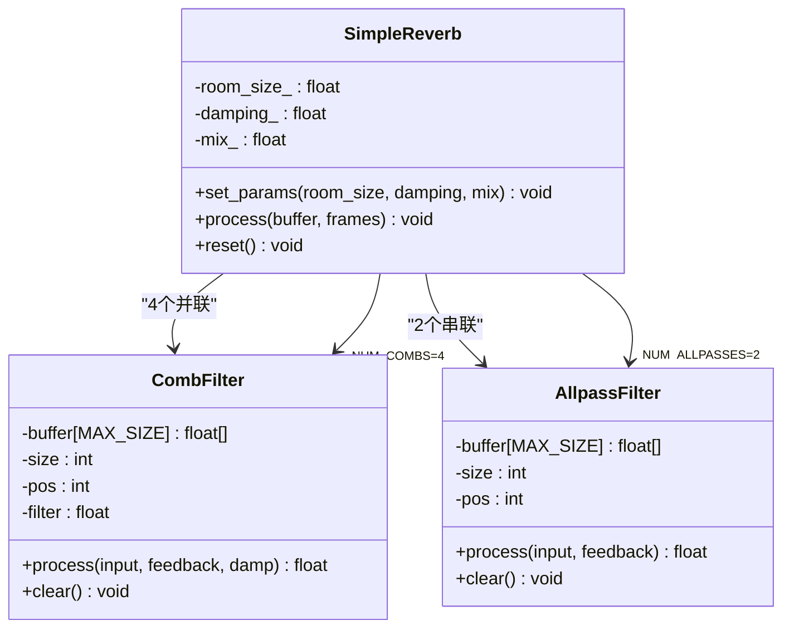
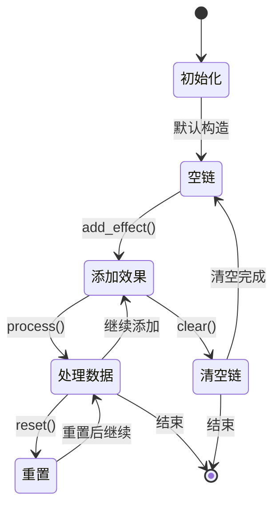
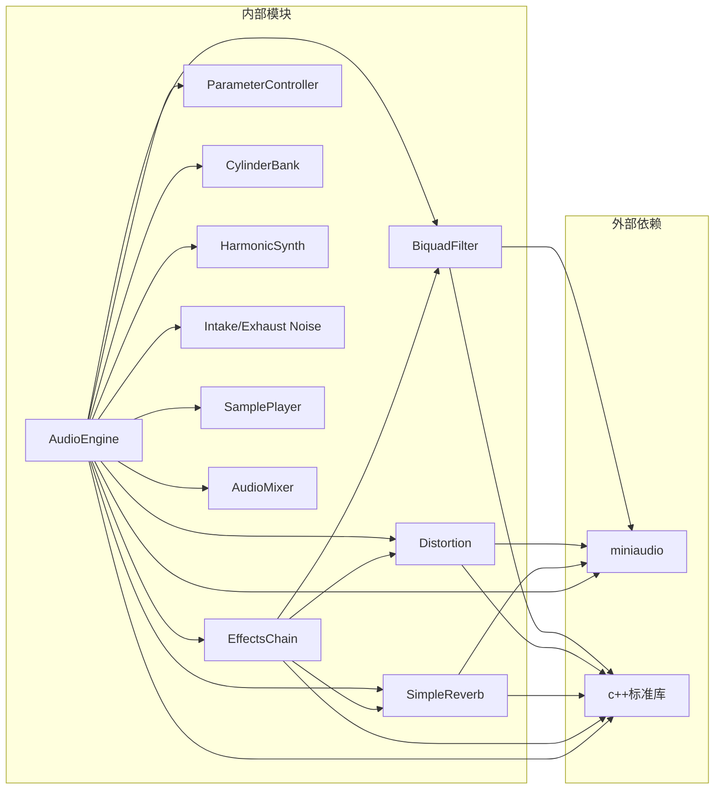
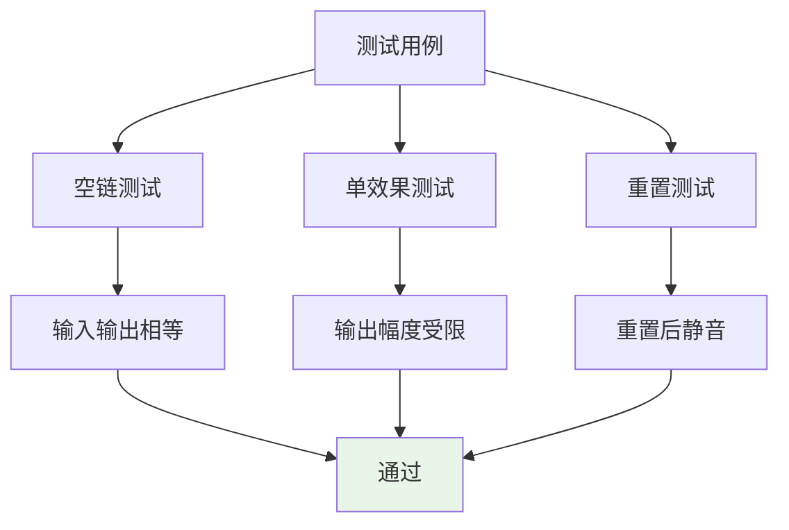

# 效果链架构设计

<cite>
**本文档引用的文件**
- [effects_chain.h](file://src/effects/effects_chain.h)
- [effects_chain.cpp](file://src/effects/effects_chain.cpp)
- [biquad_filter.h](file://src/effects/biquad_filter.h)
- [biquad_filter.cpp](file://src/effects/biquad_filter.cpp)
- [distortion.h](file://src/effects/distortion.h)
- [distortion.cpp](file://src/effects/distortion.cpp)
- [reverb.h](file://src/effects/reverb.h)
- [reverb.cpp](file://src/effects/reverb.cpp)
- [constants.h](file://src/core/constants.h)
- [types.h](file://src/core/types.h)
- [audio_engine.h](file://src/audio/audio_engine.h)
- [audio_engine.cpp](file://src/audio/audio_engine.cpp)
- [test_effects_chain.cpp](file://tests/test_effects_chain.cpp)
</cite>

## 目录
1. [简介](#简介)
2. [项目结构](#项目结构)
3. [核心组件](#核心组件)
4. [架构概览](#架构概览)
5. [详细组件分析](#详细组件分析)
6. [依赖关系分析](#依赖关系分析)
7. [性能考虑](#性能考虑)
8. [故障排除指南](#故障排除指南)
9. [结论](#结论)

## 简介

本文件详细阐述了 Racing Sound Engine 中的效果链架构设计，重点分析 EffectsChain 类的组合模式实现、IEffect 接口的设计原理、效果处理器的动态注册机制，以及效果链在音频处理流水线中的位置和作用。文档还提供了效果链配置的最佳实践和性能优化建议。

## 项目结构

Racing Sound Engine 采用模块化架构设计，效果链作为音频处理流水线中的重要组成部分，与滤波器、失真器、混响器等其他音频效果模块协同工作。



**图表来源**
- [audio_engine.h:27-92](file://src/audio/audio_engine.h#L27-L92)
- [effects_chain.h:8-24](file://src/effects/effects_chain.h#L8-L24)
- [biquad_filter.h:17-45](file://src/effects/biquad_filter.h#L17-L45)
- [distortion.h:7-22](file://src/effects/distortion.h#L7-L22)
- [reverb.h:9-76](file://src/effects/reverb.h#L9-L76)
- [constants.h:6-20](file://src/core/constants.h#L6-L20)
- [types.h:5-12](file://src/core/types.h#L5-L12)

**章节来源**
- [audio_engine.h:1-92](file://src/audio/audio_engine.h#L1-L92)
- [effects_chain.h:1-24](file://src/effects/effects_chain.h#L1-L24)
- [constants.h:1-20](file://src/core/constants.h#L1-L20)

## 核心组件

### IEffect 接口设计

IEffect 是所有音频效果的抽象基类，定义了统一的处理接口：



**图表来源**
- [biquad_filter.h:17-45](file://src/effects/biquad_filter.h#L17-L45)
- [effects_chain.h:8-24](file://src/effects/effects_chain.h#L8-L24)
- [distortion.h:7-22](file://src/effects/distortion.h#L7-L22)
- [reverb.h:9-76](file://src/effects/reverb.h#L9-L76)

IEffect 接口包含两个核心方法：
- `process(buffer, frames)`: 处理音频缓冲区，将输入信号转换为输出信号
- `reset()`: 重置效果的状态，清除内部延迟线和暂存器

**章节来源**
- [biquad_filter.h:17-23](file://src/effects/biquad_filter.h#L17-L23)
- [effects_chain.cpp:17-27](file://src/effects/effects_chain.cpp#L17-L27)

### EffectsChain 组合模式实现

EffectsChain 实现了组合模式，允许将多个 IEffect 对象组合成一个复合效果：



**图表来源**
- [effects_chain.cpp:7-21](file://src/effects/effects_chain.cpp#L7-L21)

**章节来源**
- [effects_chain.h:8-21](file://src/effects/effects_chain.h#L8-L21)
- [effects_chain.cpp:5-27](file://src/effects/effects_chain.cpp#L5-L27)

## 架构概览

### 音频处理流水线中的位置

在 Racing Sound Engine 中，效果链位于音频合成和混音之后，主效果之前：



**图表来源**
- [audio_engine.cpp:127-160](file://src/audio/audio_engine.cpp#L127-L160)

### 效果链容量限制

MAX_EFFECTS 常量定义了效果链的最大容量：

**章节来源**
- [constants.h:14](file://src/core/constants.h#L14)
- [effects_chain.h:19](file://src/effects/effects_chain.h#L19)

## 详细组件分析

### BiquadFilter 滤波器

BiquadFilter 实现了二阶数字滤波器，支持多种滤波类型：



**图表来源**
- [biquad_filter.h:25-42](file://src/effects/biquad_filter.h#L25-L42)
- [biquad_filter.cpp:11-101](file://src/effects/biquad_filter.cpp#L11-L101)

BiquadFilter 使用直接形式II转置结构实现，具有良好的数值稳定性和低延迟特性。

**章节来源**
- [biquad_filter.h:7-15](file://src/effects/biquad_filter.h#L7-L15)
- [biquad_filter.cpp:103-115](file://src/effects/biquad_filter.cpp#L103-L115)

### Distortion 失真效果

Distortion 实现了基于双曲正切函数的软限幅失真效果：

```mermaid
flowchart TD
A[输入信号] --> B[应用驱动参数]
B --> C[计算湿信号: tanh(drive * input)]
C --> D[混合干湿信号: mix * wet + (1-mix) * input]
D --> E[输出信号]
F[驱动参数] --> G[最小值: 0.1]
H[混合参数] --> I[范围: 0.0-1.0]
style D fill:#fff3e0
style G fill:#ffebee
style I fill:#ffebee
```

**图表来源**
- [distortion.cpp:14-20](file://src/effects/distortion.cpp#L14-L20)

**章节来源**
- [distortion.h:7-19](file://src/effects/distortion.h#L7-L19)
- [distortion.cpp:9-24](file://src/effects/distortion.cpp#L9-L24)

### SimpleReverb 混响效果

SimpleReverb 实现了 Schröder 混响算法，包含4个并联的梳状滤波器和2个串联的全通滤波器：



**图表来源**
- [reverb.h:26-72](file://src/effects/reverb.h#L26-L72)
- [reverb.cpp:22-47](file://src/effects/reverb.cpp#L22-L47)

**章节来源**
- [reverb.h:8-76](file://src/effects/reverb.h#L8-L76)
- [reverb.cpp:6-47](file://src/effects/reverb.cpp#L6-L47)

### EffectsChain 生命周期管理

EffectsChain 的生命周期包括初始化、添加效果、处理音频数据和重置四个阶段：



**图表来源**
- [effects_chain.cpp:5-27](file://src/effects/effects_chain.cpp#L5-L27)

**章节来源**
- [effects_chain.cpp:5-27](file://src/effects/effects_chain.cpp#L5-L27)

## 依赖关系分析

### 组件耦合度分析



**图表来源**
- [audio_engine.h:59-69](file://src/audio/audio_engine.h#L59-L69)
- [effects_chain.h:3](file://src/effects/effects_chain.h#L3)

### 关键依赖关系

1. **AudioEngine 依赖关系**: AudioEngine 持有所有音频子模块的实例，包括 EffectsChain
2. **EffectsChain 依赖关系**: EffectsChain 通过 IEffect 接口依赖具体的音频效果
3. **miniaudio 集成**: 所有音频效果最终通过 miniaudio 输出到音频设备

**章节来源**
- [audio_engine.h:59-73](file://src/audio/audio_engine.h#L59-L73)
- [effects_chain.h:3](file://src/effects/effects_chain.h#L3)

## 性能考虑

### 内存管理优化

1. **静态数组存储**: EffectsChain 使用固定大小的静态数组存储效果指针，避免动态内存分配开销
2. **栈上对象**: 所有音频效果对象在栈上创建，减少内存碎片
3. **缓冲区复用**: AudioEngine 使用预分配的缓冲区，避免频繁的内存分配

### 处理效率优化

1. **线性处理流程**: 效果链按顺序线性处理，CPU 缓存友好
2. **无分支预测**: 效果链的处理逻辑简单明确，有利于 CPU 分支预测
3. **批量处理**: 支持批量帧处理，提高处理效率

### 最佳实践建议

1. **效果链长度控制**: MAX_EFFECTS 限制为8，建议根据实际需求合理安排效果顺序
2. **状态重置**: 在参数变化时调用 reset() 方法重置效果状态
3. **内存对齐**: 确保音频缓冲区按 CPU 缓存行对齐，提高内存访问效率

## 故障排除指南

### 常见问题诊断

1. **效果链为空**: 当 EffectsChain 未添加任何效果时，音频数据应保持不变
2. **状态泄漏**: 调用 reset() 后，音频效果不应产生持续的声音
3. **参数越界**: 确保效果参数在有效范围内，避免数值不稳定

### 测试验证

通过单元测试验证效果链的行为：



**图表来源**
- [test_effects_chain.cpp:11-75](file://tests/test_effects_chain.cpp#L11-L75)

**章节来源**
- [test_effects_chain.cpp:11-75](file://tests/test_effects_chain.cpp#L11-L75)

## 结论

EffectsChain 架构设计体现了良好的软件工程原则：

1. **接口隔离**: IEffect 接口定义清晰，便于扩展新的音频效果
2. **组合模式**: 支持动态效果链构建，提供灵活的音频处理能力
3. **性能优化**: 固定大小数组和栈上对象设计确保实时性能
4. **模块化**: 与 AudioEngine 解耦，便于维护和测试

该架构为 Racing Sound Engine 提供了强大的音频效果处理能力，支持从简单的单效果到复杂的多效果链组合，满足不同场景下的音频处理需求。