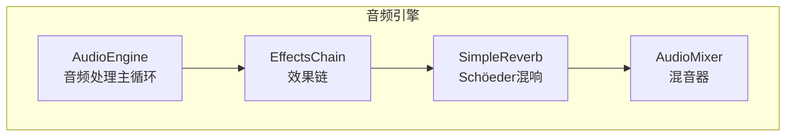
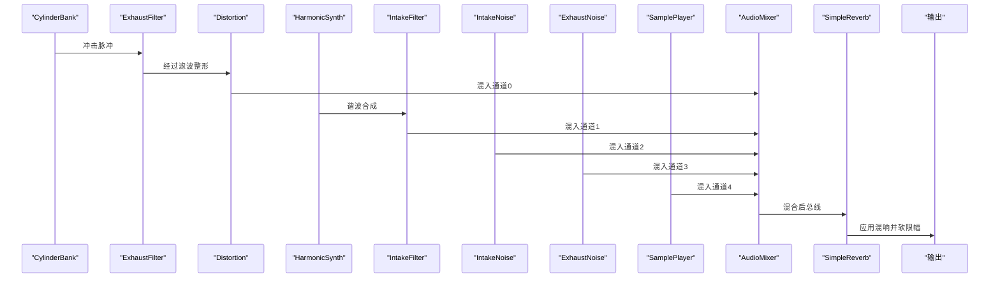
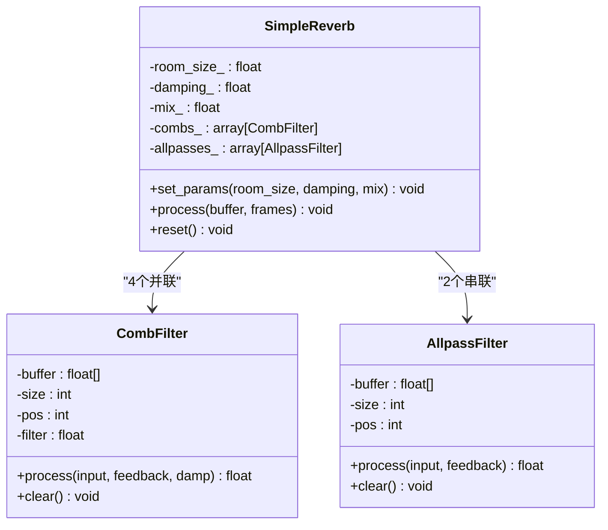
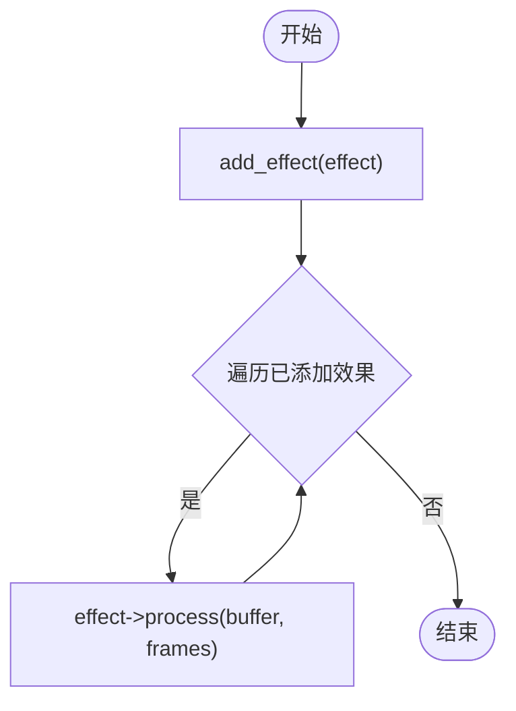
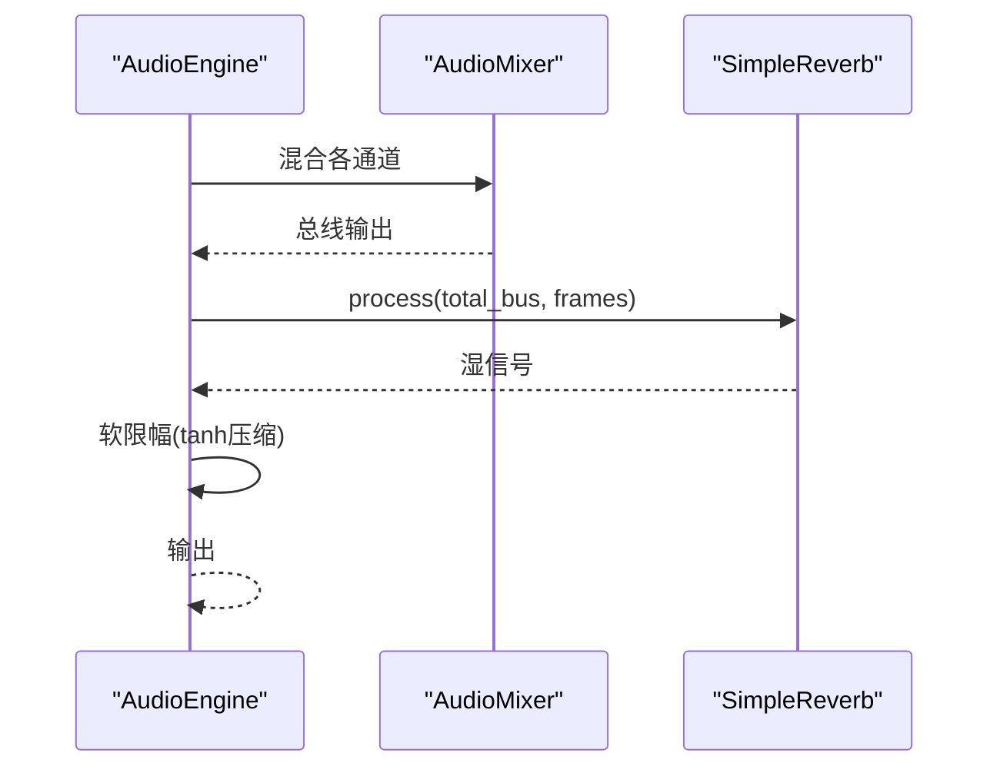
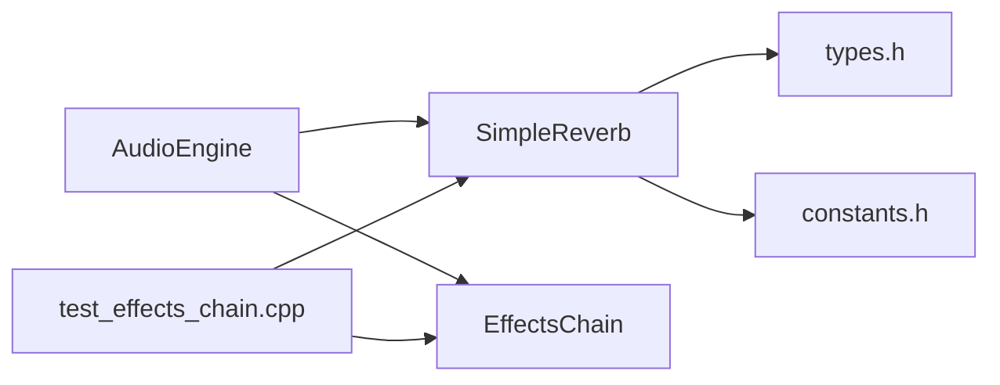

# 混响效果处理

<cite>
**本文引用的文件**
- [reverb.h](file://src/effects/reverb.h)
- [reverb.cpp](file://src/effects/reverb.cpp)
- [effects_chain.h](file://src/effects/effects_chain.h)
- [effects_chain.cpp](file://src/effects/effects_chain.cpp)
- [audio_engine.h](file://src/audio/audio_engine.h)
- [audio_engine.cpp](file://src/audio/audio_engine.cpp)
- [engine_preset.h](file://src/presets/engine_preset.h)
- [types.h](file://src/core/types.h)
- [constants.h](file://src/core/constants.h)
- [test_effects_chain.cpp](file://tests/test_effects_chain.cpp)
</cite>

## 目录
1. [简介](#简介)
2. [项目结构](#项目结构)
3. [核心组件](#核心组件)
4. [架构总览](#架构总览)
5. [详细组件分析](#详细组件分析)
6. [依赖关系分析](#依赖关系分析)
7. [性能考量](#性能考量)
8. [故障排查指南](#故障排查指南)
9. [结论](#结论)
10. [附录：参数与调优指南](#附录参数与调优指南)

## 简介
本文件聚焦于赛车声音引擎中的混响效果处理，围绕 SimpleReverb 类的 Schöeder 混响算法实现进行深入解析，涵盖房间模拟、早期反射与后期混响的建模原理；解释混响时间 RT60、早期反射延迟与扩散特性在该实现中的对应关系；阐述混响在空间感营造中的作用及对引擎声音空间定位感的增强；提供参数调优指南与不同场景的最佳设置建议；并给出实时处理复杂度与内存使用的分析，以及避免回声与音质衰减问题的方法。

## 项目结构
混响模块位于 effects 子目录，与滤波器、失真、混音器等其他效果共同构成完整的音频处理链路。AudioEngine 将各子模块组合，最终在音频回调中按顺序执行处理流程，其中混响作为主输出前的最后一个效果阶段。

图表来源
- [audio_engine.cpp:102-160](file://src/audio/audio_engine.cpp#L102-L160)
- [effects_chain.cpp:17-27](file://src/effects/effects_chain.cpp#L17-L27)
- [reverb.cpp:22-42](file://src/effects/reverb.cpp#L22-L42)

章节来源
- [audio_engine.h:27-92](file://src/audio/audio_engine.h#L27-L92)
- [audio_engine.cpp:102-160](file://src/audio/audio_engine.cpp#L102-L160)
- [effects_chain.h:8-24](file://src/effects/effects_chain.h#L8-L24)
- [effects_chain.cpp:17-27](file://src/effects/effects_chain.cpp#L17-L27)

## 核心组件
- SimpleReverb：基于 Schöeder 模型的简单混响实现，包含 4 个并联梳状滤波器与 2 个串联全通滤波器，提供房间大小、阻尼与干湿混合比例三个可调参数。
- EffectsChain：通用效果链容器，按添加顺序依次处理输入缓冲区。
- AudioEngine：音频主引擎，负责合成多路信号并通过混音器混合，最后应用混响效果。

章节来源
- [reverb.h:9-76](file://src/effects/reverb.h#L9-L76)
- [reverb.cpp:6-47](file://src/effects/reverb.cpp#L6-L47)
- [effects_chain.h:8-24](file://src/effects/effects_chain.h#L8-L24)
- [effects_chain.cpp:7-27](file://src/effects/effects_chain.cpp#L7-L27)
- [audio_engine.h:58-89](file://src/audio/audio_engine.h#L58-L89)

## 架构总览
混响在音频处理流水线中的位置如下：引擎合成（气缸冲击、谐波、噪声、采样）→ 各通道滤波与整形 → 混音器混合 → 主效果（混响）→ 软限幅 → 输出。

图表来源
- [audio_engine.cpp:127-160](file://src/audio/audio_engine.cpp#L127-L160)
- [audio_engine.h:68-69](file://src/audio/audio_engine.h#L68-L69)

章节来源
- [audio_engine.cpp:127-160](file://src/audio/audio_engine.cpp#L127-L160)

## 详细组件分析

### SimpleReverb：Schöeder 混响实现
- 结构组成
  - 4 个并联梳状滤波器（CombFilter），用于模拟早期反射与短延时反射群，形成“早期混响”。
  - 2 个串联全通滤波器（AllpassFilter），用于扩散高频能量，改善混响尾部的“染色”与空洞感。
  - 干湿混合（dry/wet mix）与反馈系数（feedback）控制混响强度与持续时间。
- 参数映射
  - 房间大小（room_size）映射到反馈系数，范围从 0.1 到 0.95，控制混响持续时间（近似 RT60 的倒数关系）。
  - 阻尼（damping）控制梳状滤波器内部一阶低通的截止频率，影响高频衰减速度，决定混响的“温暖/冷峻”。
  - 混响混合（mix）控制干信号与湿信号的比例。
- 处理流程
  - 对每个采样点：先将 4 个梳状滤波器的输出求和并归一化，再依次通过两个全通滤波器进行扩散，最后与干信号按 mix 比例混合输出。
- 状态管理
  - reset() 清空所有滤波器环形缓冲区与内部积分变量，确保状态重置。

图表来源
- [reverb.h:19-73](file://src/effects/reverb.h#L19-L73)
- [reverb.cpp:6-47](file://src/effects/reverb.cpp#L6-L47)

章节来源
- [reverb.h:9-76](file://src/effects/reverb.h#L9-L76)
- [reverb.cpp:6-47](file://src/effects/reverb.cpp#L6-L47)

### EffectsChain：效果链容器
- 功能：按添加顺序依次对同一缓冲区进行处理，支持动态添加与清空。
- 使用：AudioEngine 在渲染完成后将总线送入 EffectsChain，由其逐个调用 effect->process(...)。

图表来源
- [effects_chain.cpp:17-27](file://src/effects/effects_chain.cpp#L17-L27)

章节来源
- [effects_chain.h:8-24](file://src/effects/effects_chain.h#L8-L24)
- [effects_chain.cpp:7-27](file://src/effects/effects_chain.cpp#L7-L27)

### 参数映射与预设集成
- 预设中的混响参数：reverb_room_size、reverb_damping、reverb_mix。
- AudioEngine 在加载预设时调用 reverb_.set_params(...)，将预设值传递给混响模块。
- 这些参数在运行时可通过 ParameterController 与 EngineParams 更新，但当前混响未暴露动态参数更新接口，需在加载新预设或显式调用 set_params 时生效。

章节来源
- [engine_preset.h:33-38](file://src/presets/engine_preset.h#L33-L38)
- [audio_engine.cpp:70-92](file://src/audio/audio_engine.cpp#L70-L92)

### 流程与数据流
- 音频回调中，AudioEngine 先合成多路信号并混合，随后调用 reverb_.process(...) 对总线进行混响处理，最后进行软限幅以防止削波。

图表来源
- [audio_engine.cpp:149-160](file://src/audio/audio_engine.cpp#L149-L160)
- [reverb.cpp:22-42](file://src/effects/reverb.cpp#L22-L42)

章节来源
- [audio_engine.cpp:149-160](file://src/audio/audio_engine.cpp#L149-L160)
- [reverb.cpp:22-42](file://src/effects/reverb.cpp#L22-L42)

## 依赖关系分析
- SimpleReverb 依赖：
  - types.h：Sample、FrameCount 类型定义。
  - constants.h：采样率、缓冲帧数等常量。
  - biquad_filter.h：混响实现中未直接使用，但与滤波器模块同属 effects 子系统。
- AudioEngine 依赖：
  - 包含 SimpleReverb 实例，作为主效果之一参与处理链。
  - 通过 EffectsChain 将多个效果串联（当前混响为最后一个）。
- 测试验证：
  - test_effects_chain.cpp 展示了 EffectsChain 的行为与 SimpleReverb 的 reset 效果。

图表来源
- [reverb.h:3](file://src/effects/reverb.h#L3)
- [types.h:7-9](file://src/core/types.h#L7-L9)
- [constants.h:15-16](file://src/core/constants.h#L15-L16)
- [audio_engine.h:68-69](file://src/audio/audio_engine.h#L68-L69)
- [effects_chain.h:19](file://src/effects/effects_chain.h#L19)
- [test_effects_chain.cpp:53-75](file://tests/test_effects_chain.cpp#L53-L75)

章节来源
- [reverb.h:3](file://src/effects/reverb.h#L3)
- [types.h:7-9](file://src/core/types.h#L7-L9)
- [constants.h:15-16](file://src/core/constants.h#L15-L16)
- [audio_engine.h:68-69](file://src/audio/audio_engine.h#L68-L69)
- [effects_chain.h:19](file://src/effects/effects_chain.h#L19)
- [test_effects_chain.cpp:53-75](file://tests/test_effects_chain.cpp#L53-L75)

## 性能考量
- 时间复杂度
  - 每帧处理：对每个采样点执行一次循环，包含 4 次梳状滤波器与 2 次全通滤波器的单次延迟读写与少量算术运算，整体为 O(N)，N 为帧长。
- 空间复杂度
  - 梳状滤波器：每组最大长度约 2048，共 4 组，合计约 8KB。
  - 全通滤波器：每组最大长度约 1024，共 2 组，合计约 4KB。
  - 其他局部变量与数组开销较小，整体静态内存占用可控。
- 实时性
  - 单核实时处理可行，且缓冲帧数默认 512，采样率 48kHz，延迟较低。
  - 若需要更高复杂度的混响（如更大延迟、更多滤波器组），应评估 CPU 占用与延迟预算。

章节来源
- [reverb.h:27-69](file://src/effects/reverb.h#L27-L69)
- [audio_engine.cpp:18-45](file://src/audio/audio_engine.cpp#L18-L45)

## 故障排查指南
- 混响后出现持续“拖尾”或“回声”
  - 检查 room_size 是否过高（接近 1.0），导致反馈过大；适当降低 room_size 或提高 damping。
  - 确认混响未被过度叠加（例如在混响之后再次应用强混响）。
- 混响“发闷”或“发冷”
  - 提高 damping（高频衰减更快）使混响更“暖”；降低 damping 让混响更“冷”。
- 混响“染色”明显
  - 增加全通滤波器数量或调整反馈系数，改善扩散特性。
- 状态残留导致重启异常
  - 在切换预设或重置时调用 reset()，确保滤波器环形缓冲区清零。
- 测试参考
  - 参考测试用例对 EffectsChain 与 SimpleReverb 的行为验证，确保 reset 后输出趋近静音。

章节来源
- [reverb.cpp:44-47](file://src/effects/reverb.cpp#L44-L47)
- [test_effects_chain.cpp:51-75](file://tests/test_effects_chain.cpp#L51-L75)

## 结论
本实现采用经典的 Schöeder 混响模型，通过 4 个并联梳状滤波器与 2 个串联全通滤波器，在低延迟、低内存占用的前提下提供了可控的房间感与扩散特性。结合 AudioEngine 的处理链路，混响作为主效果阶段显著增强了引擎声音的空间定位感。通过合理调节 room_size、damping 与 mix，可在不同场景下获得自然的混响效果，并避免回声与音质衰减问题。

## 附录：参数与调优指南
- 房间大小（room_size）
  - 控制反馈系数，间接控制 RT60（混响时间）。数值越高，混响越长；过高的值可能产生回声。
  - 推荐范围：0.2–0.6（根据场景微调）。
- 阻尼（damping）
  - 控制高频衰减速度，影响混响的“冷暖”。较高 damping 更“暖”，较低 damping 更“冷”。
  - 推荐范围：0.3–0.7。
- 混响混合（mix）
  - 控制干湿比例。过高的 mix 可能掩盖原始声音细节。
  - 推荐范围：0.1–0.3。
- 不同场景建议
  - 室内/封闭舱室：room_size 中高，damping 中高，mix 低。
  - 开放跑道/户外：room_size 中低，damping 中低，mix 适中。
  - 隧道/狭长空间：room_size 较高，damping 中低，mix 适中。
- 与预设集成
  - 通过 EnginePreset 的 reverb_* 参数设置初始值；运行时可通过 AudioEngine::load_preset 重新应用。

章节来源
- [engine_preset.h:33-38](file://src/presets/engine_preset.h#L33-L38)
- [audio_engine.cpp:70-92](file://src/audio/audio_engine.cpp#L70-L92)