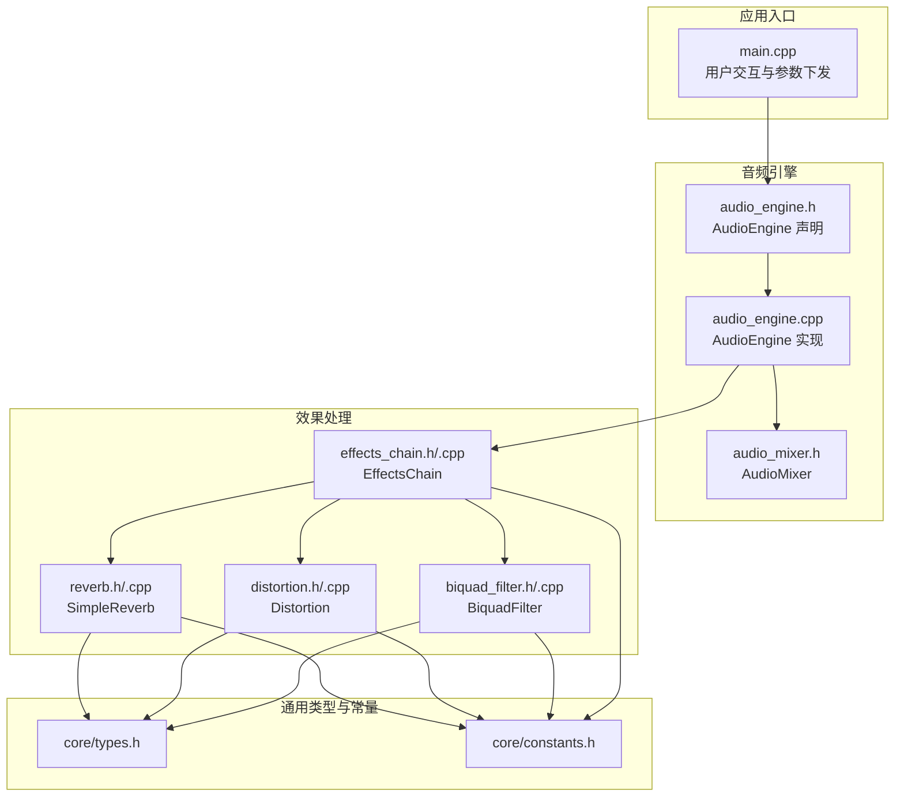
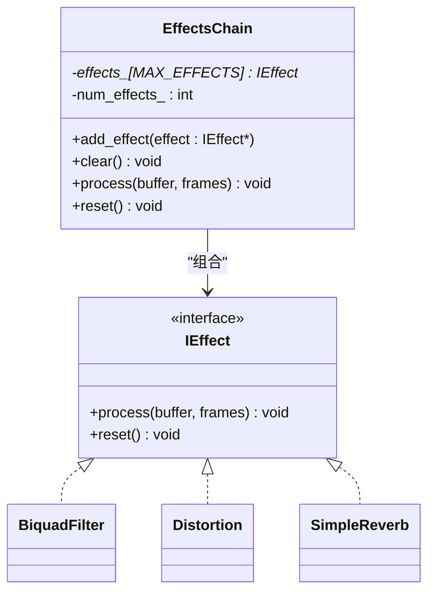
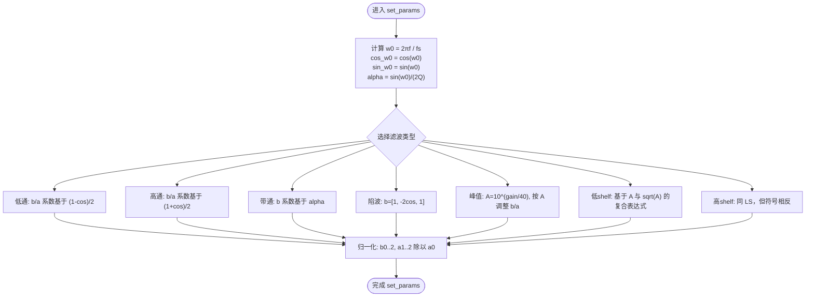
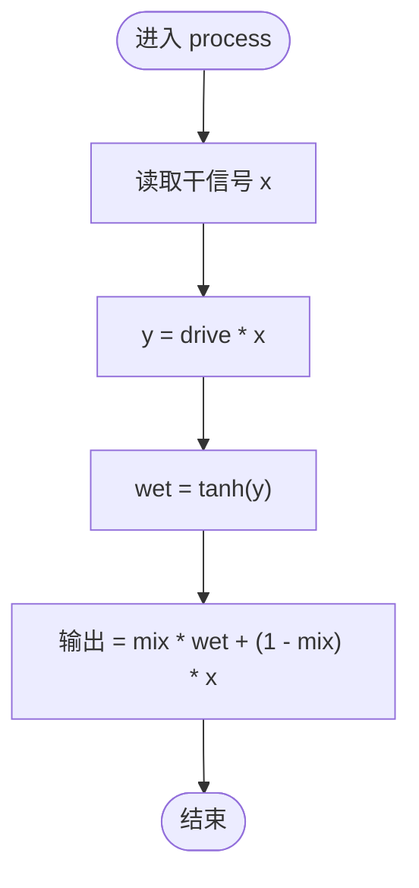
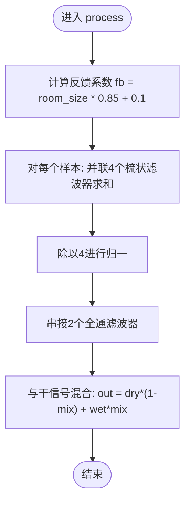
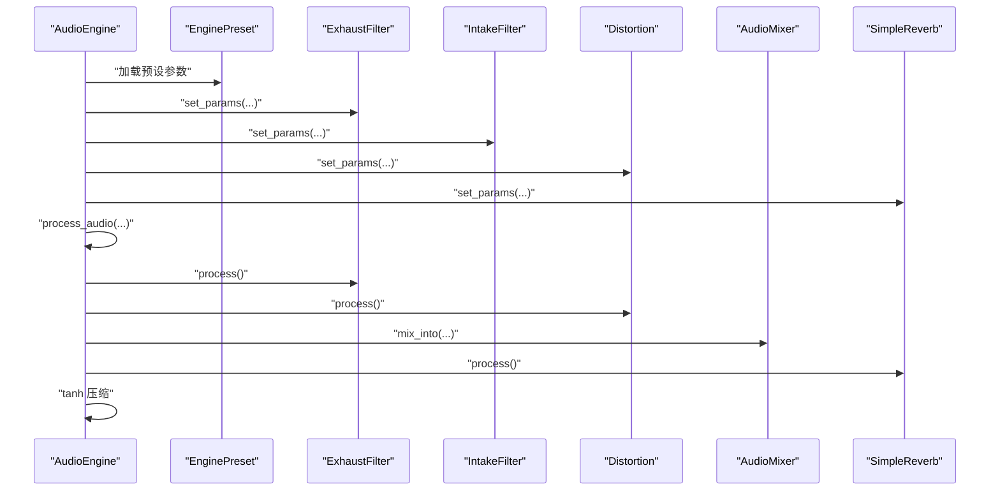
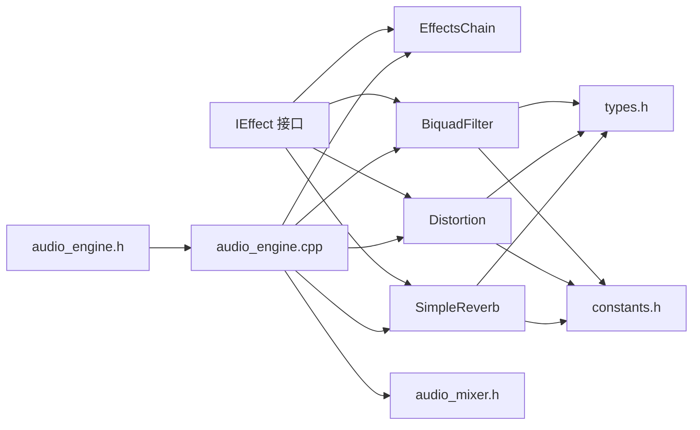

# 音频效果处理系统

<cite>
**本文引用的文件**
- [effects_chain.h](file://src/effects/effects_chain.h)
- [effects_chain.cpp](file://src/effects/effects_chain.cpp)
- [biquad_filter.h](file://src/effects/biquad_filter.h)
- [biquad_filter.cpp](file://src/effects/biquad_filter.cpp)
- [distortion.h](file://src/effects/distortion.h)
- [distortion.cpp](file://src/effects/distortion.cpp)
- [reverb.h](file://src/effects/reverb.h)
- [reverb.cpp](file://src/effects/reverb.cpp)
- [types.h](file://src/core/types.h)
- [constants.h](file://src/core/constants.h)
- [audio_engine.h](file://src/audio/audio_engine.h)
- [audio_engine.cpp](file://src/audio/audio_engine.cpp)
- [audio_mixer.h](file://src/mixer/audio_mixer.h)
- [engine_preset.h](file://src/presets/engine_preset.h)
- [test_effects_chain.cpp](file://tests/test_effects_chain.cpp)
- [test_biquad_filter.cpp](file://tests/test_biquad_filter.cpp)
- [main.cpp](file://src/main.cpp)
</cite>

## 目录
1. [简介](#简介)
2. [项目结构](#项目结构)
3. [核心组件](#核心组件)
4. [架构总览](#架构总览)
5. [详细组件分析](#详细组件分析)
6. [依赖关系分析](#依赖关系分析)
7. [性能考量](#性能考量)
8. [故障排查指南](#故障排查指南)
9. [结论](#结论)
10. [附录](#附录)

## 简介
本文件为“音频效果处理系统”的技术文档，聚焦于以下目标：
- 深入解析 EffectsChain 的架构设计：组合模式、动态链接、参数传递机制
- 详解 BiquadFilter 的实现：低通/高通/带通等滤波器设计原理、系数计算与频率响应特性
- 阐述 Distortion 效果的算法：软限幅、波形整形、谐波失真等处理技术
- 解释 Reverb 混响效果：Schroeder 混响模型（4个梳状滤波器+2个全通滤波器）的组成与工作流程
- 提供效果链配置指南与参数调优方法
- 给出添加新效果处理器与自定义效果算法的实践建议

## 项目结构
该工程采用模块化分层组织，核心音频管线由 AudioEngine 驱动，子模块包括合成器、噪声生成器、混音器以及多个效果处理器。效果处理位于 effects 子目录，通过统一的 IEffect 接口串联在处理链中。



图示来源
- [audio_engine.h:27-92](file://src/audio/audio_engine.h#L27-L92)
- [audio_engine.cpp:102-160](file://src/audio/audio_engine.cpp#L102-L160)
- [effects_chain.h:8-21](file://src/effects/effects_chain.h#L8-L21)
- [biquad_filter.h:25-42](file://src/effects/biquad_filter.h#L25-L42)
- [distortion.h:7-19](file://src/effects/distortion.h#L7-L19)
- [reverb.h:9-73](file://src/effects/reverb.h#L9-L73)
- [audio_mixer.h:9-34](file://src/mixer/audio_mixer.h#L9-L34)
- [types.h:7-9](file://src/core/types.h#L7-L9)
- [constants.h:14-16](file://src/core/constants.h#L14-L16)

章节来源
- [audio_engine.h:27-92](file://src/audio/audio_engine.h#L27-L92)
- [audio_engine.cpp:102-160](file://src/audio/audio_engine.cpp#L102-L160)
- [effects_chain.h:8-21](file://src/effects/effects_chain.h#L8-L21)
- [biquad_filter.h:25-42](file://src/effects/biquad_filter.h#L25-L42)
- [distortion.h:7-19](file://src/effects/distortion.h#L7-L19)
- [reverb.h:9-73](file://src/effects/reverb.h#L9-L73)
- [audio_mixer.h:9-34](file://src/mixer/audio_mixer.h#L9-L34)
- [types.h:7-9](file://src/core/types.h#L7-L9)
- [constants.h:14-16](file://src/core/constants.h#L14-L16)

## 核心组件
- IEffect 接口：定义所有效果处理器必须实现的 process 和 reset 方法，确保效果链以统一方式组合。
- EffectsChain：基于数组的顺序组合器，支持动态添加/清空效果，按序执行每个效果的 process 与 reset。
- BiquadFilter：基于二阶递归滤波器（Direct Form II Transposed）实现多种滤波类型（低通、高通、带通、陷波、峰值、低shelf、高shelf），参数通过 set_params 设置。
- Distortion：基于双曲正切的软限幅与干湿混合，提供驱动强度与混合比例控制。
- SimpleReverb：Schroeder 混响，包含 4 个梳状滤波器并联与 2 个全通滤波器串联，支持房间大小、阻尼与干湿混合参数。
- AudioEngine：音频主控，负责各子模块初始化、参数加载、实时处理回调与最终输出。

章节来源
- [biquad_filter.h:18-23](file://src/effects/biquad_filter.h#L18-L23)
- [effects_chain.h:8-21](file://src/effects/effects_chain.h#L8-L21)
- [effects_chain.cpp:7-27](file://src/effects/effects_chain.cpp#L7-L27)
- [biquad_filter.h:25-42](file://src/effects/biquad_filter.h#L25-L42)
- [biquad_filter.cpp:11-101](file://src/effects/biquad_filter.cpp#L11-L101)
- [distortion.h:7-19](file://src/effects/distortion.h#L7-L19)
- [distortion.cpp:9-24](file://src/effects/distortion.cpp#L9-L24)
- [reverb.h:9-73](file://src/effects/reverb.h#L9-L73)
- [reverb.cpp:16-47](file://src/effects/reverb.cpp#L16-L47)
- [audio_engine.h:58-84](file://src/audio/audio_engine.h#L58-L84)

## 架构总览
AudioEngine 在音频回调中依次生成各声源，经滤波、失真、混音后进入混响处理，并进行软限幅，最终输出到音频设备。效果链可灵活扩展，通过 EffectsChain 将多个 IEffect 组合为流水线。

```mermaid
sequenceDiagram
participant CB as "音频回调"
participant AE as "AudioEngine"
participant CYL as "CylinderBank"
participant EXF as "ExhaustFilter(Biquad)"
participant DIS as "Distortion"
participant MIX as "AudioMixer"
participant REV as "SimpleReverb"
CB->>AE : "process_audio(out, frames)"
AE->>CYL : "生成气缸脉冲层"
AE->>EXF : "低通滤波排气脉冲"
AE->>DIS : "软限幅/波形整形"
AE->>MIX : "混入通道0"
AE->>Har as "HarmonicSynth"
AE->>INTF as "IntakeFilter(Biquad)"
AE->>MIX : "混入通道1"
AE->>INO as "IntakeNoise"
AE->>MIX : "混入通道2"
AE->>EXNO as "ExhaustNoise"
AE->>MIX : "混入通道3"
AE->>SP as "SamplePlayer"
AE->>MIX : "混入通道4"
AE->>MIX : "渲染混合输出"
AE->>REV : "混响处理"
AE->>CB : "软限幅输出"
```

图示来源
- [audio_engine.cpp:102-160](file://src/audio/audio_engine.cpp#L102-L160)
- [biquad_filter.h:25-42](file://src/effects/biquad_filter.h#L25-L42)
- [distortion.h:7-19](file://src/effects/distortion.h#L7-L19)
- [reverb.h:9-73](file://src/effects/reverb.h#L9-L73)
- [audio_mixer.h:16-20](file://src/mixer/audio_mixer.h#L16-L20)

章节来源
- [audio_engine.cpp:102-160](file://src/audio/audio_engine.cpp#L102-L160)

## 详细组件分析

### EffectsChain：效果链组合器
- 设计要点
  - 组合模式：通过数组保存 IEffect 指针，按顺序遍历调用 process 与 reset
  - 动态链接：运行时可 add_effect 添加或 clear 清空，支持多效果叠加
  - 参数传递：每个效果独立维护内部状态，EffectsChain 不关心具体参数细节
- 复杂度
  - process 时间复杂度 O(N×M)，N 为帧数，M 为效果数量；空间复杂度 O(1)
- 边界与错误处理
  - 最大效果数受 MAX_EFFECTS 限制；空指针安全检查避免崩溃
- 可扩展性
  - 新增效果只需实现 IEffect 接口并通过 add_effect 注册



图示来源
- [effects_chain.h:8-21](file://src/effects/effects_chain.h#L8-L21)
- [effects_chain.cpp:7-27](file://src/effects/effects_chain.cpp#L7-L27)
- [biquad_filter.h:25-42](file://src/effects/biquad_filter.h#L25-L42)
- [distortion.h:7-19](file://src/effects/distortion.h#L7-L19)
- [reverb.h:9-73](file://src/effects/reverb.h#L9-L73)

章节来源
- [effects_chain.h:8-21](file://src/effects/effects_chain.h#L8-L21)
- [effects_chain.cpp:7-27](file://src/effects/effects_chain.cpp#L7-L27)
- [constants.h:14](file://src/core/constants.h#L14)

### BiquadFilter：二阶滤波器
- 数学原理
  - 使用二阶递归滤波器（Direct Form II Transposed），以 z^-1 移位实现高效实时处理
  - 通过预计算系数 b0,b1,b2 与 a1,a2，将差分方程转换为级联形式
- 类型与系数
  - 支持 LowPass、HighPass、BandPass、Notch、Peak、LowShelf、HighShelf
  - 系数计算基于角频率 w0、品质因数 Q、增益（dB）与采样率
- 频率响应特性
  - 低通/高通：滚降斜率为 6 dB/倍频程（一阶响应）
  - 峰值/陷波：中心频率处有增益/衰减，带宽由 Q 控制
  - Shelf：在极低/高频段提供单调增益变化
- 处理流程
  - set_params 计算并归一化系数
  - process 对每个采样点执行一次前向递推更新
  - reset 清零延迟状态



图示来源
- [biquad_filter.cpp:11-101](file://src/effects/biquad_filter.cpp#L11-L101)

章节来源
- [biquad_filter.h:7-15](file://src/effects/biquad_filter.h#L7-L15)
- [biquad_filter.h:25-42](file://src/effects/biquad_filter.h#L25-L42)
- [biquad_filter.cpp:11-118](file://src/effects/biquad_filter.cpp#L11-L118)

### Distortion：失真效果
- 算法实现
  - 输入信号乘以驱动因子后经双曲正切压缩，形成软限幅与波形整形
  - 干湿混合：输出 = mix × tanh(drive × x) + (1−mix) × x
- 参数
  - drive：驱动强度，限制下界防止过小
  - mix：干湿比例，裁剪至 [0,1]
- 状态
  - 无状态，reset 为空操作



图示来源
- [distortion.cpp:14-20](file://src/effects/distortion.cpp#L14-L20)

章节来源
- [distortion.h:7-19](file://src/effects/distortion.h#L7-L19)
- [distortion.cpp:9-24](file://src/effects/distortion.cpp#L9-L24)

### SimpleReverb：Schroeder 混响
- 结构组成
  - 4 个梳状滤波器并联（延迟缓冲区 + 一阶延迟滤波 + 反馈）
  - 2 个全通滤波器串联（延迟缓冲区 + 正负反馈组合）
- 参数
  - room_size：映射到反馈系数范围 [0.1, 0.95]
  - damping：控制延迟输出的高低频衰减
  - mix：干湿混合比例
- 流程
  - 对每个样本：先并联 4 个梳状滤波器求和并归一，再串接 2 个全通滤波器，最后与干信号混合



图示来源
- [reverb.cpp:22-41](file://src/effects/reverb.cpp#L22-L41)

章节来源
- [reverb.h:9-73](file://src/effects/reverb.h#L9-L73)
- [reverb.cpp:16-47](file://src/effects/reverb.cpp#L16-L47)

### AudioEngine：音频主控与效果链集成
- 初始化与参数
  - 从 EnginePreset 加载滤波、失真、混响等参数，并设置采样率
- 处理流程
  - 生成气缸脉冲 → 排气滤波 → 失真 → 混音通道0
  - 谐波合成 → 进气滤波 → 混音通道1
  - 进气/排气噪声 → 混音通道2/3
  - 采样播放 → 混音通道4
  - 所有通道混合 → 混响 → 软限幅
- 线程与实时性
  - 使用原子指针发布当前预设，音频回调中读取参数，保证线程安全



图示来源
- [audio_engine.cpp:70-92](file://src/audio/audio_engine.cpp#L70-L92)
- [audio_engine.cpp:102-160](file://src/audio/audio_engine.cpp#L102-L160)

章节来源
- [audio_engine.h:58-84](file://src/audio/audio_engine.h#L58-L84)
- [audio_engine.cpp:70-92](file://src/audio/audio_engine.cpp#L70-L92)
- [audio_engine.cpp:102-160](file://src/audio/audio_engine.cpp#L102-L160)

## 依赖关系分析
- 接口与实现
  - IEffect 是所有效果的抽象基类，EffectsChain、BiquadFilter、Distortion、SimpleReverb 共同实现
- 内部依赖
  - 各效果均依赖 core/types.h 的基础类型定义
  - BiquadFilter 与 SimpleReverb 依赖 core/constants.h 的常量（如 PI、TWO_PI、MAX_EFFECTS）
- 外部依赖
  - AudioEngine 通过 miniaudio 驱动音频设备，回调中调用 process_audio
- 耦合与内聚
  - EffectsChain 与具体效果解耦，仅依赖 IEffect 接口，内聚性高、耦合度低
  - AudioEngine 将各模块组合为完整管线，保持对底层细节的屏蔽



图示来源
- [biquad_filter.h:25-42](file://src/effects/biquad_filter.h#L25-L42)
- [distortion.h:7-19](file://src/effects/distortion.h#L7-L19)
- [reverb.h:9-73](file://src/effects/reverb.h#L9-L73)
- [effects_chain.h:8-21](file://src/effects/effects_chain.h#L8-L21)
- [audio_engine.h:58-84](file://src/audio/audio_engine.h#L58-L84)
- [audio_engine.cpp:102-160](file://src/audio/audio_engine.cpp#L102-L160)
- [audio_mixer.h:9-34](file://src/mixer/audio_mixer.h#L9-L34)
- [types.h:7-9](file://src/core/types.h#L7-L9)
- [constants.h:14-16](file://src/core/constants.h#L14-L16)

章节来源
- [biquad_filter.h:25-42](file://src/effects/biquad_filter.h#L25-L42)
- [distortion.h:7-19](file://src/effects/distortion.h#L7-L19)
- [reverb.h:9-73](file://src/effects/reverb.h#L9-L73)
- [effects_chain.h:8-21](file://src/effects/effects_chain.h#L8-L21)
- [audio_engine.h:58-84](file://src/audio/audio_engine.h#L58-L84)
- [audio_engine.cpp:102-160](file://src/audio/audio_engine.cpp#L102-L160)
- [audio_mixer.h:9-34](file://src/mixer/audio_mixer.h#L9-L34)
- [types.h:7-9](file://src/core/types.h#L7-L9)
- [constants.h:14-16](file://src/core/constants.h#L14-L16)

## 性能考量
- 实时性
  - 所有处理均为逐样本迭代，时间复杂度 O(N)，适合实时音频
  - EffectsChain 顺序遍历，避免额外分配，降低抖动风险
- 缓冲与批处理
  - AudioEngine 使用固定大小的临时缓冲区，process_audio 中限制最大帧数，避免越界
- 系数计算
  - BiquadFilter 的系数在参数变化时重新计算，建议在参数稳定期减少频繁 set_params 调用
- 混响成本
  - SimpleReverb 包含多个延迟缓冲与循环，注意 room_size 与 damping 的合理取值，避免过大延迟导致延迟累积
- 输出保护
  - 最终使用 tanh 压缩与主音量控制，防止削波

章节来源
- [effects_chain.cpp:17-21](file://src/effects/effects_chain.cpp#L17-L21)
- [biquad_filter.cpp:103-111](file://src/effects/biquad_filter.cpp#L103-L111)
- [reverb.cpp:22-41](file://src/effects/reverb.cpp#L22-L41)
- [audio_engine.cpp:102-160](file://src/audio/audio_engine.cpp#L102-L160)

## 故障排查指南
- EffectsChain 相关
  - 现象：空链路输出异常或状态未清空
  - 排查：确认 add_effect 传入非空指针；调用 reset 后再次处理静音应接近无声
  - 参考测试：[test_effects_chain.cpp:11-28](file://tests/test_effects_chain.cpp#L11-L28)、[test_effects_chain.cpp:51-75](file://tests/test_effects_chain.cpp#L51-L75)
- BiquadFilter 相关
  - 现象：高频未有效衰减或低频未充分通过
  - 排查：核对截止频率与采样率比值；检查 Q 值是否过低导致滚降不明显
  - 参考测试：[test_biquad_filter.cpp:25-53](file://tests/test_biquad_filter.cpp#L25-L53)、[test_biquad_filter.cpp:55-72](file://tests/test_biquad_filter.cpp#L55-L72)
- Distortion 相关
  - 现象：输出溢出或失真过度
  - 排查：降低 drive 或 mix；确认输入已适当归一化
- Reverb 相关
  - 现象：回声过长或声音发闷
  - 排查：调整 room_size 与 damping；检查 mix 比例
- 参数调优
  - 使用 EnginePreset 中的预设作为起点，逐步微调各参数，观察 RMS 或频谱变化

章节来源
- [test_effects_chain.cpp:11-28](file://tests/test_effects_chain.cpp#L11-L28)
- [test_effects_chain.cpp:51-75](file://tests/test_effects_chain.cpp#L51-L75)
- [test_biquad_filter.cpp:25-53](file://tests/test_biquad_filter.cpp#L25-L53)
- [test_biquad_filter.cpp:55-72](file://tests/test_biquad_filter.cpp#L55-L72)

## 结论
本系统以 IEffect 为核心接口，通过 EffectsChain 实现灵活的效果链组合；BiquadFilter 提供稳定的经典滤波能力；Distortion 与 SimpleReverb 分别覆盖波形整形与空间感营造。AudioEngine 将各模块整合为完整的音频管线，具备良好的可扩展性与实时性能。通过合理的参数调优与测试验证，可在不同场景下获得高质量的引擎声学效果。

## 附录

### 效果链配置指南与参数调优
- 配置步骤
  - 选择 EnginePreset 并加载到 AudioEngine
  - 通过 set_params 更新滤波、失真、混响参数
  - 使用 EffectsChain 动态组合多个效果
- 调优建议
  - BiquadFilter：以 1/8 采样率作为截止频率起点，逐步微调 Q 与增益
  - Distortion：从较低 drive 开始，逐步提升至目标音色；调节 mix 使干声占比自然
  - Reverb：room_size 与 damping 成对调节，先定 room_size 再调 damping
- 测试验证
  - 使用测试用例验证空链路、单效果链路与重置行为
  - 使用正弦波与白噪声评估滤波与混响响应

章节来源
- [engine_preset.h:8-47](file://src/presets/engine_preset.h#L8-L47)
- [audio_engine.cpp:70-92](file://src/audio/audio_engine.cpp#L70-L92)
- [test_effects_chain.cpp:30-49](file://tests/test_effects_chain.cpp#L30-L49)
- [test_biquad_filter.cpp:10-23](file://tests/test_biquad_filter.cpp#L10-L23)

### 如何添加新的效果处理器与自定义算法
- 新建类实现 IEffect 接口
  - 定义 set_params 用于接收参数
  - 实现 process 逐样本处理
  - 实现 reset 清理状态
- 在 AudioEngine 或 EffectsChain 中注册
  - 若加入主处理管线：在 AudioEngine::process_audio 中调用
  - 若加入效果链：通过 EffectsChain::add_effect 动态挂载
- 注意事项
  - 严格遵守 Sample 与 FrameCount 类型约定
  - 避免在 process 中进行内存分配
  - 必要时提供默认参数与参数裁剪逻辑

章节来源
- [biquad_filter.h:18-23](file://src/effects/biquad_filter.h#L18-L23)
- [audio_engine.cpp:102-160](file://src/audio/audio_engine.cpp#L102-L160)
- [effects_chain.cpp:7-11](file://src/effects/effects_chain.cpp#L7-L11)