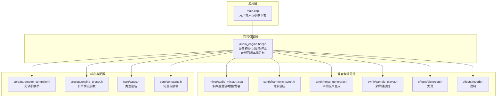
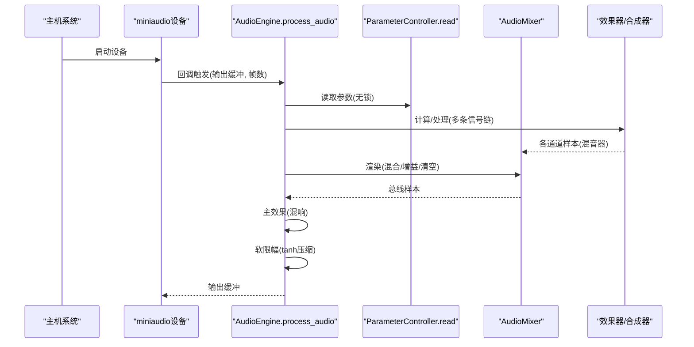
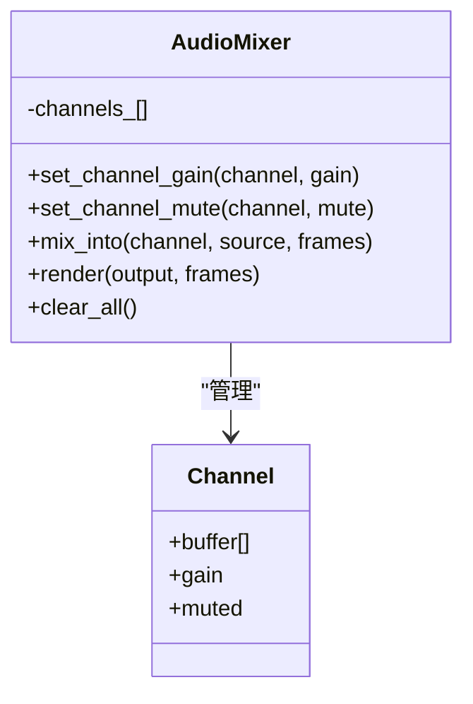
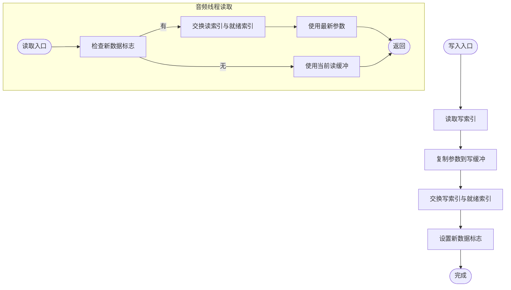
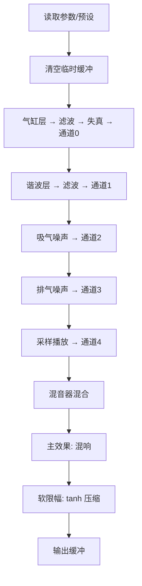
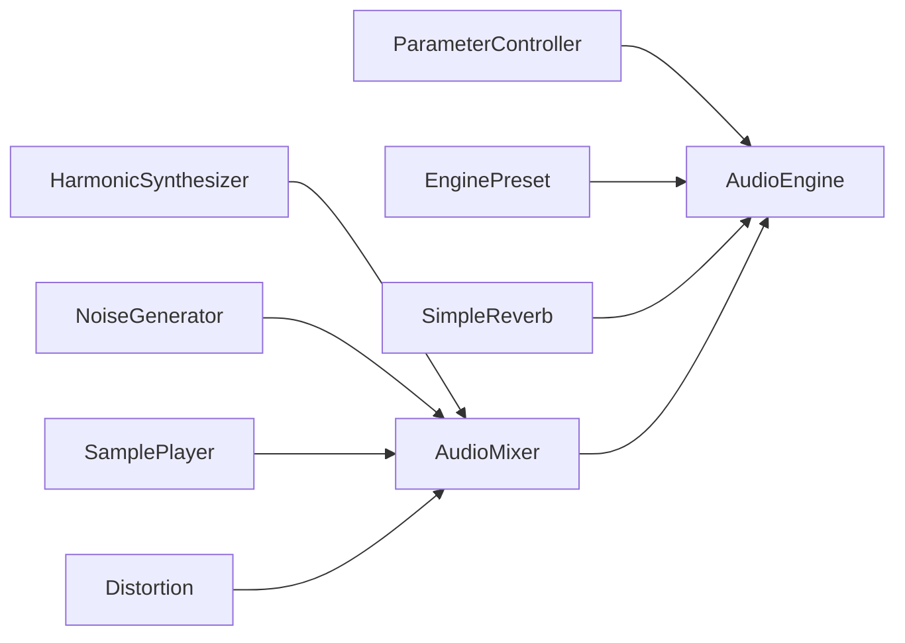

# 音频混音系统

<cite>
**本文引用的文件**
- [src/mixer/audio_mixer.h](file://src/mixer/audio_mixer.h)
- [src/mixer/audio_mixer.cpp](file://src/mixer/audio_mixer.cpp)
- [src/audio/audio_engine.h](file://src/audio/audio_engine.h)
- [src/audio/audio_engine.cpp](file://src/audio/audio_engine.cpp)
- [src/core/types.h](file://src/core/types.h)
- [src/core/constants.h](file://src/core/constants.h)
- [src/core/parameter_controller.h](file://src/core/parameter_controller.h)
- [src/presets/engine_preset.h](file://src/presets/engine_preset.h)
- [src/synth/harmonic_synth.h](file://src/synth/harmonic_synth.h)
- [src/synth/noise_generator.h](file://src/synth/noise_generator.h)
- [src/synth/sample_player.h](file://src/synth/sample_player.h)
- [src/effects/distortion.h](file://src/effects/distortion.h)
- [src/effects/reverb.h](file://src/effects/reverb.h)
- [src/effects/effects_chain.h](file://src/effects/effects_chain.h)
- [src/main.cpp](file://src/main.cpp)
- [tests/test_audio_mixer.cpp](file://tests/test_audio_mixer.cpp)
</cite>

## 目录
1. [简介](#简介)
2. [项目结构](#项目结构)
3. [核心组件](#核心组件)
4. [架构总览](#架构总览)
5. [详细组件分析](#详细组件分析)
6. [依赖关系分析](#依赖关系分析)
7. [性能考量](#性能考量)
8. [故障排除指南](#故障排除指南)
9. [结论](#结论)
10. [附录](#附录)

## 简介
本文件为“音频混音系统”的技术文档，聚焦于 AudioMixer 的设计与实现，涵盖多声道处理、音量控制、通道静音、样本混合、溢出处理与动态范围控制等关键功能。文档同时阐述了音频线程与控制线程之间的数据同步机制（无锁三缓冲参数桥），解释了输出格式转换与设备适配策略，并给出混音参数配置指南、性能优化建议、信号链路与数据流说明、扩展方案以及故障排除与调试技巧。

## 项目结构
该工程采用按功能域分层的组织方式：顶层入口负责用户交互与参数下发；音频引擎封装底层设备回调与信号链；混音器位于核心层，接收来自多个合成与效果模块的子信号并进行混合；预设与常量定义提供可配置参数与系统限制；测试用例覆盖混音器的关键行为。

图表来源
- [src/main.cpp:89-239](file://src/main.cpp#L89-L239)
- [src/audio/audio_engine.h:27-92](file://src/audio/audio_engine.h#L27-L92)
- [src/audio/audio_engine.cpp:18-163](file://src/audio/audio_engine.cpp#L18-L163)
- [src/mixer/audio_mixer.h:9-37](file://src/mixer/audio_mixer.h#L9-L37)
- [src/mixer/audio_mixer.cpp:6-58](file://src/mixer/audio_mixer.cpp#L6-L58)
- [src/core/parameter_controller.h:18-61](file://src/core/parameter_controller.h#L18-L61)
- [src/presets/engine_preset.h:8-55](file://src/presets/engine_preset.h#L8-L55)
- [src/core/types.h:7-12](file://src/core/types.h#L7-L12)
- [src/core/constants.h:13-17](file://src/core/constants.h#L13-L17)

章节来源
- [src/main.cpp:89-239](file://src/main.cpp#L89-L239)
- [src/audio/audio_engine.h:27-92](file://src/audio/audio_engine.h#L27-L92)
- [src/audio/audio_engine.cpp:18-163](file://src/audio/audio_engine.cpp#L18-L163)
- [src/mixer/audio_mixer.h:9-37](file://src/mixer/audio_mixer.h#L9-L37)
- [src/mixer/audio_mixer.cpp:6-58](file://src/mixer/audio_mixer.cpp#L6-L58)
- [src/core/parameter_controller.h:18-61](file://src/core/parameter_controller.h#L18-L61)
- [src/presets/engine_preset.h:8-55](file://src/presets/engine_preset.h#L8-L55)
- [src/core/types.h:7-12](file://src/core/types.h#L7-L12)
- [src/core/constants.h:13-17](file://src/core/constants.h#L13-L17)

## 核心组件
- 类型与常量
  - 样本、帧数、采样率使用类型别名，统一数据宽度与接口契约。
  - 常量定义了最大声道数、默认采样率与缓冲帧数等系统级限制。
- 参数桥（ParameterController）
  - 三缓冲无锁参数桥，控制线程写入，音频线程读取，避免阻塞与分配。
- 预设（EnginePreset）
  - 定义引擎与声音特性参数，如气缸数、相位偏移、谐波幅度、滤波器与效果参数等。
- 混音器（AudioMixer）
  - 多声道累加混合、单声道输出、通道增益与静音控制、清空缓冲。
- 音频引擎（AudioEngine）
  - 设备初始化与回调、信号链构建、主效果处理与软限幅。

章节来源
- [src/core/types.h:7-12](file://src/core/types.h#L7-L12)
- [src/core/constants.h:13-17](file://src/core/constants.h#L13-L17)
- [src/core/parameter_controller.h:18-61](file://src/core/parameter_controller.h#L18-L61)
- [src/presets/engine_preset.h:8-55](file://src/presets/engine_preset.h#L8-L55)
- [src/mixer/audio_mixer.h:9-37](file://src/mixer/audio_mixer.h#L9-L37)
- [src/mixer/audio_mixer.cpp:6-58](file://src/mixer/audio_mixer.cpp#L6-L58)
- [src/audio/audio_engine.h:27-92](file://src/audio/audio_engine.h#L27-L92)
- [src/audio/audio_engine.cpp:102-163](file://src/audio/audio_engine.cpp#L102-L163)

## 架构总览
音频引擎通过 miniaudio 回调驱动，音频线程在每次回调中读取当前参数与预设，执行多层信号处理（气缸冲击层、谐波合成层、噪声层、采样播放层），分别送入混音器的不同通道，随后进行总线混合、主效果处理与软限幅输出。

图表来源
- [src/audio/audio_engine.cpp:24-44](file://src/audio/audio_engine.cpp#L24-L44)
- [src/audio/audio_engine.cpp:102-163](file://src/audio/audio_engine.cpp#L102-L163)
- [src/core/parameter_controller.h:42-50](file://src/core/parameter_controller.h#L42-L50)
- [src/mixer/audio_mixer.cpp:31-47](file://src/mixer/audio_mixer.cpp#L31-L47)

## 详细组件分析

### AudioMixer 组件
- 功能职责
  - 接收来自各信号源的样本，按通道累加到本地环形缓冲。
  - 在渲染阶段将各通道样本乘以增益后累加到输出，并清空通道缓冲。
  - 支持通道静音，静音时直接清空通道缓冲。
- 数据结构
  - 每个通道包含固定大小的样本缓冲、增益与静音标志。
  - 最大通道数由常量定义，缓冲大小受帧数上限约束。
- 算法要点
  - 混合采用逐样本累加，未做显式溢出保护，需依赖上层限幅或合理增益控制。
  - 渲染阶段先清零输出，再累加各通道，最后清空通道缓冲，确保每帧只混合一次。
- 线程安全
  - 仅在音频线程内被调用，不涉及跨线程共享状态，天然线程安全。
- 可扩展性
  - 当前为单声道输出模型；若需立体声或更复杂声像，可在通道维度扩展为双声道缓冲，并增加声像控制。

图表来源
- [src/mixer/audio_mixer.h:27-34](file://src/mixer/audio_mixer.h#L27-L34)
- [src/mixer/audio_mixer.cpp:6-58](file://src/mixer/audio_mixer.cpp#L6-L58)

章节来源
- [src/mixer/audio_mixer.h:9-37](file://src/mixer/audio_mixer.h#L9-L37)
- [src/mixer/audio_mixer.cpp:6-58](file://src/mixer/audio_mixer.cpp#L6-L58)
- [tests/test_audio_mixer.cpp:9-96](file://tests/test_audio_mixer.cpp#L9-L96)

### 参数桥（ParameterController）与线程同步
- 设计目标
  - 控制线程（UI/游戏循环）写入参数，音频线程实时读取，避免锁与内存分配。
- 实现机制
  - 三缓冲轮换：写索引、就绪索引、读索引原子切换，新数据标记用于音频线程按需交换读取缓冲。
  - 写入：写入当前缓冲后发布，交换写索引与就绪索引。
  - 读取：若存在新数据则交换读索引，保证读到最新参数。
- 使用场景
  - 音频引擎在回调中读取当前参数，结合当前预设计算信号链参数。

图表来源
- [src/core/parameter_controller.h:32-50](file://src/core/parameter_controller.h#L32-L50)

章节来源
- [src/core/parameter_controller.h:18-61](file://src/core/parameter_controller.h#L18-L61)
- [src/audio/audio_engine.cpp:102-111](file://src/audio/audio_engine.cpp#L102-L111)

### 音频引擎（AudioEngine）与信号链
- 设备与回调
  - 初始化时配置输出格式为单声道浮点，帧大小由配置决定。
  - 回调中调用内部处理函数，按固定顺序执行多条信号链并混合。
- 信号链步骤
  1) 气缸冲击层 → 消 Exhaust滤波 → 失真 → 通道0
  2) 谐波合成层 → Intake滤波 → 通道1
  3) 吸气噪声 → 通道2；排气噪声 → 通道3
  4) 采样播放 → 通道4
  5) 混音器混合所有通道
  6) 主效果：混响
  7) 软限幅：tanh 压缩 + 主增益
- 输出格式与设备适配
  - 设备输出格式为单声道浮点，适合大多数播放设备；若需立体声或多声道，可在混音器与设备层扩展。

图表来源
- [src/audio/audio_engine.cpp:102-163](file://src/audio/audio_engine.cpp#L102-L163)

章节来源
- [src/audio/audio_engine.h:27-92](file://src/audio/audio_engine.h#L27-L92)
- [src/audio/audio_engine.cpp:18-68](file://src/audio/audio_engine.cpp#L18-L68)
- [src/audio/audio_engine.cpp:102-163](file://src/audio/audio_engine.cpp#L102-L163)

### 混音算法细节
- 样本混合
  - 每帧逐样本累加，通道间无交叉增益，最终输出为各通道加权和。
- 溢出处理
  - 未进行显式溢出钳制，依赖软限幅与合理的增益设置。
- 动态范围控制
  - 软限幅采用双曲正切压缩，配合主增益抑制削波风险。

章节来源
- [src/mixer/audio_mixer.cpp:22-47](file://src/mixer/audio_mixer.cpp#L22-L47)
- [src/audio/audio_engine.cpp:155-159](file://src/audio/audio_engine.cpp#L155-L159)

### 线程安全与数据同步
- 音频线程
  - 仅在回调中读取参数桥与执行信号链处理，保证实时性。
- 控制线程
  - 负责更新 EngineParams 并写入参数桥，周期性较低（示例中约 60Hz）。
- 同步策略
  - 无锁三缓冲参数桥避免阻塞，音频线程按需交换读取缓冲，确保参数可见性。

章节来源
- [src/core/parameter_controller.h:32-50](file://src/core/parameter_controller.h#L32-L50)
- [src/main.cpp:146-233](file://src/main.cpp#L146-L233)

### 输出格式转换与设备适配
- 当前实现
  - 设备输出格式为单声道浮点，采样率与缓冲帧数可配置。
- 扩展建议
  - 若需立体声：在混音器层扩展为双声道缓冲，或在设备层配置为双声道输出。
  - 若需多声道环绕：扩展通道布局与声像控制，同时在设备层配置对应声道映射。

章节来源
- [src/audio/audio_engine.cpp:24-29](file://src/audio/audio_engine.cpp#L24-L29)
- [src/audio/audio_engine.h:22-25](file://src/audio/audio_engine.h#L22-L25)

### 配置指南与性能优化
- 混音参数
  - 通道增益：通过混音器接口设置，注意总和增益避免削波。
  - 静音：对不需要的通道启用静音，减少无效计算。
- 性能优化
  - 控制线程写入频率与音频线程读取频率匹配，避免频繁切换参数。
  - 合理设置缓冲帧数，平衡延迟与稳定性。
  - 使用软限幅替代硬削波，提升听感质量。
- 线程模型
  - 保持参数桥无锁特性，避免在音频线程中进行阻塞操作。

章节来源
- [src/mixer/audio_mixer.cpp:10-20](file://src/mixer/audio_mixer.cpp#L10-L20)
- [src/audio/audio_engine.cpp:155-159](file://src/audio/audio_engine.cpp#L155-L159)
- [src/main.cpp:146-233](file://src/main.cpp#L146-L233)

### 扩展混音器以支持更多声道与特殊格式
- 多声道扩展
  - 将通道缓冲从单声道升级为双声道，增加声像控制（左右平衡）。
  - 在设备层配置多声道输出，映射到对应混音器通道。
- 特殊音频格式
  - 设备层支持不同格式（如 s16、f32），在输出前进行格式转换。
  - 混音器保持浮点处理，输出时再转为目标格式。

章节来源
- [src/mixer/audio_mixer.h:27-34](file://src/mixer/audio_mixer.h#L27-L34)
- [src/audio/audio_engine.cpp:24-29](file://src/audio/audio_engine.cpp#L24-L29)

## 依赖关系分析
AudioEngine 作为中枢，聚合了参数控制器、引擎预设、合成器与效果器，并将它们串联成完整的信号链。混音器位于信号链末端，负责最终混合与输出准备。

图表来源
- [src/audio/audio_engine.h:58-84](file://src/audio/audio_engine.h#L58-L84)
- [src/mixer/audio_mixer.h:9-37](file://src/mixer/audio_mixer.h#L9-L37)

章节来源
- [src/audio/audio_engine.h:58-84](file://src/audio/audio_engine.h#L58-L84)
- [src/mixer/audio_mixer.h:9-37](file://src/mixer/audio_mixer.h#L9-L37)

## 性能考量
- 缓冲区与帧数
  - 默认缓冲帧数与采样率在常量中定义，可根据平台与延迟需求调整。
- 参数桥开销
  - 三缓冲无锁设计避免锁竞争，但需注意参数更新频率与读取路径。
- 混音复杂度
  - 每帧 O(N) 混合，N 为通道数；通道数受限于常量，通常影响较小。
- 效果器成本
  - 滤波与混响等效果器按帧处理，应根据 CPU 负载选择必要的效果组合。

章节来源
- [src/core/constants.h:15-17](file://src/core/constants.h#L15-L17)
- [src/core/parameter_controller.h:18-61](file://src/core/parameter_controller.h#L18-L61)
- [src/mixer/audio_mixer.cpp:31-47](file://src/mixer/audio_mixer.cpp#L31-L47)

## 故障排除指南
- 无声或异常静音
  - 检查通道是否被静音，确认增益设置是否为零。
  - 确认信号链各模块已正确连接至混音器对应通道。
- 削波与失真
  - 降低通道增益或整体增益，启用软限幅。
  - 检查各效果器的驱动与混合参数。
- 参数不同步
  - 确保控制线程持续写入参数桥，音频线程正常读取。
  - 避免在音频线程中进行阻塞操作。
- 设备初始化失败
  - 检查设备权限与驱动状态，确认输出格式与声道配置。

章节来源
- [tests/test_audio_mixer.cpp:9-96](file://tests/test_audio_mixer.cpp#L9-L96)
- [src/audio/audio_engine.cpp:155-159](file://src/audio/audio_engine.cpp#L155-L159)
- [src/core/parameter_controller.h:32-50](file://src/core/parameter_controller.h#L32-L50)

## 结论
本系统以简洁高效的混音器为核心，结合无锁参数桥与清晰的信号链，实现了低延迟、高可维护性的音频引擎。通过合理的增益与软限幅策略，能够在不引入硬削波的前提下获得稳定的声音输出。未来可围绕多声道布局、设备格式适配与效果器组合进一步扩展能力。

## 附录
- 关键接口与职责
  - AudioMixer：多声道混合、增益与静音控制。
  - ParameterController：控制线程与音频线程间的参数同步。
  - AudioEngine：设备生命周期、回调与信号链执行。
  - EnginePreset：引擎与声音特性的参数集合。
- 测试参考
  - 单通道直通、多通道混合、增益控制、静音验证等用例覆盖混音器核心行为。

章节来源
- [src/mixer/audio_mixer.h:9-37](file://src/mixer/audio_mixer.h#L9-L37)
- [src/mixer/audio_mixer.cpp:6-58](file://src/mixer/audio_mixer.cpp#L6-L58)
- [src/core/parameter_controller.h:18-61](file://src/core/parameter_controller.h#L18-L61)
- [src/presets/engine_preset.h:8-55](file://src/presets/engine_preset.h#L8-L55)
- [tests/test_audio_mixer.cpp:9-96](file://tests/test_audio_mixer.cpp#L9-L96)