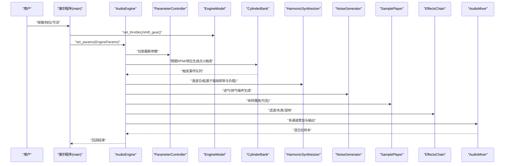
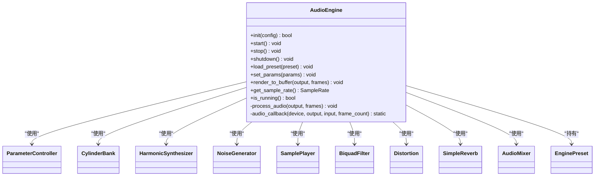
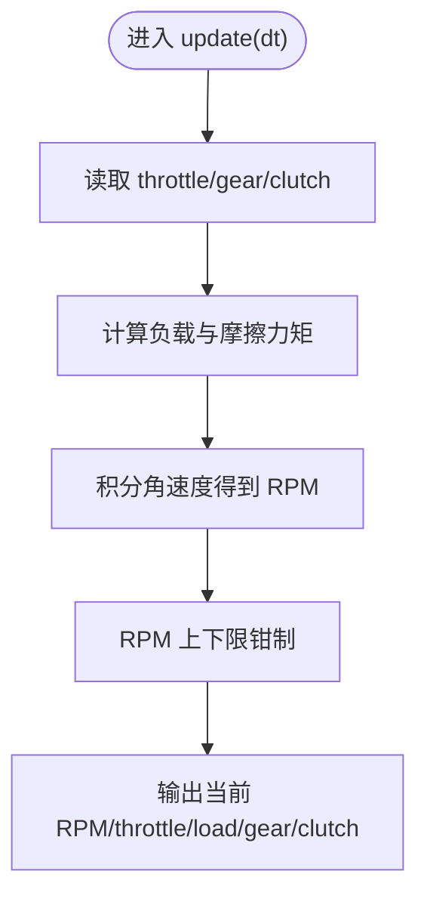
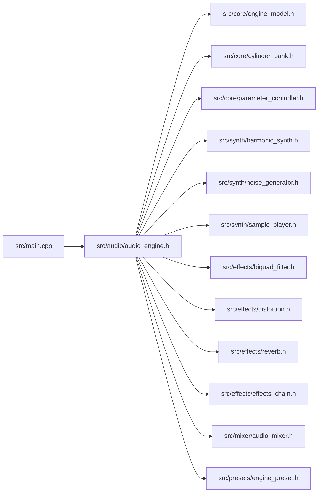

# 项目概述

<cite>
**本文引用的文件**
- [src/main.cpp](file://src/main.cpp)
- [src/audio/audio_engine.h](file://src/audio/audio_engine.h)
- [src/audio/audio_engine.cpp](file://src/audio/audio_engine.cpp)
- [src/audio/miniaudio_impl.cpp](file://src/audio/miniaudio_impl.cpp)
- [src/core/engine_model.h](file://src/core/engine_model.h)
- [src/core/engine_model.cpp](file://src/core/engine_model.cpp)
- [src/core/cylinder_bank.h](file://src/core/cylinder_bank.h)
- [src/core/cylinder_bank.cpp](file://src/core/cylinder_bank.cpp)
- [src/core/parameter_controller.h](file://src/core/parameter_controller.h)
- [src/core/types.h](file://src/core/types.h)
- [src/core/constants.h](file://src/core/constants.h)
- [src/synth/harmonic_synth.h](file://src/synth/harmonic_synth.h)
- [src/synth/harmonic_synth.cpp](file://src/synth/harmonic_synth.cpp)
- [src/synth/noise_generator.h](file://src/synth/noise_generator.h)
- [src/synth/noise_generator.cpp](file://src/synth/noise_generator.cpp)
- [src/synth/sample_player.h](file://src/synth/sample_player.h)
- [src/synth/sample_player.cpp](file://src/synth/sample_player.cpp)
- [src/effects/biquad_filter.h](file://src/effects/biquad_filter.h)
- [src/effects/biquad_filter.cpp](file://src/effects/biquad_filter.cpp)
- [src/effects/distortion.h](file://src/effects/distortion.h)
- [src/effects/distortion.cpp](file://src/effects/distortion.cpp)
- [src/effects/reverb.h](file://src/effects/reverb.h)
- [src/effects/reverb.cpp](file://src/effects/reverb.cpp)
- [src/effects/effects_chain.h](file://src/effects/effects_chain.h)
- [src/effects/effects_chain.cpp](file://src/effects/effects_chain.cpp)
- [src/mixer/audio_mixer.h](file://src/mixer/audio_mixer.h)
- [src/mixer/audio_mixer.cpp](file://src/mixer/audio_mixer.cpp)
- [src/presets/engine_preset.h](file://src/presets/engine_preset.h)
- [src/presets/preset_i4.cpp](file://src/presets/preset_i4.cpp)
- [src/presets/preset_v8_cross.cpp](file://src/presets/preset_v8_cross.cpp)
- [src/presets/preset_v8_flat.cpp](file://src/presets/preset_v8_flat.cpp)
- [meson_options.txt](file://meson_options.txt)
</cite>

## 目录
1. [引言](#引言)
2. [项目结构](#项目结构)
3. [核心组件](#核心组件)
4. [架构总览](#架构总览)
5. [详细组件分析](#详细组件分析)
6. [依赖关系分析](#依赖关系分析)
7. [性能考量](#性能考量)
8. [故障排查指南](#故障排查指南)
9. [结论](#结论)
10. [附录](#附录)

## 引言
本项目是一个实时汽车引擎声音合成系统，旨在通过物理建模与数字信号处理相结合的方式，生成逼真的引擎声。其设计理念是将“物理引擎模型”与“可调谐的声音合成器”解耦，配合“可堆叠的效果链”，在低延迟的音频回调中完成合成与渲染，从而满足游戏、仿真、训练与娱乐等场景对真实感与交互性的需求。

- 核心目标
  - 实时合成：在音频回调中完成完整的声音生成管线，保证低延迟与高稳定性。
  - 物理建模：以四冲程、多缸、齿轮传动为基础的机械动力学模型，驱动声音参数。
  - 可配置性：通过预设与参数控制器，快速切换不同发动机类型与声学特征。
  - 可扩展性：模块化设计，便于添加新预设、新效果或新合成单元。

- 应用场景
  - 赛车游戏与模拟器：为车辆提供随工况变化的真实引擎声。
  - 驾驶培训与VR体验：强调动态响应与临场感。
  - 娱乐与演示：作为独立可交互的引擎声音演示程序。

- 目标用户
  - 游戏音频工程师与引擎程序员：集成到游戏引擎或音视频管线。
  - 独立开发者与爱好者：学习物理建模合成与实时音频处理。
  - 教学与研究：作为实时音频与信号处理的教学案例。

## 项目结构
项目采用按功能域划分的模块化组织方式，主要目录与职责如下：
- src/main.cpp：演示程序入口，负责用户输入、参数更新与主循环。
- src/audio：音频引擎核心，封装设备初始化、回调与子模块编排。
- src/core：物理建模与通用类型常量，包括引擎模型、气缸组、参数控制器等。
- src/synth：声音合成子系统，包含谐波合成、噪声生成与采样播放。
- src/effects：音频效果子系统，包含滤波、失真、混响与效果链。
- src/mixer：混音器，负责多通道累加与最终输出渲染。
- src/presets：预设工厂，定义不同发动机类型的几何、发声特征与效果参数。
- tests：单元测试集合，覆盖各模块关键行为。
- third_party：外部依赖（例如 miniaudio）。
- meson_options.txt：构建选项，定义采样率、缓冲帧数、是否构建演示与测试。

```mermaid
graph TB
subgraph "应用层"
MAIN["src/main.cpp<br/>演示与控制循环"]
end
subgraph "音频引擎层"
AEH["src/audio/audio_engine.h<br/>AudioEngine 接口"]
AECPP["src/audio/audio_engine.cpp<br/>音频处理流程"]
MIN_IMPL["src/audio/miniaudio_impl.cpp<br/>miniaudio 回调封装"]
end
subgraph "核心物理层"
EMH["src/core/engine_model.h<br/>EngineModel"]
CBH["src/core/cylinder_bank.h<br/>CylinderBank"]
PCH["src/core/parameter_controller.h<br/>ParameterController"]
TYPES["src/core/types.h<br/>类型别名"]
CONST["src/core/constants.h<br/>常量与限制"]
end
subgraph "合成层"
HS["src/synth/harmonic_synth.h<br/>HarmonicSynthesizer"]
NG["src/synth/noise_generator.h<br/>NoiseGenerator"]
SP["src/synth/sample_player.h<br/>SamplePlayer"]
end
subgraph "效果层"
BF["src/effects/biquad_filter.h<br/>BiquadFilter"]
DS["src/effects/distortion.h<br/>Distortion"]
RV["src/effects/reverb.h<br/>SimpleReverb"]
EC["src/effects/effects_chain.h<br/>EffectsChain"]
end
subgraph "混音层"
MIX["src/mixer/audio_mixer.h<br/>AudioMixer"]
end
subgraph "预设层"
EP["src/presets/engine_preset.h<br/>EnginePreset"]
I4["src/presets/preset_i4.cpp"]
V8C["src/presets/preset_v8_cross.cpp"]
V8F["src/presets/preset_v8_flat.cpp"]
end
MAIN --> AEH
AEH --> AECPP
AEH --> MIN_IMPL
AEH --> EMH
AEH --> CBH
AEH --> PCH
AEH --> HS
AEH --> NG
AEH --> SP
AEH --> BF
AEH --> DS
AEH --> RV
AEH --> EC
AEH --> MIX
AEH --> EP
EP --> I4
EP --> V8C
EP --> V8F
```

图表来源
- [src/main.cpp](file://src/main.cpp)
- [src/audio/audio_engine.h](file://src/audio/audio_engine.h)
- [src/audio/audio_engine.cpp](file://src/audio/audio_engine.cpp)
- [src/audio/miniaudio_impl.cpp](file://src/audio/miniaudio_impl.cpp)
- [src/core/engine_model.h](file://src/core/engine_model.h)
- [src/core/cylinder_bank.h](file://src/core/cylinder_bank.h)
- [src/core/parameter_controller.h](file://src/core/parameter_controller.h)
- [src/core/types.h](file://src/core/types.h)
- [src/core/constants.h](file://src/core/constants.h)
- [src/synth/harmonic_synth.h](file://src/synth/harmonic_synth.h)
- [src/synth/noise_generator.h](file://src/synth/noise_generator.h)
- [src/synth/sample_player.h](file://src/synth/sample_player.h)
- [src/effects/biquad_filter.h](file://src/effects/biquad_filter.h)
- [src/effects/distortion.h](file://src/effects/distortion.h)
- [src/effects/reverb.h](file://src/effects/reverb.h)
- [src/effects/effects_chain.h](file://src/effects/effects_chain.h)
- [src/mixer/audio_mixer.h](file://src/mixer/audio_mixer.h)
- [src/presets/engine_preset.h](file://src/presets/engine_preset.h)
- [src/presets/preset_i4.cpp](file://src/presets/preset_i4.cpp)
- [src/presets/preset_v8_cross.cpp](file://src/presets/preset_v8_cross.cpp)
- [src/presets/preset_v8_flat.cpp](file://src/presets/preset_v8_flat.cpp)

章节来源
- [src/main.cpp](file://src/main.cpp)
- [meson_options.txt](file://meson_options.txt)

## 核心组件
- 类型与常量
  - 类型别名：统一采样、帧数与采样率的表示，提升可读性与一致性。
  - 常量：定义最大缸数、谐波数、声道数、效果数、默认采样率与缓冲帧数等上限与默认值。
- 参数控制器
  - 将来自物理引擎的状态（如转速、节流、档位、离合）转换为合成器与效果链可用的参数，并进行平滑与限幅。
- 发动机模型
  - 模拟四冲程、多缸、齿轮传动的机械动力学，计算当前转速、负载与摩擦等状态。
- 气缸组
  - 基于点火顺序与相位偏移，生成点火触发事件序列，驱动谐波与噪声合成。
- 合成器
  - 谐波合成：基于预设的谐波谱，叠加不同频率分量，体现不同发动机的发声特征。
  - 噪声生成：模拟进气与排气端的湍流噪声，增强真实感。
  - 采样播放：可选地引入真实录音素材，作为合成的补充或替代。
- 效果链
  - 二阶滤波：调节进气与排气共振峰，塑造声色。
  - 失真：引入非线性，模拟管道与涡流的畸变效应。
  - 混响：营造空间感与回声特性。
  - 效果链：支持多效果串联，形成复杂的声学路径。
- 混音器
  - 多通道累加与增益控制，最终混合输出。
- 预设系统
  - 提供不同发动机类型的几何、点火模式、谐波谱、滤波与噪声参数，以及效果强度等，便于快速切换与对比。

章节来源
- [src/core/types.h](file://src/core/types.h)
- [src/core/constants.h](file://src/core/constants.h)
- [src/core/parameter_controller.h](file://src/core/parameter_controller.h)
- [src/core/engine_model.h](file://src/core/engine_model.h)
- [src/core/cylinder_bank.h](file://src/core/cylinder_bank.h)
- [src/synth/harmonic_synth.h](file://src/synth/harmonic_synth.h)
- [src/synth/noise_generator.h](file://src/synth/noise_generator.h)
- [src/synth/sample_player.h](file://src/synth/sample_player.h)
- [src/effects/biquad_filter.h](file://src/effects/biquad_filter.h)
- [src/effects/distortion.h](file://src/effects/distortion.h)
- [src/effects/reverb.h](file://src/effects/reverb.h)
- [src/effects/effects_chain.h](file://src/effects/effects_chain.h)
- [src/mixer/audio_mixer.h](file://src/mixer/audio_mixer.h)
- [src/presets/engine_preset.h](file://src/presets/engine_preset.h)

## 架构总览
系统采用“控制线程 + 音频回调线程”的双线程模型：
- 控制线程（演示程序）：处理用户输入、更新物理引擎状态、推送参数至音频线程。
- 音频回调线程（AudioEngine）：在固定时间片内完成参数拉取、物理触发、合成与效果处理、混音与输出。

图表来源
- [src/main.cpp](file://src/main.cpp)
- [src/audio/audio_engine.h](file://src/audio/audio_engine.h)
- [src/core/parameter_controller.h](file://src/core/parameter_controller.h)
- [src/core/engine_model.h](file://src/core/engine_model.h)
- [src/core/cylinder_bank.h](file://src/core/cylinder_bank.h)
- [src/synth/harmonic_synth.h](file://src/synth/harmonic_synth.h)
- [src/synth/noise_generator.h](file://src/synth/noise_generator.h)
- [src/synth/sample_player.h](file://src/synth/sample_player.h)
- [src/effects/effects_chain.h](file://src/effects/effects_chain.h)
- [src/mixer/audio_mixer.h](file://src/mixer/audio_mixer.h)

## 详细组件分析

### 音频引擎（AudioEngine）
- 职责
  - 设备初始化与启动，绑定 miniaudio 的音频回调。
  - 编排子模块：参数控制器、气缸组、谐波合成、噪声、采样、滤波、失真、混响与混音器。
  - 提供预设加载与参数设置接口，支持从控制线程安全传递参数。
- 关键点
  - 使用原子指针保存当前预设，避免回调中的竞态。
  - 内置多个临时缓冲区，按需复用，降低分配开销。
  - 提供离线渲染接口，便于测试与批处理。

图表来源
- [src/audio/audio_engine.h](file://src/audio/audio_engine.h)

章节来源
- [src/audio/audio_engine.h](file://src/audio/audio_engine.h)
- [src/audio/audio_engine.cpp](file://src/audio/audio_engine.cpp)
- [src/audio/miniaudio_impl.cpp](file://src/audio/miniaudio_impl.cpp)

### 发动机模型（EngineModel）
- 职责
  - 维护节气门、档位、离合状态与当前转速。
  - 基于惯性、摩擦与最大扭矩估算瞬时负载与加速度。
  - 提供固定步长更新接口，供控制线程周期调用。
- 关键点
  - 预设参数决定怠速、红线与惯量，影响声音的自然响应。
  - 档比数组与离合状态决定传动比，进而影响基础频率与谐波比例。

图表来源
- [src/core/engine_model.h](file://src/core/engine_model.h)
- [src/core/engine_model.cpp](file://src/core/engine_model.cpp)

章节来源
- [src/core/engine_model.h](file://src/core/engine_model.h)
- [src/core/engine_model.cpp](file://src/core/engine_model.cpp)

### 气缸组（CylinderBank）
- 职责
  - 根据点火顺序与相位偏移，产生周期性点火触发事件。
  - 将触发事件映射到基础频率与负载，驱动谐波与噪声合成。
- 关键点
  - 不同发动机的点火相位与顺序直接影响声音的“脉动感”与“粗糙度”。

章节来源
- [src/core/cylinder_bank.h](file://src/core/cylinder_bank.h)
- [src/core/cylinder_bank.cpp](file://src/core/cylinder_bank.cpp)

### 谐波合成（HarmonicSynthesizer）
- 职责
  - 基于预设的谐波幅度谱，对基础频率进行叠加合成。
  - 受负载调制，使声音随工况变化而动态演进。
- 关键点
  - 幅度谱由预设定义，体现不同发动机的发声特征（如 V8 的低频与 I4 的中频突出）。

章节来源
- [src/synth/harmonic_synth.h](file://src/synth/harmonic_synth.h)
- [src/synth/harmonic_synth.cpp](file://src/synth/harmonic_synth.cpp)

### 噪声生成（NoiseGenerator）
- 职责
  - 生成进气与排气噪声，模拟气流与涡流的随机性。
- 关键点
  - 中心频率与带宽由预设定义，结合负载与转速进行动态调制。

章节来源
- [src/synth/noise_generator.h](file://src/synth/noise_generator.h)
- [src/synth/noise_generator.cpp](file://src/synth/noise_generator.cpp)

### 采样播放（SamplePlayer）
- 职责
  - 可选地播放真实录音素材，作为合成的补充或替代。
- 关键点
  - 与合成器并行工作，通过混音器融合。

章节来源
- [src/synth/sample_player.h](file://src/synth/sample_player.h)
- [src/synth/sample_player.cpp](file://src/synth/sample_player.cpp)

### 效果链（EffectsChain）
- 职责
  - 将滤波、失真、混响等效果按序组合，形成可配置的声学路径。
- 关键点
  - 支持动态增删效果，便于实验与优化。

章节来源
- [src/effects/effects_chain.h](file://src/effects/effects_chain.h)
- [src/effects/effects_chain.cpp](file://src/effects/effects_chain.cpp)

### 混音器（AudioMixer）
- 职责
  - 多通道累加、增益与静音控制，最终渲染到输出缓冲。
- 关键点
  - 提供清空通道缓冲的能力，避免跨帧泄漏。

章节来源
- [src/mixer/audio_mixer.h](file://src/mixer/audio_mixer.h)
- [src/mixer/audio_mixer.cpp](file://src/mixer/audio_mixer.cpp)

### 预设系统（EnginePreset）
- 职责
  - 定义不同发动机类型的几何、点火顺序、谐波谱、滤波与噪声参数，以及效果强度。
- 关键点
  - 提供 I4、V8 交叉平面与 V8 平面三种典型预设，覆盖从“低沉”到“尖锐”的广泛声色。

章节来源
- [src/presets/engine_preset.h](file://src/presets/engine_preset.h)
- [src/presets/preset_i4.cpp](file://src/presets/preset_i4.cpp)
- [src/presets/preset_v8_cross.cpp](file://src/presets/preset_v8_cross.cpp)
- [src/presets/preset_v8_flat.cpp](file://src/presets/preset_v8_flat.cpp)

## 依赖关系分析
- 模块耦合
  - AudioEngine 对所有子模块存在直接依赖，但通过头文件接口隔离具体实现，保持良好内聚。
  - 控制线程仅通过 set_params 与 load_preset 与音频线程通信，避免直接操作内部状态。
- 外部依赖
  - miniaudio：负责平台无关的音频设备管理与回调调度。
- 构建系统
  - Meson：提供跨平台构建、可配置采样率与缓冲大小、可选构建演示与测试。

图表来源
- [src/main.cpp](file://src/main.cpp)
- [src/audio/audio_engine.h](file://src/audio/audio_engine.h)
- [src/core/engine_model.h](file://src/core/engine_model.h)
- [src/core/cylinder_bank.h](file://src/core/cylinder_bank.h)
- [src/core/parameter_controller.h](file://src/core/parameter_controller.h)
- [src/synth/harmonic_synth.h](file://src/synth/harmonic_synth.h)
- [src/synth/noise_generator.h](file://src/synth/noise_generator.h)
- [src/synth/sample_player.h](file://src/synth/sample_player.h)
- [src/effects/biquad_filter.h](file://src/effects/biquad_filter.h)
- [src/effects/distortion.h](file://src/effects/distortion.h)
- [src/effects/reverb.h](file://src/effects/reverb.h)
- [src/effects/effects_chain.h](file://src/effects/effects_chain.h)
- [src/mixer/audio_mixer.h](file://src/mixer/audio_mixer.h)
- [src/presets/engine_preset.h](file://src/presets/engine_preset.h)

章节来源
- [src/main.cpp](file://src/main.cpp)
- [src/audio/audio_engine.h](file://src/audio/audio_engine.h)
- [meson_options.txt](file://meson_options.txt)

## 性能考量
- 实时性保障
  - 使用固定采样率与缓冲帧数，确保音频回调稳定。
  - 在回调中避免动态分配与锁竞争，使用预分配缓冲与原子参数传递。
- 计算复杂度
  - 合成与效果处理按帧计，复杂度与帧长线性相关；通过合理设置缓冲帧数平衡延迟与吞吐。
- 资源管理
  - 预设与缓冲区本地化，减少跨线程访问开销。
- 可扩展性
  - 新增效果或合成单元只需遵循统一接口，不影响现有管线。

## 故障排查指南
- 无法初始化音频设备
  - 检查设备权限与驱动状态；确认采样率与缓冲帧数设置合理。
- 声音断断续续或爆音
  - 检查回调中是否有阻塞操作；确认缓冲帧数未过大导致延迟累积。
- 参数不生效
  - 确认控制线程已调用 set_params；检查预设切换是否成功。
- 预设切换无效
  - 确认 load_preset 已被调用且 AudioEngine 正在运行。

章节来源
- [src/main.cpp](file://src/main.cpp)
- [src/audio/audio_engine.h](file://src/audio/audio_engine.h)

## 结论
本项目以模块化与实时性为核心，将物理建模与数字合成有机结合，提供了从引擎动力学到声音输出的完整链路。通过预设系统与效果链，既能快速适配多种发动机类型，又能灵活调整声色。对于初学者，该架构清晰易懂；对于专业开发者，其接口与数据流便于扩展与集成。

## 附录
- 技术栈与优势
  - C++：高性能、跨平台、内存可控，适合实时音频处理。
  - miniaudio：轻量、跨平台、回调友好，简化设备抽象。
  - Meson：现代构建系统，跨平台、可配置、易于CI集成。
- 主要功能特性
  - 多发动机类型支持：I4、V8 交叉平面、V8 平面。
  - 实时参数控制：节流、档位、离合、涡轮开关。
  - 物理建模合成：基于点火顺序与负载的谐波与噪声合成。
  - 音频效果处理：滤波、失真、混响与可堆叠效果链。
  - 预设与可配置：一键切换不同声色，参数可调。
- 适用场景与目标用户
  - 赛车游戏与模拟器、驾驶培训与VR、娱乐演示与教学研究。